# 123456.ZMX — Zemax 2026 R1 全分析对比测试基准

> 本报告是 `123456.ZMX` 的只读 Zemax 基准快照。后续 Workbench 分析应使用相同镜头哈希、
> 分析设置、波长和视场，与本报告链接的数据及 GUI 截图逐项比较。

## 基准仪表板

| 项目 | 基准值 |
|---|---|
| Zemax 版本 | `Ansys Zemax OpticStudio 2026 R1` |
| 许可证 / 模式 | `EnterpriseEdition` / `Server` |
| 源镜头 | [`source/123456.ZMX`](source/123456.ZMX) |
| SHA-256 | `0CD65A2F823BAF5079F20F91D8310765899A182A6BE72DDAC53EDE943F2BF75B` |
| 光学结构 | 23 个表面 · 5 个视场 · 3 个波长 |
| 全部分析 | **165** |
| 已捕获 | **148** |
| 不适用/未创建 | **17** |
| GUI 截图 | **148**（原生 106，数据回退渲染 42） |
| 文本结果 | 121 |
| 设置快照 | 148 |
| 采集开始 | 2026-07-30 01:14:10 +0800 |
| 采集完成 | 2026-07-30 07:53:55 +0800 |

### 状态与截图说明

- **OpticStudio 原生 GUI**：由 OpticStudio/ZPL 直接捕获，是首选视觉基准。
- **ZOS-API 数据回退渲染**：分析数据已由 Zemax 计算，但截图由采集工具从 ZOS-API 数据重绘。
- **不适用/未创建**：当前顺序光学镜头或许可证上下文无法创建该 AnalysisIDM；仍保留在完整清单中。
- 本报告只定义 Zemax 基线，不表示 Workbench 已通过对应项目。

## 对比测试使用方法

1. 校验待测镜头 SHA-256 与本报告一致。
2. 使用每项分析目录中的 `settings.cfg` 锁定 Zemax 设置；Workbench 侧使用等价物理参数。
3. 优先比较 `data.json` 的结构化数据；`data.txt` 用于检查 Zemax 文本输出。
4. GUI 截图用于核对曲线数量、视场/波长布局、坐标轴、单位、方向、色标和默认显示。
5. 若分析默认值不同，应先记录设置差异，再判定数值差异，不能仅凭截图像素给出通过结论。

## 全部分析索引

| # | AnalysisIDM | GUI 标题 | 状态 | 截图来源 | 数据 |
|---:|---|---|---|---|---|
| 001 | [`RayFan`](#analysis-001-rayfan) | 光线光扇图 | ✅ 已捕获 | OpticStudio 原生 GUI | [JSON](analyses/001-rayfan/data.json) |
| 002 | [`OpticalPathFan`](#analysis-002-opticalpathfan) | 光程差图 | ✅ 已捕获 | OpticStudio 原生 GUI | [JSON](analyses/002-opticalpathfan/data.json) |
| 003 | [`PupilAberrationFan`](#analysis-003-pupilaberrationfan) | 光瞳像差光扇图 | ✅ 已捕获 | OpticStudio 原生 GUI | [JSON](analyses/003-pupilaberrationfan/data.json) |
| 004 | [`FieldCurvatureAndDistortion`](#analysis-004-fieldcurvatureanddistortion) | 视场 场曲/畸变 | ✅ 已捕获 | OpticStudio 原生 GUI | [JSON](analyses/004-fieldcurvatureanddistortion/data.json) |
| 005 | [`FocalShiftDiagram`](#analysis-005-focalshiftdiagram) | 焦移 | ✅ 已捕获 | OpticStudio 原生 GUI | [JSON](analyses/005-focalshiftdiagram/data.json) |
| 006 | [`GridDistortion`](#analysis-006-griddistortion) | 网格畸变 | ✅ 已捕获 | OpticStudio 原生 GUI | [JSON](analyses/006-griddistortion/data.json) |
| 007 | [`LateralColor`](#analysis-007-lateralcolor) | 垂轴色差 | ✅ 已捕获 | OpticStudio 原生 GUI | [JSON](analyses/007-lateralcolor/data.json) |
| 008 | [`LongitudinalAberration`](#analysis-008-longitudinalaberration) | 轴向像差 | ✅ 已捕获 | OpticStudio 原生 GUI | [JSON](analyses/008-longitudinalaberration/data.json) |
| 009 | [`RayTrace`](#analysis-009-raytrace) | 单光线追迹 2 | ✅ 已捕获 | ZOS-API 数据回退渲染 | [JSON](analyses/009-raytrace/data.json) |
| 010 | [`SeidelCoefficients`](#analysis-010-seidelcoefficients) | 赛德尔系数 | ✅ 已捕获 | ZOS-API 数据回退渲染 | [JSON](analyses/010-seidelcoefficients/data.json) |
| 011 | [`SeidelDiagram`](#analysis-011-seideldiagram) | 赛德尔图 | ✅ 已捕获 | OpticStudio 原生 GUI | [JSON](analyses/011-seideldiagram/data.json) |
| 012 | [`ZernikeAnnularCoefficients`](#analysis-012-zernikeannularcoefficients) | Zernike Annular系数 | ✅ 已捕获 | ZOS-API 数据回退渲染 | [JSON](analyses/012-zernikeannularcoefficients/data.json) |
| 013 | [`ZernikeCoefficientsVsField`](#analysis-013-zernikecoefficientsvsfield) | Zernike系数 vs. 视场 | ✅ 已捕获 | OpticStudio 原生 GUI | [JSON](analyses/013-zernikecoefficientsvsfield/data.json) |
| 014 | [`ZernikeFringeCoefficients`](#analysis-014-zernikefringecoefficients) | Zernike Fringe系数 | ✅ 已捕获 | ZOS-API 数据回退渲染 | [JSON](analyses/014-zernikefringecoefficients/data.json) |
| 015 | [`ZernikeStandardCoefficients`](#analysis-015-zernikestandardcoefficients) | Zernike Standard系数 | ✅ 已捕获 | ZOS-API 数据回退渲染 | [JSON](analyses/015-zernikestandardcoefficients/data.json) |
| 016 | [`FftMtf`](#analysis-016-fftmtf) | FFT MTF | ✅ 已捕获 | OpticStudio 原生 GUI | [JSON](analyses/016-fftmtf/data.json) |
| 017 | [`FftThroughFocusMtf`](#analysis-017-fftthroughfocusmtf) | 离焦FFT MTF | ✅ 已捕获 | OpticStudio 原生 GUI | [JSON](analyses/017-fftthroughfocusmtf/data.json) |
| 018 | [`GeometricThroughFocusMtf`](#analysis-018-geometricthroughfocusmtf) | 离焦几何MTF | ✅ 已捕获 | OpticStudio 原生 GUI | [JSON](analyses/018-geometricthroughfocusmtf/data.json) |
| 019 | [`GeometricMtf`](#analysis-019-geometricmtf) | 几何MTF | ✅ 已捕获 | OpticStudio 原生 GUI | [JSON](analyses/019-geometricmtf/data.json) |
| 020 | [`FftMtfMap`](#analysis-020-fftmtfmap) | 二维视场FFT MTF | ✅ 已捕获 | OpticStudio 原生 GUI | [JSON](analyses/020-fftmtfmap/data.json) |
| 021 | [`GeometricMtfMap`](#analysis-021-geometricmtfmap) | 二维视场几何MTF | ✅ 已捕获 | OpticStudio 原生 GUI | [JSON](analyses/021-geometricmtfmap/data.json) |
| 022 | [`FftSurfaceMtf`](#analysis-022-fftsurfacemtf) | 三维FFT MTF | ✅ 已捕获 | OpticStudio 原生 GUI | [JSON](analyses/022-fftsurfacemtf/data.json) |
| 023 | [`FftMtfvsField`](#analysis-023-fftmtfvsfield) | FFT MTF vs. 视场 | ✅ 已捕获 | OpticStudio 原生 GUI | [JSON](analyses/023-fftmtfvsfield/data.json) |
| 024 | [`GeometricMtfvsField`](#analysis-024-geometricmtfvsfield) | 几何MTF vs. 视场 | ✅ 已捕获 | OpticStudio 原生 GUI | [JSON](analyses/024-geometricmtfvsfield/data.json) |
| 025 | [`HuygensMtfvsField`](#analysis-025-huygensmtfvsfield) | 惠更斯 MTF vs. 视场 | ✅ 已捕获 | OpticStudio 原生 GUI | [JSON](analyses/025-huygensmtfvsfield/data.json) |
| 026 | [`HuygensMtf`](#analysis-026-huygensmtf) | 惠更斯MTF | ✅ 已捕获 | OpticStudio 原生 GUI | [JSON](analyses/026-huygensmtf/data.json) |
| 027 | [`HuygensSurfaceMtf`](#analysis-027-huygenssurfacemtf) | 二维惠更斯MTF | ✅ 已捕获 | OpticStudio 原生 GUI | [JSON](analyses/027-huygenssurfacemtf/data.json) |
| 028 | [`HuygensThroughFocusMtf`](#analysis-028-huygensthroughfocusmtf) | 离焦惠更斯MTF | ✅ 已捕获 | OpticStudio 原生 GUI | [JSON](analyses/028-huygensthroughfocusmtf/data.json) |
| 029 | [`FftPsf`](#analysis-029-fftpsf) | FFT PSF | ✅ 已捕获 | OpticStudio 原生 GUI | [JSON](analyses/029-fftpsf/data.json) |
| 030 | [`FftPsfCrossSection`](#analysis-030-fftpsfcrosssection) | FFT PSF截面图 | ✅ 已捕获 | OpticStudio 原生 GUI | [JSON](analyses/030-fftpsfcrosssection/data.json) |
| 031 | [`FftPsfLineEdgeSpread`](#analysis-031-fftpsflineedgespread) | FFT 线/边缘扩散 | ✅ 已捕获 | OpticStudio 原生 GUI | [JSON](analyses/031-fftpsflineedgespread/data.json) |
| 032 | [`HuygensPsfCrossSection`](#analysis-032-huygenspsfcrosssection) | 惠更斯PSF截面图 | ✅ 已捕获 | OpticStudio 原生 GUI | [JSON](analyses/032-huygenspsfcrosssection/data.json) |
| 033 | [`HuygensPsf`](#analysis-033-huygenspsf) | 惠更斯PSF | ✅ 已捕获 | OpticStudio 原生 GUI | [JSON](analyses/033-huygenspsf/data.json) |
| 034 | [`DiffractionEncircledEnergy`](#analysis-034-diffractionencircledenergy) | 衍射圈入能量 | ✅ 已捕获 | OpticStudio 原生 GUI | [JSON](analyses/034-diffractionencircledenergy/data.json) |
| 035 | [`GeometricEncircledEnergy`](#analysis-035-geometricencircledenergy) | 几何圈入能量 | ✅ 已捕获 | OpticStudio 原生 GUI | [JSON](analyses/035-geometricencircledenergy/data.json) |
| 036 | [`GeometricLineEdgeSpread`](#analysis-036-geometriclineedgespread) | 线/边缘扩散 | ✅ 已捕获 | OpticStudio 原生 GUI | [JSON](analyses/036-geometriclineedgespread/data.json) |
| 037 | [`ExtendedSourceEncircledEnergy`](#analysis-037-extendedsourceencircledenergy) | 扩展光源圈入能量 | ✅ 已捕获 | OpticStudio 原生 GUI | [JSON](analyses/037-extendedsourceencircledenergy/data.json) |
| 038 | [`SurfaceCurvatureCross`](#analysis-038-surfacecurvaturecross) | 表面曲率截面 | ✅ 已捕获 | OpticStudio 原生 GUI | [JSON](analyses/038-surfacecurvaturecross/data.json) |
| 039 | [`SurfacePhaseCross`](#analysis-039-surfacephasecross) | 表面相位截面 | ✅ 已捕获 | OpticStudio 原生 GUI | [JSON](analyses/039-surfacephasecross/data.json) |
| 040 | [`SurfaceSagCross`](#analysis-040-surfacesagcross) | 表面矢高截面 | ✅ 已捕获 | OpticStudio 原生 GUI | [JSON](analyses/040-surfacesagcross/data.json) |
| 041 | [`SurfaceCurvature`](#analysis-041-surfacecurvature) | 表面曲率 | ✅ 已捕获 | OpticStudio 原生 GUI | [JSON](analyses/041-surfacecurvature/data.json) |
| 042 | [`SurfacePhase`](#analysis-042-surfacephase) | 表面相位 | ✅ 已捕获 | OpticStudio 原生 GUI | [JSON](analyses/042-surfacephase/data.json) |
| 043 | [`SurfaceSag`](#analysis-043-surfacesag) | 表面矢高 | ✅ 已捕获 | OpticStudio 原生 GUI | [JSON](analyses/043-surfacesag/data.json) |
| 044 | [`StandardSpot`](#analysis-044-standardspot) | 点列图 | ✅ 已捕获 | OpticStudio 原生 GUI | [JSON](analyses/044-standardspot/data.json) |
| 045 | [`ThroughFocusSpot`](#analysis-045-throughfocusspot) | 离焦点列图 | ✅ 已捕获 | OpticStudio 原生 GUI | [JSON](analyses/045-throughfocusspot/data.json) |
| 046 | [`FullFieldSpot`](#analysis-046-fullfieldspot) | 全视场点列图 | ✅ 已捕获 | OpticStudio 原生 GUI | [JSON](analyses/046-fullfieldspot/data.json) |
| 047 | [`MatrixSpot`](#analysis-047-matrixspot) | 矩阵点列图 | ✅ 已捕获 | OpticStudio 原生 GUI | [JSON](analyses/047-matrixspot/data.json) |
| 048 | [`ConfigurationMatrixSpot`](#analysis-048-configurationmatrixspot) | 结构矩阵点列图 | ✅ 已捕获 | OpticStudio 原生 GUI | [JSON](analyses/048-configurationmatrixspot/data.json) |
| 049 | [`RMSField`](#analysis-049-rmsfield) | RMS vs. 视场 | ✅ 已捕获 | OpticStudio 原生 GUI | [JSON](analyses/049-rmsfield/data.json) |
| 050 | [`RMSFieldMap`](#analysis-050-rmsfieldmap) | 二维视场RMS图 | ✅ 已捕获 | OpticStudio 原生 GUI | [JSON](analyses/050-rmsfieldmap/data.json) |
| 051 | [`RMSLambdaDiagram`](#analysis-051-rmslambdadiagram) | RMS vs. 波长 | ✅ 已捕获 | OpticStudio 原生 GUI | [JSON](analyses/051-rmslambdadiagram/data.json) |
| 052 | [`RMSFocus`](#analysis-052-rmsfocus) | RMS vs. 离焦 | ✅ 已捕获 | OpticStudio 原生 GUI | [JSON](analyses/052-rmsfocus/data.json) |
| 053 | [`Foucault`](#analysis-053-foucault) | 傅科分析 | ✅ 已捕获 | OpticStudio 原生 GUI | [JSON](analyses/053-foucault/data.json) |
| 054 | [`Interferogram`](#analysis-054-interferogram) | 干涉图 | ✅ 已捕获 | OpticStudio 原生 GUI | [JSON](analyses/054-interferogram/data.json) |
| 055 | [`WavefrontMap`](#analysis-055-wavefrontmap) | 波前图 | ✅ 已捕获 | OpticStudio 原生 GUI | [JSON](analyses/055-wavefrontmap/data.json) |
| 056 | [`DetectorViewer`](#analysis-056-detectorviewer) | DetectorViewer | ➖ 不适用/未创建 | 无截图 | — |
| 057 | [`Draw2D`](#analysis-057-draw2d) | 布局图 | ✅ 已捕获 | OpticStudio 原生 GUI | [JSON](analyses/057-draw2d/data.json) |
| 058 | [`Draw3D`](#analysis-058-draw3d) | 三维布局图 | ✅ 已捕获 | OpticStudio 原生 GUI | [JSON](analyses/058-draw3d/data.json) |
| 059 | [`ImageSimulation`](#analysis-059-imagesimulation) | 图像模拟 | ✅ 已捕获 | OpticStudio 原生 GUI | [JSON](analyses/059-imagesimulation/data.json) |
| 060 | [`GeometricImageAnalysis`](#analysis-060-geometricimageanalysis) | 几何图像分析 | ✅ 已捕获 | OpticStudio 原生 GUI | [JSON](analyses/060-geometricimageanalysis/data.json) |
| 061 | [`IMABIMFileViewer`](#analysis-061-imabimfileviewer) | IMA/BIM文件查看器 | ✅ 已捕获 | OpticStudio 原生 GUI | [JSON](analyses/061-imabimfileviewer/data.json) |
| 062 | [`GeometricBitmapImageAnalysis`](#analysis-062-geometricbitmapimageanalysis) | 几何位图图像分析 | ✅ 已捕获 | OpticStudio 原生 GUI | [JSON](analyses/062-geometricbitmapimageanalysis/data.json) |
| 063 | [`BitmapFileViewer`](#analysis-063-bitmapfileviewer) | 位图文件查看器 | ✅ 已捕获 | OpticStudio 原生 GUI | [JSON](analyses/063-bitmapfileviewer/data.json) |
| 064 | [`LightSourceAnalysis`](#analysis-064-lightsourceanalysis) | 光源分析 | ✅ 已捕获 | OpticStudio 原生 GUI | [JSON](analyses/064-lightsourceanalysis/data.json) |
| 065 | [`PartiallyCoherentImageAnalysis`](#analysis-065-partiallycoherentimageanalysis) | 部分相干图像分析 | ✅ 已捕获 | OpticStudio 原生 GUI | [JSON](analyses/065-partiallycoherentimageanalysis/data.json) |
| 066 | [`ExtendedDiffractionImageAnalysis`](#analysis-066-extendeddiffractionimageanalysis) | 扩展图像分析 | ✅ 已捕获 | OpticStudio 原生 GUI | [JSON](analyses/066-extendeddiffractionimageanalysis/data.json) |
| 067 | [`BiocularFieldOfViewAnalysis`](#analysis-067-biocularfieldofviewanalysis) | 双目镜视场分析 | ✅ 已捕获 | OpticStudio 原生 GUI | [JSON](analyses/067-biocularfieldofviewanalysis/data.json) |
| 068 | [`BiocularDipvergenceConvergence`](#analysis-068-bioculardipvergenceconvergence) | 双目镜水平/垂直视差分析 | ✅ 已捕获 | OpticStudio 原生 GUI | [JSON](analyses/068-bioculardipvergenceconvergence/data.json) |
| 069 | [`RelativeIllumination`](#analysis-069-relativeillumination) | 相对照度 | ✅ 已捕获 | OpticStudio 原生 GUI | [JSON](analyses/069-relativeillumination/data.json) |
| 070 | [`VignettingDiagramSettings`](#analysis-070-vignettingdiagramsettings) | 渐晕图 | ✅ 已捕获 | OpticStudio 原生 GUI | [JSON](analyses/070-vignettingdiagramsettings/data.json) |
| 071 | [`FootprintSettings`](#analysis-071-footprintsettings) | 光迹图 | ✅ 已捕获 | OpticStudio 原生 GUI | [JSON](analyses/071-footprintsettings/data.json) |
| 072 | [`YYbarDiagram`](#analysis-072-yybardiagram) | Y-Ybar图 | ✅ 已捕获 | OpticStudio 原生 GUI | [JSON](analyses/072-yybardiagram/data.json) |
| 073 | [`PowerFieldMapSettings`](#analysis-073-powerfieldmapsettings) | 视场光焦图 | ✅ 已捕获 | OpticStudio 原生 GUI | [JSON](analyses/073-powerfieldmapsettings/data.json) |
| 074 | [`PowerPupilMapSettings`](#analysis-074-powerpupilmapsettings) | 光瞳光焦图 | ✅ 已捕获 | OpticStudio 原生 GUI | [JSON](analyses/074-powerpupilmapsettings/data.json) |
| 075 | [`IncidentAnglevsImageHeight`](#analysis-075-incidentanglevsimageheight) | 入射角 vs. 像高 | ✅ 已捕获 | OpticStudio 原生 GUI | [JSON](analyses/075-incidentanglevsimageheight/data.json) |
| 076 | [`FiberCouplingSettings`](#analysis-076-fibercouplingsettings) | 光纤耦合 | ✅ 已捕获 | ZOS-API 数据回退渲染 | [JSON](analyses/076-fibercouplingsettings/data.json) |
| 077 | [`YNIContributions`](#analysis-077-ynicontributions) | YNI贡献 | ✅ 已捕获 | ZOS-API 数据回退渲染 | [JSON](analyses/077-ynicontributions/data.json) |
| 078 | [`SagTable`](#analysis-078-sagtable) | 矢高表 | ✅ 已捕获 | ZOS-API 数据回退渲染 | [JSON](analyses/078-sagtable/data.json) |
| 079 | [`CardinalPoints`](#analysis-079-cardinalpoints) | 基点数据 | ✅ 已捕获 | ZOS-API 数据回退渲染 | [JSON](analyses/079-cardinalpoints/data.json) |
| 080 | [`DispersionDiagram`](#analysis-080-dispersiondiagram) | 色散图 | ✅ 已捕获 | OpticStudio 原生 GUI | [JSON](analyses/080-dispersiondiagram/data.json) |
| 081 | [`GlassMap`](#analysis-081-glassmap) | 玻璃图 | ✅ 已捕获 | OpticStudio 原生 GUI | [JSON](analyses/081-glassmap/data.json) |
| 082 | [`AthermalGlassMap`](#analysis-082-athermalglassmap) | 无热化玻璃图 | ✅ 已捕获 | OpticStudio 原生 GUI | [JSON](analyses/082-athermalglassmap/data.json) |
| 083 | [`InternalTransmissionvsWavelength`](#analysis-083-internaltransmissionvswavelength) | 内透射 | ✅ 已捕获 | ZOS-API 数据回退渲染 | [JSON](analyses/083-internaltransmissionvswavelength/data.json) |
| 084 | [`DispersionvsWavelength`](#analysis-084-dispersionvswavelength) | 色散 vs. 波长 | ✅ 已捕获 | OpticStudio 原生 GUI | [JSON](analyses/084-dispersionvswavelength/data.json) |
| 085 | [`GrinProfile`](#analysis-085-grinprofile) | GRIN剖面 | ✅ 已捕获 | OpticStudio 原生 GUI | [JSON](analyses/085-grinprofile/data.json) |
| 086 | [`GradiumProfile`](#analysis-086-gradiumprofile) | GRADIUM™文件 | ✅ 已捕获 | OpticStudio 原生 GUI | [JSON](analyses/086-gradiumprofile/data.json) |
| 087 | [`UniversalPlot1D`](#analysis-087-universalplot1d) | 一维通用绘图 | ✅ 已捕获 | OpticStudio 原生 GUI | [JSON](analyses/087-universalplot1d/data.json) |
| 088 | [`UniversalPlot2D`](#analysis-088-universalplot2d) | 二维通用绘图 | ✅ 已捕获 | OpticStudio 原生 GUI | [JSON](analyses/088-universalplot2d/data.json) |
| 089 | [`PolarizationRayTrace`](#analysis-089-polarizationraytrace) | 偏振光线追迹 | ✅ 已捕获 | ZOS-API 数据回退渲染 | [JSON](analyses/089-polarizationraytrace/data.json) |
| 090 | [`PolarizationPupilMap`](#analysis-090-polarizationpupilmap) | 偏振光瞳图 | ✅ 已捕获 | OpticStudio 原生 GUI | [JSON](analyses/090-polarizationpupilmap/data.json) |
| 091 | [`Transmission`](#analysis-091-transmission) | 透过率 | ✅ 已捕获 | ZOS-API 数据回退渲染 | [JSON](analyses/091-transmission/data.json) |
| 092 | [`PhaseAberration`](#analysis-092-phaseaberration) | 相位像差 | ✅ 已捕获 | OpticStudio 原生 GUI | [JSON](analyses/092-phaseaberration/data.json) |
| 093 | [`TransmissionFan`](#analysis-093-transmissionfan) | 透射光扇图 | ✅ 已捕获 | OpticStudio 原生 GUI | [JSON](analyses/093-transmissionfan/data.json) |
| 094 | [`ParaxialGaussianBeam`](#analysis-094-paraxialgaussianbeam) | 近轴高斯光束数据 | ✅ 已捕获 | ZOS-API 数据回退渲染 | [JSON](analyses/094-paraxialgaussianbeam/data.json) |
| 095 | [`SkewGaussianBeam`](#analysis-095-skewgaussianbeam) | 倾斜高斯光束数据 | ✅ 已捕获 | ZOS-API 数据回退渲染 | [JSON](analyses/095-skewgaussianbeam/data.json) |
| 096 | [`PhysicalOpticsPropagation`](#analysis-096-physicalopticspropagation) | 物理光学传播 | ✅ 已捕获 | OpticStudio 原生 GUI | [JSON](analyses/096-physicalopticspropagation/data.json) |
| 097 | [`BeamFileViewer`](#analysis-097-beamfileviewer) | 光束文件查看器 | ✅ 已捕获 | OpticStudio 原生 GUI | [JSON](analyses/097-beamfileviewer/data.json) |
| 098 | [`ReflectionvsAngle`](#analysis-098-reflectionvsangle) | 反射率 vs. 角度 | ✅ 已捕获 | OpticStudio 原生 GUI | [JSON](analyses/098-reflectionvsangle/data.json) |
| 099 | [`TransmissionvsAngle`](#analysis-099-transmissionvsangle) | 透过率 vs. 角度 | ✅ 已捕获 | OpticStudio 原生 GUI | [JSON](analyses/099-transmissionvsangle/data.json) |
| 100 | [`AbsorptionvsAngle`](#analysis-100-absorptionvsangle) | 吸收率 vs. 角度 | ✅ 已捕获 | OpticStudio 原生 GUI | [JSON](analyses/100-absorptionvsangle/data.json) |
| 101 | [`DiattenuationvsAngle`](#analysis-101-diattenuationvsangle) | 双衰减 vs. 角度 | ✅ 已捕获 | OpticStudio 原生 GUI | [JSON](analyses/101-diattenuationvsangle/data.json) |
| 102 | [`PhasevsAngle`](#analysis-102-phasevsangle) | 位相 vs. 角度 | ✅ 已捕获 | OpticStudio 原生 GUI | [JSON](analyses/102-phasevsangle/data.json) |
| 103 | [`RetardancevsAngle`](#analysis-103-retardancevsangle) | 相位延迟 vs. 角度 | ✅ 已捕获 | OpticStudio 原生 GUI | [JSON](analyses/103-retardancevsangle/data.json) |
| 104 | [`ReflectionvsWavelength`](#analysis-104-reflectionvswavelength) | 反射率 vs. 波长 | ✅ 已捕获 | OpticStudio 原生 GUI | [JSON](analyses/104-reflectionvswavelength/data.json) |
| 105 | [`TransmissionvsWavelength`](#analysis-105-transmissionvswavelength) | 透过率 vs. 波长 | ✅ 已捕获 | OpticStudio 原生 GUI | [JSON](analyses/105-transmissionvswavelength/data.json) |
| 106 | [`AbsorptionvsWavelength`](#analysis-106-absorptionvswavelength) | 吸收率 vs. 波长 | ✅ 已捕获 | OpticStudio 原生 GUI | [JSON](analyses/106-absorptionvswavelength/data.json) |
| 107 | [`DiattenuationvsWavelength`](#analysis-107-diattenuationvswavelength) | 双衰减 vs. 波长 | ✅ 已捕获 | OpticStudio 原生 GUI | [JSON](analyses/107-diattenuationvswavelength/data.json) |
| 108 | [`PhasevsWavelength`](#analysis-108-phasevswavelength) | 相位 vs. 波长 | ✅ 已捕获 | OpticStudio 原生 GUI | [JSON](analyses/108-phasevswavelength/data.json) |
| 109 | [`RetardancevsWavelength`](#analysis-109-retardancevswavelength) | 相位延迟 vs. 波长 | ✅ 已捕获 | OpticStudio 原生 GUI | [JSON](analyses/109-retardancevswavelength/data.json) |
| 110 | [`DirectivityPlot`](#analysis-110-directivityplot) | 光源配光曲线 | ✅ 已捕获 | OpticStudio 原生 GUI | [JSON](analyses/110-directivityplot/data.json) |
| 111 | [`SourcePolarViewer`](#analysis-111-sourcepolarviewer) | 光源极坐标图 | ✅ 已捕获 | OpticStudio 原生 GUI | [JSON](analyses/111-sourcepolarviewer/data.json) |
| 112 | [`PhotoluminscenceViewer`](#analysis-112-photoluminscenceviewer) | 磷光/荧光光谱图 | ✅ 已捕获 | ZOS-API 数据回退渲染 | [JSON](analyses/112-photoluminscenceviewer/data.json) |
| 113 | [`SourceSpectrumViewer`](#analysis-113-sourcespectrumviewer) | 光源光谱图 | ✅ 已捕获 | OpticStudio 原生 GUI | [JSON](analyses/113-sourcespectrumviewer/data.json) |
| 114 | [`RadiantSourceModelViewerSettings`](#analysis-114-radiantsourcemodelviewersettings) | Radiant Source Model™模型查看器 | ✅ 已捕获 | ZOS-API 数据回退渲染 | [JSON](analyses/114-radiantsourcemodelviewersettings/data.json) |
| 115 | [`SurfaceDataSettings`](#analysis-115-surfacedatasettings) | 表面数据 | ✅ 已捕获 | ZOS-API 数据回退渲染 | [JSON](analyses/115-surfacedatasettings/data.json) |
| 116 | [`PrescriptionDataSettings`](#analysis-116-prescriptiondatasettings) | 详细数据 | ✅ 已捕获 | ZOS-API 数据回退渲染 | [JSON](analyses/116-prescriptiondatasettings/data.json) |
| 117 | [`FileComparatorSettings`](#analysis-117-filecomparatorsettings) | 文件比较 | ✅ 已捕获 | ZOS-API 数据回退渲染 | [JSON](analyses/117-filecomparatorsettings/data.json) |
| 118 | [`PartViewer`](#analysis-118-partviewer) | 零件查看器: sample.igs | ✅ 已捕获 | OpticStudio 原生 GUI | [JSON](analyses/118-partviewer/data.json) |
| 119 | [`ReverseRadianceAnalysis`](#analysis-119-reverseradianceanalysis) | ReverseRadianceAnalysis | ➖ 不适用/未创建 | 无截图 | — |
| 120 | [`PathAnalysis`](#analysis-120-pathanalysis) | PathAnalysis | ➖ 不适用/未创建 | 无截图 | — |
| 121 | [`FluxvsWavelength`](#analysis-121-fluxvswavelength) | FluxvsWavelength | ➖ 不适用/未创建 | 无截图 | — |
| 122 | [`RoadwayLighting`](#analysis-122-roadwaylighting) | RoadwayLighting | ➖ 不适用/未创建 | 无截图 | — |
| 123 | [`SourceIlluminationMap`](#analysis-123-sourceilluminationmap) | SourceIlluminationMap | ➖ 不适用/未创建 | 无截图 | — |
| 124 | [`ScatterFunctionViewer`](#analysis-124-scatterfunctionviewer) | 散射函数查看器 | ✅ 已捕获 | OpticStudio 原生 GUI | [JSON](analyses/124-scatterfunctionviewer/data.json) |
| 125 | [`ScatterPolarPlotSettings`](#analysis-125-scatterpolarplotsettings) | 散射极坐标图 | ✅ 已捕获 | OpticStudio 原生 GUI | [JSON](analyses/125-scatterpolarplotsettings/data.json) |
| 126 | [`ZemaxElementDrawing`](#analysis-126-zemaxelementdrawing) | Zemax元件制图 | ✅ 已捕获 | OpticStudio 原生 GUI | [JSON](analyses/126-zemaxelementdrawing/data.json) |
| 127 | [`ShadedModel`](#analysis-127-shadedmodel) | 实体模型 | ✅ 已捕获 | OpticStudio 原生 GUI | [JSON](analyses/127-shadedmodel/data.json) |
| 128 | [`NSCShadedModel`](#analysis-128-nscshadedmodel) | NSCShadedModel | ➖ 不适用/未创建 | 无截图 | — |
| 129 | [`NSC3DLayout`](#analysis-129-nsc3dlayout) | NSC3DLayout | ➖ 不适用/未创建 | 无截图 | — |
| 130 | [`NSCObjectViewer`](#analysis-130-nscobjectviewer) | NSCObjectViewer | ➖ 不适用/未创建 | 无截图 | — |
| 131 | [`RayDatabaseViewer`](#analysis-131-raydatabaseviewer) | RayDatabaseViewer | ➖ 不适用/未创建 | 无截图 | — |
| 132 | [`ISOElementDrawing`](#analysis-132-isoelementdrawing) | ISO元件制图 | ✅ 已捕获 | OpticStudio 原生 GUI | [JSON](analyses/132-isoelementdrawing/data.json) |
| 133 | [`SystemData`](#analysis-133-systemdata) | 系统数据 | ✅ 已捕获 | ZOS-API 数据回退渲染 | [JSON](analyses/133-systemdata/data.json) |
| 134 | [`TestPlateList`](#analysis-134-testplatelist) | 套样板列表 | ✅ 已捕获 | ZOS-API 数据回退渲染 | [JSON](analyses/134-testplatelist/data.json) |
| 135 | [`SourceColorChart1931`](#analysis-135-sourcecolorchart1931) | CIE 1931 色品图 | ✅ 已捕获 | OpticStudio 原生 GUI | [JSON](analyses/135-sourcecolorchart1931/data.json) |
| 136 | [`SourceColorChart1976`](#analysis-136-sourcecolorchart1976) | CIE 1976 色品图 | ✅ 已捕获 | OpticStudio 原生 GUI | [JSON](analyses/136-sourcecolorchart1976/data.json) |
| 137 | [`PrescriptionGraphic`](#analysis-137-prescriptiongraphic) | 系统概要图 | ✅ 已捕获 | ZOS-API 数据回退渲染 | [JSON](analyses/137-prescriptiongraphic/data.json) |
| 138 | [`CriticalRayTracer`](#analysis-138-criticalraytracer) | 特定光线比对 | ✅ 已捕获 | ZOS-API 数据回退渲染 | [JSON](analyses/138-criticalraytracer/data.json) |
| 139 | [`ContrastLoss`](#analysis-139-contrastloss) | 对比度损失图 | ✅ 已捕获 | ZOS-API 数据回退渲染 | [JSON](analyses/139-contrastloss/data.json) |
| 140 | [`CoatingListing`](#analysis-140-coatinglisting) | 膜层/材料 表 | ✅ 已捕获 | ZOS-API 数据回退渲染 | [JSON](analyses/140-coatinglisting/data.json) |
| 141 | [`FullFieldAberration`](#analysis-141-fullfieldaberration) | 全视场像差 | ✅ 已捕获 | OpticStudio 原生 GUI | [JSON](analyses/141-fullfieldaberration/data.json) |
| 142 | [`SurfaceSlope`](#analysis-142-surfaceslope) | 表面斜率 | ✅ 已捕获 | ZOS-API 数据回退渲染 | [JSON](analyses/142-surfaceslope/data.json) |
| 143 | [`SurfaceSlopeCross`](#analysis-143-surfaceslopecross) | 表面斜率截面 | ✅ 已捕获 | ZOS-API 数据回退渲染 | [JSON](analyses/143-surfaceslopecross/data.json) |
| 144 | [`QuickYield`](#analysis-144-quickyield) | 快速良率 | ✅ 已捕获 | ZOS-API 数据回退渲染 | [JSON](analyses/144-quickyield/data.json) |
| 145 | [`SystemCheck`](#analysis-145-systemcheck) | 系统检查 | ✅ 已捕获 | ZOS-API 数据回退渲染 | [JSON](analyses/145-systemcheck/data.json) |
| 146 | [`ToleranceYield`](#analysis-146-toleranceyield) | 良率 | ✅ 已捕获 | ZOS-API 数据回退渲染 | [JSON](analyses/146-toleranceyield/data.json) |
| 147 | [`ToleranceHistogram`](#analysis-147-tolerancehistogram) | 直方图 | ✅ 已捕获 | ZOS-API 数据回退渲染 | [JSON](analyses/147-tolerancehistogram/data.json) |
| 148 | [`DiffEfficiency2D`](#analysis-148-diffefficiency2d) | 衍射效率 | ✅ 已捕获 | ZOS-API 数据回退渲染 | [JSON](analyses/148-diffefficiency2d/data.json) |
| 149 | [`DiffEfficiencyAngular`](#analysis-149-diffefficiencyangular) | 衍射效率 vs 角度 | ✅ 已捕获 | ZOS-API 数据回退渲染 | [JSON](analyses/149-diffefficiencyangular/data.json) |
| 150 | [`DiffEfficiencyChromatic`](#analysis-150-diffefficiencychromatic) | 衍射效率 vs 波长 | ✅ 已捕获 | ZOS-API 数据回退渲染 | [JSON](analyses/150-diffefficiencychromatic/data.json) |
| 151 | [`NSCSurfaceSag`](#analysis-151-nscsurfacesag) | NSCSurfaceSag | ➖ 不适用/未创建 | 无截图 | — |
| 152 | [`NSCSingleRayTrace`](#analysis-152-nscsingleraytrace) | NSCSingleRayTrace | ➖ 不适用/未创建 | 无截图 | — |
| 153 | [`NSCGeometricMtf`](#analysis-153-nscgeometricmtf) | NSCGeometricMtf | ➖ 不适用/未创建 | 无截图 | — |
| 154 | [`SurfacePhaseSlope`](#analysis-154-surfacephaseslope) | 相位斜率 | ✅ 已捕获 | ZOS-API 数据回退渲染 | [JSON](analyses/154-surfacephaseslope/data.json) |
| 155 | [`SurfacePhaseSlopeCross`](#analysis-155-surfacephaseslopecross) | 相位斜率截面图 | ✅ 已捕获 | ZOS-API 数据回退渲染 | [JSON](analyses/155-surfacephaseslopecross/data.json) |
| 156 | [`STARAlignCheck`](#analysis-156-staraligncheck) | 对准检查 | ✅ 已捕获 | ZOS-API 数据回退渲染 | [JSON](analyses/156-staraligncheck/data.json) |
| 157 | [`STARSysViewer`](#analysis-157-starsysviewer) | 系统查看器 | ✅ 已捕获 | ZOS-API 数据回退渲染 | [JSON](analyses/157-starsysviewer/data.json) |
| 158 | [`STAR2DDefPlot`](#analysis-158-star2ddefplot) | 2D 形变图 | ✅ 已捕获 | ZOS-API 数据回退渲染 | [JSON](analyses/158-star2ddefplot/data.json) |
| 159 | [`STARPerfChange`](#analysis-159-starperfchange) | 性能分析 | ✅ 已捕获 | ZOS-API 数据回退渲染 | [JSON](analyses/159-starperfchange/data.json) |
| 160 | [`STARIndexVsTemp`](#analysis-160-starindexvstemp) | 热分析折射率绘图 | ✅ 已捕获 | ZOS-API 数据回退渲染 | [JSON](analyses/160-starindexvstemp/data.json) |
| 161 | [`STARInspectFEA`](#analysis-161-starinspectfea) | 多物理场数据查看器 | ✅ 已捕获 | ZOS-API 数据回退渲染 | [JSON](analyses/161-starinspectfea/data.json) |
| 162 | [`UserDefinedCOM`](#analysis-162-userdefinedcom) | UserDefinedCOM | ➖ 不适用/未创建 | 无截图 | — |
| 163 | [`NEST`](#analysis-163-nest) | NEST | ➖ 不适用/未创建 | 无截图 | — |
| 164 | [`NSCSpotStandardNative`](#analysis-164-nscspotstandardnative) | NSCSpotStandardNative | ➖ 不适用/未创建 | 无截图 | — |
| 165 | [`XXXTemplateXXX`](#analysis-165-xxxtemplatexxx) | XXXTemplateXXX | ➖ 不适用/未创建 | 无截图 | — |

## 逐项 GUI 与数据基准

以下条目默认折叠。展开后可查看 Zemax GUI 截图、设置、结构化数据和文本结果。

### 分析 001–025

<strong>001 · RayFan · 光线光扇图</strong>　✅ 已捕获

| 字段 | 内容 |
|---|---|
| AnalysisIDM | `RayFan` |
| ZPL 代码 | `Ray` |
| GUI 标题 | 光线光扇图 |
| 状态 | ✅ 已捕获 |
| 截图来源 | OpticStudio 原生 GUI |
| 数据规模 | 曲线 10 · 网格 0 · 散点 0 · 光线 0 · NSC 点列 1 |
| 分析说明 | 光扇图数据列表 |
| 文件 | [结构化数据](analyses/001-rayfan/data.json) · [文本结果](analyses/001-rayfan/data.txt) · [分析设置](analyses/001-rayfan/settings.cfg) · [采集状态](analyses/001-rayfan/status.json) |

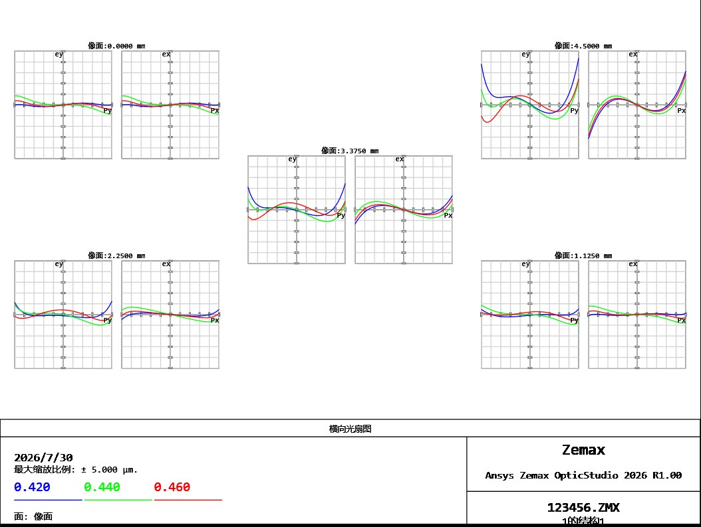

<strong>002 · OpticalPathFan · 光程差图</strong>　✅ 已捕获

| 字段 | 内容 |
|---|---|
| AnalysisIDM | `OpticalPathFan` |
| ZPL 代码 | `Opd` |
| GUI 标题 | 光程差图 |
| 状态 | ✅ 已捕获 |
| 截图来源 | OpticStudio 原生 GUI |
| 数据规模 | 曲线 10 · 网格 0 · 散点 0 · 光线 0 · NSC 点列 1 |
| 分析说明 | 光程差数据列表 |
| 文件 | [结构化数据](analyses/002-opticalpathfan/data.json) · [文本结果](analyses/002-opticalpathfan/data.txt) · [分析设置](analyses/002-opticalpathfan/settings.cfg) · [采集状态](analyses/002-opticalpathfan/status.json) |

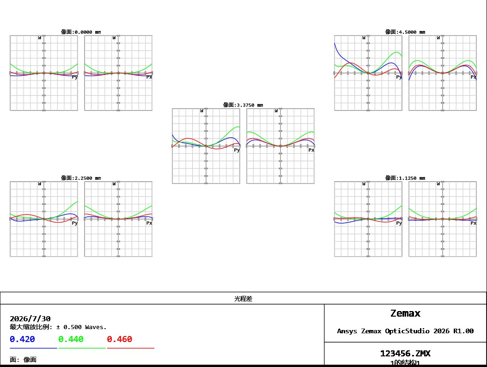

<strong>003 · PupilAberrationFan · 光瞳像差光扇图</strong>　✅ 已捕获

| 字段 | 内容 |
|---|---|
| AnalysisIDM | `PupilAberrationFan` |
| ZPL 代码 | `Pab` |
| GUI 标题 | 光瞳像差光扇图 |
| 状态 | ✅ 已捕获 |
| 截图来源 | OpticStudio 原生 GUI |
| 数据规模 | 曲线 10 · 网格 0 · 散点 0 · 光线 0 · NSC 点列 1 |
| 分析说明 | 入瞳像差数据列表 |
| 文件 | [结构化数据](analyses/003-pupilaberrationfan/data.json) · [文本结果](analyses/003-pupilaberrationfan/data.txt) · [分析设置](analyses/003-pupilaberrationfan/settings.cfg) · [采集状态](analyses/003-pupilaberrationfan/status.json) |

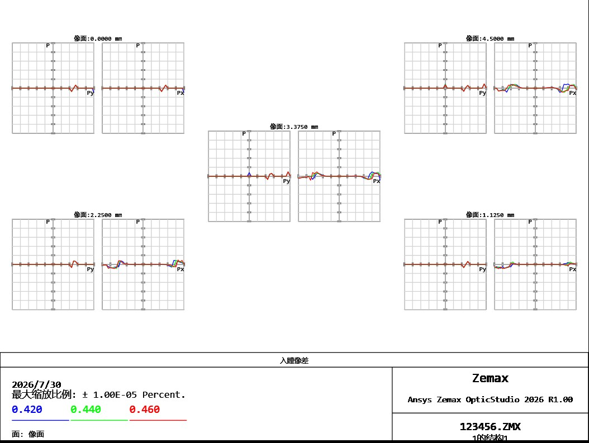

<strong>004 · FieldCurvatureAndDistortion · 视场 场曲/畸变</strong>　✅ 已捕获

| 字段 | 内容 |
|---|---|
| AnalysisIDM | `FieldCurvatureAndDistortion` |
| ZPL 代码 | `Fcd` |
| GUI 标题 | 视场 场曲/畸变 |
| 状态 | ✅ 已捕获 |
| 截图来源 | OpticStudio 原生 GUI |
| 数据规模 | 曲线 3 · 网格 0 · 散点 0 · 光线 0 · NSC 点列 1 |
| 分析说明 | — |
| 文件 | [结构化数据](analyses/004-fieldcurvatureanddistortion/data.json) · [文本结果](analyses/004-fieldcurvatureanddistortion/data.txt) · [分析设置](analyses/004-fieldcurvatureanddistortion/settings.cfg) · [采集状态](analyses/004-fieldcurvatureanddistortion/status.json) |

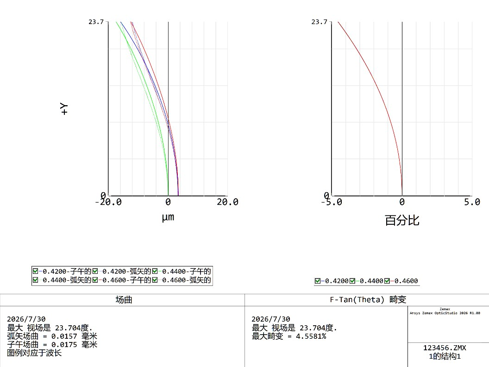

<strong>005 · FocalShiftDiagram · 焦移</strong>　✅ 已捕获

| 字段 | 内容 |
|---|---|
| AnalysisIDM | `FocalShiftDiagram` |
| ZPL 代码 | `Cfs` |
| GUI 标题 | 焦移 |
| 状态 | ✅ 已捕获 |
| 截图来源 | OpticStudio 原生 GUI |
| 数据规模 | 曲线 1 · 网格 0 · 散点 0 · 光线 0 · NSC 点列 1 |
| 分析说明 | 色焦移数据列表 |
| 文件 | [结构化数据](analyses/005-focalshiftdiagram/data.json) · [文本结果](analyses/005-focalshiftdiagram/data.txt) · [分析设置](analyses/005-focalshiftdiagram/settings.cfg) · [采集状态](analyses/005-focalshiftdiagram/status.json) |

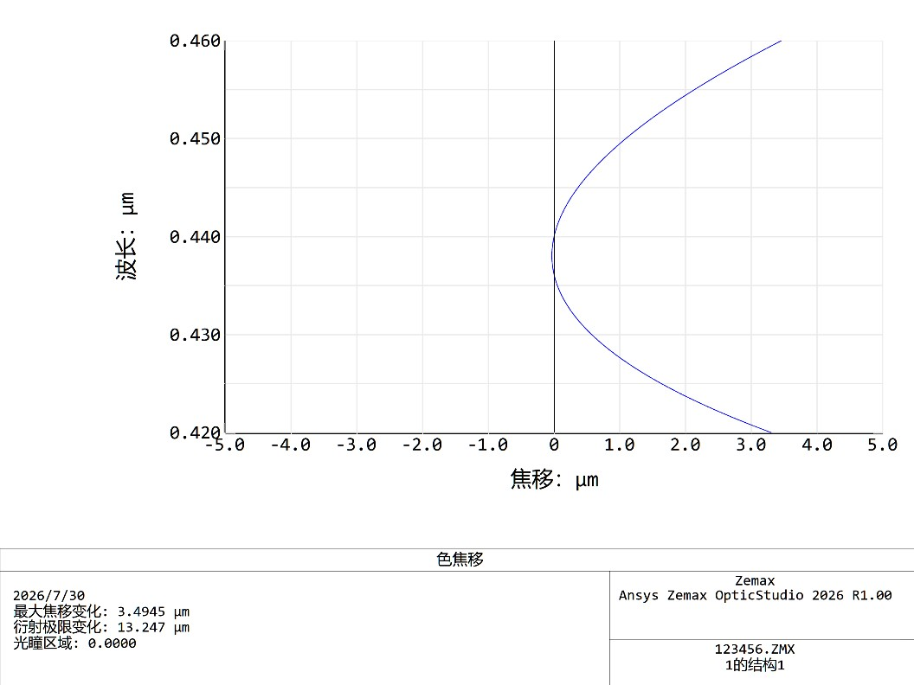

<strong>006 · GridDistortion · 网格畸变</strong>　✅ 已捕获

| 字段 | 内容 |
|---|---|
| AnalysisIDM | `GridDistortion` |
| ZPL 代码 | `Grd` |
| GUI 标题 | 网格畸变 |
| 状态 | ✅ 已捕获 |
| 截图来源 | OpticStudio 原生 GUI |
| 数据规模 | 曲线 0 · 网格 0 · 散点 0 · 光线 0 · NSC 点列 1 |
| 分析说明 | — |
| 文件 | [结构化数据](analyses/006-griddistortion/data.json) · [文本结果](analyses/006-griddistortion/data.txt) · [分析设置](analyses/006-griddistortion/settings.cfg) · [采集状态](analyses/006-griddistortion/status.json) |

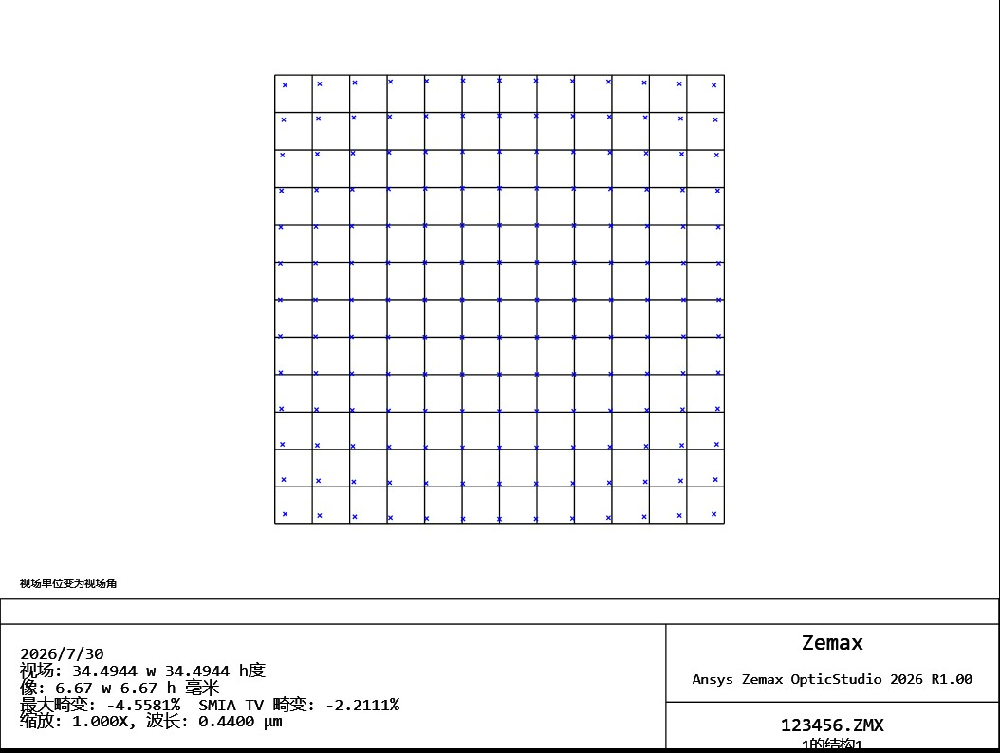

<strong>007 · LateralColor · 垂轴色差</strong>　✅ 已捕获

| 字段 | 内容 |
|---|---|
| AnalysisIDM | `LateralColor` |
| ZPL 代码 | `Lat` |
| GUI 标题 | 垂轴色差 |
| 状态 | ✅ 已捕获 |
| 截图来源 | OpticStudio 原生 GUI |
| 数据规模 | 曲线 1 · 网格 0 · 散点 0 · 光线 0 · NSC 点列 1 |
| 分析说明 | 垂轴色差数据列表 |
| 文件 | [结构化数据](analyses/007-lateralcolor/data.json) · [文本结果](analyses/007-lateralcolor/data.txt) · [分析设置](analyses/007-lateralcolor/settings.cfg) · [采集状态](analyses/007-lateralcolor/status.json) |

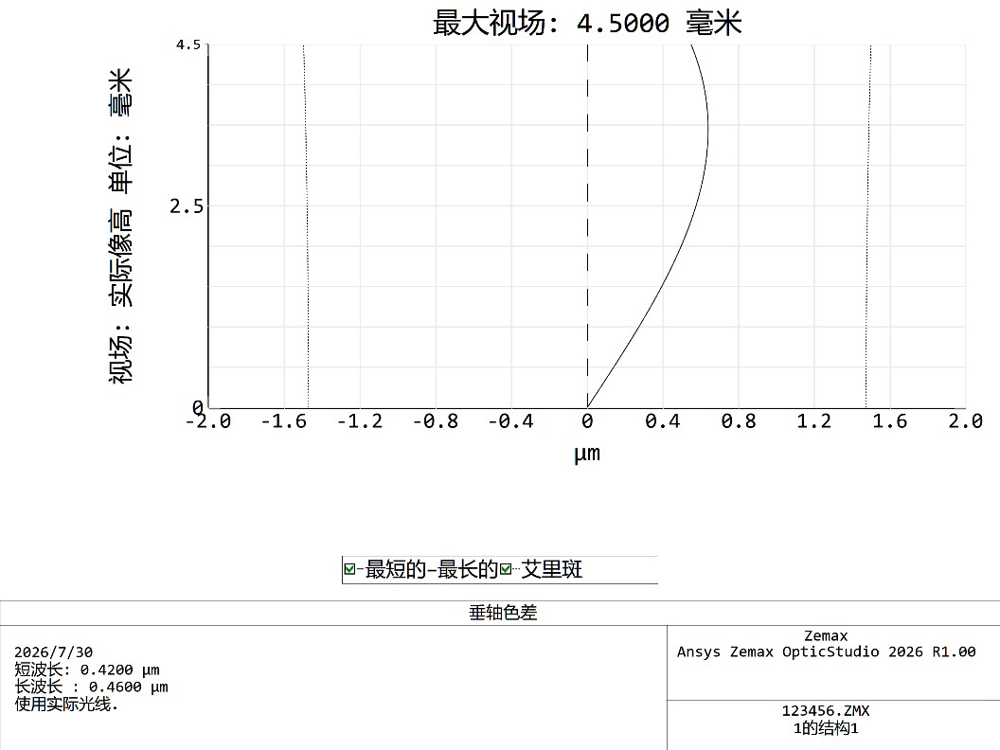

<strong>008 · LongitudinalAberration · 轴向像差</strong>　✅ 已捕获

| 字段 | 内容 |
|---|---|
| AnalysisIDM | `LongitudinalAberration` |
| ZPL 代码 | `Lon` |
| GUI 标题 | 轴向像差 |
| 状态 | ✅ 已捕获 |
| 截图来源 | OpticStudio 原生 GUI |
| 数据规模 | 曲线 1 · 网格 0 · 散点 0 · 光线 0 · NSC 点列 1 |
| 分析说明 | 轴向像差数据列表 |
| 文件 | [结构化数据](analyses/008-longitudinalaberration/data.json) · [文本结果](analyses/008-longitudinalaberration/data.txt) · [分析设置](analyses/008-longitudinalaberration/settings.cfg) · [采集状态](analyses/008-longitudinalaberration/status.json) |

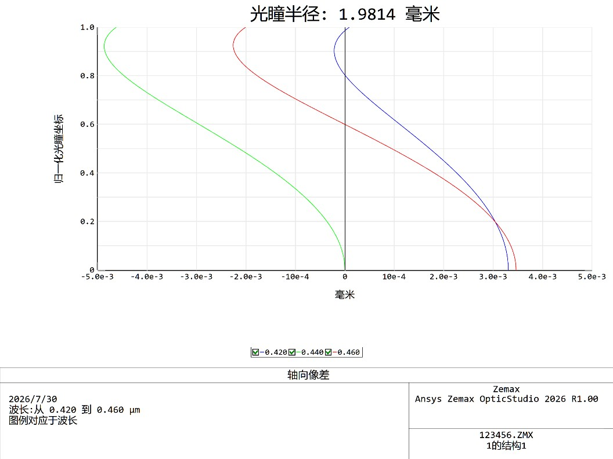

<strong>009 · RayTrace · 单光线追迹 2</strong>　✅ 已捕获

| 字段 | 内容 |
|---|---|
| AnalysisIDM | `RayTrace` |
| ZPL 代码 | `Rtr` |
| GUI 标题 | 单光线追迹 2 |
| 状态 | ✅ 已捕获 |
| 截图来源 | ZOS-API 数据回退渲染 |
| 数据规模 | 曲线 0 · 网格 0 · 散点 0 · 光线 0 · NSC 点列 1 |
| 分析说明 | — |
| 文件 | [结构化数据](analyses/009-raytrace/data.json) · [文本结果](analyses/009-raytrace/data.txt) · [分析设置](analyses/009-raytrace/settings.cfg) · [采集状态](analyses/009-raytrace/status.json) |

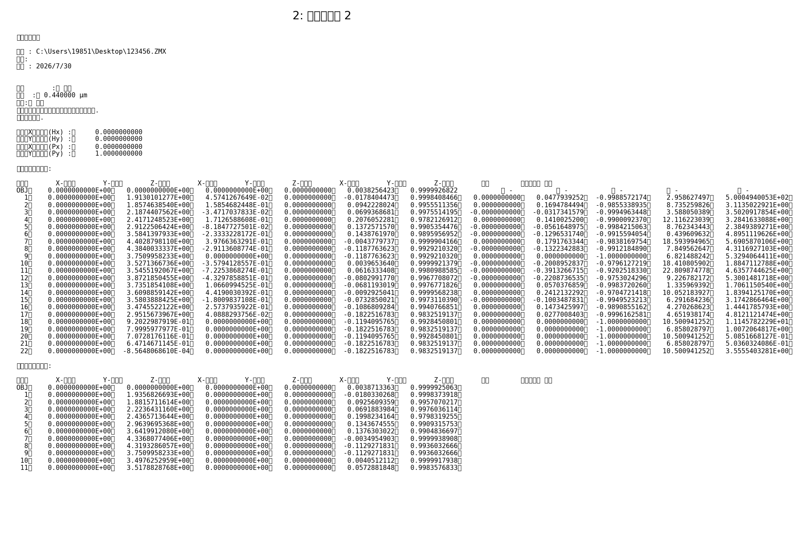

<strong>010 · SeidelCoefficients · 赛德尔系数</strong>　✅ 已捕获

| 字段 | 内容 |
|---|---|
| AnalysisIDM | `SeidelCoefficients` |
| ZPL 代码 | `Sei` |
| GUI 标题 | 赛德尔系数 |
| 状态 | ✅ 已捕获 |
| 截图来源 | ZOS-API 数据回退渲染 |
| 数据规模 | 曲线 0 · 网格 0 · 散点 0 · 光线 0 · NSC 点列 1 |
| 分析说明 | — |
| 文件 | [结构化数据](analyses/010-seidelcoefficients/data.json) · [文本结果](analyses/010-seidelcoefficients/data.txt) · [分析设置](analyses/010-seidelcoefficients/settings.cfg) · [采集状态](analyses/010-seidelcoefficients/status.json) |

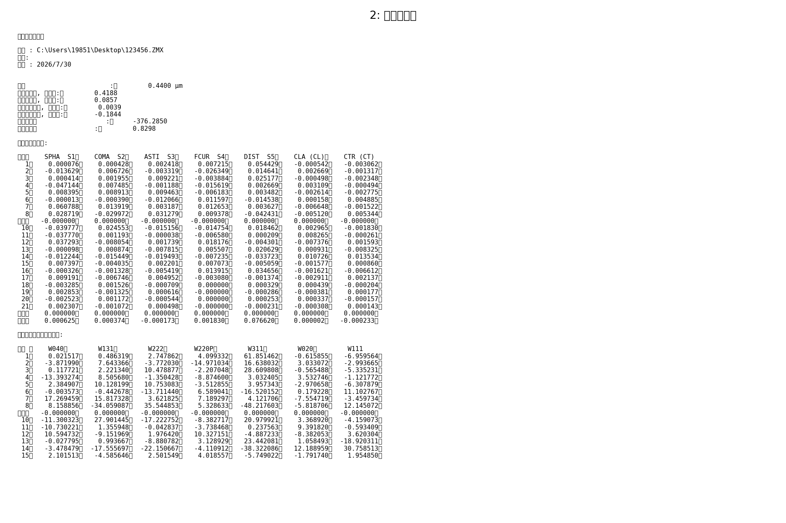

<strong>011 · SeidelDiagram · 赛德尔图</strong>　✅ 已捕获

| 字段 | 内容 |
|---|---|
| AnalysisIDM | `SeidelDiagram` |
| ZPL 代码 | `Sdi` |
| GUI 标题 | 赛德尔图 |
| 状态 | ✅ 已捕获 |
| 截图来源 | OpticStudio 原生 GUI |
| 数据规模 | 曲线 0 · 网格 0 · 散点 0 · 光线 0 · NSC 点列 1 |
| 分析说明 | — |
| 文件 | [结构化数据](analyses/011-seideldiagram/data.json) · [分析设置](analyses/011-seideldiagram/settings.cfg) · [采集状态](analyses/011-seideldiagram/status.json) |

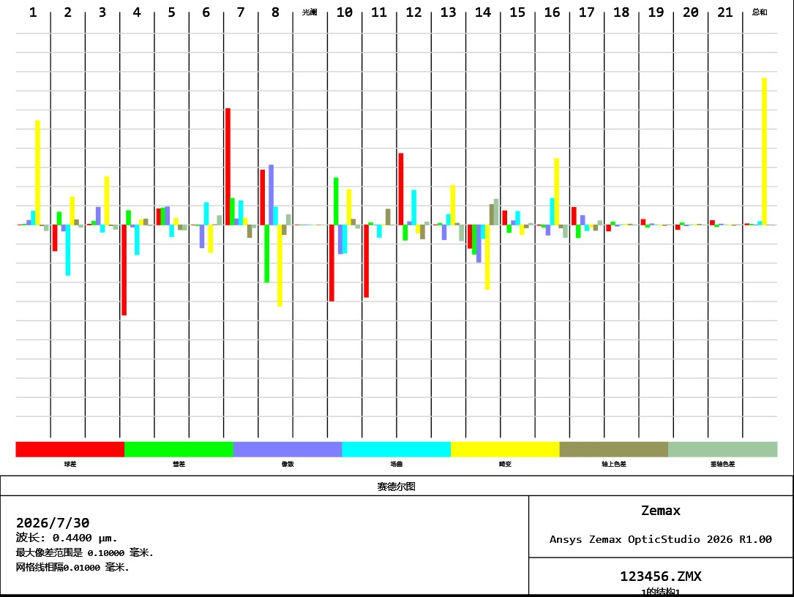

<strong>012 · ZernikeAnnularCoefficients · Zernike Annular系数</strong>　✅ 已捕获

| 字段 | 内容 |
|---|---|
| AnalysisIDM | `ZernikeAnnularCoefficients` |
| ZPL 代码 | `Zat` |
| GUI 标题 | Zernike Annular系数 |
| 状态 | ✅ 已捕获 |
| 截图来源 | ZOS-API 数据回退渲染 |
| 数据规模 | 曲线 0 · 网格 0 · 散点 0 · 光线 0 · NSC 点列 1 |
| 分析说明 | — |
| 文件 | [结构化数据](analyses/012-zernikeannularcoefficients/data.json) · [文本结果](analyses/012-zernikeannularcoefficients/data.txt) · [分析设置](analyses/012-zernikeannularcoefficients/settings.cfg) · [采集状态](analyses/012-zernikeannularcoefficients/status.json) |

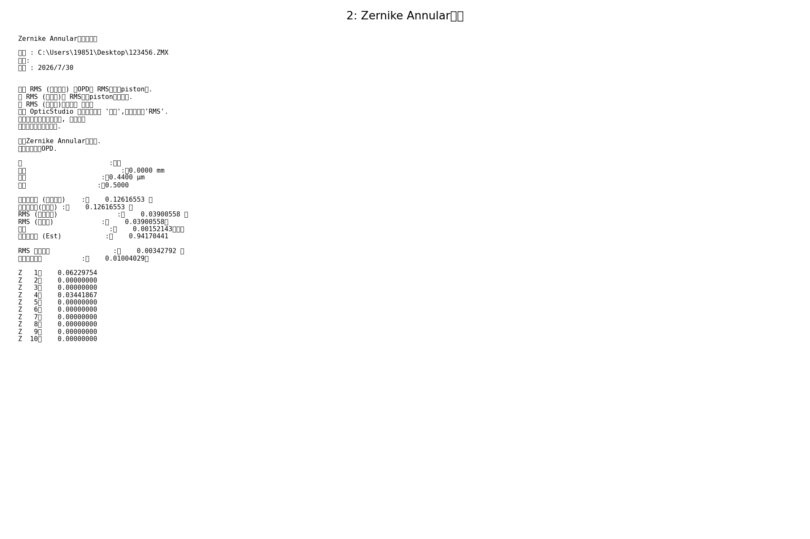

<strong>013 · ZernikeCoefficientsVsField · Zernike系数 vs. 视场</strong>　✅ 已捕获

| 字段 | 内容 |
|---|---|
| AnalysisIDM | `ZernikeCoefficientsVsField` |
| ZPL 代码 | `Zvf` |
| GUI 标题 | Zernike系数 vs. 视场 |
| 状态 | ✅ 已捕获 |
| 截图来源 | OpticStudio 原生 GUI |
| 数据规模 | 曲线 0 · 网格 0 · 散点 0 · 光线 0 · NSC 点列 1 |
| 分析说明 | Zernike系数 vs. 视场 列表 |
| 文件 | [结构化数据](analyses/013-zernikecoefficientsvsfield/data.json) · [文本结果](analyses/013-zernikecoefficientsvsfield/data.txt) · [分析设置](analyses/013-zernikecoefficientsvsfield/settings.cfg) · [采集状态](analyses/013-zernikecoefficientsvsfield/status.json) |

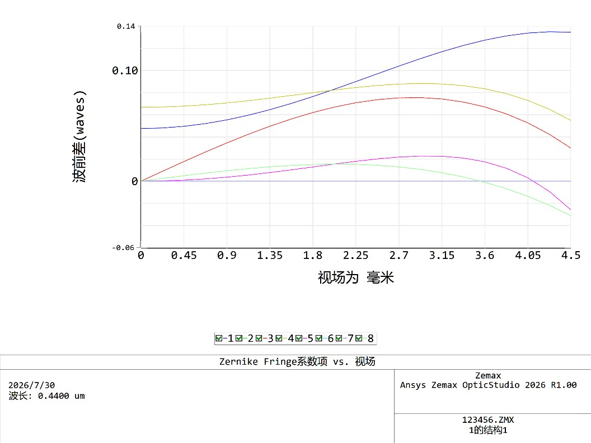

<strong>014 · ZernikeFringeCoefficients · Zernike Fringe系数</strong>　✅ 已捕获

| 字段 | 内容 |
|---|---|
| AnalysisIDM | `ZernikeFringeCoefficients` |
| ZPL 代码 | `Zfr` |
| GUI 标题 | Zernike Fringe系数 |
| 状态 | ✅ 已捕获 |
| 截图来源 | ZOS-API 数据回退渲染 |
| 数据规模 | 曲线 0 · 网格 0 · 散点 0 · 光线 0 · NSC 点列 1 |
| 分析说明 | — |
| 文件 | [结构化数据](analyses/014-zernikefringecoefficients/data.json) · [文本结果](analyses/014-zernikefringecoefficients/data.txt) · [分析设置](analyses/014-zernikefringecoefficients/settings.cfg) · [采集状态](analyses/014-zernikefringecoefficients/status.json) |

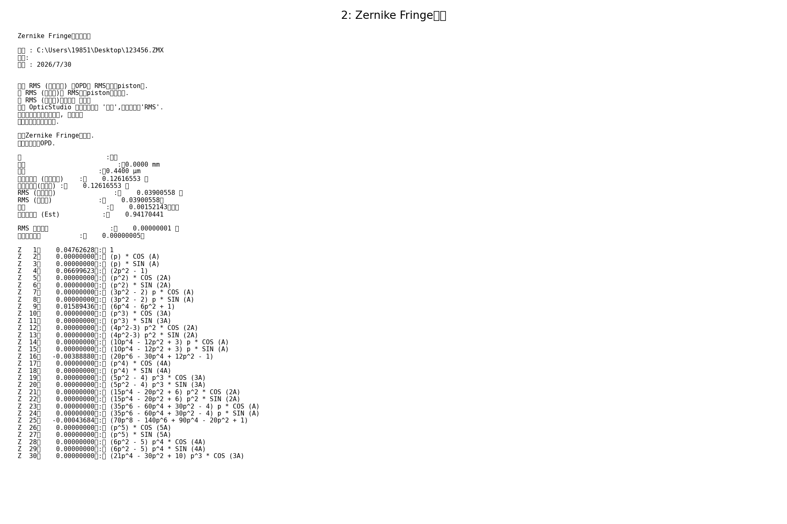

<strong>015 · ZernikeStandardCoefficients · Zernike Standard系数</strong>　✅ 已捕获

| 字段 | 内容 |
|---|---|
| AnalysisIDM | `ZernikeStandardCoefficients` |
| ZPL 代码 | `Zst` |
| GUI 标题 | Zernike Standard系数 |
| 状态 | ✅ 已捕获 |
| 截图来源 | ZOS-API 数据回退渲染 |
| 数据规模 | 曲线 0 · 网格 0 · 散点 0 · 光线 0 · NSC 点列 1 |
| 分析说明 | — |
| 文件 | [结构化数据](analyses/015-zernikestandardcoefficients/data.json) · [文本结果](analyses/015-zernikestandardcoefficients/data.txt) · [分析设置](analyses/015-zernikestandardcoefficients/settings.cfg) · [采集状态](analyses/015-zernikestandardcoefficients/status.json) |

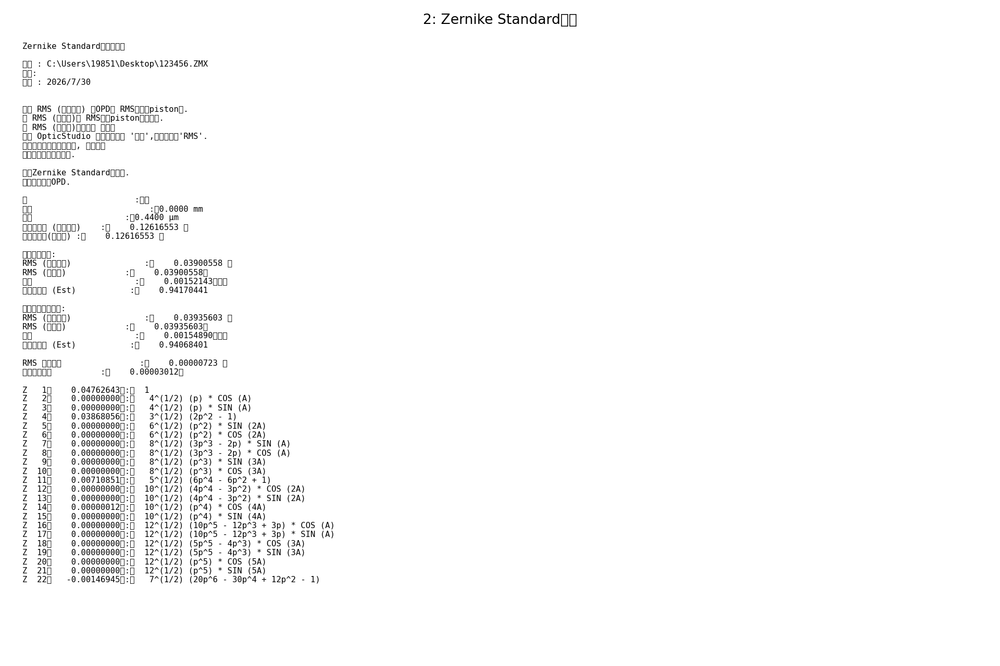

<strong>016 · FftMtf · FFT MTF</strong>　✅ 已捕获

| 字段 | 内容 |
|---|---|
| AnalysisIDM | `FftMtf` |
| ZPL 代码 | `Mtf` |
| GUI 标题 | FFT MTF |
| 状态 | ✅ 已捕获 |
| 截图来源 | OpticStudio 原生 GUI |
| 数据规模 | 曲线 5 · 网格 0 · 散点 0 · 光线 0 · NSC 点列 1 |
| 分析说明 | 复色光衍射MTF |
| 文件 | [结构化数据](analyses/016-fftmtf/data.json) · [文本结果](analyses/016-fftmtf/data.txt) · [分析设置](analyses/016-fftmtf/settings.cfg) · [采集状态](analyses/016-fftmtf/status.json) |

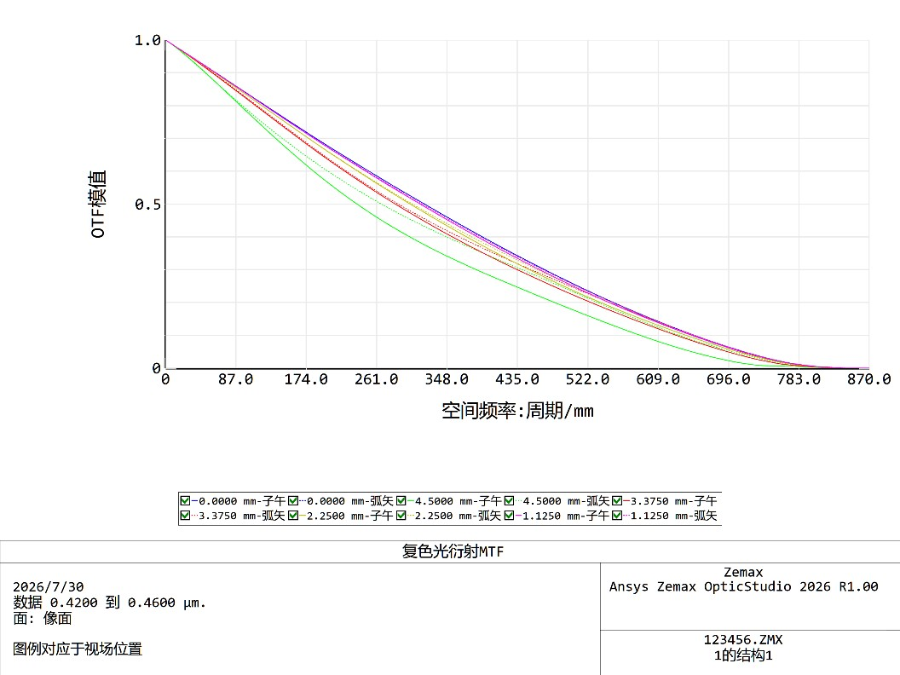

<strong>017 · FftThroughFocusMtf · 离焦FFT MTF</strong>　✅ 已捕获

| 字段 | 内容 |
|---|---|
| AnalysisIDM | `FftThroughFocusMtf` |
| ZPL 代码 | `Tfm` |
| GUI 标题 | 离焦FFT MTF |
| 状态 | ✅ 已捕获 |
| 截图来源 | OpticStudio 原生 GUI |
| 数据规模 | 曲线 5 · 网格 0 · 散点 0 · 光线 0 · NSC 点列 1 |
| 分析说明 | 复色光衍射离焦MTF |
| 文件 | [结构化数据](analyses/017-fftthroughfocusmtf/data.json) · [文本结果](analyses/017-fftthroughfocusmtf/data.txt) · [分析设置](analyses/017-fftthroughfocusmtf/settings.cfg) · [采集状态](analyses/017-fftthroughfocusmtf/status.json) |

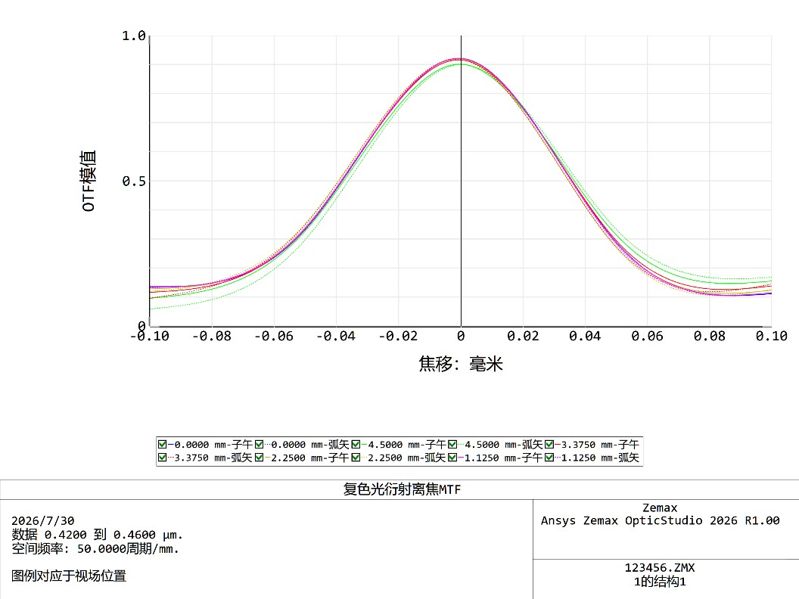

<strong>018 · GeometricThroughFocusMtf · 离焦几何MTF</strong>　✅ 已捕获

| 字段 | 内容 |
|---|---|
| AnalysisIDM | `GeometricThroughFocusMtf` |
| ZPL 代码 | `Tfg` |
| GUI 标题 | 离焦几何MTF |
| 状态 | ✅ 已捕获 |
| 截图来源 | OpticStudio 原生 GUI |
| 数据规模 | 曲线 5 · 网格 0 · 散点 0 · 光线 0 · NSC 点列 1 |
| 分析说明 | 复色光离焦几何MTF |
| 文件 | [结构化数据](analyses/018-geometricthroughfocusmtf/data.json) · [文本结果](analyses/018-geometricthroughfocusmtf/data.txt) · [分析设置](analyses/018-geometricthroughfocusmtf/settings.cfg) · [采集状态](analyses/018-geometricthroughfocusmtf/status.json) |

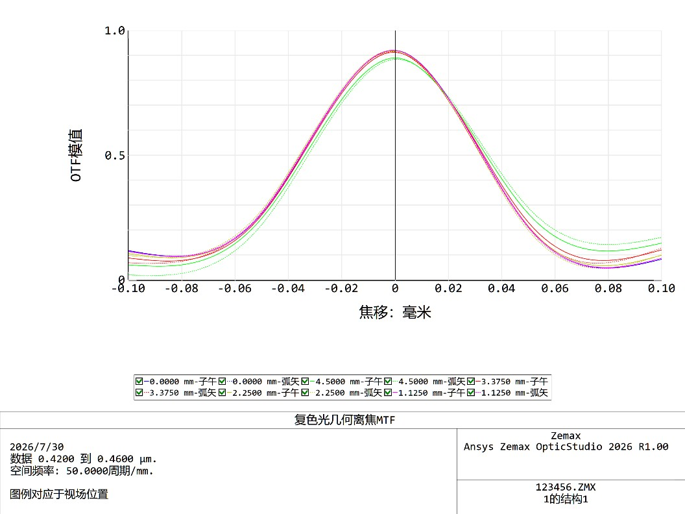

<strong>019 · GeometricMtf · 几何MTF</strong>　✅ 已捕获

| 字段 | 内容 |
|---|---|
| AnalysisIDM | `GeometricMtf` |
| ZPL 代码 | `Gtf` |
| GUI 标题 | 几何MTF |
| 状态 | ✅ 已捕获 |
| 截图来源 | OpticStudio 原生 GUI |
| 数据规模 | 曲线 5 · 网格 0 · 散点 0 · 光线 0 · NSC 点列 1 |
| 分析说明 | 复色光几何MTF |
| 文件 | [结构化数据](analyses/019-geometricmtf/data.json) · [文本结果](analyses/019-geometricmtf/data.txt) · [分析设置](analyses/019-geometricmtf/settings.cfg) · [采集状态](analyses/019-geometricmtf/status.json) |

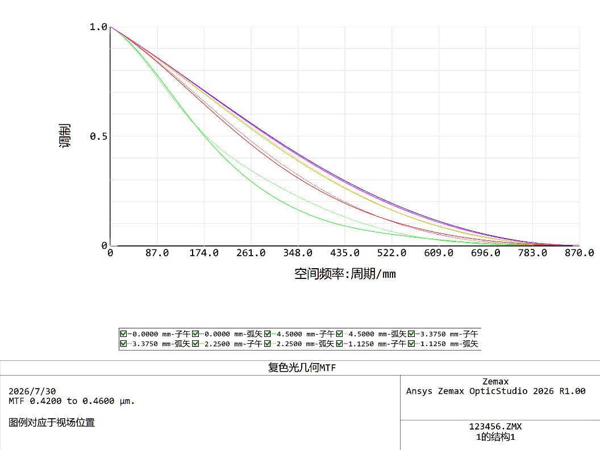

<strong>020 · FftMtfMap · 二维视场FFT MTF</strong>　✅ 已捕获

| 字段 | 内容 |
|---|---|
| AnalysisIDM | `FftMtfMap` |
| ZPL 代码 | `Fmm` |
| GUI 标题 | 二维视场FFT MTF |
| 状态 | ✅ 已捕获 |
| 截图来源 | OpticStudio 原生 GUI |
| 数据规模 | 曲线 0 · 网格 1 · 散点 0 · 光线 0 · NSC 点列 1 |
| 分析说明 | 平均子午 + 弧矢的 MTF图 |
| 文件 | [结构化数据](analyses/020-fftmtfmap/data.json) · [文本结果](analyses/020-fftmtfmap/data.txt) · [分析设置](analyses/020-fftmtfmap/settings.cfg) · [采集状态](analyses/020-fftmtfmap/status.json) |

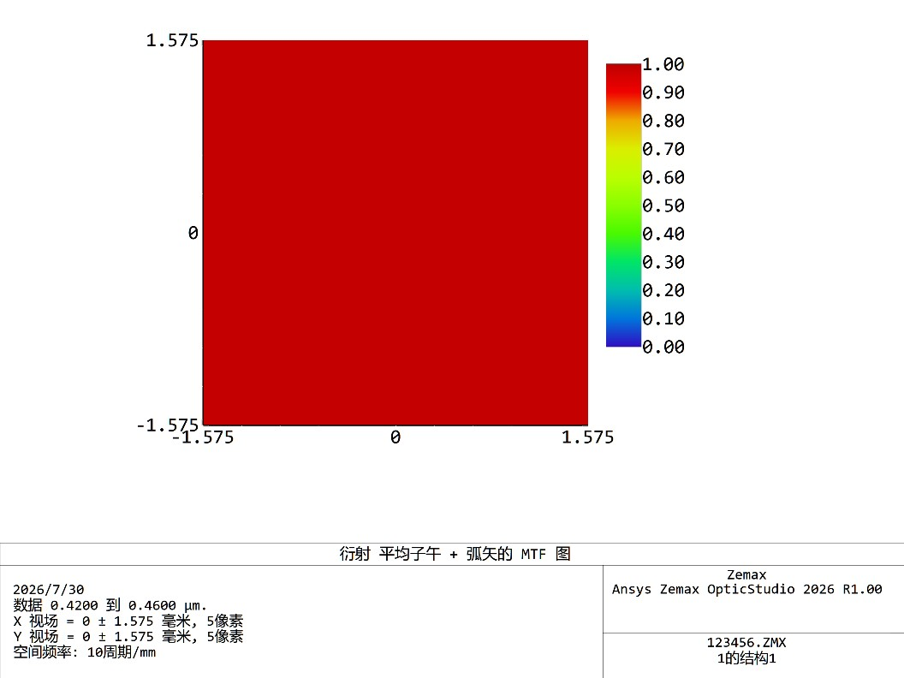

<strong>021 · GeometricMtfMap · 二维视场几何MTF</strong>　✅ 已捕获

| 字段 | 内容 |
|---|---|
| AnalysisIDM | `GeometricMtfMap` |
| ZPL 代码 | `Gmm` |
| GUI 标题 | 二维视场几何MTF |
| 状态 | ✅ 已捕获 |
| 截图来源 | OpticStudio 原生 GUI |
| 数据规模 | 曲线 0 · 网格 1 · 散点 0 · 光线 0 · NSC 点列 1 |
| 分析说明 | 平均子午 + 弧矢的 MTF图 |
| 文件 | [结构化数据](analyses/021-geometricmtfmap/data.json) · [文本结果](analyses/021-geometricmtfmap/data.txt) · [分析设置](analyses/021-geometricmtfmap/settings.cfg) · [采集状态](analyses/021-geometricmtfmap/status.json) |

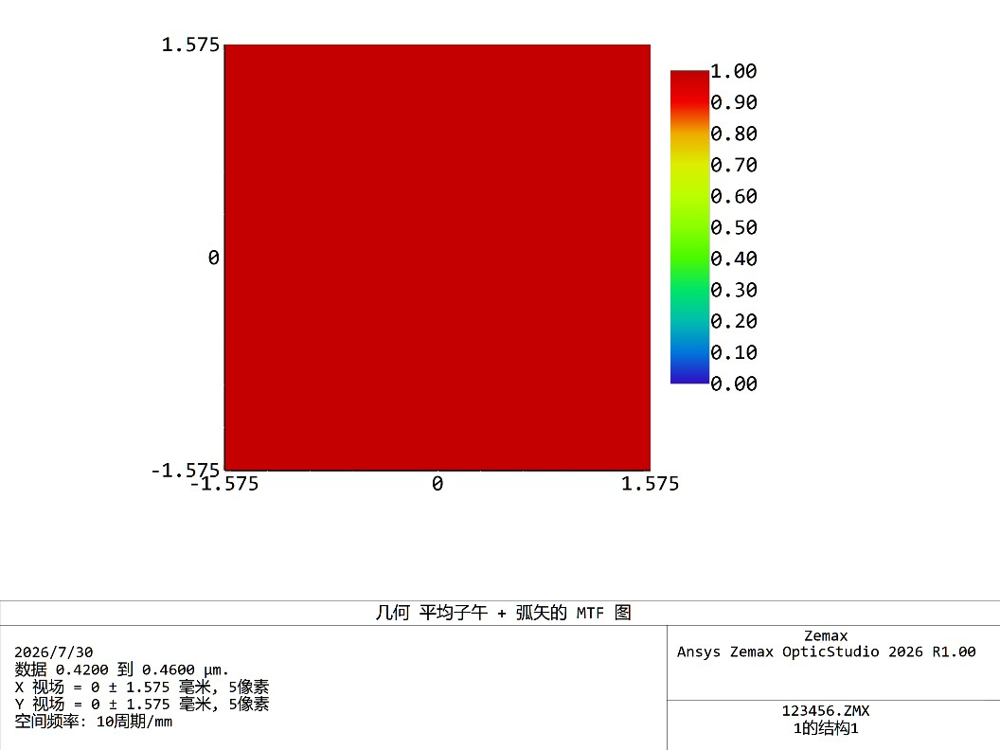

<strong>022 · FftSurfaceMtf · 三维FFT MTF</strong>　✅ 已捕获

| 字段 | 内容 |
|---|---|
| AnalysisIDM | `FftSurfaceMtf` |
| ZPL 代码 | `Smf` |
| GUI 标题 | 三维FFT MTF |
| 状态 | ✅ 已捕获 |
| 截图来源 | OpticStudio 原生 GUI |
| 数据规模 | 曲线 0 · 网格 1 · 散点 0 · 光线 0 · NSC 点列 1 |
| 分析说明 | FFT MTF 数据列表 |
| 文件 | [结构化数据](analyses/022-fftsurfacemtf/data.json) · [文本结果](analyses/022-fftsurfacemtf/data.txt) · [分析设置](analyses/022-fftsurfacemtf/settings.cfg) · [采集状态](analyses/022-fftsurfacemtf/status.json) |

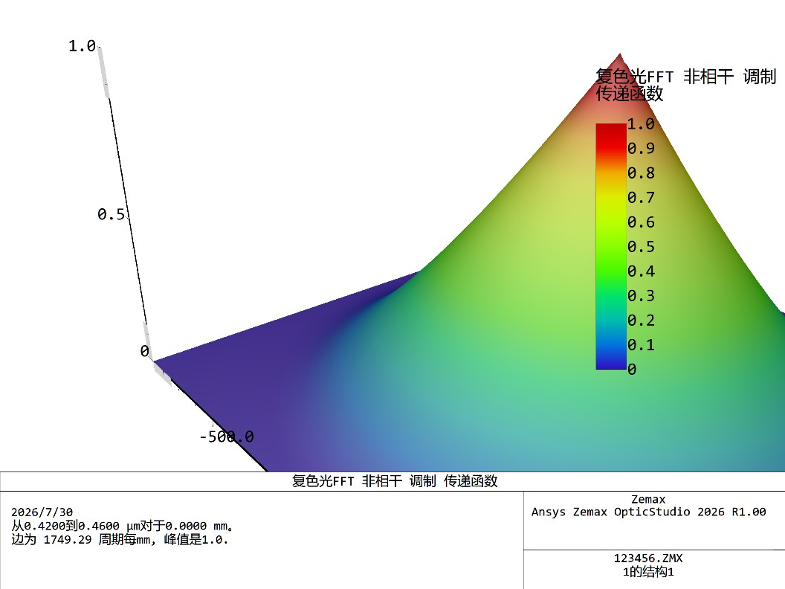

<strong>023 · FftMtfvsField · FFT MTF vs. 视场</strong>　✅ 已捕获

| 字段 | 内容 |
|---|---|
| AnalysisIDM | `FftMtfvsField` |
| ZPL 代码 | `Mth` |
| GUI 标题 | FFT MTF vs. 视场 |
| 状态 | ✅ 已捕获 |
| 截图来源 | OpticStudio 原生 GUI |
| 数据规模 | 曲线 6 · 网格 0 · 散点 0 · 光线 0 · NSC 点列 1 |
| 分析说明 | 复色光MTF vs. Y视场高度 |
| 文件 | [结构化数据](analyses/023-fftmtfvsfield/data.json) · [文本结果](analyses/023-fftmtfvsfield/data.txt) · [分析设置](analyses/023-fftmtfvsfield/settings.cfg) · [采集状态](analyses/023-fftmtfvsfield/status.json) |

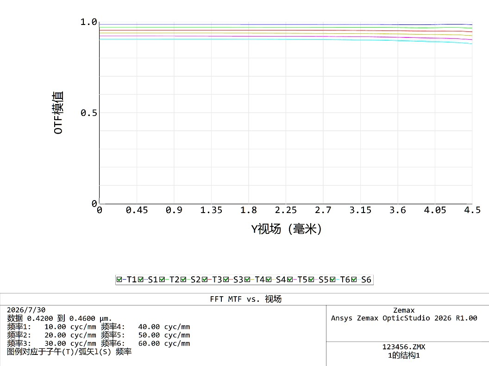

<strong>024 · GeometricMtfvsField · 几何MTF vs. 视场</strong>　✅ 已捕获

| 字段 | 内容 |
|---|---|
| AnalysisIDM | `GeometricMtfvsField` |
| ZPL 代码 | `Gvf` |
| GUI 标题 | 几何MTF vs. 视场 |
| 状态 | ✅ 已捕获 |
| 截图来源 | OpticStudio 原生 GUI |
| 数据规模 | 曲线 6 · 网格 0 · 散点 0 · 光线 0 · NSC 点列 1 |
| 分析说明 | 复色光几何MTFY vs. 视场高度 |
| 文件 | [结构化数据](analyses/024-geometricmtfvsfield/data.json) · [文本结果](analyses/024-geometricmtfvsfield/data.txt) · [分析设置](analyses/024-geometricmtfvsfield/settings.cfg) · [采集状态](analyses/024-geometricmtfvsfield/status.json) |

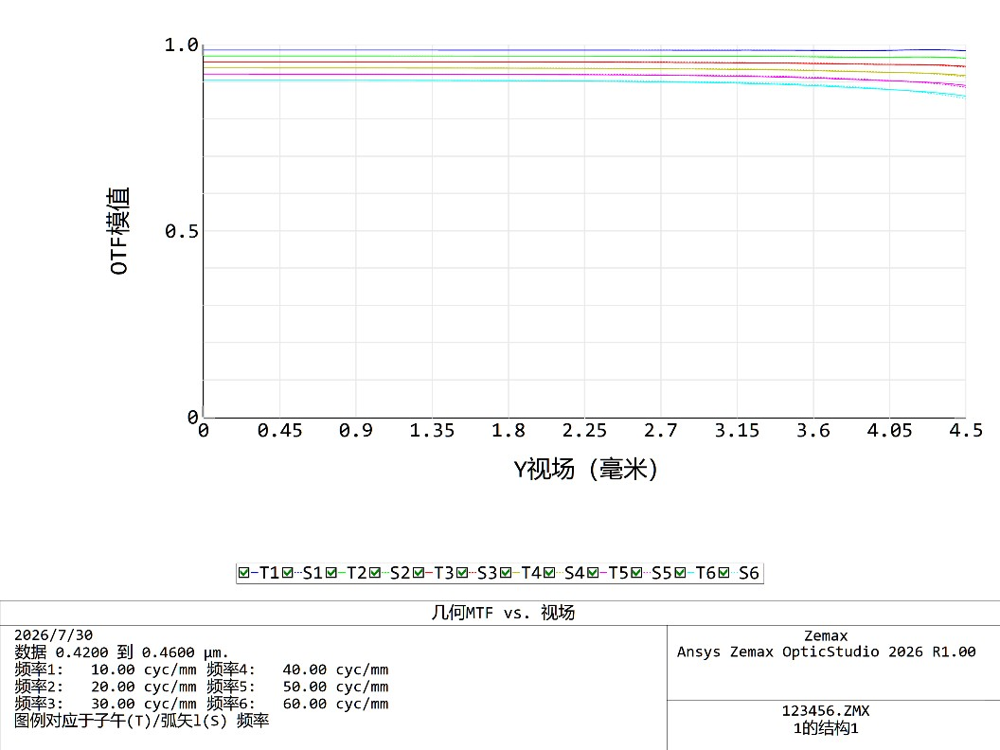

<strong>025 · HuygensMtfvsField · 惠更斯 MTF vs. 视场</strong>　✅ 已捕获

| 字段 | 内容 |
|---|---|
| AnalysisIDM | `HuygensMtfvsField` |
| ZPL 代码 | `Hmh` |
| GUI 标题 | 惠更斯 MTF vs. 视场 |
| 状态 | ✅ 已捕获 |
| 截图来源 | OpticStudio 原生 GUI |
| 数据规模 | 曲线 6 · 网格 0 · 散点 0 · 光线 0 · NSC 点列 1 |
| 分析说明 | 复色光惠更斯 MTF vs. Y 视场高度 |
| 文件 | [结构化数据](analyses/025-huygensmtfvsfield/data.json) · [文本结果](analyses/025-huygensmtfvsfield/data.txt) · [分析设置](analyses/025-huygensmtfvsfield/settings.cfg) · [采集状态](analyses/025-huygensmtfvsfield/status.json) |

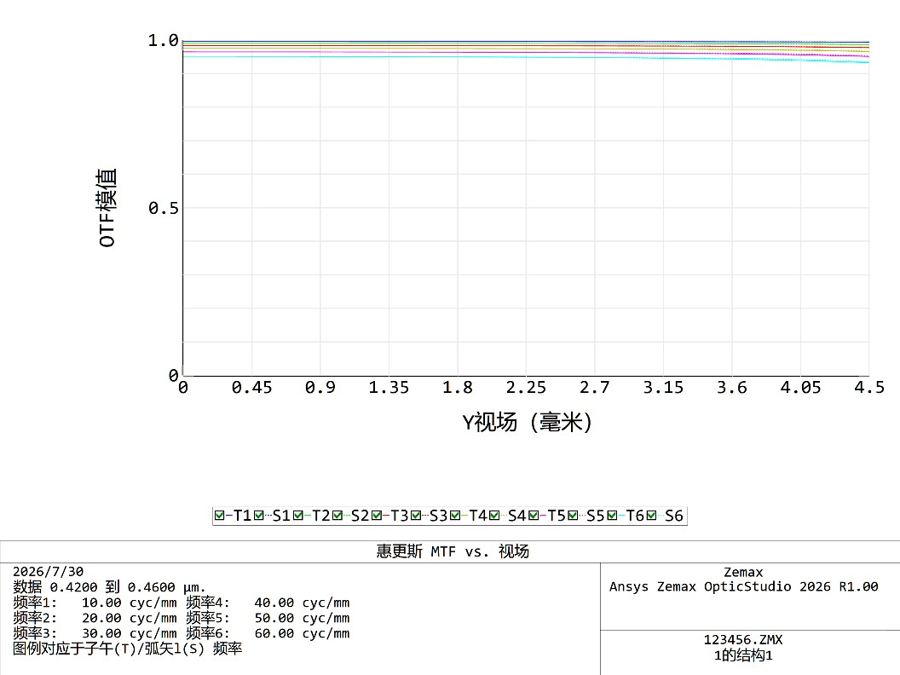

### 分析 026–050

<strong>026 · HuygensMtf · 惠更斯MTF</strong>　✅ 已捕获

| 字段 | 内容 |
|---|---|
| AnalysisIDM | `HuygensMtf` |
| ZPL 代码 | `Hmf` |
| GUI 标题 | 惠更斯MTF |
| 状态 | ✅ 已捕获 |
| 截图来源 | OpticStudio 原生 GUI |
| 数据规模 | 曲线 5 · 网格 0 · 散点 0 · 光线 0 · NSC 点列 1 |
| 分析说明 | 复色光惠更斯MTF |
| 文件 | [结构化数据](analyses/026-huygensmtf/data.json) · [文本结果](analyses/026-huygensmtf/data.txt) · [分析设置](analyses/026-huygensmtf/settings.cfg) · [采集状态](analyses/026-huygensmtf/status.json) |

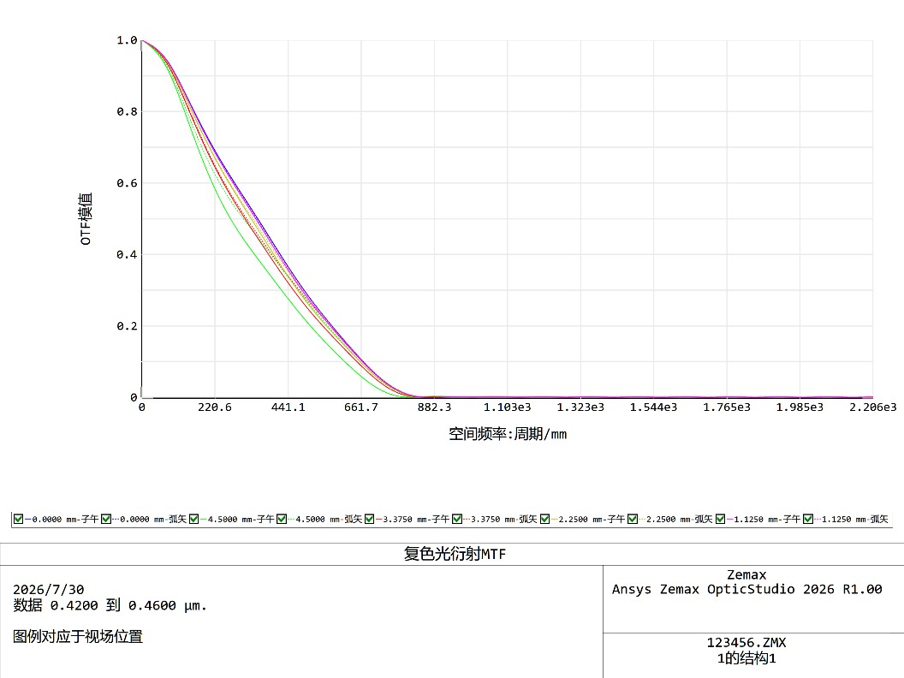

<strong>027 · HuygensSurfaceMtf · 二维惠更斯MTF</strong>　✅ 已捕获

| 字段 | 内容 |
|---|---|
| AnalysisIDM | `HuygensSurfaceMtf` |
| ZPL 代码 | `Hsm` |
| GUI 标题 | 二维惠更斯MTF |
| 状态 | ✅ 已捕获 |
| 截图来源 | OpticStudio 原生 GUI |
| 数据规模 | 曲线 0 · 网格 1 · 散点 0 · 光线 0 · NSC 点列 1 |
| 分析说明 | — |
| 文件 | [结构化数据](analyses/027-huygenssurfacemtf/data.json) · [文本结果](analyses/027-huygenssurfacemtf/data.txt) · [分析设置](analyses/027-huygenssurfacemtf/settings.cfg) · [采集状态](analyses/027-huygenssurfacemtf/status.json) |

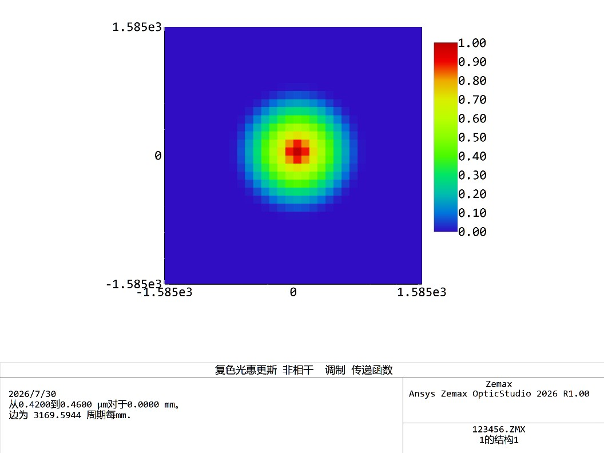

<strong>028 · HuygensThroughFocusMtf · 离焦惠更斯MTF</strong>　✅ 已捕获

| 字段 | 内容 |
|---|---|
| AnalysisIDM | `HuygensThroughFocusMtf` |
| ZPL 代码 | `Htf` |
| GUI 标题 | 离焦惠更斯MTF |
| 状态 | ✅ 已捕获 |
| 截图来源 | OpticStudio 原生 GUI |
| 数据规模 | 曲线 5 · 网格 0 · 散点 0 · 光线 0 · NSC 点列 1 |
| 分析说明 | 复色光离焦惠更斯MTF |
| 文件 | [结构化数据](analyses/028-huygensthroughfocusmtf/data.json) · [文本结果](analyses/028-huygensthroughfocusmtf/data.txt) · [分析设置](analyses/028-huygensthroughfocusmtf/settings.cfg) · [采集状态](analyses/028-huygensthroughfocusmtf/status.json) |

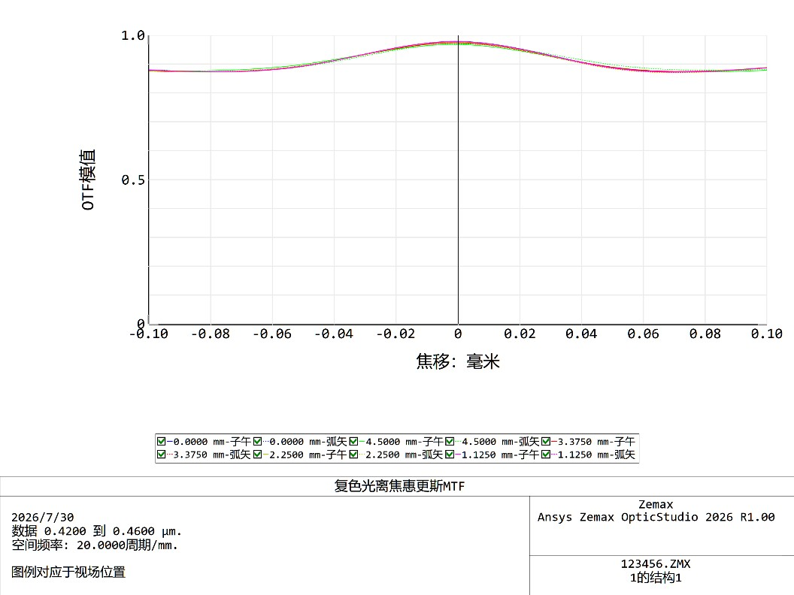

<strong>029 · FftPsf · FFT PSF</strong>　✅ 已捕获

| 字段 | 内容 |
|---|---|
| AnalysisIDM | `FftPsf` |
| ZPL 代码 | `Fps` |
| GUI 标题 | FFT PSF |
| 状态 | ✅ 已捕获 |
| 截图来源 | OpticStudio 原生 GUI |
| 数据规模 | 曲线 0 · 网格 1 · 散点 0 · 光线 0 · NSC 点列 1 |
| 分析说明 | FFT PSF 数据列表 |
| 文件 | [结构化数据](analyses/029-fftpsf/data.json) · [文本结果](analyses/029-fftpsf/data.txt) · [分析设置](analyses/029-fftpsf/settings.cfg) · [采集状态](analyses/029-fftpsf/status.json) |

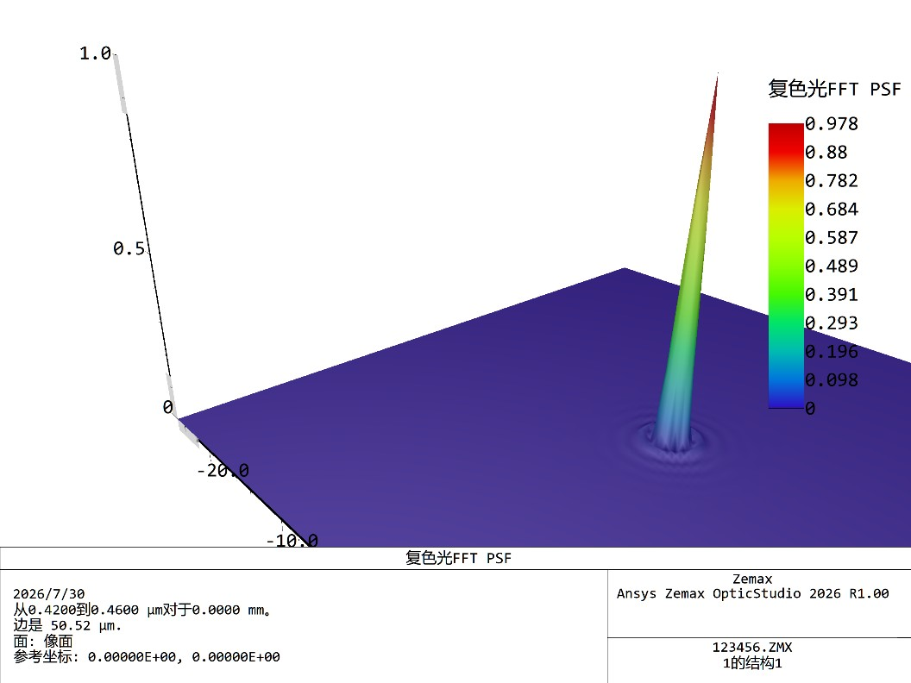

<strong>030 · FftPsfCrossSection · FFT PSF截面图</strong>　✅ 已捕获

| 字段 | 内容 |
|---|---|
| AnalysisIDM | `FftPsfCrossSection` |
| ZPL 代码 | `Pcs` |
| GUI 标题 | FFT PSF截面图 |
| 状态 | ✅ 已捕获 |
| 截图来源 | OpticStudio 原生 GUI |
| 数据规模 | 曲线 0 · 网格 0 · 散点 0 · 光线 0 · NSC 点列 1 |
| 分析说明 | PSF 数据列表 |
| 文件 | [结构化数据](analyses/030-fftpsfcrosssection/data.json) · [文本结果](analyses/030-fftpsfcrosssection/data.txt) · [分析设置](analyses/030-fftpsfcrosssection/settings.cfg) · [采集状态](analyses/030-fftpsfcrosssection/status.json) |

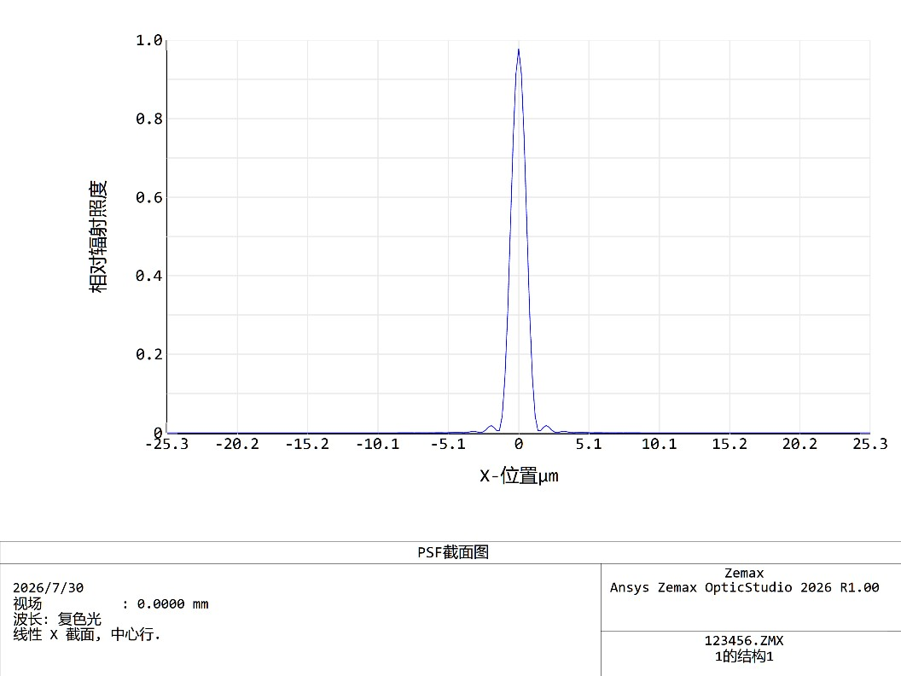

<strong>031 · FftPsfLineEdgeSpread · FFT 线/边缘扩散</strong>　✅ 已捕获

| 字段 | 内容 |
|---|---|
| AnalysisIDM | `FftPsfLineEdgeSpread` |
| ZPL 代码 | `Lsf` |
| GUI 标题 | FFT 线/边缘扩散 |
| 状态 | ✅ 已捕获 |
| 截图来源 | OpticStudio 原生 GUI |
| 数据规模 | 曲线 0 · 网格 0 · 散点 0 · 光线 0 · NSC 点列 1 |
| 分析说明 | FFT 线扩散函数列表 |
| 文件 | [结构化数据](analyses/031-fftpsflineedgespread/data.json) · [文本结果](analyses/031-fftpsflineedgespread/data.txt) · [分析设置](analyses/031-fftpsflineedgespread/settings.cfg) · [采集状态](analyses/031-fftpsflineedgespread/status.json) |

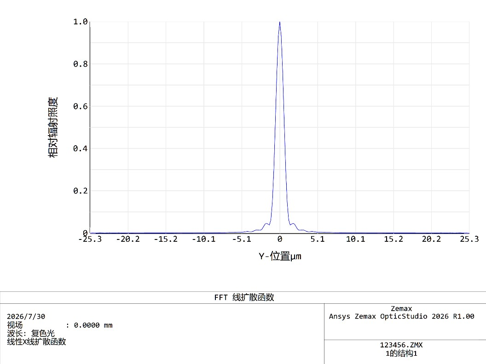

<strong>032 · HuygensPsfCrossSection · 惠更斯PSF截面图</strong>　✅ 已捕获

| 字段 | 内容 |
|---|---|
| AnalysisIDM | `HuygensPsfCrossSection` |
| ZPL 代码 | `Hcs` |
| GUI 标题 | 惠更斯PSF截面图 |
| 状态 | ✅ 已捕获 |
| 截图来源 | OpticStudio 原生 GUI |
| 数据规模 | 曲线 0 · 网格 0 · 散点 0 · 光线 0 · NSC 点列 1 |
| 分析说明 | 惠更斯 PSF 十字部分数据列表 |
| 文件 | [结构化数据](analyses/032-huygenspsfcrosssection/data.json) · [文本结果](analyses/032-huygenspsfcrosssection/data.txt) · [分析设置](analyses/032-huygenspsfcrosssection/settings.cfg) · [采集状态](analyses/032-huygenspsfcrosssection/status.json) |

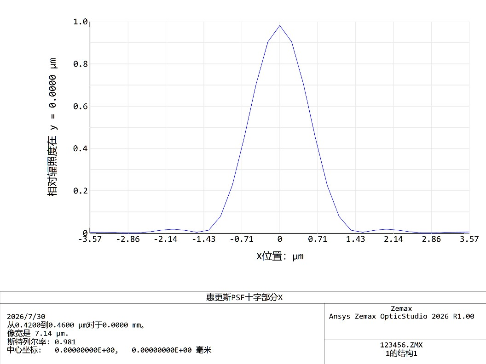

<strong>033 · HuygensPsf · 惠更斯PSF</strong>　✅ 已捕获

| 字段 | 内容 |
|---|---|
| AnalysisIDM | `HuygensPsf` |
| ZPL 代码 | `Hps` |
| GUI 标题 | 惠更斯PSF |
| 状态 | ✅ 已捕获 |
| 截图来源 | OpticStudio 原生 GUI |
| 数据规模 | 曲线 0 · 网格 1 · 散点 0 · 光线 0 · NSC 点列 1 |
| 分析说明 | 惠更斯PSF数据列表 |
| 文件 | [结构化数据](analyses/033-huygenspsf/data.json) · [文本结果](analyses/033-huygenspsf/data.txt) · [分析设置](analyses/033-huygenspsf/settings.cfg) · [采集状态](analyses/033-huygenspsf/status.json) |

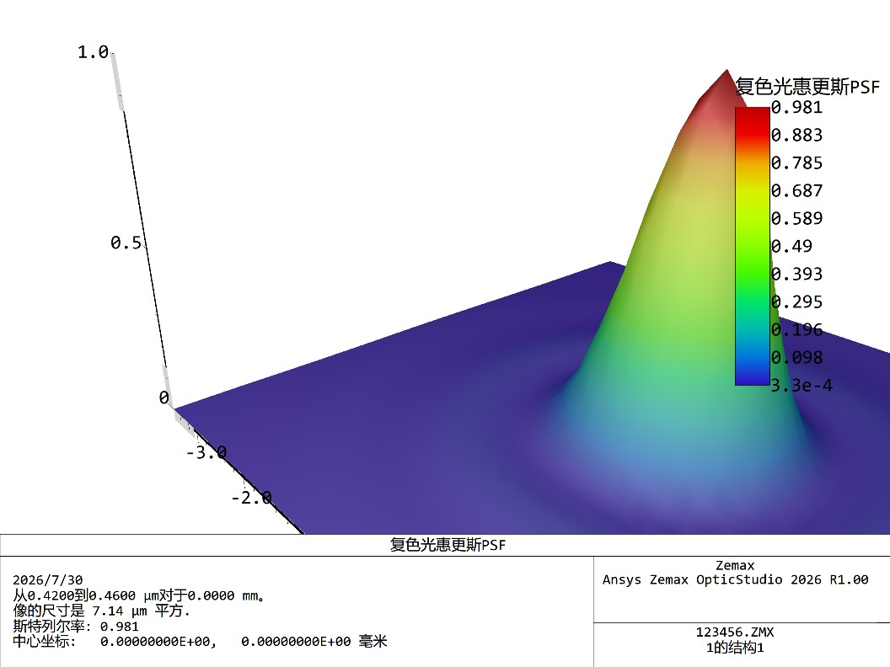

<strong>034 · DiffractionEncircledEnergy · 衍射圈入能量</strong>　✅ 已捕获

| 字段 | 内容 |
|---|---|
| AnalysisIDM | `DiffractionEncircledEnergy` |
| ZPL 代码 | `Enc` |
| GUI 标题 | 衍射圈入能量 |
| 状态 | ✅ 已捕获 |
| 截图来源 | OpticStudio 原生 GUI |
| 数据规模 | 曲线 6 · 网格 0 · 散点 0 · 光线 0 · NSC 点列 1 |
| 分析说明 | FFT 衍射圈入能量 |
| 文件 | [结构化数据](analyses/034-diffractionencircledenergy/data.json) · [文本结果](analyses/034-diffractionencircledenergy/data.txt) · [分析设置](analyses/034-diffractionencircledenergy/settings.cfg) · [采集状态](analyses/034-diffractionencircledenergy/status.json) |

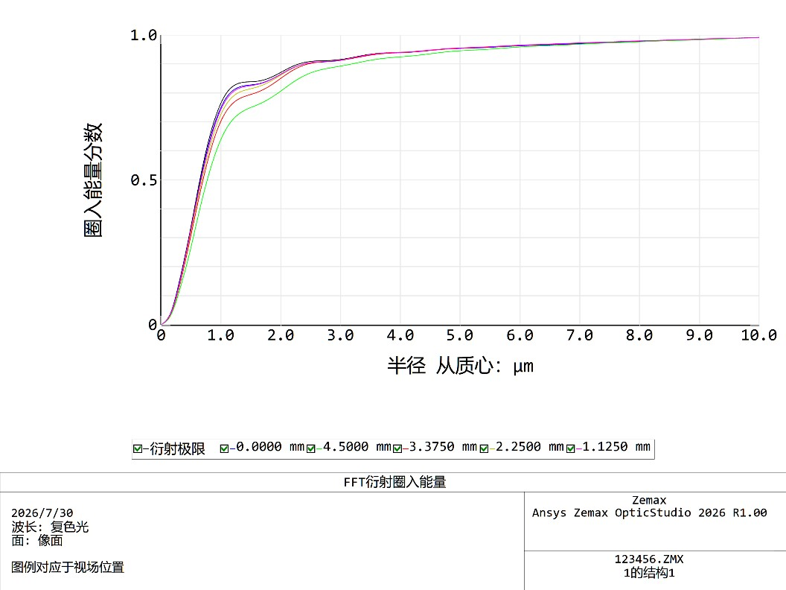

<strong>035 · GeometricEncircledEnergy · 几何圈入能量</strong>　✅ 已捕获

| 字段 | 内容 |
|---|---|
| AnalysisIDM | `GeometricEncircledEnergy` |
| ZPL 代码 | `Gee` |
| GUI 标题 | 几何圈入能量 |
| 状态 | ✅ 已捕获 |
| 截图来源 | OpticStudio 原生 GUI |
| 数据规模 | 曲线 5 · 网格 0 · 散点 0 · 光线 0 · NSC 点列 1 |
| 分析说明 | 几何圈入能量 |
| 文件 | [结构化数据](analyses/035-geometricencircledenergy/data.json) · [文本结果](analyses/035-geometricencircledenergy/data.txt) · [分析设置](analyses/035-geometricencircledenergy/settings.cfg) · [采集状态](analyses/035-geometricencircledenergy/status.json) |

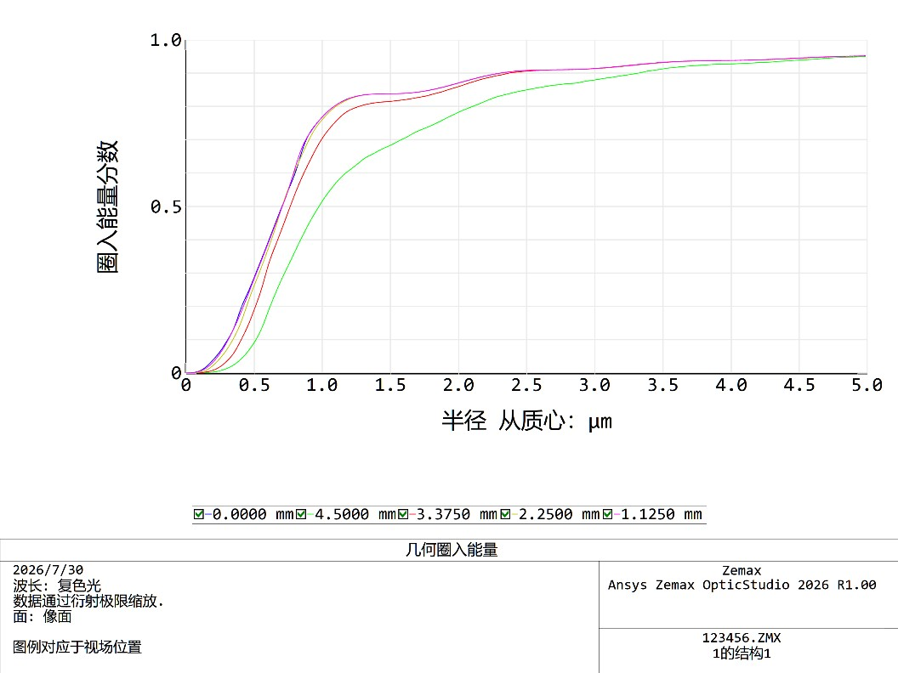

<strong>036 · GeometricLineEdgeSpread · 线/边缘扩散</strong>　✅ 已捕获

| 字段 | 内容 |
|---|---|
| AnalysisIDM | `GeometricLineEdgeSpread` |
| ZPL 代码 | `Lin` |
| GUI 标题 | 线/边缘扩散 |
| 状态 | ✅ 已捕获 |
| 截图来源 | OpticStudio 原生 GUI |
| 数据规模 | 曲线 1 · 网格 0 · 散点 0 · 光线 0 · NSC 点列 1 |
| 分析说明 | — |
| 文件 | [结构化数据](analyses/036-geometriclineedgespread/data.json) · [文本结果](analyses/036-geometriclineedgespread/data.txt) · [分析设置](analyses/036-geometriclineedgespread/settings.cfg) · [采集状态](analyses/036-geometriclineedgespread/status.json) |

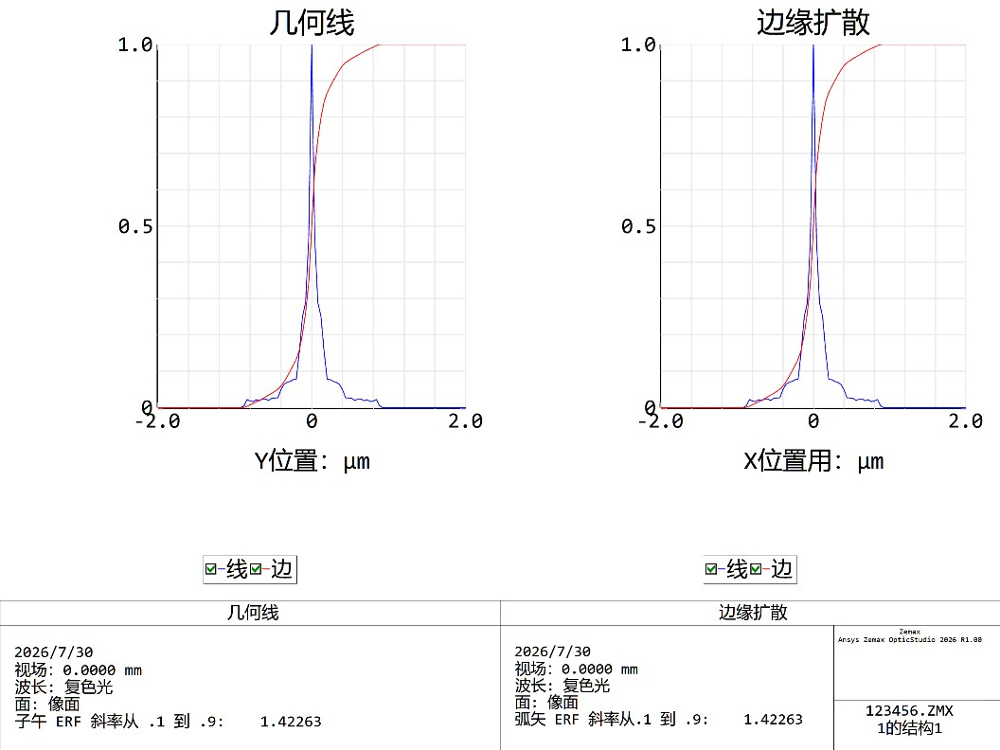

<strong>037 · ExtendedSourceEncircledEnergy · 扩展光源圈入能量</strong>　✅ 已捕获

| 字段 | 内容 |
|---|---|
| AnalysisIDM | `ExtendedSourceEncircledEnergy` |
| ZPL 代码 | `Xse` |
| GUI 标题 | 扩展光源圈入能量 |
| 状态 | ✅ 已捕获 |
| 截图来源 | OpticStudio 原生 GUI |
| 数据规模 | 曲线 1 · 网格 0 · 散点 0 · 光线 0 · NSC 点列 1 |
| 分析说明 | 扩展光源几何圈入能量 |
| 文件 | [结构化数据](analyses/037-extendedsourceencircledenergy/data.json) · [文本结果](analyses/037-extendedsourceencircledenergy/data.txt) · [分析设置](analyses/037-extendedsourceencircledenergy/settings.cfg) · [采集状态](analyses/037-extendedsourceencircledenergy/status.json) |

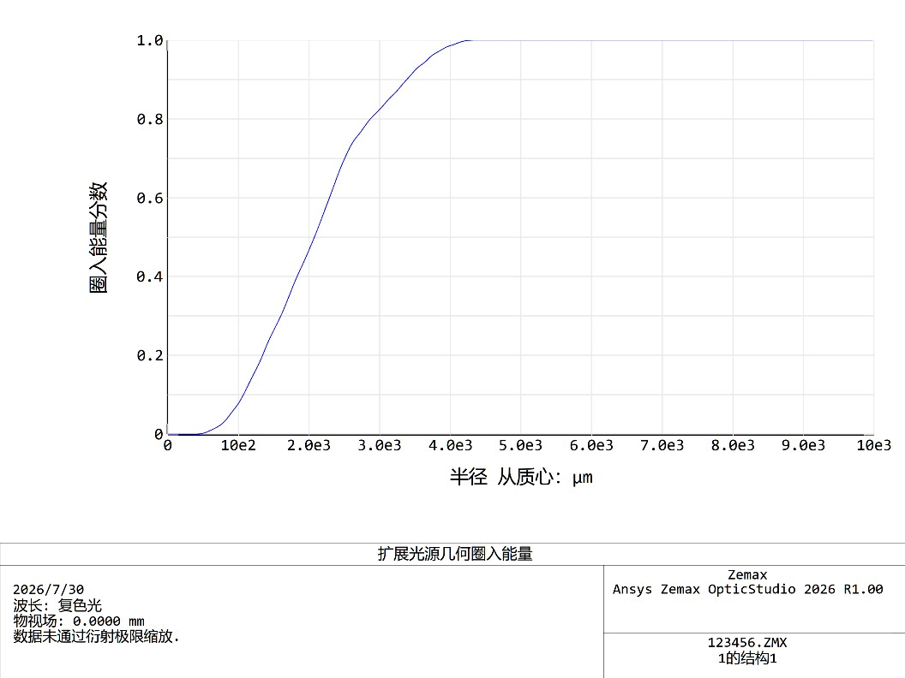

<strong>038 · SurfaceCurvatureCross · 表面曲率截面</strong>　✅ 已捕获

| 字段 | 内容 |
|---|---|
| AnalysisIDM | `SurfaceCurvatureCross` |
| ZPL 代码 | `Scc` |
| GUI 标题 | 表面曲率截面 |
| 状态 | ✅ 已捕获 |
| 截图来源 | OpticStudio 原生 GUI |
| 数据规模 | 曲线 1 · 网格 0 · 散点 0 · 光线 0 · NSC 点列 1 |
| 分析说明 | 表面曲率截面数据列表 |
| 文件 | [结构化数据](analyses/038-surfacecurvaturecross/data.json) · [文本结果](analyses/038-surfacecurvaturecross/data.txt) · [分析设置](analyses/038-surfacecurvaturecross/settings.cfg) · [采集状态](analyses/038-surfacecurvaturecross/status.json) |

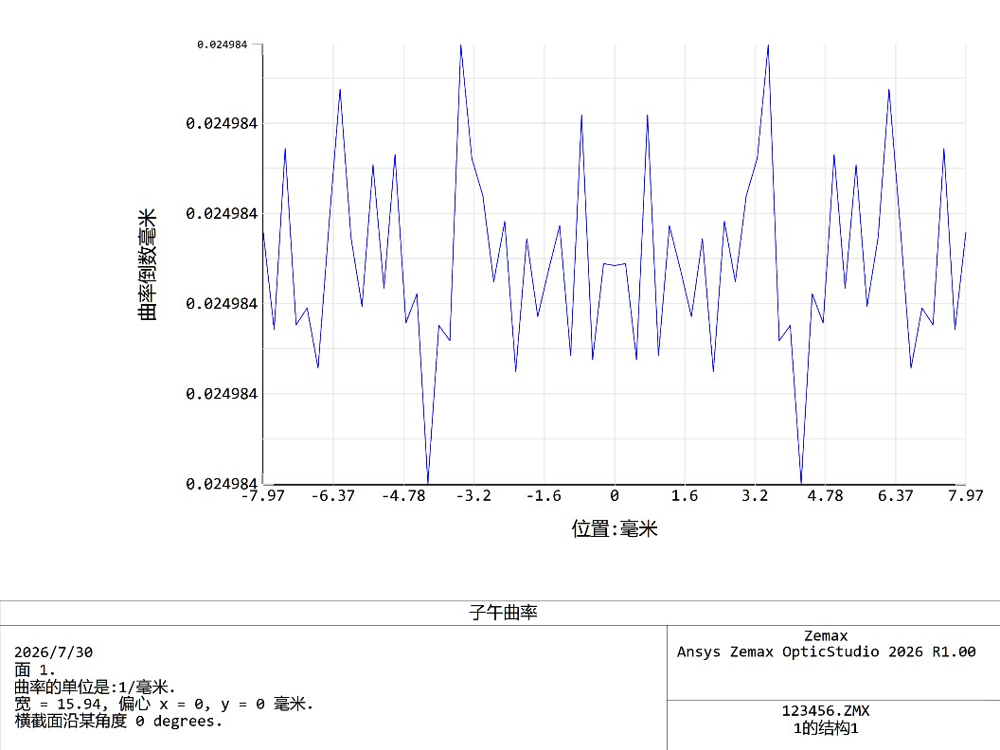

<strong>039 · SurfacePhaseCross · 表面相位截面</strong>　✅ 已捕获

| 字段 | 内容 |
|---|---|
| AnalysisIDM | `SurfacePhaseCross` |
| ZPL 代码 | `Spc` |
| GUI 标题 | 表面相位截面 |
| 状态 | ✅ 已捕获 |
| 截图来源 | OpticStudio 原生 GUI |
| 数据规模 | 曲线 1 · 网格 0 · 散点 0 · 光线 0 · NSC 点列 1 |
| 分析说明 | 横截面相位数据列表 |
| 文件 | [结构化数据](analyses/039-surfacephasecross/data.json) · [文本结果](analyses/039-surfacephasecross/data.txt) · [分析设置](analyses/039-surfacephasecross/settings.cfg) · [采集状态](analyses/039-surfacephasecross/status.json) |

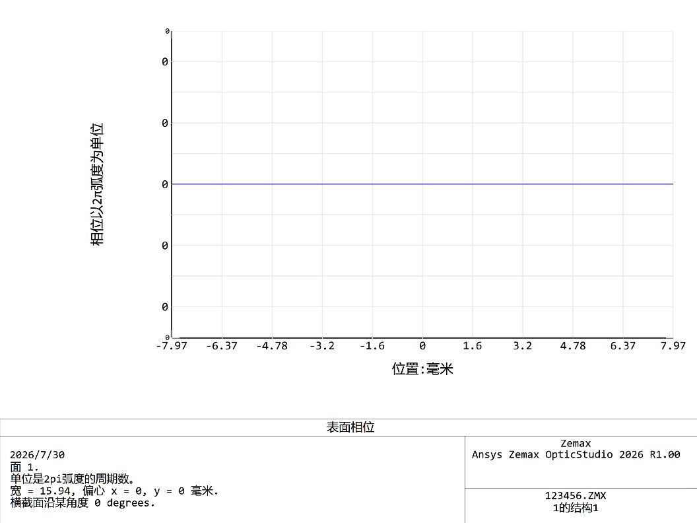

<strong>040 · SurfaceSagCross · 表面矢高截面</strong>　✅ 已捕获

| 字段 | 内容 |
|---|---|
| AnalysisIDM | `SurfaceSagCross` |
| ZPL 代码 | `Ssc` |
| GUI 标题 | 表面矢高截面 |
| 状态 | ✅ 已捕获 |
| 截图来源 | OpticStudio 原生 GUI |
| 数据规模 | 曲线 1 · 网格 0 · 散点 0 · 光线 0 · NSC 点列 1 |
| 分析说明 | 横截面矢高列表 |
| 文件 | [结构化数据](analyses/040-surfacesagcross/data.json) · [文本结果](analyses/040-surfacesagcross/data.txt) · [分析设置](analyses/040-surfacesagcross/settings.cfg) · [采集状态](analyses/040-surfacesagcross/status.json) |

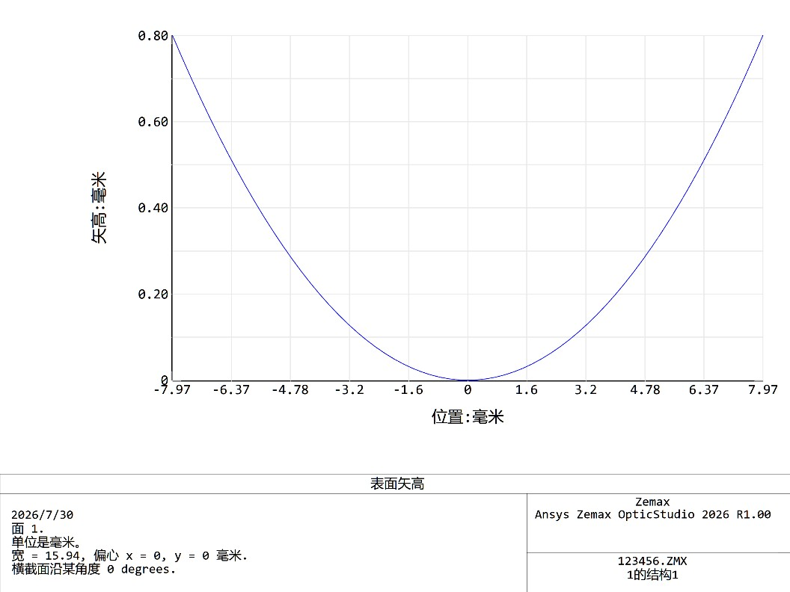

<strong>041 · SurfaceCurvature · 表面曲率</strong>　✅ 已捕获

| 字段 | 内容 |
|---|---|
| AnalysisIDM | `SurfaceCurvature` |
| ZPL 代码 | `Scv` |
| GUI 标题 | 表面曲率 |
| 状态 | ✅ 已捕获 |
| 截图来源 | OpticStudio 原生 GUI |
| 数据规模 | 曲线 0 · 网格 1 · 散点 0 · 光线 0 · NSC 点列 1 |
| 分析说明 | 表面曲率图数据列表 |
| 文件 | [结构化数据](analyses/041-surfacecurvature/data.json) · [文本结果](analyses/041-surfacecurvature/data.txt) · [分析设置](analyses/041-surfacecurvature/settings.cfg) · [采集状态](analyses/041-surfacecurvature/status.json) |

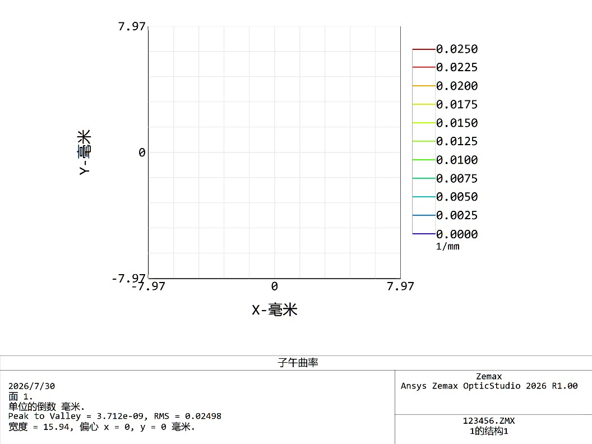

<strong>042 · SurfacePhase · 表面相位</strong>　✅ 已捕获

| 字段 | 内容 |
|---|---|
| AnalysisIDM | `SurfacePhase` |
| ZPL 代码 | `Srp` |
| GUI 标题 | 表面相位 |
| 状态 | ✅ 已捕获 |
| 截图来源 | OpticStudio 原生 GUI |
| 数据规模 | 曲线 0 · 网格 1 · 散点 0 · 光线 0 · NSC 点列 1 |
| 分析说明 | 表面相位图 数据列表 |
| 文件 | [结构化数据](analyses/042-surfacephase/data.json) · [文本结果](analyses/042-surfacephase/data.txt) · [分析设置](analyses/042-surfacephase/settings.cfg) · [采集状态](analyses/042-surfacephase/status.json) |

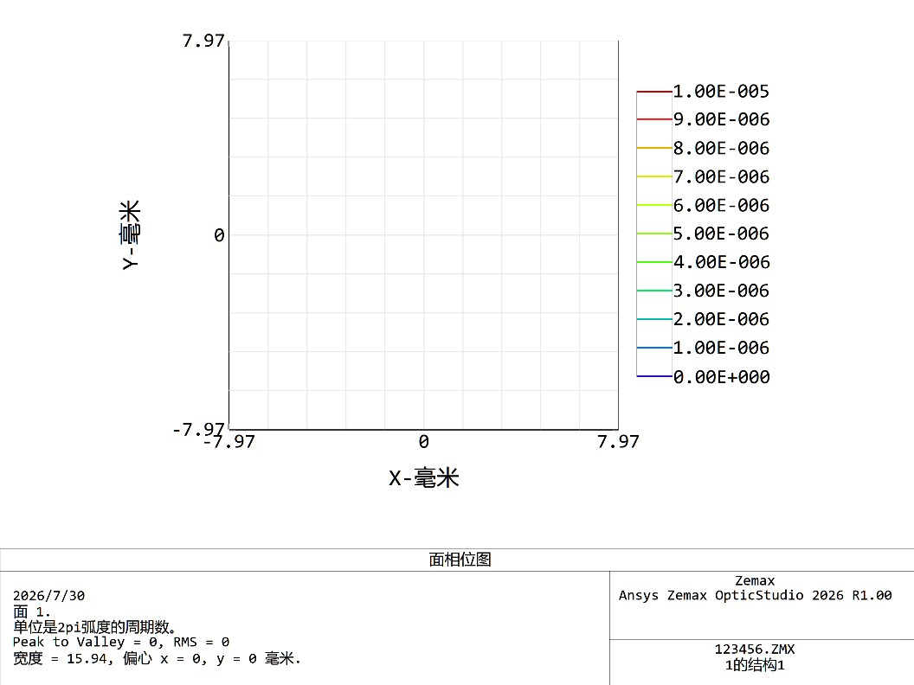

<strong>043 · SurfaceSag · 表面矢高</strong>　✅ 已捕获

| 字段 | 内容 |
|---|---|
| AnalysisIDM | `SurfaceSag` |
| ZPL 代码 | `Srs` |
| GUI 标题 | 表面矢高 |
| 状态 | ✅ 已捕获 |
| 截图来源 | OpticStudio 原生 GUI |
| 数据规模 | 曲线 0 · 网格 1 · 散点 0 · 光线 0 · NSC 点列 1 |
| 分析说明 | 面矢高图数据列表 |
| 文件 | [结构化数据](analyses/043-surfacesag/data.json) · [文本结果](analyses/043-surfacesag/data.txt) · [分析设置](analyses/043-surfacesag/settings.cfg) · [采集状态](analyses/043-surfacesag/status.json) |

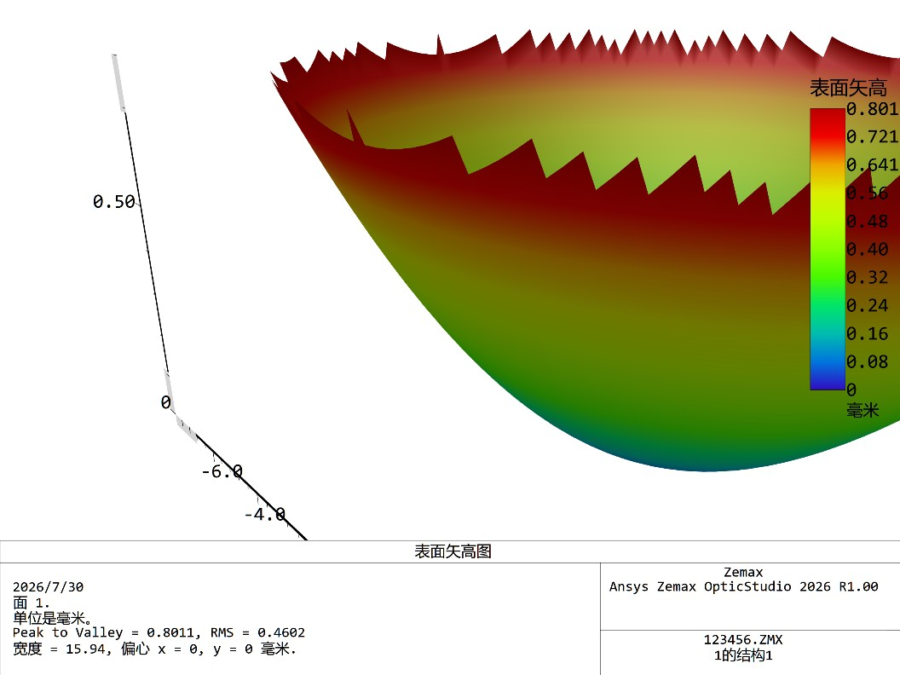

<strong>044 · StandardSpot · 点列图</strong>　✅ 已捕获

| 字段 | 内容 |
|---|---|
| AnalysisIDM | `StandardSpot` |
| ZPL 代码 | `Spt` |
| GUI 标题 | 点列图 |
| 状态 | ✅ 已捕获 |
| 截图来源 | OpticStudio 原生 GUI |
| 数据规模 | 曲线 0 · 网格 0 · 散点 0 · 光线 0 · NSC 点列 1 |
| 分析说明 | 点列图数据列表 |
| 文件 | [结构化数据](analyses/044-standardspot/data.json) · [文本结果](analyses/044-standardspot/data.txt) · [分析设置](analyses/044-standardspot/settings.cfg) · [采集状态](analyses/044-standardspot/status.json) |

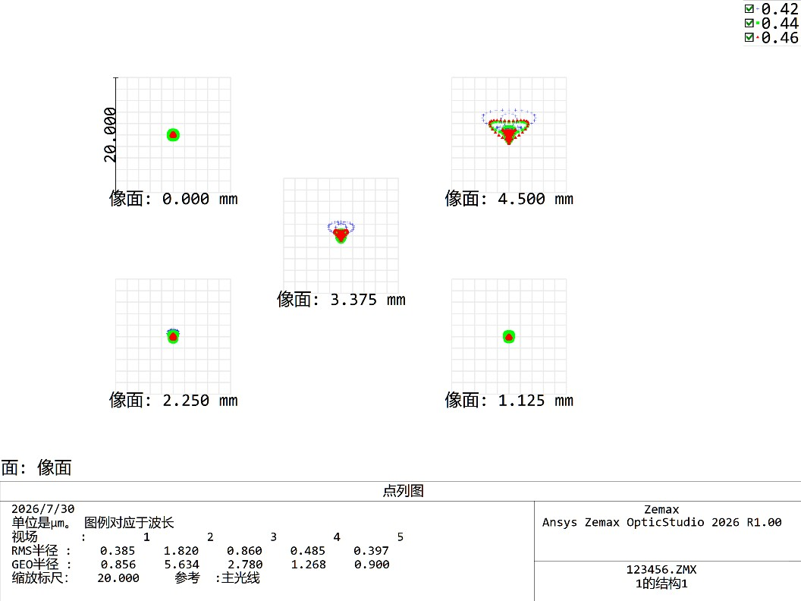

<strong>045 · ThroughFocusSpot · 离焦点列图</strong>　✅ 已捕获

| 字段 | 内容 |
|---|---|
| AnalysisIDM | `ThroughFocusSpot` |
| ZPL 代码 | `Stf` |
| GUI 标题 | 离焦点列图 |
| 状态 | ✅ 已捕获 |
| 截图来源 | OpticStudio 原生 GUI |
| 数据规模 | 曲线 0 · 网格 0 · 散点 0 · 光线 0 · NSC 点列 1 |
| 分析说明 | — |
| 文件 | [结构化数据](analyses/045-throughfocusspot/data.json) · [分析设置](analyses/045-throughfocusspot/settings.cfg) · [采集状态](analyses/045-throughfocusspot/status.json) |

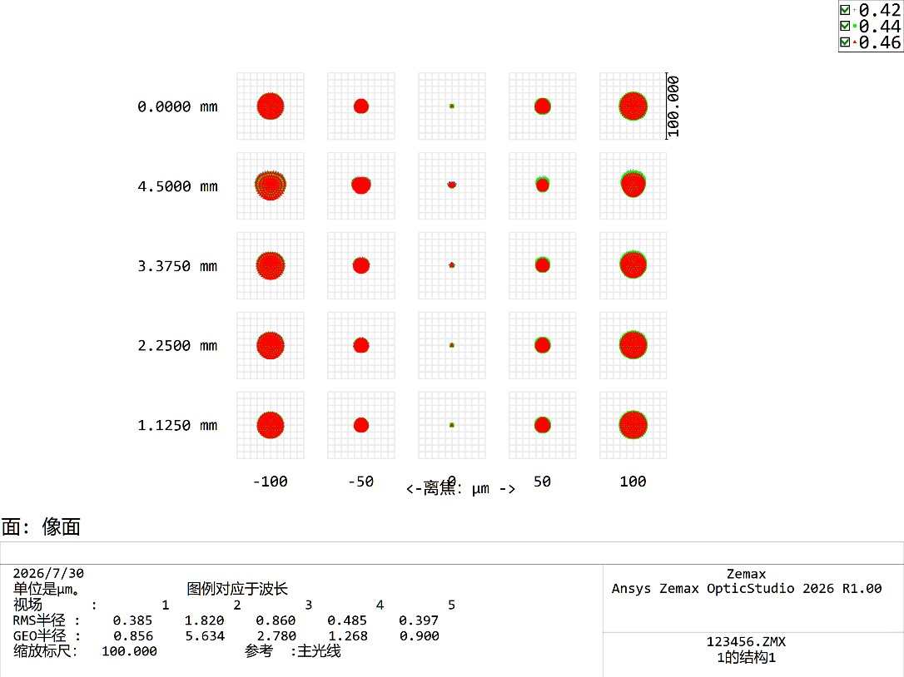

<strong>046 · FullFieldSpot · 全视场点列图</strong>　✅ 已捕获

| 字段 | 内容 |
|---|---|
| AnalysisIDM | `FullFieldSpot` |
| ZPL 代码 | `Sff` |
| GUI 标题 | 全视场点列图 |
| 状态 | ✅ 已捕获 |
| 截图来源 | OpticStudio 原生 GUI |
| 数据规模 | 曲线 0 · 网格 0 · 散点 0 · 光线 0 · NSC 点列 1 |
| 分析说明 | — |
| 文件 | [结构化数据](analyses/046-fullfieldspot/data.json) · [分析设置](analyses/046-fullfieldspot/settings.cfg) · [采集状态](analyses/046-fullfieldspot/status.json) |

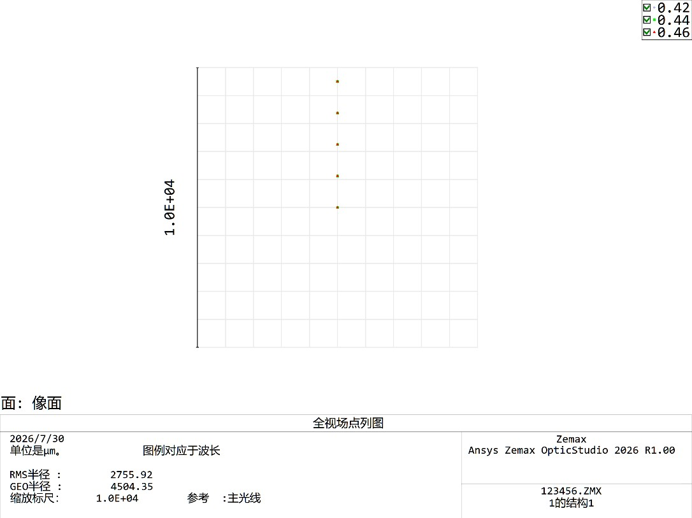

<strong>047 · MatrixSpot · 矩阵点列图</strong>　✅ 已捕获

| 字段 | 内容 |
|---|---|
| AnalysisIDM | `MatrixSpot` |
| ZPL 代码 | `Sma` |
| GUI 标题 | 矩阵点列图 |
| 状态 | ✅ 已捕获 |
| 截图来源 | OpticStudio 原生 GUI |
| 数据规模 | 曲线 0 · 网格 0 · 散点 0 · 光线 0 · NSC 点列 1 |
| 分析说明 | — |
| 文件 | [结构化数据](analyses/047-matrixspot/data.json) · [分析设置](analyses/047-matrixspot/settings.cfg) · [采集状态](analyses/047-matrixspot/status.json) |

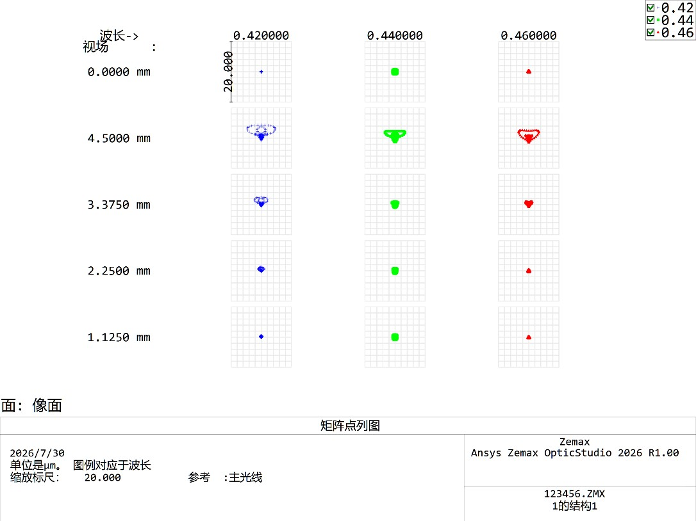

<strong>048 · ConfigurationMatrixSpot · 结构矩阵点列图</strong>　✅ 已捕获

| 字段 | 内容 |
|---|---|
| AnalysisIDM | `ConfigurationMatrixSpot` |
| ZPL 代码 | `Smc` |
| GUI 标题 | 结构矩阵点列图 |
| 状态 | ✅ 已捕获 |
| 截图来源 | OpticStudio 原生 GUI |
| 数据规模 | 曲线 0 · 网格 0 · 散点 0 · 光线 0 · NSC 点列 1 |
| 分析说明 | — |
| 文件 | [结构化数据](analyses/048-configurationmatrixspot/data.json) · [分析设置](analyses/048-configurationmatrixspot/settings.cfg) · [采集状态](analyses/048-configurationmatrixspot/status.json) |

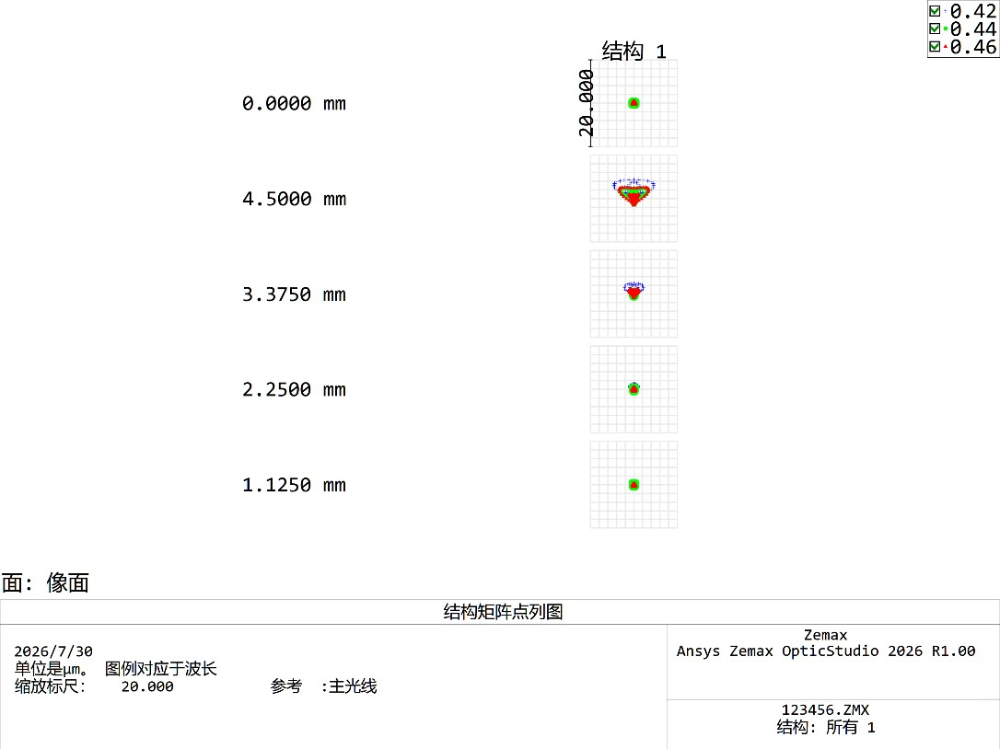

<strong>049 · RMSField · RMS vs. 视场</strong>　✅ 已捕获

| 字段 | 内容 |
|---|---|
| AnalysisIDM | `RMSField` |
| ZPL 代码 | `Rms` |
| GUI 标题 | RMS vs. 视场 |
| 状态 | ✅ 已捕获 |
| 截图来源 | OpticStudio 原生 GUI |
| 数据规模 | 曲线 1 · 网格 0 · 散点 0 · 光线 0 · NSC 点列 1 |
| 分析说明 | RMS波差 vs. 视场 |
| 文件 | [结构化数据](analyses/049-rmsfield/data.json) · [文本结果](analyses/049-rmsfield/data.txt) · [分析设置](analyses/049-rmsfield/settings.cfg) · [采集状态](analyses/049-rmsfield/status.json) |

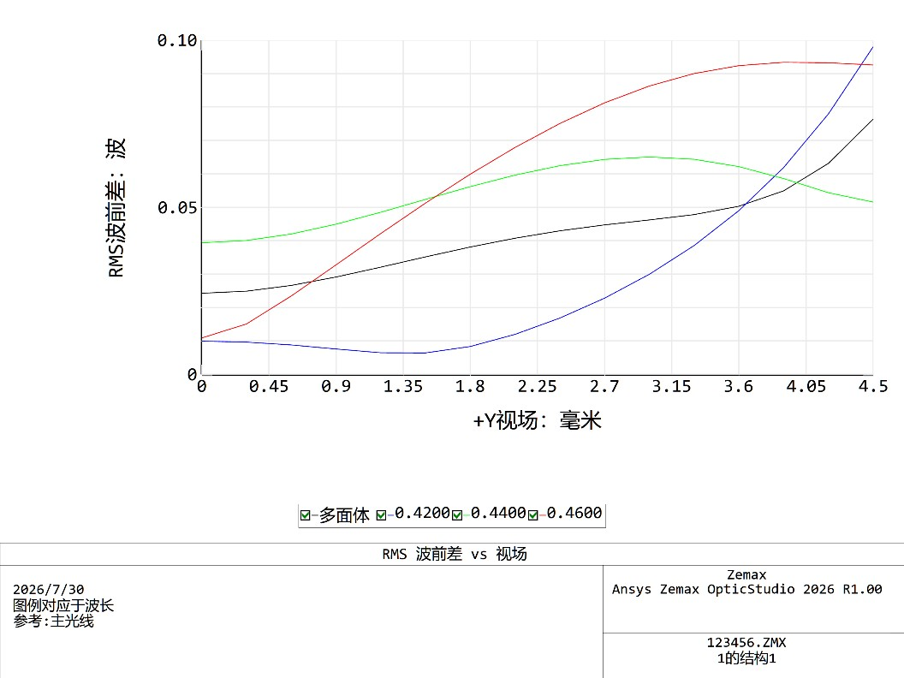

<strong>050 · RMSFieldMap · 二维视场RMS图</strong>　✅ 已捕获

| 字段 | 内容 |
|---|---|
| AnalysisIDM | `RMSFieldMap` |
| ZPL 代码 | `Rfm` |
| GUI 标题 | 二维视场RMS图 |
| 状态 | ✅ 已捕获 |
| 截图来源 | OpticStudio 原生 GUI |
| 数据规模 | 曲线 0 · 网格 1 · 散点 0 · 光线 0 · NSC 点列 1 |
| 分析说明 | RMS 波前视场图数据列表 |
| 文件 | [结构化数据](analyses/050-rmsfieldmap/data.json) · [文本结果](analyses/050-rmsfieldmap/data.txt) · [分析设置](analyses/050-rmsfieldmap/settings.cfg) · [采集状态](analyses/050-rmsfieldmap/status.json) |

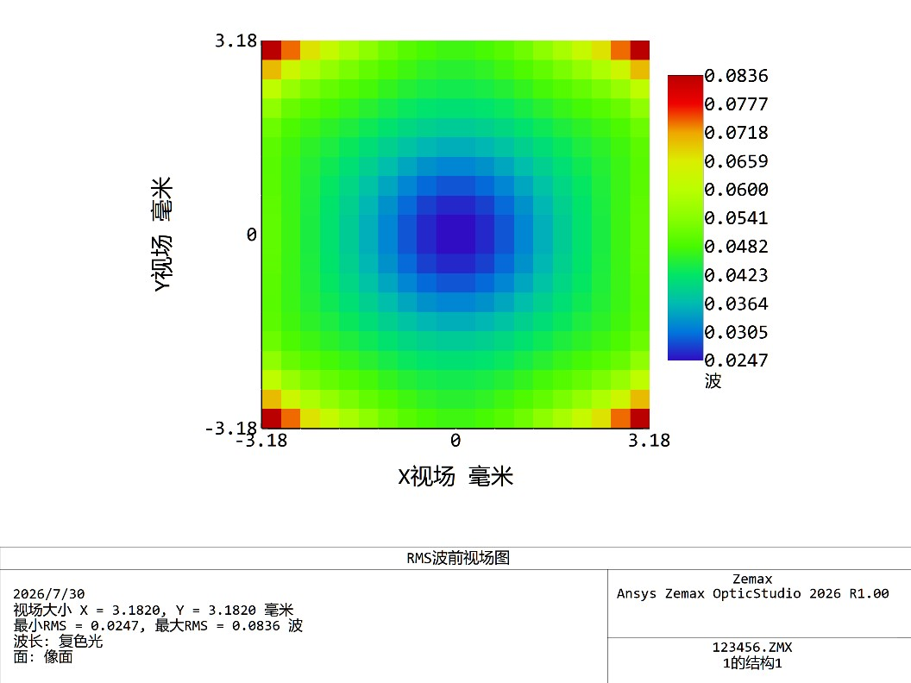

### 分析 051–075

<strong>051 · RMSLambdaDiagram · RMS vs. 波长</strong>　✅ 已捕获

| 字段 | 内容 |
|---|---|
| AnalysisIDM | `RMSLambdaDiagram` |
| ZPL 代码 | `Rmw` |
| GUI 标题 | RMS vs. 波长 |
| 状态 | ✅ 已捕获 |
| 截图来源 | OpticStudio 原生 GUI |
| 数据规模 | 曲线 1 · 网格 0 · 散点 0 · 光线 0 · NSC 点列 1 |
| 分析说明 | RMS 波差 vs. 波长 |
| 文件 | [结构化数据](analyses/051-rmslambdadiagram/data.json) · [文本结果](analyses/051-rmslambdadiagram/data.txt) · [分析设置](analyses/051-rmslambdadiagram/settings.cfg) · [采集状态](analyses/051-rmslambdadiagram/status.json) |

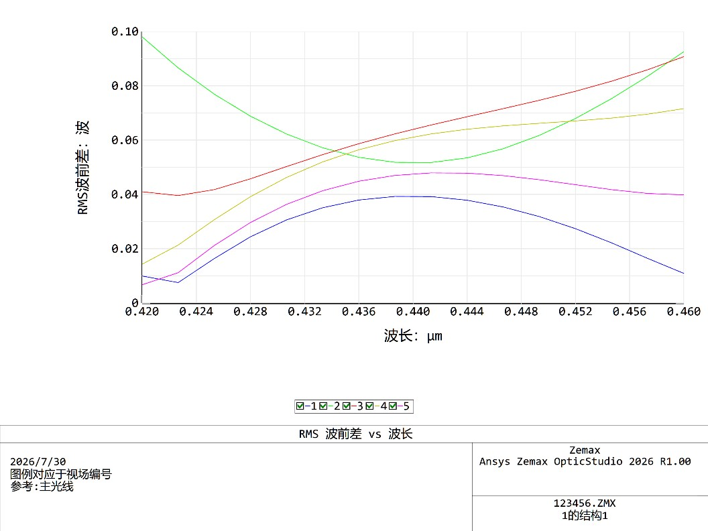

<strong>052 · RMSFocus · RMS vs. 离焦</strong>　✅ 已捕获

| 字段 | 内容 |
|---|---|
| AnalysisIDM | `RMSFocus` |
| ZPL 代码 | `Rmf` |
| GUI 标题 | RMS vs. 离焦 |
| 状态 | ✅ 已捕获 |
| 截图来源 | OpticStudio 原生 GUI |
| 数据规模 | 曲线 1 · 网格 0 · 散点 0 · 光线 0 · NSC 点列 1 |
| 分析说明 | RMS波差 vs. 焦点 |
| 文件 | [结构化数据](analyses/052-rmsfocus/data.json) · [文本结果](analyses/052-rmsfocus/data.txt) · [分析设置](analyses/052-rmsfocus/settings.cfg) · [采集状态](analyses/052-rmsfocus/status.json) |

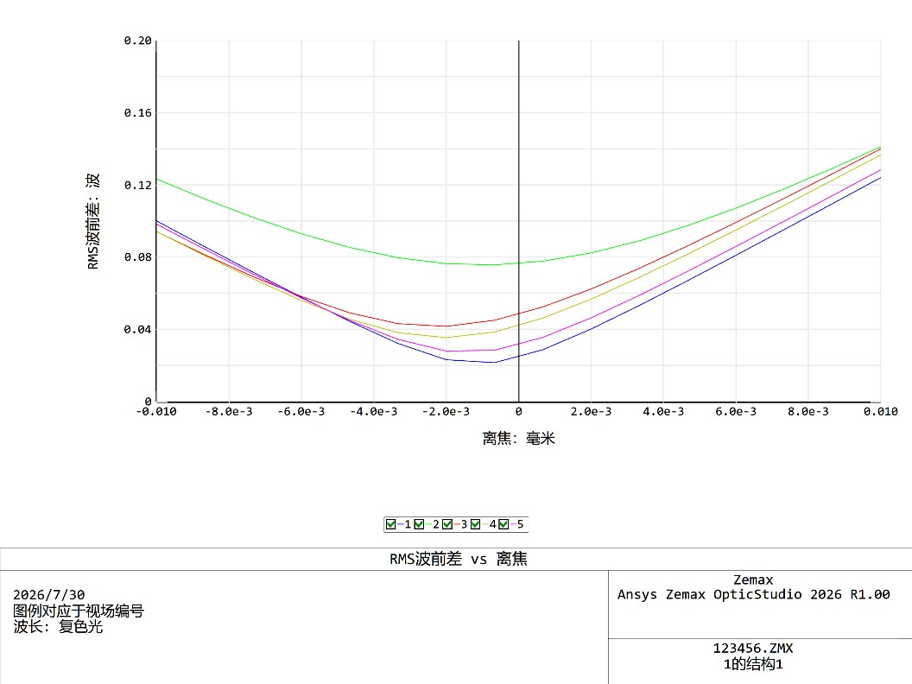

<strong>053 · Foucault · 傅科分析</strong>　✅ 已捕获

| 字段 | 内容 |
|---|---|
| AnalysisIDM | `Foucault` |
| ZPL 代码 | `Foa` |
| GUI 标题 | 傅科分析 |
| 状态 | ✅ 已捕获 |
| 截图来源 | OpticStudio 原生 GUI |
| 数据规模 | 曲线 1 · 网格 1 · 散点 0 · 光线 0 · NSC 点列 1 |
| 分析说明 | 傅科数据列表 |
| 文件 | [结构化数据](analyses/053-foucault/data.json) · [文本结果](analyses/053-foucault/data.txt) · [分析设置](analyses/053-foucault/settings.cfg) · [采集状态](analyses/053-foucault/status.json) |

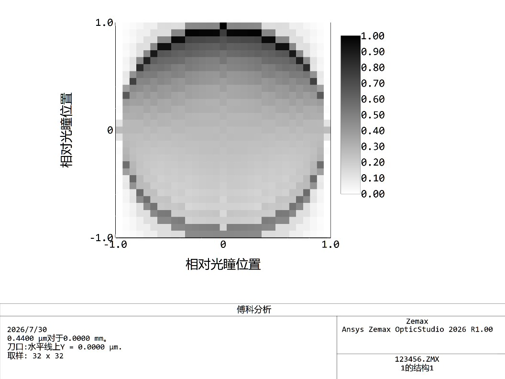

<strong>054 · Interferogram · 干涉图</strong>　✅ 已捕获

| 字段 | 内容 |
|---|---|
| AnalysisIDM | `Interferogram` |
| ZPL 代码 | `Int` |
| GUI 标题 | 干涉图 |
| 状态 | ✅ 已捕获 |
| 截图来源 | OpticStudio 原生 GUI |
| 数据规模 | 曲线 0 · 网格 1 · 散点 0 · 光线 0 · NSC 点列 1 |
| 分析说明 | 干涉图数据列表 |
| 文件 | [结构化数据](analyses/054-interferogram/data.json) · [文本结果](analyses/054-interferogram/data.txt) · [分析设置](analyses/054-interferogram/settings.cfg) · [采集状态](analyses/054-interferogram/status.json) |

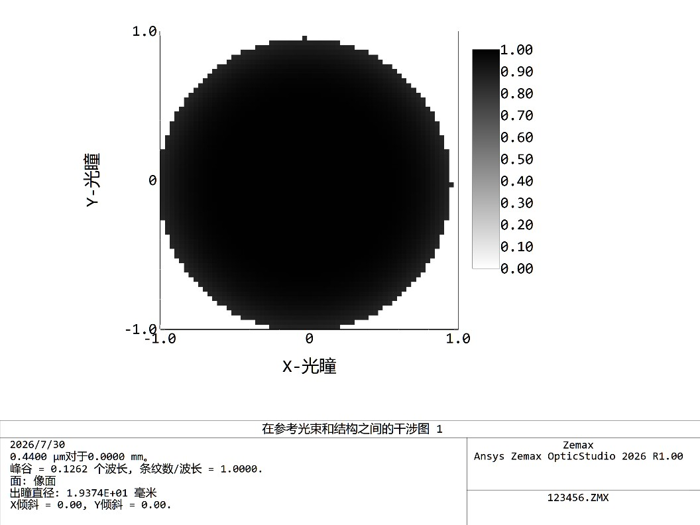

<strong>055 · WavefrontMap · 波前图</strong>　✅ 已捕获

| 字段 | 内容 |
|---|---|
| AnalysisIDM | `WavefrontMap` |
| ZPL 代码 | `Wfm` |
| GUI 标题 | 波前图 |
| 状态 | ✅ 已捕获 |
| 截图来源 | OpticStudio 原生 GUI |
| 数据规模 | 曲线 0 · 网格 1 · 散点 0 · 光线 0 · NSC 点列 1 |
| 分析说明 | 波前图数据列表 |
| 文件 | [结构化数据](analyses/055-wavefrontmap/data.json) · [文本结果](analyses/055-wavefrontmap/data.txt) · [分析设置](analyses/055-wavefrontmap/settings.cfg) · [采集状态](analyses/055-wavefrontmap/status.json) |

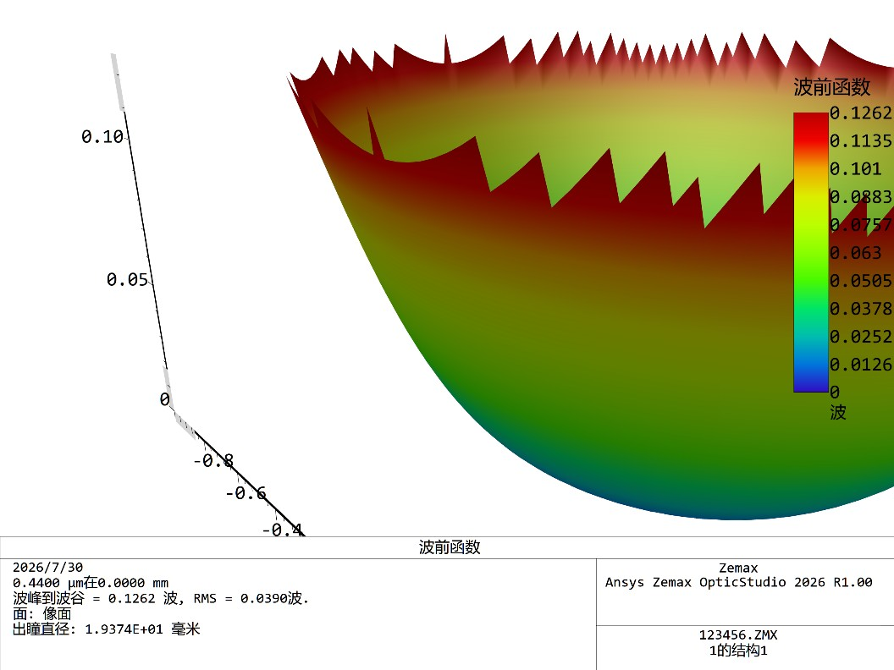

<strong>056 · DetectorViewer · DetectorViewer</strong>　➖ 不适用/未创建

| 字段 | 内容 |
|---|---|
| AnalysisIDM | `DetectorViewer` |
| ZPL 代码 | `—` |
| GUI 标题 | DetectorViewer |
| 状态 | ➖ 不适用/未创建 |
| 截图来源 | 无截图 |
| 数据规模 | 无结构化数据 |
| 分析说明 | — |
| 文件 | [采集状态](analyses/056-detectorviewer/status.json) |

> 未生成截图。原因：New_Analysis returned null

<strong>057 · Draw2D · 布局图</strong>　✅ 已捕获

| 字段 | 内容 |
|---|---|
| AnalysisIDM | `Draw2D` |
| ZPL 代码 | `Lay` |
| GUI 标题 | 布局图 |
| 状态 | ✅ 已捕获 |
| 截图来源 | OpticStudio 原生 GUI |
| 数据规模 | 曲线 0 · 网格 0 · 散点 0 · 光线 0 · NSC 点列 1 |
| 分析说明 | — |
| 文件 | [结构化数据](analyses/057-draw2d/data.json) · [分析设置](analyses/057-draw2d/settings.cfg) · [采集状态](analyses/057-draw2d/status.json) |

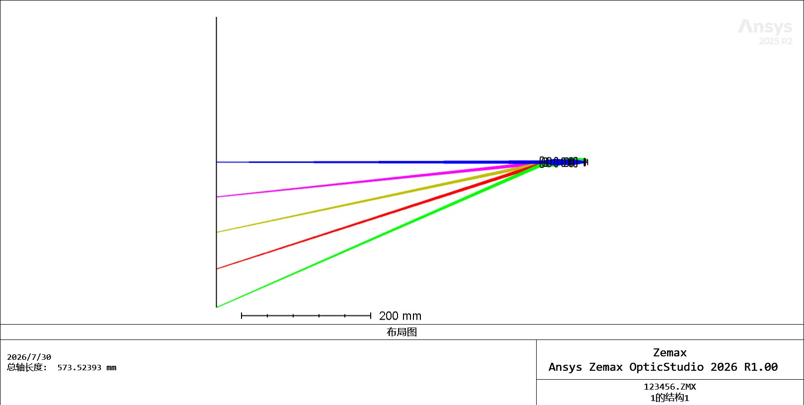

<strong>058 · Draw3D · 三维布局图</strong>　✅ 已捕获

| 字段 | 内容 |
|---|---|
| AnalysisIDM | `Draw3D` |
| ZPL 代码 | `L3d` |
| GUI 标题 | 三维布局图 |
| 状态 | ✅ 已捕获 |
| 截图来源 | OpticStudio 原生 GUI |
| 数据规模 | 曲线 0 · 网格 0 · 散点 0 · 光线 0 · NSC 点列 1 |
| 分析说明 | — |
| 文件 | [结构化数据](analyses/058-draw3d/data.json) · [分析设置](analyses/058-draw3d/settings.cfg) · [采集状态](analyses/058-draw3d/status.json) |

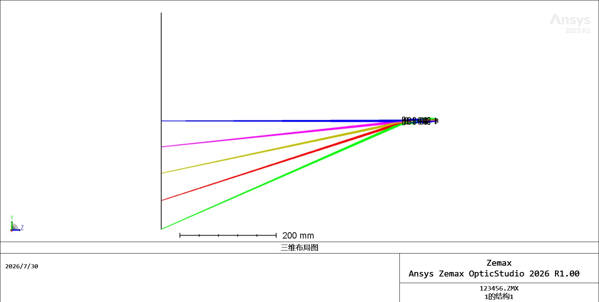

<strong>059 · ImageSimulation · 图像模拟</strong>　✅ 已捕获

| 字段 | 内容 |
|---|---|
| AnalysisIDM | `ImageSimulation` |
| ZPL 代码 | `Sim` |
| GUI 标题 | 图像模拟 |
| 状态 | ✅ 已捕获 |
| 截图来源 | OpticStudio 原生 GUI |
| 数据规模 | 曲线 0 · 网格 0 · 散点 0 · 光线 0 · NSC 点列 1 |
| 分析说明 | — |
| 文件 | [结构化数据](analyses/059-imagesimulation/data.json) · [分析设置](analyses/059-imagesimulation/settings.cfg) · [采集状态](analyses/059-imagesimulation/status.json) |

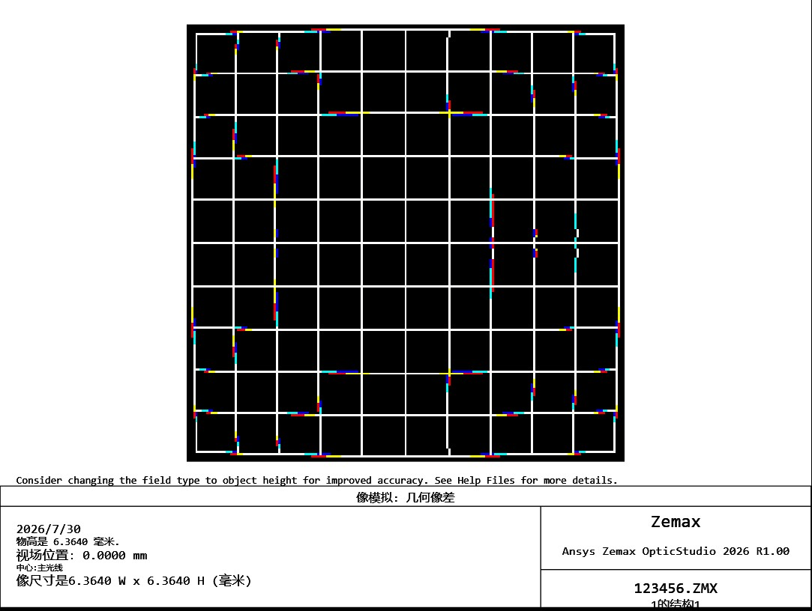

<strong>060 · GeometricImageAnalysis · 几何图像分析</strong>　✅ 已捕获

| 字段 | 内容 |
|---|---|
| AnalysisIDM | `GeometricImageAnalysis` |
| ZPL 代码 | `Ima` |
| GUI 标题 | 几何图像分析 |
| 状态 | ✅ 已捕获 |
| 截图来源 | OpticStudio 原生 GUI |
| 数据规模 | 曲线 0 · 网格 1 · 散点 0 · 光线 0 · NSC 点列 1 |
| 分析说明 | 像分析直方表 |
| 文件 | [结构化数据](analyses/060-geometricimageanalysis/data.json) · [文本结果](analyses/060-geometricimageanalysis/data.txt) · [分析设置](analyses/060-geometricimageanalysis/settings.cfg) · [采集状态](analyses/060-geometricimageanalysis/status.json) |

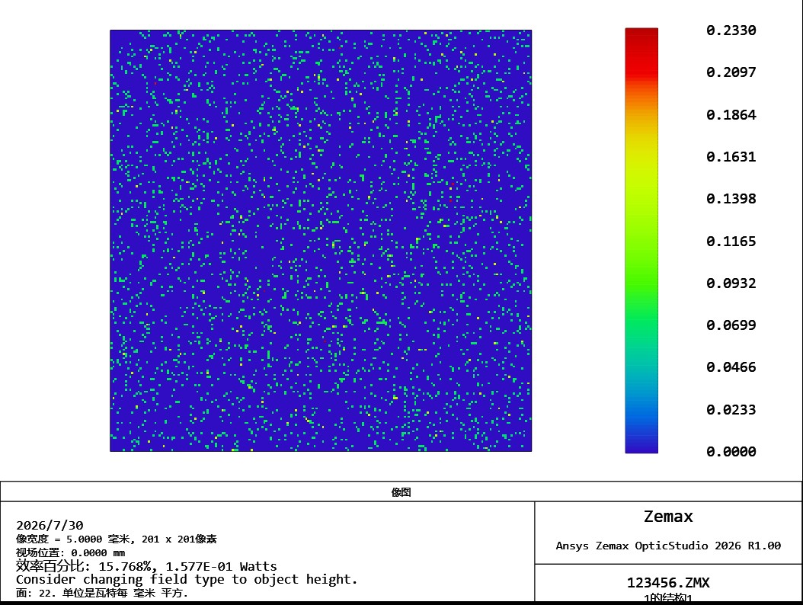

<strong>061 · IMABIMFileViewer · IMA/BIM文件查看器</strong>　✅ 已捕获

| 字段 | 内容 |
|---|---|
| AnalysisIDM | `IMABIMFileViewer` |
| ZPL 代码 | `Imv` |
| GUI 标题 | IMA/BIM文件查看器 |
| 状态 | ✅ 已捕获 |
| 截图来源 | OpticStudio 原生 GUI |
| 数据规模 | 曲线 0 · 网格 0 · 散点 0 · 光线 0 · NSC 点列 1 |
| 分析说明 | — |
| 文件 | [结构化数据](analyses/061-imabimfileviewer/data.json) · [文本结果](analyses/061-imabimfileviewer/data.txt) · [分析设置](analyses/061-imabimfileviewer/settings.cfg) · [采集状态](analyses/061-imabimfileviewer/status.json) |

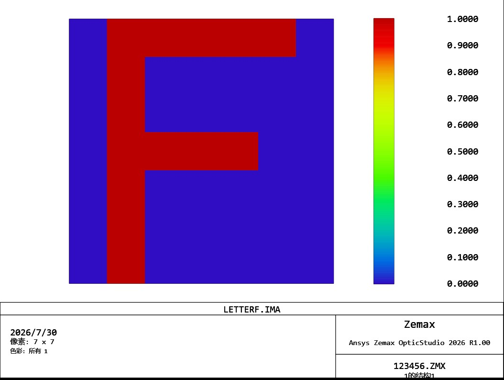

<strong>062 · GeometricBitmapImageAnalysis · 几何位图图像分析</strong>　✅ 已捕获

| 字段 | 内容 |
|---|---|
| AnalysisIDM | `GeometricBitmapImageAnalysis` |
| ZPL 代码 | `Ibm` |
| GUI 标题 | 几何位图图像分析 |
| 状态 | ✅ 已捕获 |
| 截图来源 | OpticStudio 原生 GUI |
| 数据规模 | 曲线 0 · 网格 0 · 散点 0 · 光线 0 · NSC 点列 1 |
| 分析说明 | — |
| 文件 | [结构化数据](analyses/062-geometricbitmapimageanalysis/data.json) · [文本结果](analyses/062-geometricbitmapimageanalysis/data.txt) · [分析设置](analyses/062-geometricbitmapimageanalysis/settings.cfg) · [采集状态](analyses/062-geometricbitmapimageanalysis/status.json) |

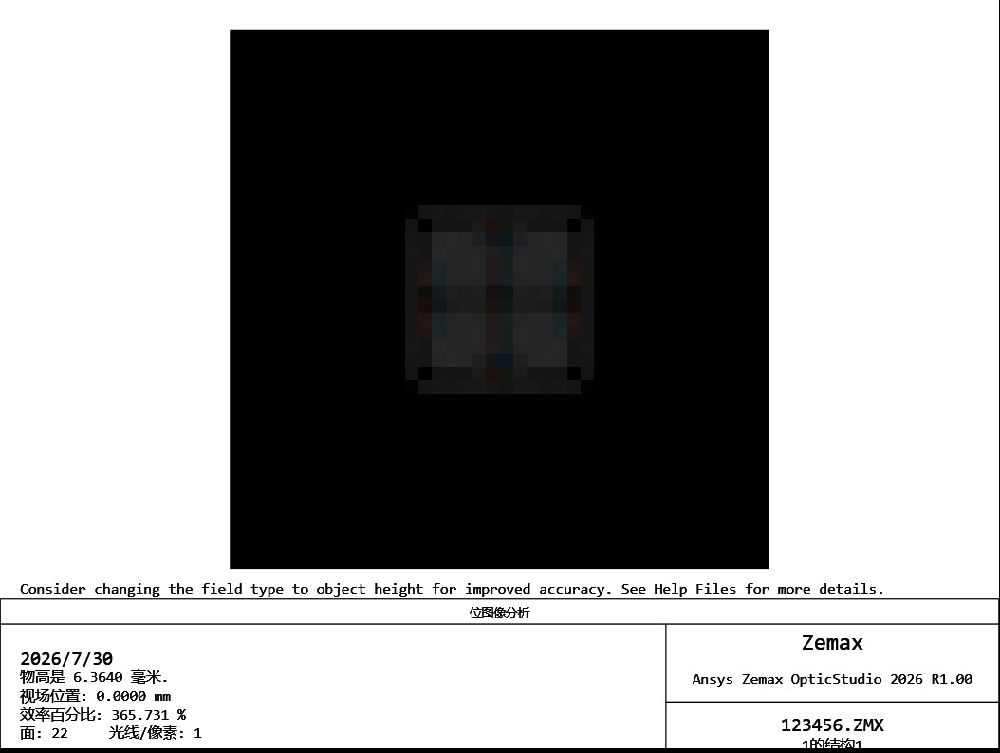

<strong>063 · BitmapFileViewer · 位图文件查看器</strong>　✅ 已捕获

| 字段 | 内容 |
|---|---|
| AnalysisIDM | `BitmapFileViewer` |
| ZPL 代码 | `Jbv` |
| GUI 标题 | 位图文件查看器 |
| 状态 | ✅ 已捕获 |
| 截图来源 | OpticStudio 原生 GUI |
| 数据规模 | 曲线 0 · 网格 0 · 散点 0 · 光线 0 · NSC 点列 1 |
| 分析说明 | — |
| 文件 | [结构化数据](analyses/063-bitmapfileviewer/data.json) · [分析设置](analyses/063-bitmapfileviewer/settings.cfg) · [采集状态](analyses/063-bitmapfileviewer/status.json) |

<strong>064 · LightSourceAnalysis · 光源分析</strong>　✅ 已捕获

| 字段 | 内容 |
|---|---|
| AnalysisIDM | `LightSourceAnalysis` |
| ZPL 代码 | `Lsa` |
| GUI 标题 | 光源分析 |
| 状态 | ✅ 已捕获 |
| 截图来源 | OpticStudio 原生 GUI |
| 数据规模 | 曲线 0 · 网格 0 · 散点 0 · 光线 0 · NSC 点列 1 |
| 分析说明 | — |
| 文件 | [结构化数据](analyses/064-lightsourceanalysis/data.json) · [文本结果](analyses/064-lightsourceanalysis/data.txt) · [分析设置](analyses/064-lightsourceanalysis/settings.cfg) · [采集状态](analyses/064-lightsourceanalysis/status.json) |

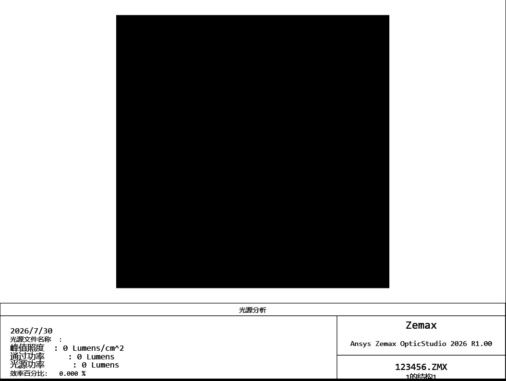

<strong>065 · PartiallyCoherentImageAnalysis · 部分相干图像分析</strong>　✅ 已捕获

| 字段 | 内容 |
|---|---|
| AnalysisIDM | `PartiallyCoherentImageAnalysis` |
| ZPL 代码 | `Pci` |
| GUI 标题 | 部分相干图像分析 |
| 状态 | ✅ 已捕获 |
| 截图来源 | OpticStudio 原生 GUI |
| 数据规模 | 曲线 0 · 网格 1 · 散点 0 · 光线 0 · NSC 点列 1 |
| 分析说明 | 部分相干成像分析数据列表 |
| 文件 | [结构化数据](analyses/065-partiallycoherentimageanalysis/data.json) · [文本结果](analyses/065-partiallycoherentimageanalysis/data.txt) · [分析设置](analyses/065-partiallycoherentimageanalysis/settings.cfg) · [采集状态](analyses/065-partiallycoherentimageanalysis/status.json) |

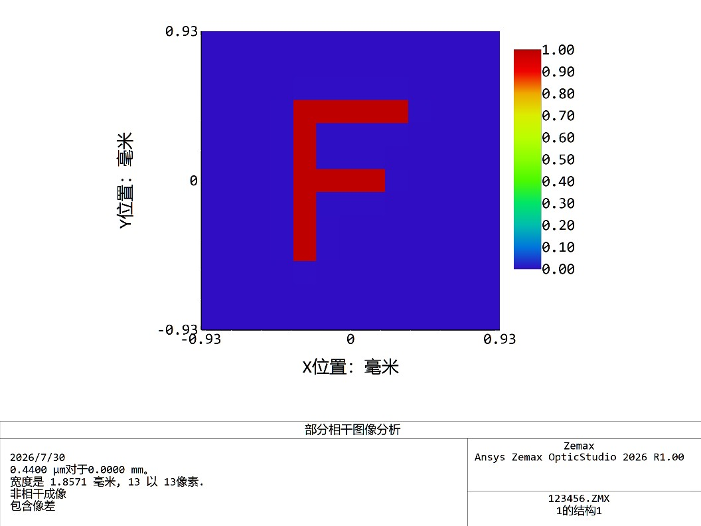

<strong>066 · ExtendedDiffractionImageAnalysis · 扩展图像分析</strong>　✅ 已捕获

| 字段 | 内容 |
|---|---|
| AnalysisIDM | `ExtendedDiffractionImageAnalysis` |
| ZPL 代码 | `Xdi` |
| GUI 标题 | 扩展图像分析 |
| 状态 | ✅ 已捕获 |
| 截图来源 | OpticStudio 原生 GUI |
| 数据规模 | 曲线 0 · 网格 1 · 散点 0 · 光线 0 · NSC 点列 1 |
| 分析说明 | 扩展衍射像分析数据清单 |
| 文件 | [结构化数据](analyses/066-extendeddiffractionimageanalysis/data.json) · [文本结果](analyses/066-extendeddiffractionimageanalysis/data.txt) · [分析设置](analyses/066-extendeddiffractionimageanalysis/settings.cfg) · [采集状态](analyses/066-extendeddiffractionimageanalysis/status.json) |

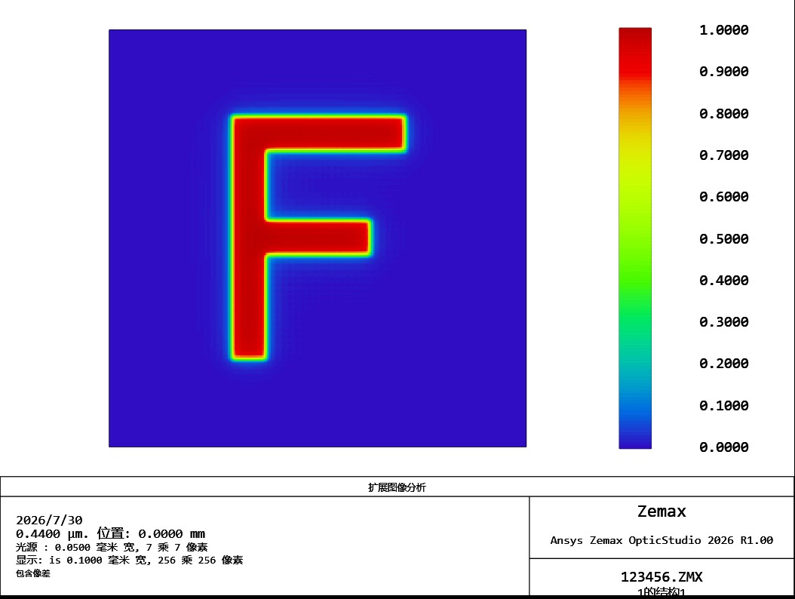

<strong>067 · BiocularFieldOfViewAnalysis · 双目镜视场分析</strong>　✅ 已捕获

| 字段 | 内容 |
|---|---|
| AnalysisIDM | `BiocularFieldOfViewAnalysis` |
| ZPL 代码 | `Fov` |
| GUI 标题 | 双目镜视场分析 |
| 状态 | ✅ 已捕获 |
| 截图来源 | OpticStudio 原生 GUI |
| 数据规模 | 曲线 0 · 网格 0 · 散点 0 · 光线 0 · NSC 点列 1 |
| 分析说明 | — |
| 文件 | [结构化数据](analyses/067-biocularfieldofviewanalysis/data.json) · [分析设置](analyses/067-biocularfieldofviewanalysis/settings.cfg) · [采集状态](analyses/067-biocularfieldofviewanalysis/status.json) |

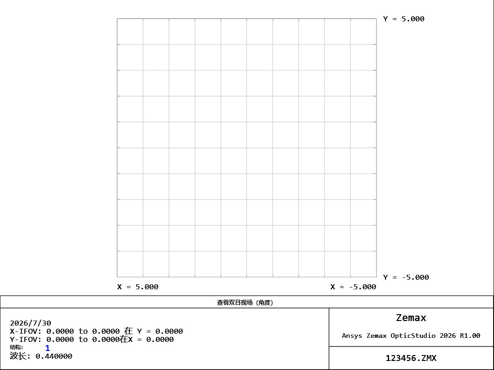

<strong>068 · BiocularDipvergenceConvergence · 双目镜水平/垂直视差分析</strong>　✅ 已捕获

| 字段 | 内容 |
|---|---|
| AnalysisIDM | `BiocularDipvergenceConvergence` |
| ZPL 代码 | `Dip` |
| GUI 标题 | 双目镜水平/垂直视差分析 |
| 状态 | ✅ 已捕获 |
| 截图来源 | OpticStudio 原生 GUI |
| 数据规模 | 曲线 0 · 网格 0 · 散点 0 · 光线 0 · NSC 点列 1 |
| 分析说明 | — |
| 文件 | [结构化数据](analyses/068-bioculardipvergenceconvergence/data.json) · [文本结果](analyses/068-bioculardipvergenceconvergence/data.txt) · [分析设置](analyses/068-bioculardipvergenceconvergence/settings.cfg) · [采集状态](analyses/068-bioculardipvergenceconvergence/status.json) |

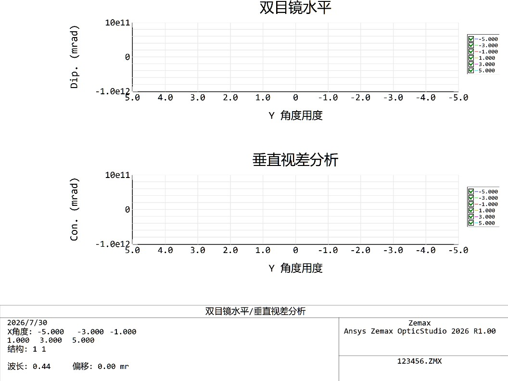

<strong>069 · RelativeIllumination · 相对照度</strong>　✅ 已捕获

| 字段 | 内容 |
|---|---|
| AnalysisIDM | `RelativeIllumination` |
| ZPL 代码 | `Rel` |
| GUI 标题 | 相对照度 |
| 状态 | ✅ 已捕获 |
| 截图来源 | OpticStudio 原生 GUI |
| 数据规模 | 曲线 1 · 网格 0 · 散点 0 · 光线 0 · NSC 点列 1 |
| 分析说明 | 相对照度数据 |
| 文件 | [结构化数据](analyses/069-relativeillumination/data.json) · [文本结果](analyses/069-relativeillumination/data.txt) · [分析设置](analyses/069-relativeillumination/settings.cfg) · [采集状态](analyses/069-relativeillumination/status.json) |

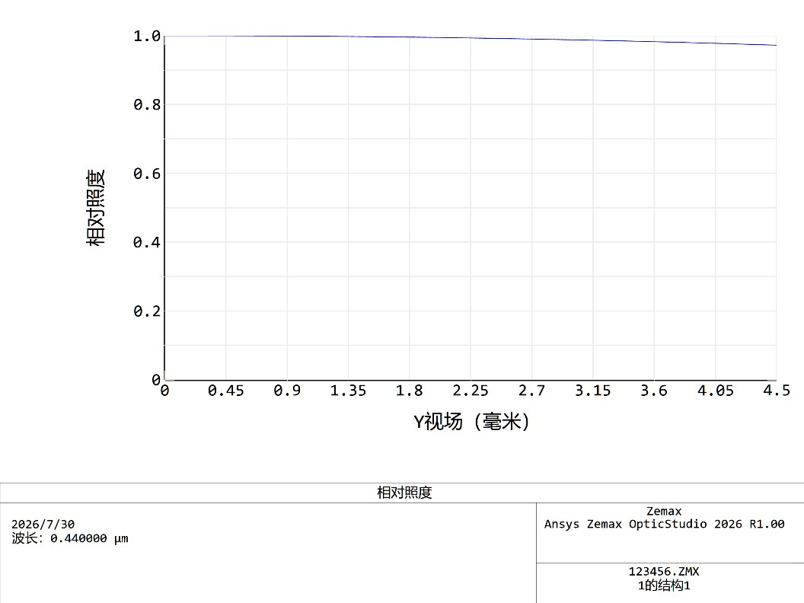

<strong>070 · VignettingDiagramSettings · 渐晕图</strong>　✅ 已捕获

| 字段 | 内容 |
|---|---|
| AnalysisIDM | `VignettingDiagramSettings` |
| ZPL 代码 | `Vig` |
| GUI 标题 | 渐晕图 |
| 状态 | ✅ 已捕获 |
| 截图来源 | OpticStudio 原生 GUI |
| 数据规模 | 曲线 0 · 网格 0 · 散点 0 · 光线 0 · NSC 点列 1 |
| 分析说明 | 渐晕数据 |
| 文件 | [结构化数据](analyses/070-vignettingdiagramsettings/data.json) · [文本结果](analyses/070-vignettingdiagramsettings/data.txt) · [分析设置](analyses/070-vignettingdiagramsettings/settings.cfg) · [采集状态](analyses/070-vignettingdiagramsettings/status.json) |

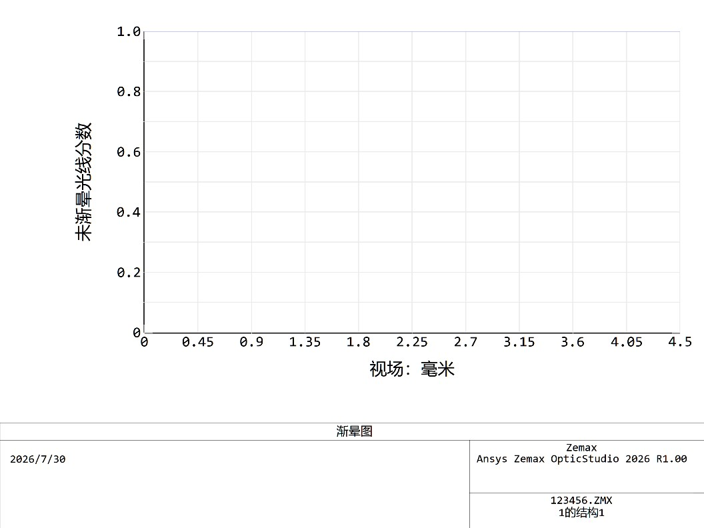

<strong>071 · FootprintSettings · 光迹图</strong>　✅ 已捕获

| 字段 | 内容 |
|---|---|
| AnalysisIDM | `FootprintSettings` |
| ZPL 代码 | `Foo` |
| GUI 标题 | 光迹图 |
| 状态 | ✅ 已捕获 |
| 截图来源 | OpticStudio 原生 GUI |
| 数据规模 | 曲线 0 · 网格 0 · 散点 0 · 光线 0 · NSC 点列 1 |
| 分析说明 | — |
| 文件 | [结构化数据](analyses/071-footprintsettings/data.json) · [文本结果](analyses/071-footprintsettings/data.txt) · [分析设置](analyses/071-footprintsettings/settings.cfg) · [采集状态](analyses/071-footprintsettings/status.json) |

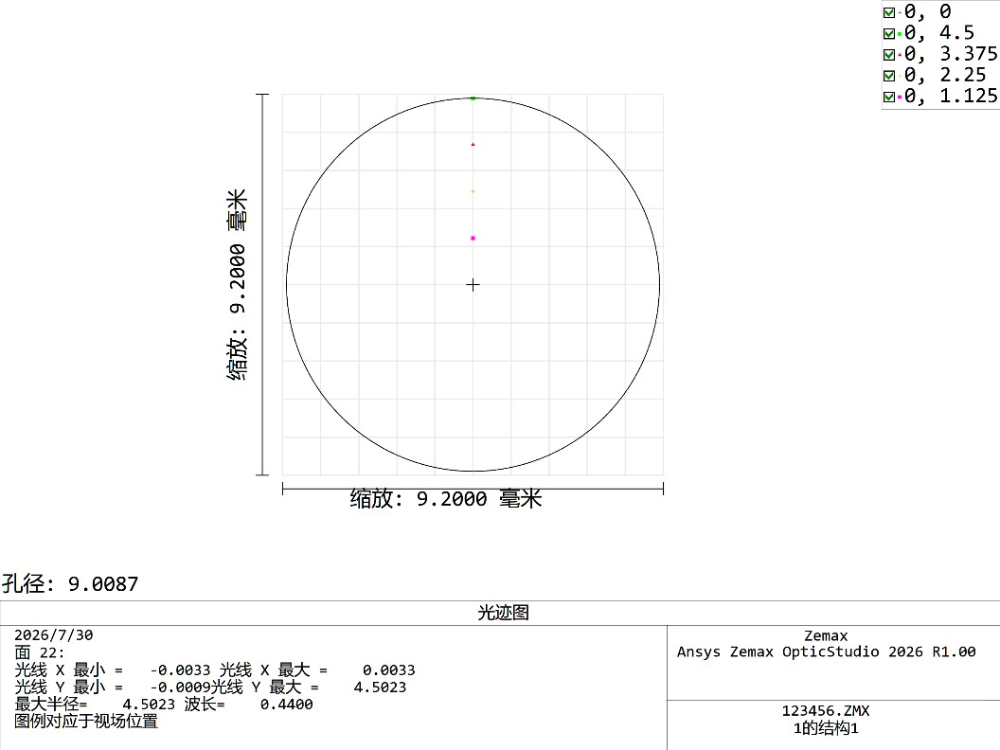

<strong>072 · YYbarDiagram · Y-Ybar图</strong>　✅ 已捕获

| 字段 | 内容 |
|---|---|
| AnalysisIDM | `YYbarDiagram` |
| ZPL 代码 | `Yyb` |
| GUI 标题 | Y-Ybar图 |
| 状态 | ✅ 已捕获 |
| 截图来源 | OpticStudio 原生 GUI |
| 数据规模 | 曲线 0 · 网格 0 · 散点 0 · 光线 0 · NSC 点列 1 |
| 分析说明 | — |
| 文件 | [结构化数据](analyses/072-yybardiagram/data.json) · [文本结果](analyses/072-yybardiagram/data.txt) · [分析设置](analyses/072-yybardiagram/settings.cfg) · [采集状态](analyses/072-yybardiagram/status.json) |

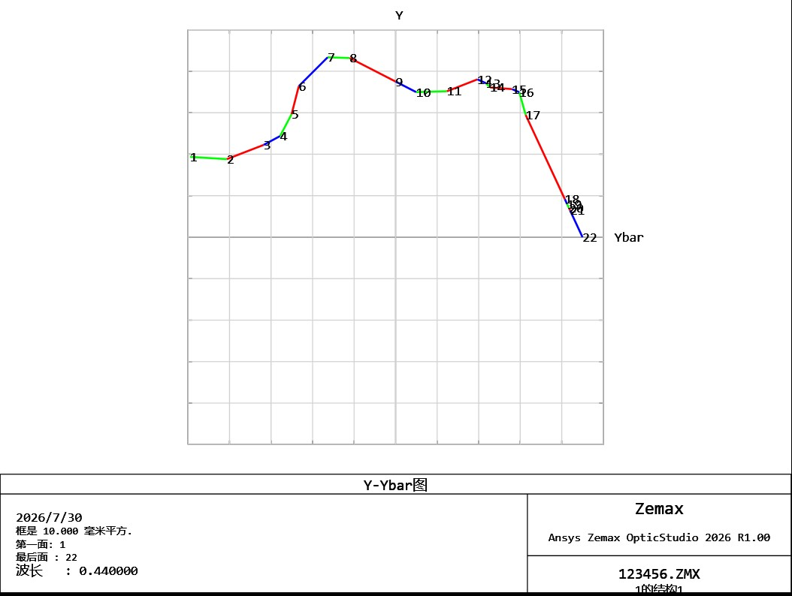

<strong>073 · PowerFieldMapSettings · 视场光焦图</strong>　✅ 已捕获

| 字段 | 内容 |
|---|---|
| AnalysisIDM | `PowerFieldMapSettings` |
| ZPL 代码 | `Pal` |
| GUI 标题 | 视场光焦图 |
| 状态 | ✅ 已捕获 |
| 截图来源 | OpticStudio 原生 GUI |
| 数据规模 | 曲线 0 · 网格 1 · 散点 0 · 光线 0 · NSC 点列 1 |
| 分析说明 | 光焦视场图数据表 |
| 文件 | [结构化数据](analyses/073-powerfieldmapsettings/data.json) · [文本结果](analyses/073-powerfieldmapsettings/data.txt) · [分析设置](analyses/073-powerfieldmapsettings/settings.cfg) · [采集状态](analyses/073-powerfieldmapsettings/status.json) |

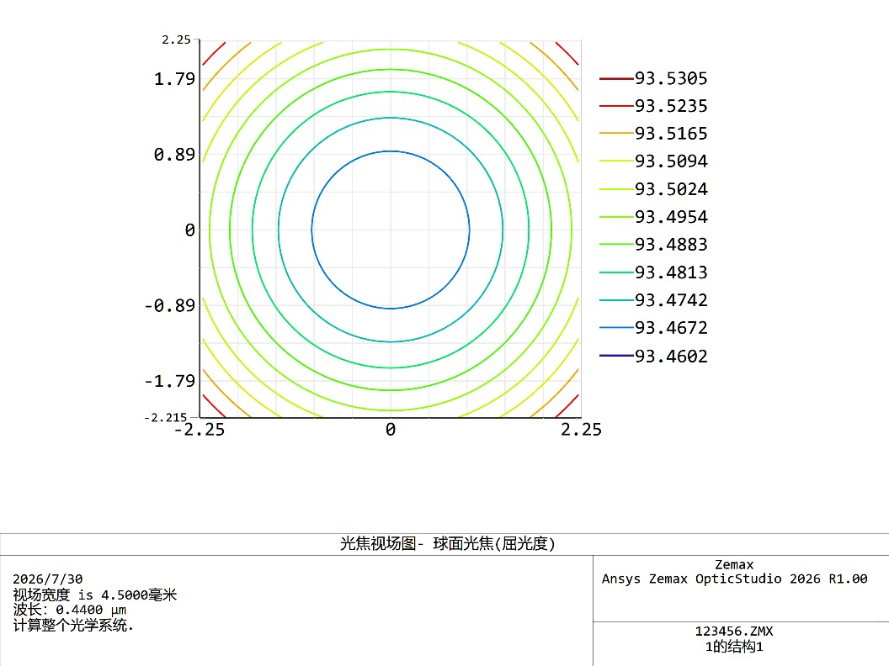

<strong>074 · PowerPupilMapSettings · 光瞳光焦图</strong>　✅ 已捕获

| 字段 | 内容 |
|---|---|
| AnalysisIDM | `PowerPupilMapSettings` |
| ZPL 代码 | `Ppm` |
| GUI 标题 | 光瞳光焦图 |
| 状态 | ✅ 已捕获 |
| 截图来源 | OpticStudio 原生 GUI |
| 数据规模 | 曲线 0 · 网格 1 · 散点 0 · 光线 0 · NSC 点列 1 |
| 分析说明 | 光焦光瞳图数据表n |
| 文件 | [结构化数据](analyses/074-powerpupilmapsettings/data.json) · [文本结果](analyses/074-powerpupilmapsettings/data.txt) · [分析设置](analyses/074-powerpupilmapsettings/settings.cfg) · [采集状态](analyses/074-powerpupilmapsettings/status.json) |

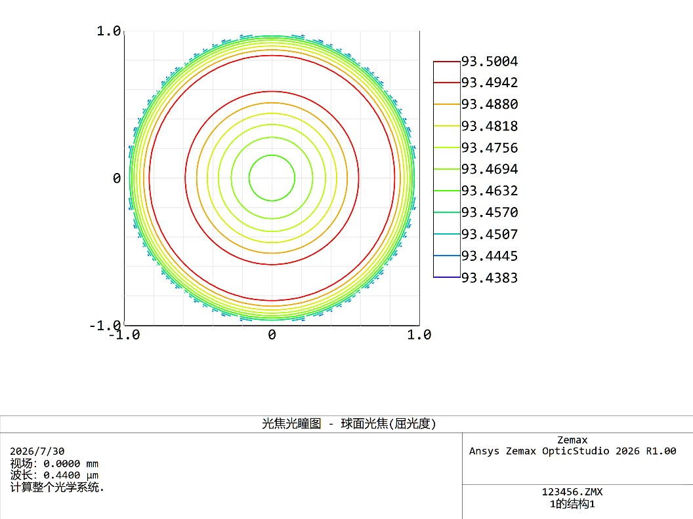

<strong>075 · IncidentAnglevsImageHeight · 入射角 vs. 像高</strong>　✅ 已捕获

| 字段 | 内容 |
|---|---|
| AnalysisIDM | `IncidentAnglevsImageHeight` |
| ZPL 代码 | `Iht` |
| GUI 标题 | 入射角 vs. 像高 |
| 状态 | ✅ 已捕获 |
| 截图来源 | OpticStudio 原生 GUI |
| 数据规模 | 曲线 0 · 网格 0 · 散点 0 · 光线 0 · NSC 点列 1 |
| 分析说明 | 入射角度与像高列表 |
| 文件 | [结构化数据](analyses/075-incidentanglevsimageheight/data.json) · [文本结果](analyses/075-incidentanglevsimageheight/data.txt) · [分析设置](analyses/075-incidentanglevsimageheight/settings.cfg) · [采集状态](analyses/075-incidentanglevsimageheight/status.json) |

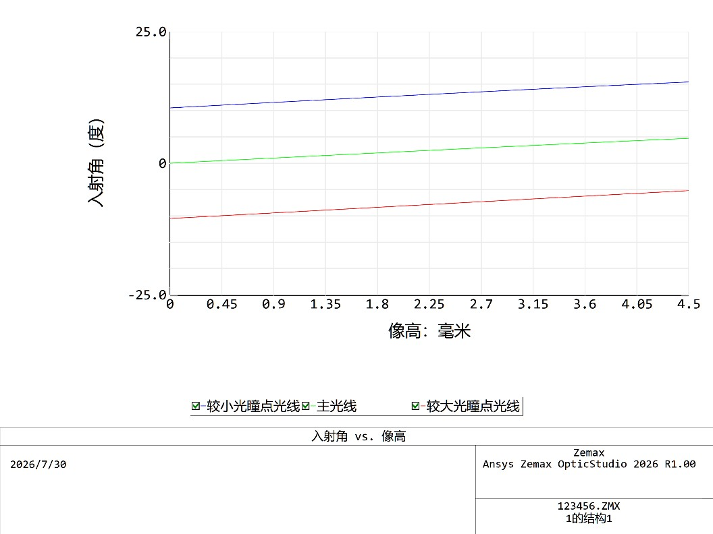

### 分析 076–100

<strong>076 · FiberCouplingSettings · 光纤耦合</strong>　✅ 已捕获

| 字段 | 内容 |
|---|---|
| AnalysisIDM | `FiberCouplingSettings` |
| ZPL 代码 | `Fcl` |
| GUI 标题 | 光纤耦合 |
| 状态 | ✅ 已捕获 |
| 截图来源 | ZOS-API 数据回退渲染 |
| 数据规模 | 曲线 0 · 网格 0 · 散点 0 · 光线 0 · NSC 点列 1 |
| 分析说明 | — |
| 文件 | [结构化数据](analyses/076-fibercouplingsettings/data.json) · [文本结果](analyses/076-fibercouplingsettings/data.txt) · [分析设置](analyses/076-fibercouplingsettings/settings.cfg) · [采集状态](analyses/076-fibercouplingsettings/status.json) |

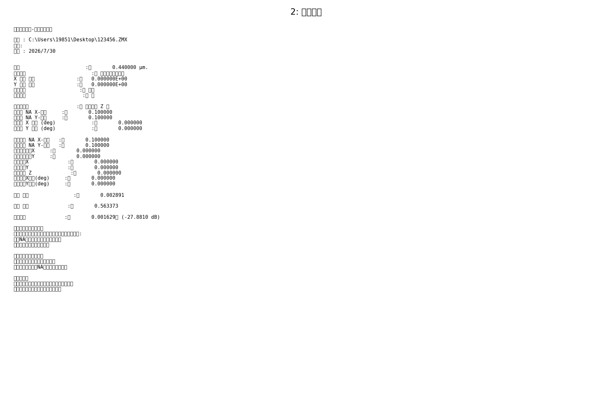

<strong>077 · YNIContributions · YNI贡献</strong>　✅ 已捕获

| 字段 | 内容 |
|---|---|
| AnalysisIDM | `YNIContributions` |
| ZPL 代码 | `Yni` |
| GUI 标题 | YNI贡献 |
| 状态 | ✅ 已捕获 |
| 截图来源 | ZOS-API 数据回退渲染 |
| 数据规模 | 曲线 0 · 网格 0 · 散点 0 · 光线 0 · NSC 点列 1 |
| 分析说明 | — |
| 文件 | [结构化数据](analyses/077-ynicontributions/data.json) · [文本结果](analyses/077-ynicontributions/data.txt) · [分析设置](analyses/077-ynicontributions/settings.cfg) · [采集状态](analyses/077-ynicontributions/status.json) |

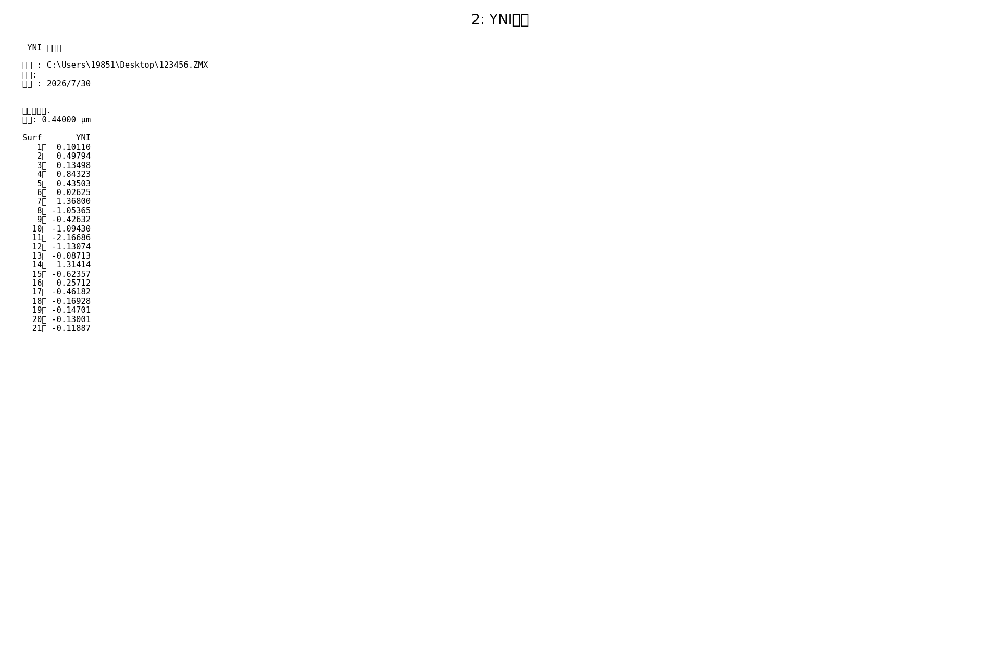

<strong>078 · SagTable · 矢高表</strong>　✅ 已捕获

| 字段 | 内容 |
|---|---|
| AnalysisIDM | `SagTable` |
| ZPL 代码 | `Sag` |
| GUI 标题 | 矢高表 |
| 状态 | ✅ 已捕获 |
| 截图来源 | ZOS-API 数据回退渲染 |
| 数据规模 | 曲线 0 · 网格 0 · 散点 0 · 光线 0 · NSC 点列 1 |
| 分析说明 | — |
| 文件 | [结构化数据](analyses/078-sagtable/data.json) · [文本结果](analyses/078-sagtable/data.txt) · [分析设置](analyses/078-sagtable/settings.cfg) · [采集状态](analyses/078-sagtable/status.json) |

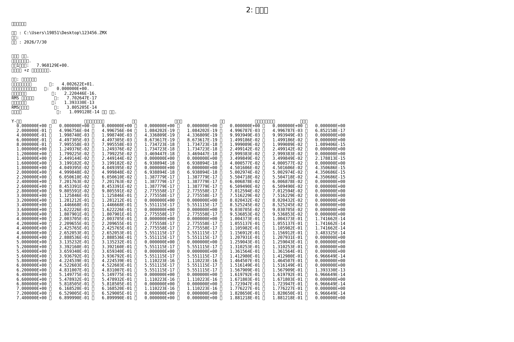

<strong>079 · CardinalPoints · 基点数据</strong>　✅ 已捕获

| 字段 | 内容 |
|---|---|
| AnalysisIDM | `CardinalPoints` |
| ZPL 代码 | `Car` |
| GUI 标题 | 基点数据 |
| 状态 | ✅ 已捕获 |
| 截图来源 | ZOS-API 数据回退渲染 |
| 数据规模 | 曲线 0 · 网格 0 · 散点 0 · 光线 0 · NSC 点列 1 |
| 分析说明 | — |
| 文件 | [结构化数据](analyses/079-cardinalpoints/data.json) · [文本结果](analyses/079-cardinalpoints/data.txt) · [分析设置](analyses/079-cardinalpoints/settings.cfg) · [采集状态](analyses/079-cardinalpoints/status.json) |

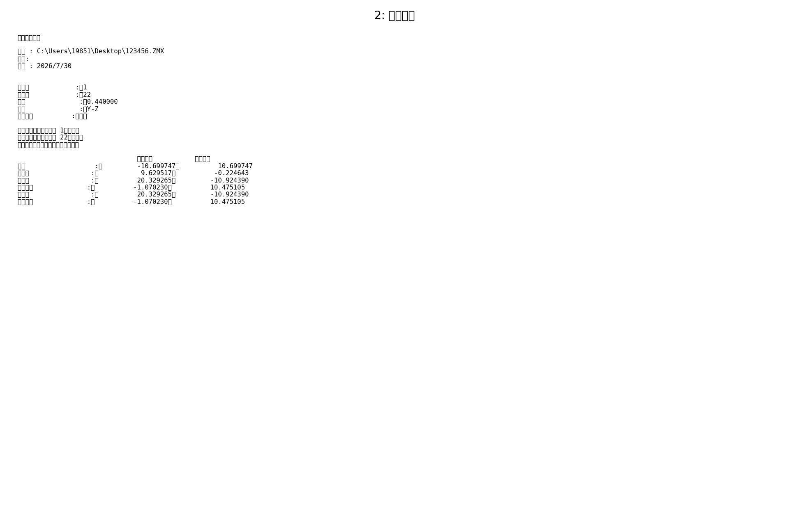

<strong>080 · DispersionDiagram · 色散图</strong>　✅ 已捕获

| 字段 | 内容 |
|---|---|
| AnalysisIDM | `DispersionDiagram` |
| ZPL 代码 | `Dis` |
| GUI 标题 | 色散图 |
| 状态 | ✅ 已捕获 |
| 截图来源 | OpticStudio 原生 GUI |
| 数据规模 | 曲线 0 · 网格 0 · 散点 0 · 光线 0 · NSC 点列 1 |
| 分析说明 | 折射率 vs. 波长 |
| 文件 | [结构化数据](analyses/080-dispersiondiagram/data.json) · [文本结果](analyses/080-dispersiondiagram/data.txt) · [分析设置](analyses/080-dispersiondiagram/settings.cfg) · [采集状态](analyses/080-dispersiondiagram/status.json) |

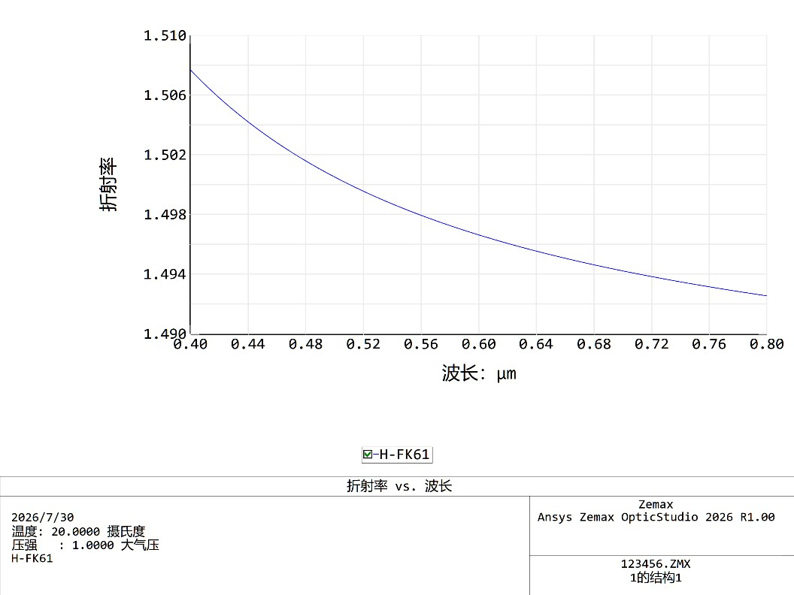

<strong>081 · GlassMap · 玻璃图</strong>　✅ 已捕获

| 字段 | 内容 |
|---|---|
| AnalysisIDM | `GlassMap` |
| ZPL 代码 | `Gmp` |
| GUI 标题 | 玻璃图 |
| 状态 | ✅ 已捕获 |
| 截图来源 | OpticStudio 原生 GUI |
| 数据规模 | 曲线 0 · 网格 0 · 散点 0 · 光线 0 · NSC 点列 1 |
| 分析说明 | — |
| 文件 | [结构化数据](analyses/081-glassmap/data.json) · [文本结果](analyses/081-glassmap/data.txt) · [分析设置](analyses/081-glassmap/settings.cfg) · [采集状态](analyses/081-glassmap/status.json) |

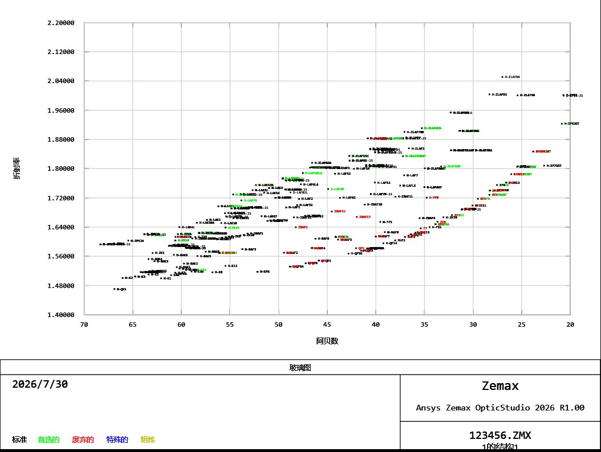

<strong>082 · AthermalGlassMap · 无热化玻璃图</strong>　✅ 已捕获

| 字段 | 内容 |
|---|---|
| AnalysisIDM | `AthermalGlassMap` |
| ZPL 代码 | `Agm` |
| GUI 标题 | 无热化玻璃图 |
| 状态 | ✅ 已捕获 |
| 截图来源 | OpticStudio 原生 GUI |
| 数据规模 | 曲线 0 · 网格 0 · 散点 0 · 光线 0 · NSC 点列 1 |
| 分析说明 | — |
| 文件 | [结构化数据](analyses/082-athermalglassmap/data.json) · [文本结果](analyses/082-athermalglassmap/data.txt) · [分析设置](analyses/082-athermalglassmap/settings.cfg) · [采集状态](analyses/082-athermalglassmap/status.json) |

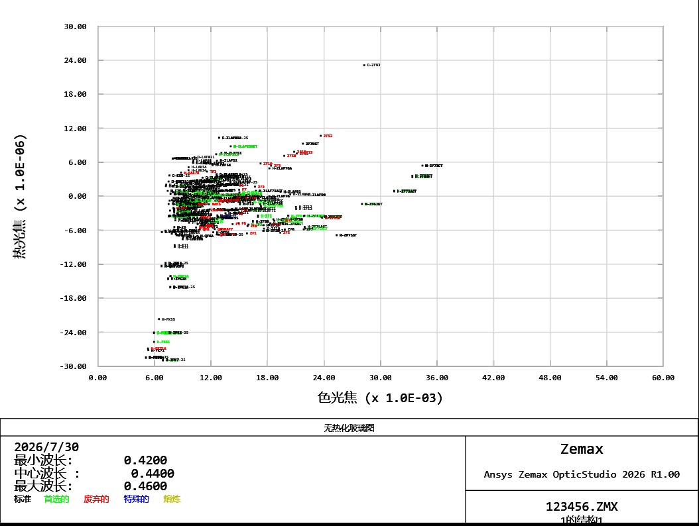

<strong>083 · InternalTransmissionvsWavelength · 内透射</strong>　✅ 已捕获

| 字段 | 内容 |
|---|---|
| AnalysisIDM | `InternalTransmissionvsWavelength` |
| ZPL 代码 | `—` |
| GUI 标题 | 内透射 |
| 状态 | ✅ 已捕获 |
| 截图来源 | ZOS-API 数据回退渲染 |
| 数据规模 | 曲线 1 · 网格 0 · 散点 0 · 光线 0 · NSC 点列 1 |
| 分析说明 | 内部透过率 vs. 波长 |
| 文件 | [结构化数据](analyses/083-internaltransmissionvswavelength/data.json) · [文本结果](analyses/083-internaltransmissionvswavelength/data.txt) · [分析设置](analyses/083-internaltransmissionvswavelength/settings.cfg) · [采集状态](analyses/083-internaltransmissionvswavelength/status.json) |

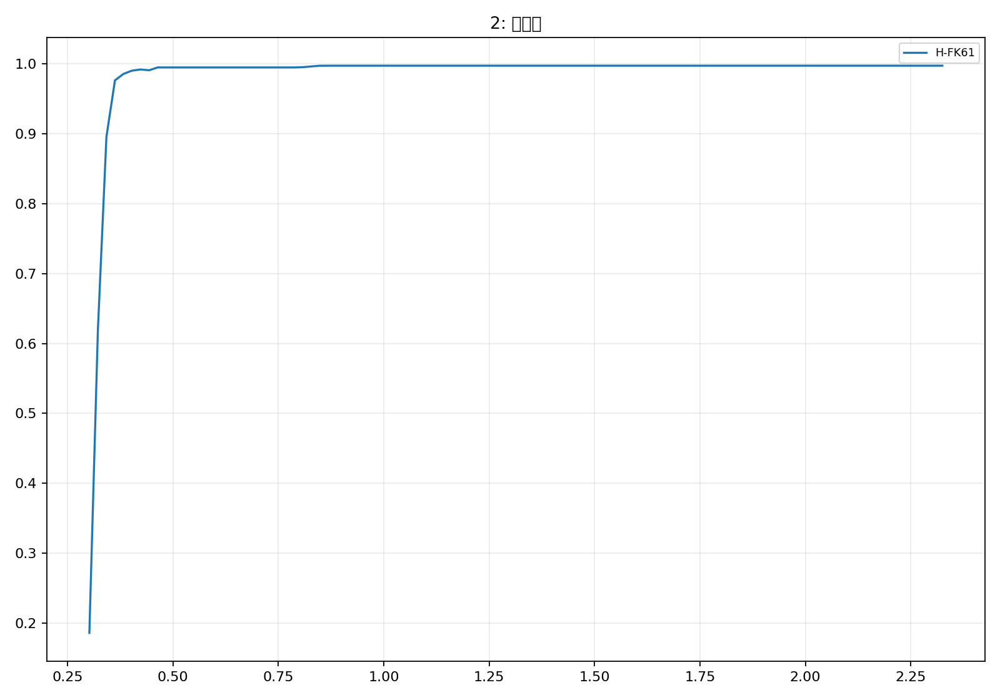

<strong>084 · DispersionvsWavelength · 色散 vs. 波长</strong>　✅ 已捕获

| 字段 | 内容 |
|---|---|
| AnalysisIDM | `DispersionvsWavelength` |
| ZPL 代码 | `Dvl` |
| GUI 标题 | 色散 vs. 波长 |
| 状态 | ✅ 已捕获 |
| 截图来源 | OpticStudio 原生 GUI |
| 数据规模 | 曲线 0 · 网格 0 · 散点 0 · 光线 0 · NSC 点列 1 |
| 分析说明 | 色散 vs. 波长 |
| 文件 | [结构化数据](analyses/084-dispersionvswavelength/data.json) · [文本结果](analyses/084-dispersionvswavelength/data.txt) · [分析设置](analyses/084-dispersionvswavelength/settings.cfg) · [采集状态](analyses/084-dispersionvswavelength/status.json) |

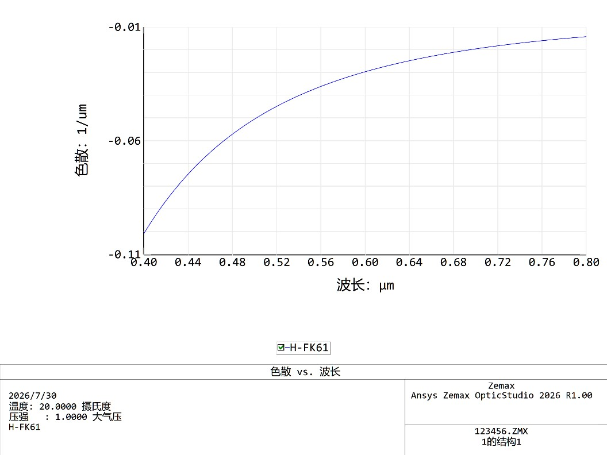

<strong>085 · GrinProfile · GRIN剖面</strong>　✅ 已捕获

| 字段 | 内容 |
|---|---|
| AnalysisIDM | `GrinProfile` |
| ZPL 代码 | `Gip` |
| GUI 标题 | GRIN剖面 |
| 状态 | ✅ 已捕获 |
| 截图来源 | OpticStudio 原生 GUI |
| 数据规模 | 曲线 1 · 网格 0 · 散点 0 · 光线 0 · NSC 点列 1 |
| 分析说明 | 表面 0: 的折射率vs. X |
| 文件 | [结构化数据](analyses/085-grinprofile/data.json) · [文本结果](analyses/085-grinprofile/data.txt) · [分析设置](analyses/085-grinprofile/settings.cfg) · [采集状态](analyses/085-grinprofile/status.json) |

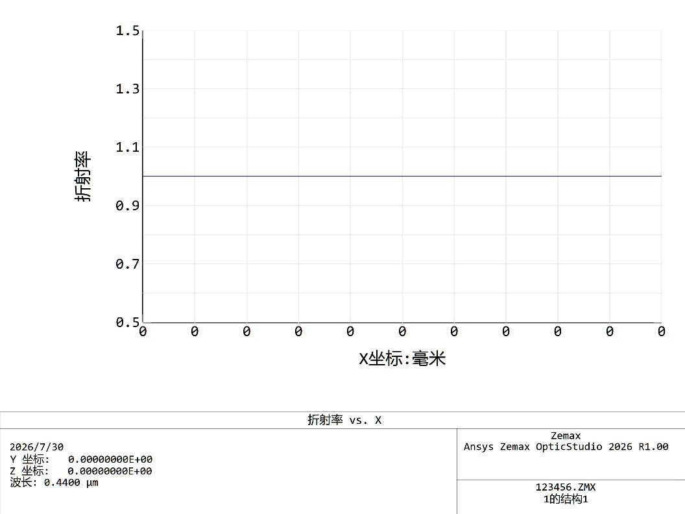

<strong>086 · GradiumProfile · GRADIUM™文件</strong>　✅ 已捕获

| 字段 | 内容 |
|---|---|
| AnalysisIDM | `GradiumProfile` |
| ZPL 代码 | `Gpr` |
| GUI 标题 | GRADIUM™文件 |
| 状态 | ✅ 已捕获 |
| 截图来源 | OpticStudio 原生 GUI |
| 数据规模 | 曲线 0 · 网格 0 · 散点 0 · 光线 0 · NSC 点列 1 |
| 分析说明 | GRADIUM®文件数据列表 |
| 文件 | [结构化数据](analyses/086-gradiumprofile/data.json) · [文本结果](analyses/086-gradiumprofile/data.txt) · [分析设置](analyses/086-gradiumprofile/settings.cfg) · [采集状态](analyses/086-gradiumprofile/status.json) |

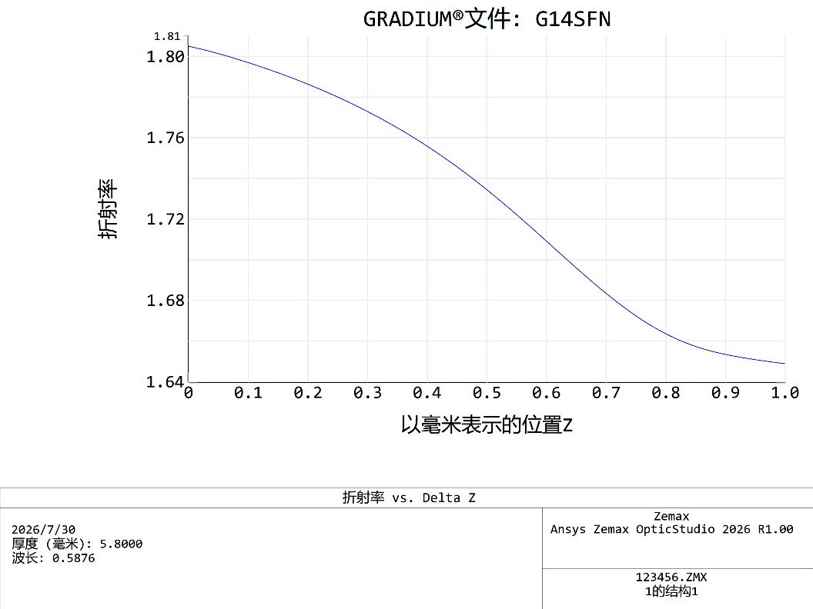

<strong>087 · UniversalPlot1D · 一维通用绘图</strong>　✅ 已捕获

| 字段 | 内容 |
|---|---|
| AnalysisIDM | `UniversalPlot1D` |
| ZPL 代码 | `Uni` |
| GUI 标题 | 一维通用绘图 |
| 状态 | ✅ 已捕获 |
| 截图来源 | OpticStudio 原生 GUI |
| 数据规模 | 曲线 0 · 网格 0 · 散点 0 · 光线 0 · NSC 点列 1 |
| 分析说明 | 通用绘图 |
| 文件 | [结构化数据](analyses/087-universalplot1d/data.json) · [文本结果](analyses/087-universalplot1d/data.txt) · [分析设置](analyses/087-universalplot1d/settings.cfg) · [采集状态](analyses/087-universalplot1d/status.json) |

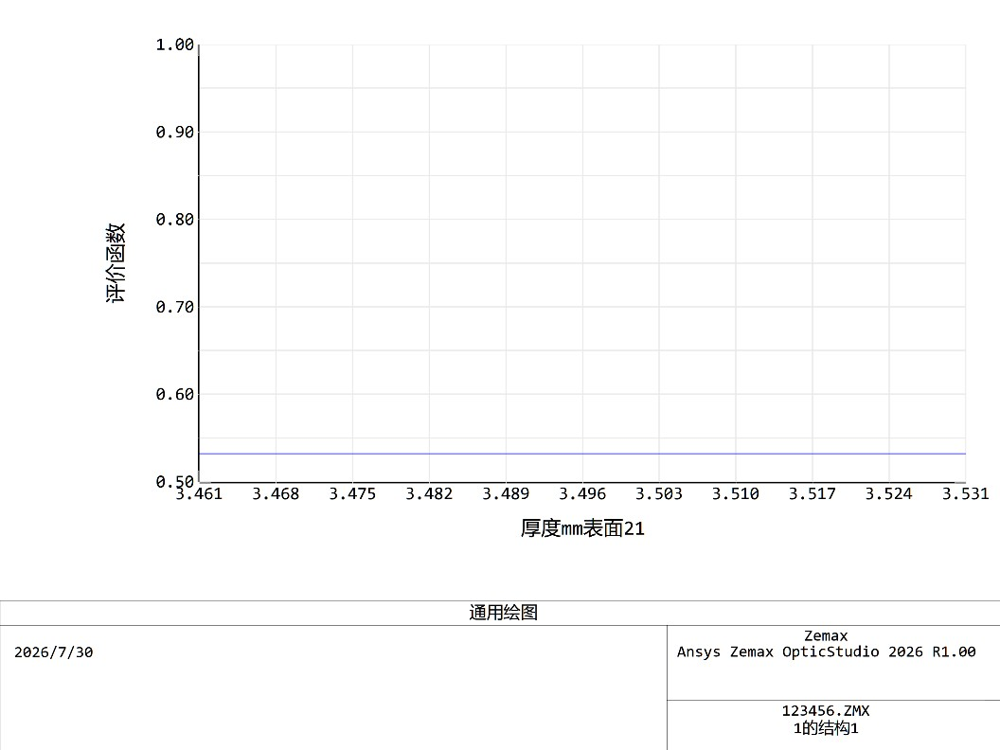

<strong>088 · UniversalPlot2D · 二维通用绘图</strong>　✅ 已捕获

| 字段 | 内容 |
|---|---|
| AnalysisIDM | `UniversalPlot2D` |
| ZPL 代码 | `Un2` |
| GUI 标题 | 二维通用绘图 |
| 状态 | ✅ 已捕获 |
| 截图来源 | OpticStudio 原生 GUI |
| 数据规模 | 曲线 0 · 网格 1 · 散点 0 · 光线 0 · NSC 点列 1 |
| 分析说明 | 二维数据列表 |
| 文件 | [结构化数据](analyses/088-universalplot2d/data.json) · [文本结果](analyses/088-universalplot2d/data.txt) · [分析设置](analyses/088-universalplot2d/settings.cfg) · [采集状态](analyses/088-universalplot2d/status.json) |

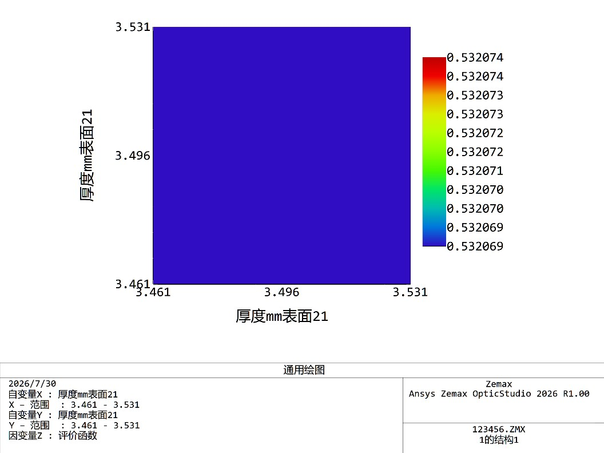

<strong>089 · PolarizationRayTrace · 偏振光线追迹</strong>　✅ 已捕获

| 字段 | 内容 |
|---|---|
| AnalysisIDM | `PolarizationRayTrace` |
| ZPL 代码 | `Pol` |
| GUI 标题 | 偏振光线追迹 |
| 状态 | ✅ 已捕获 |
| 截图来源 | ZOS-API 数据回退渲染 |
| 数据规模 | 曲线 0 · 网格 0 · 散点 0 · 光线 0 · NSC 点列 1 |
| 分析说明 | — |
| 文件 | [结构化数据](analyses/089-polarizationraytrace/data.json) · [文本结果](analyses/089-polarizationraytrace/data.txt) · [分析设置](analyses/089-polarizationraytrace/settings.cfg) · [采集状态](analyses/089-polarizationraytrace/status.json) |

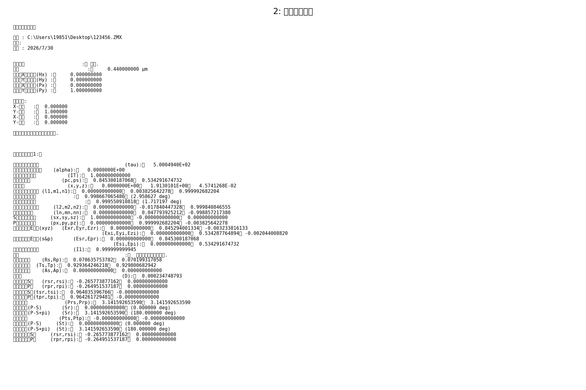

<strong>090 · PolarizationPupilMap · 偏振光瞳图</strong>　✅ 已捕获

| 字段 | 内容 |
|---|---|
| AnalysisIDM | `PolarizationPupilMap` |
| ZPL 代码 | `Pmp` |
| GUI 标题 | 偏振光瞳图 |
| 状态 | ✅ 已捕获 |
| 截图来源 | OpticStudio 原生 GUI |
| 数据规模 | 曲线 0 · 网格 0 · 散点 0 · 光线 0 · NSC 点列 1 |
| 分析说明 | — |
| 文件 | [结构化数据](analyses/090-polarizationpupilmap/data.json) · [文本结果](analyses/090-polarizationpupilmap/data.txt) · [分析设置](analyses/090-polarizationpupilmap/settings.cfg) · [采集状态](analyses/090-polarizationpupilmap/status.json) |

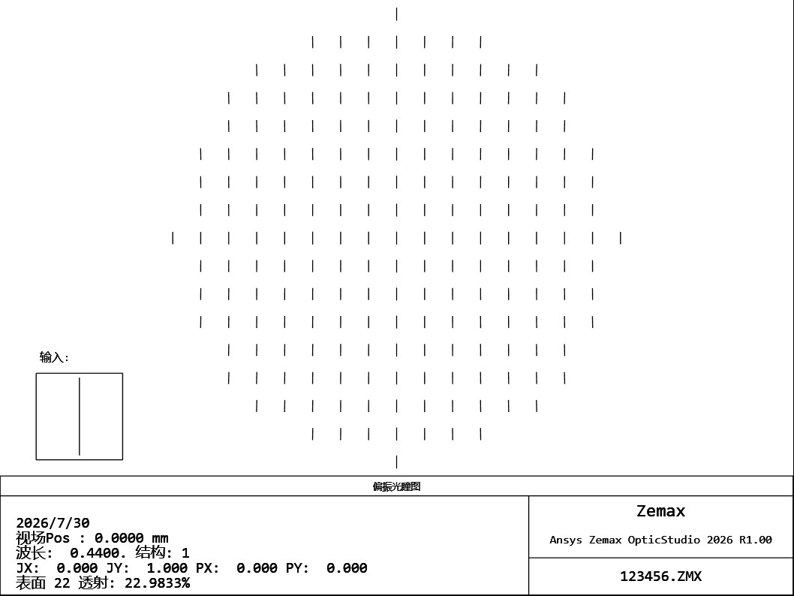

<strong>091 · Transmission · 透过率</strong>　✅ 已捕获

| 字段 | 内容 |
|---|---|
| AnalysisIDM | `Transmission` |
| ZPL 代码 | `Tra` |
| GUI 标题 | 透过率 |
| 状态 | ✅ 已捕获 |
| 截图来源 | ZOS-API 数据回退渲染 |
| 数据规模 | 曲线 0 · 网格 0 · 散点 0 · 光线 0 · NSC 点列 1 |
| 分析说明 | — |
| 文件 | [结构化数据](analyses/091-transmission/data.json) · [文本结果](analyses/091-transmission/data.txt) · [分析设置](analyses/091-transmission/settings.cfg) · [采集状态](analyses/091-transmission/status.json) |

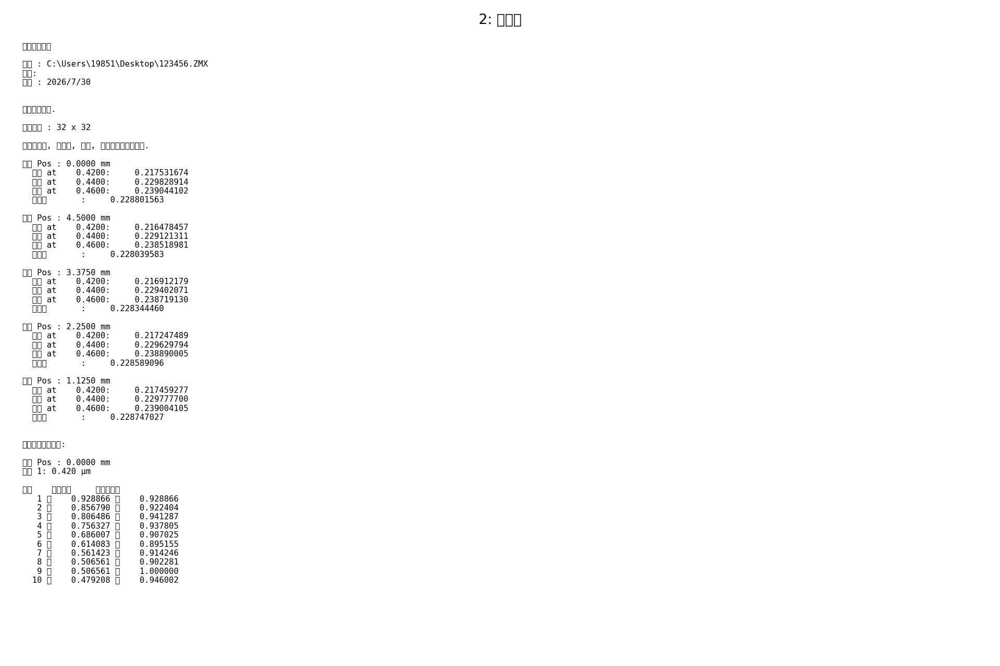

<strong>092 · PhaseAberration · 相位像差</strong>　✅ 已捕获

| 字段 | 内容 |
|---|---|
| AnalysisIDM | `PhaseAberration` |
| ZPL 代码 | `Pha` |
| GUI 标题 | 相位像差 |
| 状态 | ✅ 已捕获 |
| 截图来源 | OpticStudio 原生 GUI |
| 数据规模 | 曲线 0 · 网格 0 · 散点 0 · 光线 0 · NSC 点列 1 |
| 分析说明 | — |
| 文件 | [结构化数据](analyses/092-phaseaberration/data.json) · [文本结果](analyses/092-phaseaberration/data.txt) · [分析设置](analyses/092-phaseaberration/settings.cfg) · [采集状态](analyses/092-phaseaberration/status.json) |

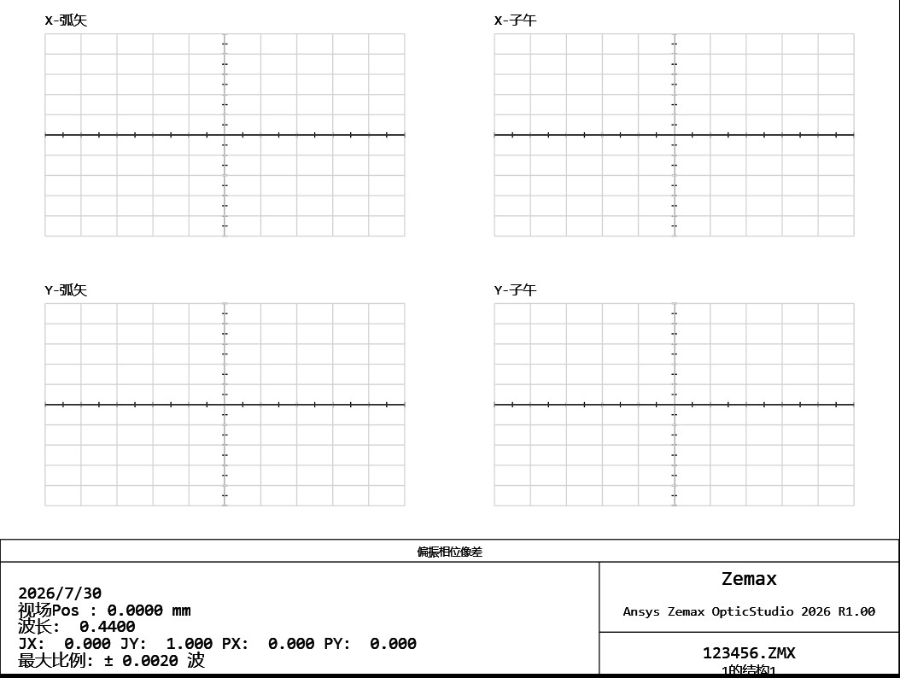

<strong>093 · TransmissionFan · 透射光扇图</strong>　✅ 已捕获

| 字段 | 内容 |
|---|---|
| AnalysisIDM | `TransmissionFan` |
| ZPL 代码 | `Ptf` |
| GUI 标题 | 透射光扇图 |
| 状态 | ✅ 已捕获 |
| 截图来源 | OpticStudio 原生 GUI |
| 数据规模 | 曲线 0 · 网格 0 · 散点 0 · 光线 0 · NSC 点列 1 |
| 分析说明 | — |
| 文件 | [结构化数据](analyses/093-transmissionfan/data.json) · [文本结果](analyses/093-transmissionfan/data.txt) · [分析设置](analyses/093-transmissionfan/settings.cfg) · [采集状态](analyses/093-transmissionfan/status.json) |

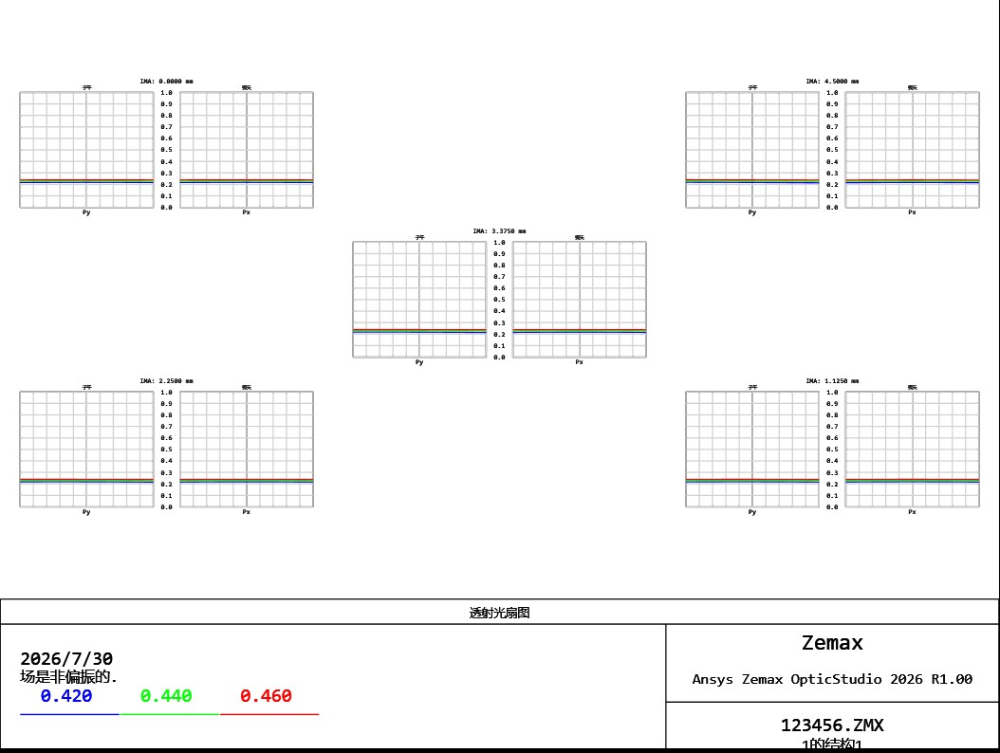

<strong>094 · ParaxialGaussianBeam · 近轴高斯光束数据</strong>　✅ 已捕获

| 字段 | 内容 |
|---|---|
| AnalysisIDM | `ParaxialGaussianBeam` |
| ZPL 代码 | `Gbp` |
| GUI 标题 | 近轴高斯光束数据 |
| 状态 | ✅ 已捕获 |
| 截图来源 | ZOS-API 数据回退渲染 |
| 数据规模 | 曲线 0 · 网格 0 · 散点 0 · 光线 0 · NSC 点列 1 |
| 分析说明 | — |
| 文件 | [结构化数据](analyses/094-paraxialgaussianbeam/data.json) · [文本结果](analyses/094-paraxialgaussianbeam/data.txt) · [分析设置](analyses/094-paraxialgaussianbeam/settings.cfg) · [采集状态](analyses/094-paraxialgaussianbeam/status.json) |

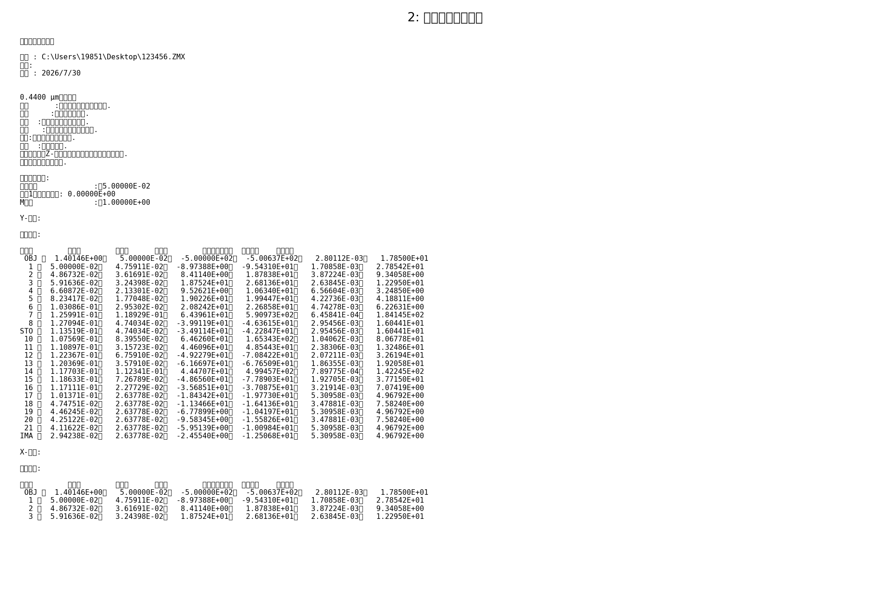

<strong>095 · SkewGaussianBeam · 倾斜高斯光束数据</strong>　✅ 已捕获

| 字段 | 内容 |
|---|---|
| AnalysisIDM | `SkewGaussianBeam` |
| ZPL 代码 | `Gbs` |
| GUI 标题 | 倾斜高斯光束数据 |
| 状态 | ✅ 已捕获 |
| 截图来源 | ZOS-API 数据回退渲染 |
| 数据规模 | 曲线 0 · 网格 0 · 散点 0 · 光线 0 · NSC 点列 1 |
| 分析说明 | — |
| 文件 | [结构化数据](analyses/095-skewgaussianbeam/data.json) · [文本结果](analyses/095-skewgaussianbeam/data.txt) · [分析设置](analyses/095-skewgaussianbeam/settings.cfg) · [采集状态](analyses/095-skewgaussianbeam/status.json) |

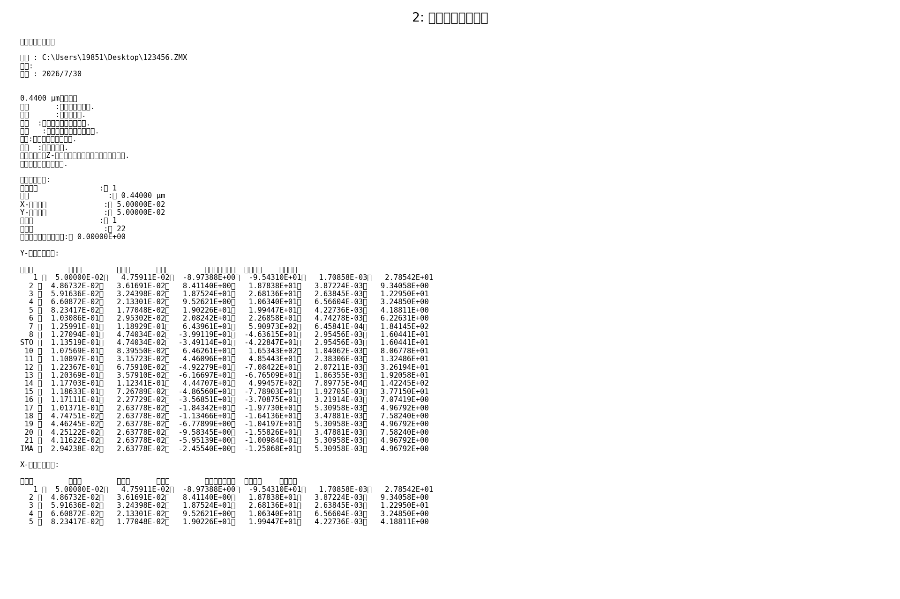

<strong>096 · PhysicalOpticsPropagation · 物理光学传播</strong>　✅ 已捕获

| 字段 | 内容 |
|---|---|
| AnalysisIDM | `PhysicalOpticsPropagation` |
| ZPL 代码 | `Pop` |
| GUI 标题 | 物理光学传播 |
| 状态 | ✅ 已捕获 |
| 截图来源 | OpticStudio 原生 GUI |
| 数据规模 | 曲线 0 · 网格 1 · 散点 0 · 光线 0 · NSC 点列 1 |
| 分析说明 | POP 辐照度数据的列表 |
| 文件 | [结构化数据](analyses/096-physicalopticspropagation/data.json) · [文本结果](analyses/096-physicalopticspropagation/data.txt) · [分析设置](analyses/096-physicalopticspropagation/settings.cfg) · [采集状态](analyses/096-physicalopticspropagation/status.json) |

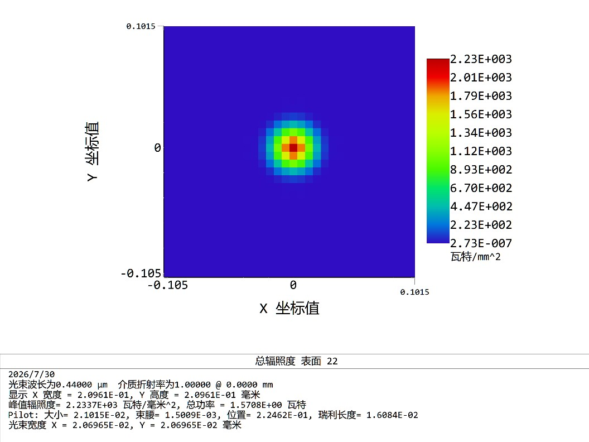

<strong>097 · BeamFileViewer · 光束文件查看器</strong>　✅ 已捕获

| 字段 | 内容 |
|---|---|
| AnalysisIDM | `BeamFileViewer` |
| ZPL 代码 | `Bfv` |
| GUI 标题 | 光束文件查看器 |
| 状态 | ✅ 已捕获 |
| 截图来源 | OpticStudio 原生 GUI |
| 数据规模 | 曲线 0 · 网格 1 · 散点 0 · 光线 0 · NSC 点列 1 |
| 分析说明 | POP 辐照度数据的列表 |
| 文件 | [结构化数据](analyses/097-beamfileviewer/data.json) · [文本结果](analyses/097-beamfileviewer/data.txt) · [分析设置](analyses/097-beamfileviewer/settings.cfg) · [采集状态](analyses/097-beamfileviewer/status.json) |

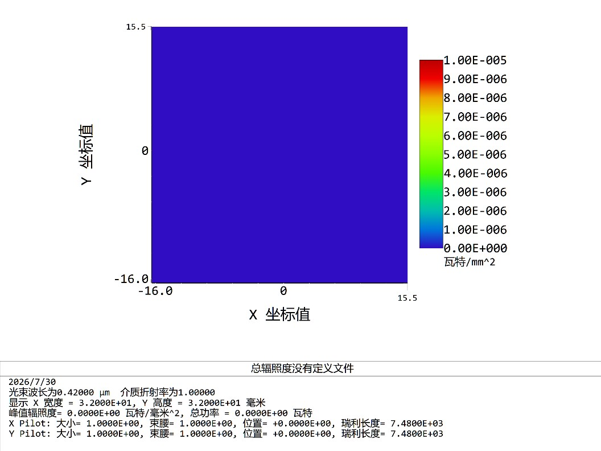

<strong>098 · ReflectionvsAngle · 反射率 vs. 角度</strong>　✅ 已捕获

| 字段 | 内容 |
|---|---|
| AnalysisIDM | `ReflectionvsAngle` |
| ZPL 代码 | `Cra` |
| GUI 标题 | 反射率 vs. 角度 |
| 状态 | ✅ 已捕获 |
| 截图来源 | OpticStudio 原生 GUI |
| 数据规模 | 曲线 2 · 网格 0 · 散点 0 · 光线 0 · NSC 点列 1 |
| 分析说明 | — |
| 文件 | [结构化数据](analyses/098-reflectionvsangle/data.json) · [文本结果](analyses/098-reflectionvsangle/data.txt) · [分析设置](analyses/098-reflectionvsangle/settings.cfg) · [采集状态](analyses/098-reflectionvsangle/status.json) |

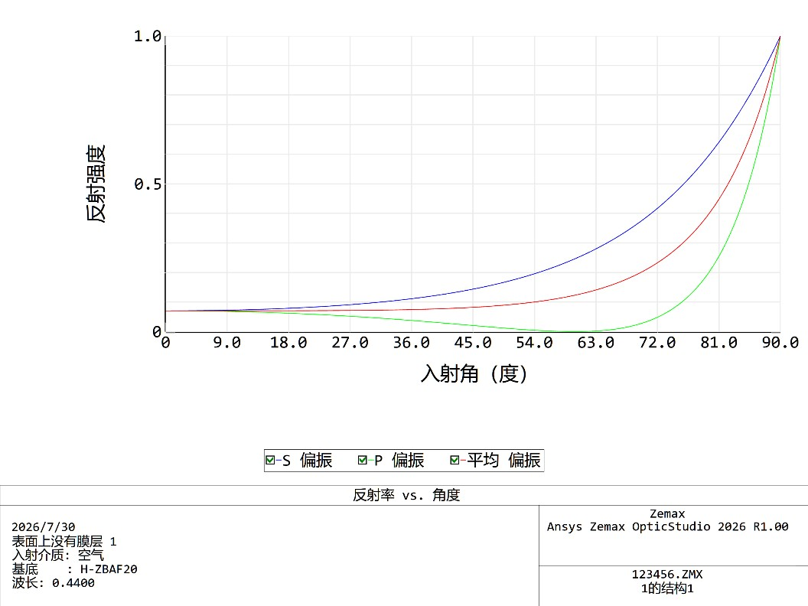

<strong>099 · TransmissionvsAngle · 透过率 vs. 角度</strong>　✅ 已捕获

| 字段 | 内容 |
|---|---|
| AnalysisIDM | `TransmissionvsAngle` |
| ZPL 代码 | `Cta` |
| GUI 标题 | 透过率 vs. 角度 |
| 状态 | ✅ 已捕获 |
| 截图来源 | OpticStudio 原生 GUI |
| 数据规模 | 曲线 2 · 网格 0 · 散点 0 · 光线 0 · NSC 点列 1 |
| 分析说明 | — |
| 文件 | [结构化数据](analyses/099-transmissionvsangle/data.json) · [文本结果](analyses/099-transmissionvsangle/data.txt) · [分析设置](analyses/099-transmissionvsangle/settings.cfg) · [采集状态](analyses/099-transmissionvsangle/status.json) |

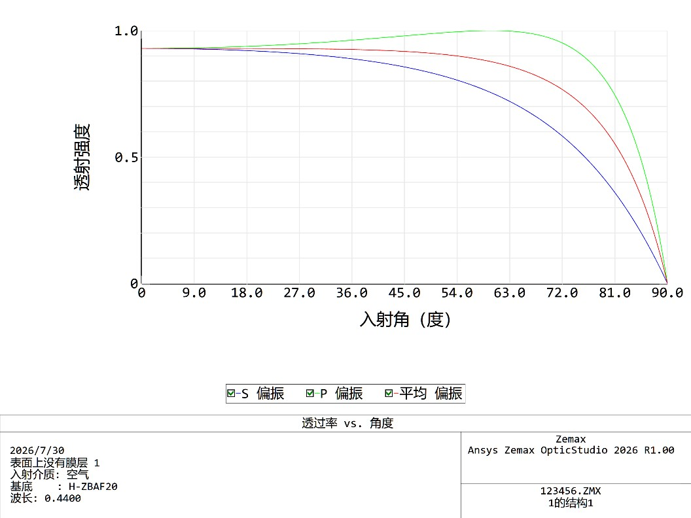

<strong>100 · AbsorptionvsAngle · 吸收率 vs. 角度</strong>　✅ 已捕获

| 字段 | 内容 |
|---|---|
| AnalysisIDM | `AbsorptionvsAngle` |
| ZPL 代码 | `Caa` |
| GUI 标题 | 吸收率 vs. 角度 |
| 状态 | ✅ 已捕获 |
| 截图来源 | OpticStudio 原生 GUI |
| 数据规模 | 曲线 2 · 网格 0 · 散点 0 · 光线 0 · NSC 点列 1 |
| 分析说明 | — |
| 文件 | [结构化数据](analyses/100-absorptionvsangle/data.json) · [文本结果](analyses/100-absorptionvsangle/data.txt) · [分析设置](analyses/100-absorptionvsangle/settings.cfg) · [采集状态](analyses/100-absorptionvsangle/status.json) |

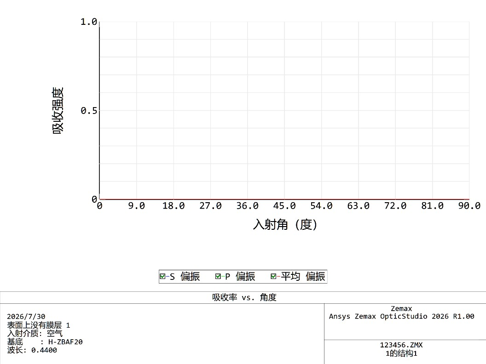

### 分析 101–125

<strong>101 · DiattenuationvsAngle · 双衰减 vs. 角度</strong>　✅ 已捕获

| 字段 | 内容 |
|---|---|
| AnalysisIDM | `DiattenuationvsAngle` |
| ZPL 代码 | `Cda` |
| GUI 标题 | 双衰减 vs. 角度 |
| 状态 | ✅ 已捕获 |
| 截图来源 | OpticStudio 原生 GUI |
| 数据规模 | 曲线 2 · 网格 0 · 散点 0 · 光线 0 · NSC 点列 1 |
| 分析说明 | — |
| 文件 | [结构化数据](analyses/101-diattenuationvsangle/data.json) · [文本结果](analyses/101-diattenuationvsangle/data.txt) · [分析设置](analyses/101-diattenuationvsangle/settings.cfg) · [采集状态](analyses/101-diattenuationvsangle/status.json) |

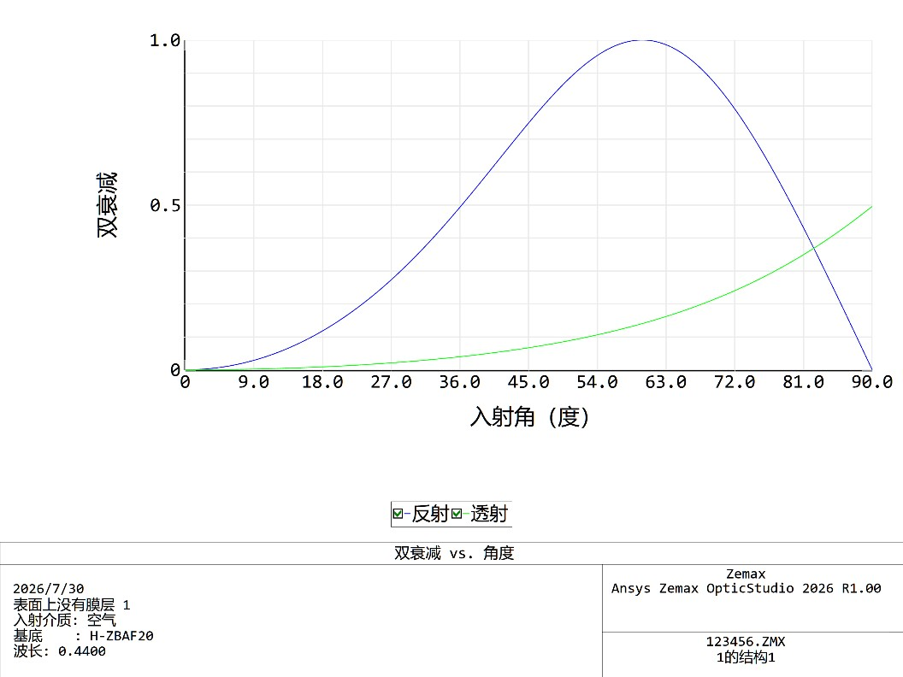

<strong>102 · PhasevsAngle · 位相 vs. 角度</strong>　✅ 已捕获

| 字段 | 内容 |
|---|---|
| AnalysisIDM | `PhasevsAngle` |
| ZPL 代码 | `Cpa` |
| GUI 标题 | 位相 vs. 角度 |
| 状态 | ✅ 已捕获 |
| 截图来源 | OpticStudio 原生 GUI |
| 数据规模 | 曲线 2 · 网格 0 · 散点 0 · 光线 0 · NSC 点列 1 |
| 分析说明 | — |
| 文件 | [结构化数据](analyses/102-phasevsangle/data.json) · [文本结果](analyses/102-phasevsangle/data.txt) · [分析设置](analyses/102-phasevsangle/settings.cfg) · [采集状态](analyses/102-phasevsangle/status.json) |

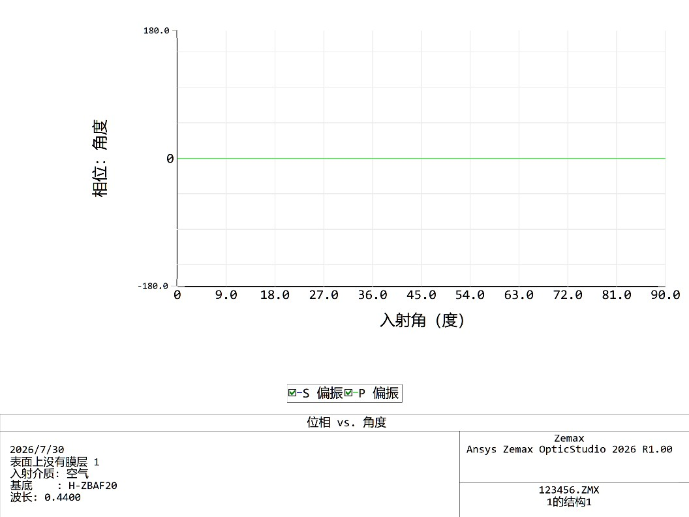

<strong>103 · RetardancevsAngle · 相位延迟 vs. 角度</strong>　✅ 已捕获

| 字段 | 内容 |
|---|---|
| AnalysisIDM | `RetardancevsAngle` |
| ZPL 代码 | `Cna` |
| GUI 标题 | 相位延迟 vs. 角度 |
| 状态 | ✅ 已捕获 |
| 截图来源 | OpticStudio 原生 GUI |
| 数据规模 | 曲线 2 · 网格 0 · 散点 0 · 光线 0 · NSC 点列 1 |
| 分析说明 | — |
| 文件 | [结构化数据](analyses/103-retardancevsangle/data.json) · [文本结果](analyses/103-retardancevsangle/data.txt) · [分析设置](analyses/103-retardancevsangle/settings.cfg) · [采集状态](analyses/103-retardancevsangle/status.json) |

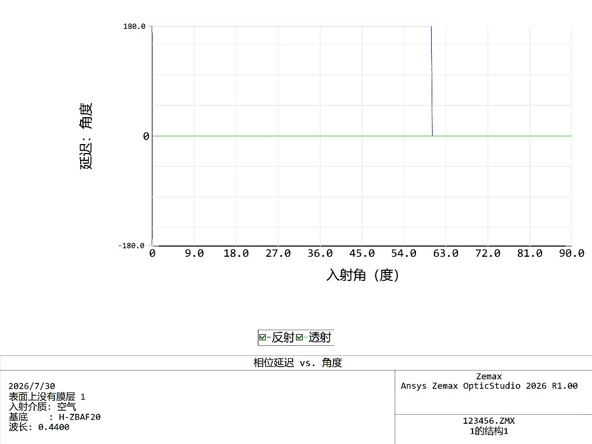

<strong>104 · ReflectionvsWavelength · 反射率 vs. 波长</strong>　✅ 已捕获

| 字段 | 内容 |
|---|---|
| AnalysisIDM | `ReflectionvsWavelength` |
| ZPL 代码 | `Crw` |
| GUI 标题 | 反射率 vs. 波长 |
| 状态 | ✅ 已捕获 |
| 截图来源 | OpticStudio 原生 GUI |
| 数据规模 | 曲线 2 · 网格 0 · 散点 0 · 光线 0 · NSC 点列 1 |
| 分析说明 | — |
| 文件 | [结构化数据](analyses/104-reflectionvswavelength/data.json) · [文本结果](analyses/104-reflectionvswavelength/data.txt) · [分析设置](analyses/104-reflectionvswavelength/settings.cfg) · [采集状态](analyses/104-reflectionvswavelength/status.json) |

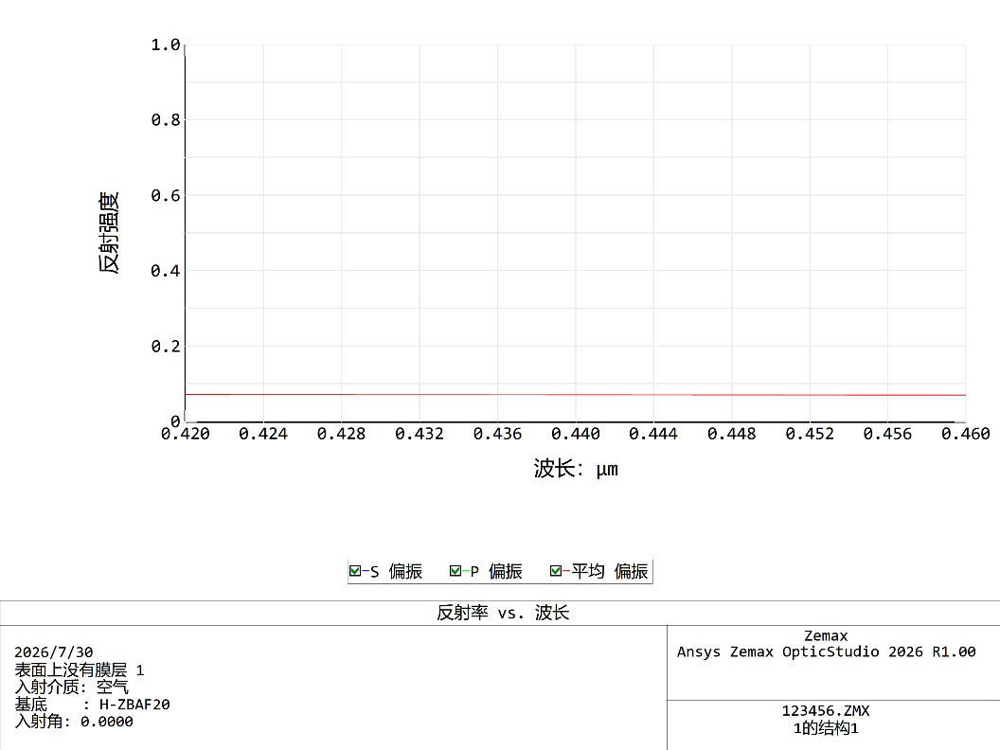

<strong>105 · TransmissionvsWavelength · 透过率 vs. 波长</strong>　✅ 已捕获

| 字段 | 内容 |
|---|---|
| AnalysisIDM | `TransmissionvsWavelength` |
| ZPL 代码 | `Ctw` |
| GUI 标题 | 透过率 vs. 波长 |
| 状态 | ✅ 已捕获 |
| 截图来源 | OpticStudio 原生 GUI |
| 数据规模 | 曲线 2 · 网格 0 · 散点 0 · 光线 0 · NSC 点列 1 |
| 分析说明 | — |
| 文件 | [结构化数据](analyses/105-transmissionvswavelength/data.json) · [文本结果](analyses/105-transmissionvswavelength/data.txt) · [分析设置](analyses/105-transmissionvswavelength/settings.cfg) · [采集状态](analyses/105-transmissionvswavelength/status.json) |

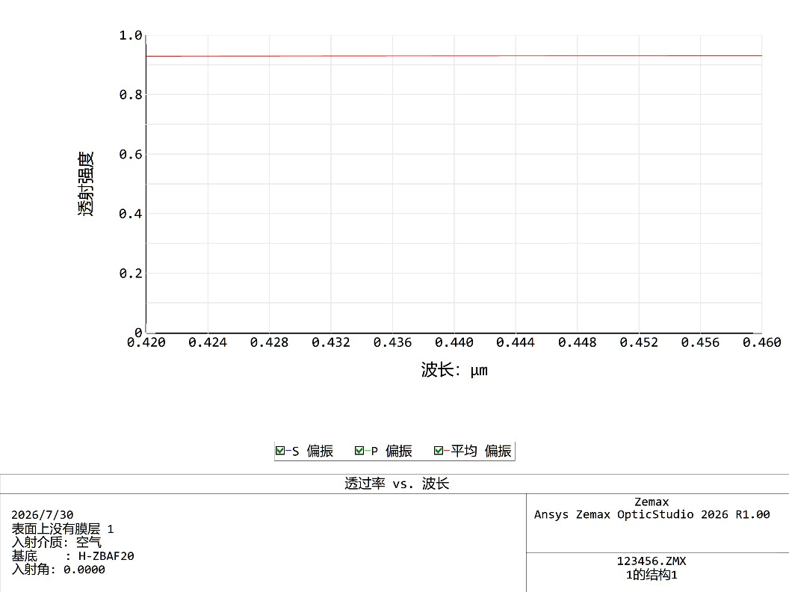

<strong>106 · AbsorptionvsWavelength · 吸收率 vs. 波长</strong>　✅ 已捕获

| 字段 | 内容 |
|---|---|
| AnalysisIDM | `AbsorptionvsWavelength` |
| ZPL 代码 | `Caw` |
| GUI 标题 | 吸收率 vs. 波长 |
| 状态 | ✅ 已捕获 |
| 截图来源 | OpticStudio 原生 GUI |
| 数据规模 | 曲线 2 · 网格 0 · 散点 0 · 光线 0 · NSC 点列 1 |
| 分析说明 | — |
| 文件 | [结构化数据](analyses/106-absorptionvswavelength/data.json) · [文本结果](analyses/106-absorptionvswavelength/data.txt) · [分析设置](analyses/106-absorptionvswavelength/settings.cfg) · [采集状态](analyses/106-absorptionvswavelength/status.json) |

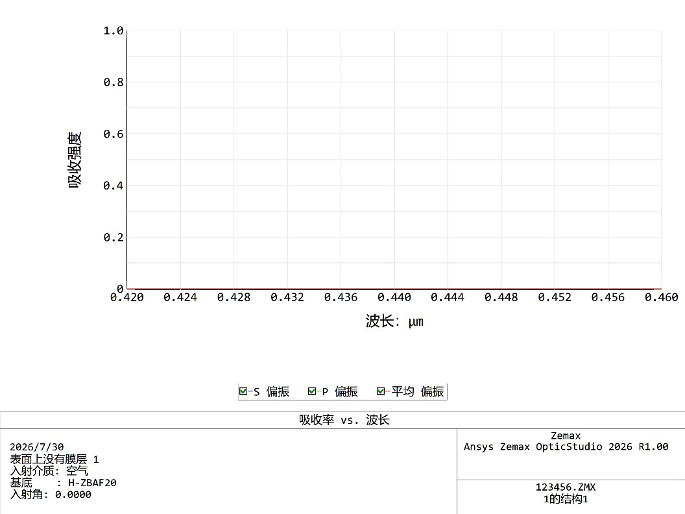

<strong>107 · DiattenuationvsWavelength · 双衰减 vs. 波长</strong>　✅ 已捕获

| 字段 | 内容 |
|---|---|
| AnalysisIDM | `DiattenuationvsWavelength` |
| ZPL 代码 | `Cdw` |
| GUI 标题 | 双衰减 vs. 波长 |
| 状态 | ✅ 已捕获 |
| 截图来源 | OpticStudio 原生 GUI |
| 数据规模 | 曲线 2 · 网格 0 · 散点 0 · 光线 0 · NSC 点列 1 |
| 分析说明 | — |
| 文件 | [结构化数据](analyses/107-diattenuationvswavelength/data.json) · [文本结果](analyses/107-diattenuationvswavelength/data.txt) · [分析设置](analyses/107-diattenuationvswavelength/settings.cfg) · [采集状态](analyses/107-diattenuationvswavelength/status.json) |

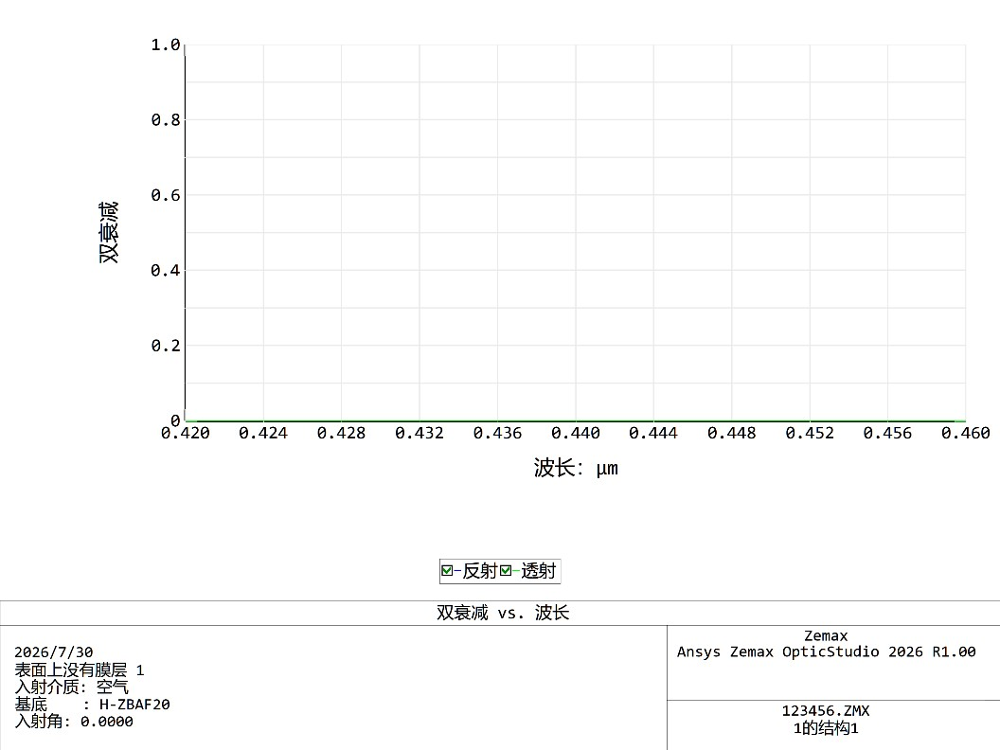

<strong>108 · PhasevsWavelength · 相位 vs. 波长</strong>　✅ 已捕获

| 字段 | 内容 |
|---|---|
| AnalysisIDM | `PhasevsWavelength` |
| ZPL 代码 | `Cpw` |
| GUI 标题 | 相位 vs. 波长 |
| 状态 | ✅ 已捕获 |
| 截图来源 | OpticStudio 原生 GUI |
| 数据规模 | 曲线 2 · 网格 0 · 散点 0 · 光线 0 · NSC 点列 1 |
| 分析说明 | — |
| 文件 | [结构化数据](analyses/108-phasevswavelength/data.json) · [文本结果](analyses/108-phasevswavelength/data.txt) · [分析设置](analyses/108-phasevswavelength/settings.cfg) · [采集状态](analyses/108-phasevswavelength/status.json) |

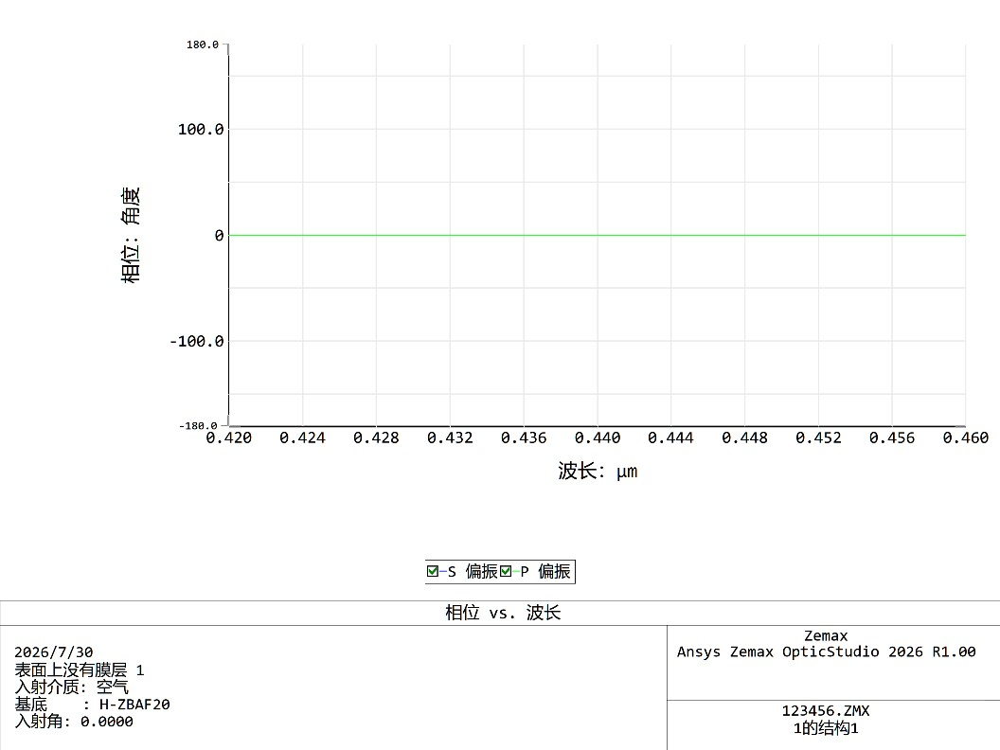

<strong>109 · RetardancevsWavelength · 相位延迟 vs. 波长</strong>　✅ 已捕获

| 字段 | 内容 |
|---|---|
| AnalysisIDM | `RetardancevsWavelength` |
| ZPL 代码 | `Cnw` |
| GUI 标题 | 相位延迟 vs. 波长 |
| 状态 | ✅ 已捕获 |
| 截图来源 | OpticStudio 原生 GUI |
| 数据规模 | 曲线 2 · 网格 0 · 散点 0 · 光线 0 · NSC 点列 1 |
| 分析说明 | — |
| 文件 | [结构化数据](analyses/109-retardancevswavelength/data.json) · [文本结果](analyses/109-retardancevswavelength/data.txt) · [分析设置](analyses/109-retardancevswavelength/settings.cfg) · [采集状态](analyses/109-retardancevswavelength/status.json) |

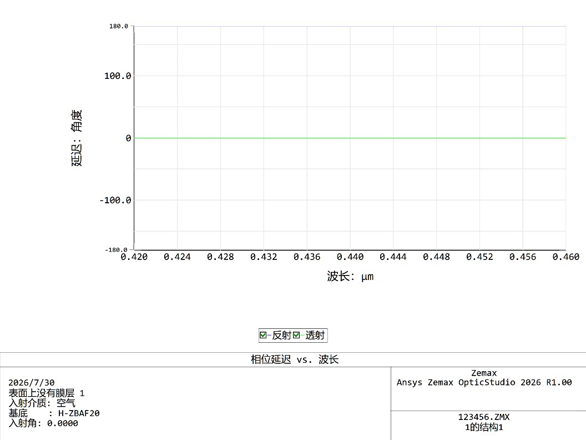

<strong>110 · DirectivityPlot · 光源配光曲线</strong>　✅ 已捕获

| 字段 | 内容 |
|---|---|
| AnalysisIDM | `DirectivityPlot` |
| ZPL 代码 | `Sdv` |
| GUI 标题 | 光源配光曲线 |
| 状态 | ✅ 已捕获 |
| 截图来源 | OpticStudio 原生 GUI |
| 数据规模 | 曲线 0 · 网格 0 · 散点 0 · 光线 0 · NSC 点列 1 |
| 分析说明 | — |
| 文件 | [结构化数据](analyses/110-directivityplot/data.json) · [文本结果](analyses/110-directivityplot/data.txt) · [分析设置](analyses/110-directivityplot/settings.cfg) · [采集状态](analyses/110-directivityplot/status.json) |

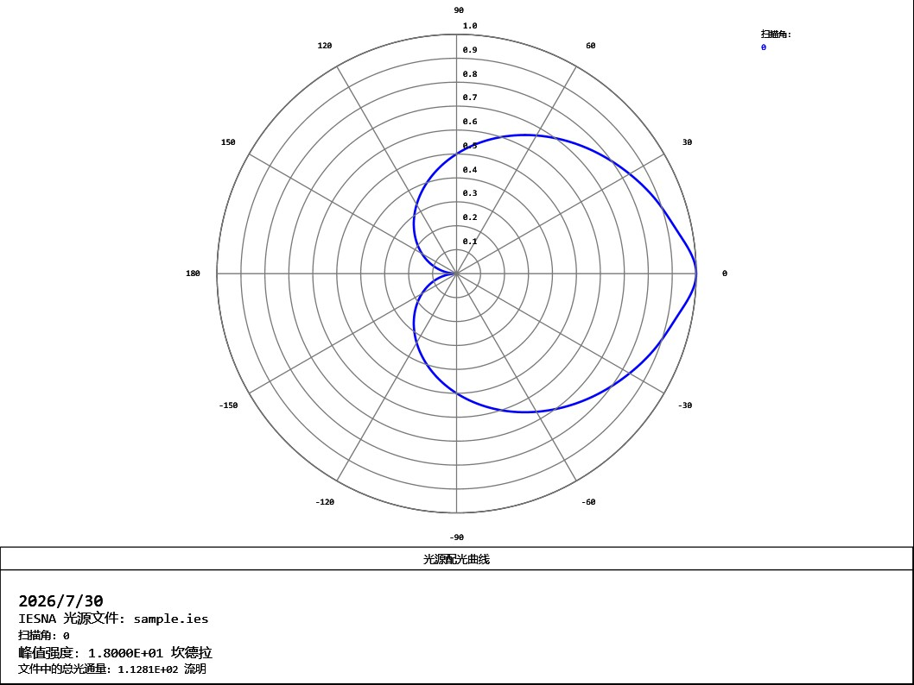

<strong>111 · SourcePolarViewer · 光源极坐标图</strong>　✅ 已捕获

| 字段 | 内容 |
|---|---|
| AnalysisIDM | `SourcePolarViewer` |
| ZPL 代码 | `Spo` |
| GUI 标题 | 光源极坐标图 |
| 状态 | ✅ 已捕获 |
| 截图来源 | OpticStudio 原生 GUI |
| 数据规模 | 曲线 0 · 网格 1 · 散点 0 · 光线 0 · NSC 点列 1 |
| 分析说明 | — |
| 文件 | [结构化数据](analyses/111-sourcepolarviewer/data.json) · [分析设置](analyses/111-sourcepolarviewer/settings.cfg) · [采集状态](analyses/111-sourcepolarviewer/status.json) |

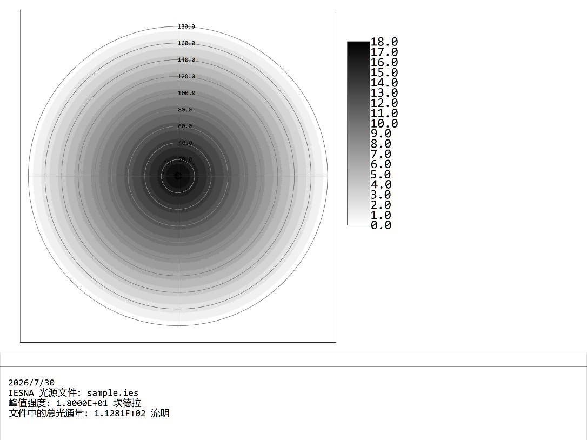

<strong>112 · PhotoluminscenceViewer · 磷光/荧光光谱图</strong>　✅ 已捕获

| 字段 | 内容 |
|---|---|
| AnalysisIDM | `PhotoluminscenceViewer` |
| ZPL 代码 | `—` |
| GUI 标题 | 磷光/荧光光谱图 |
| 状态 | ✅ 已捕获 |
| 截图来源 | ZOS-API 数据回退渲染 |
| 数据规模 | 曲线 0 · 网格 0 · 散点 0 · 光线 0 · NSC 点列 1 |
| 分析说明 | — |
| 文件 | [结构化数据](analyses/112-photoluminscenceviewer/data.json) · [文本结果](analyses/112-photoluminscenceviewer/data.txt) · [分析设置](analyses/112-photoluminscenceviewer/settings.cfg) · [采集状态](analyses/112-photoluminscenceviewer/status.json) |

<strong>113 · SourceSpectrumViewer · 光源光谱图</strong>　✅ 已捕获

| 字段 | 内容 |
|---|---|
| AnalysisIDM | `SourceSpectrumViewer` |
| ZPL 代码 | `Ssp` |
| GUI 标题 | 光源光谱图 |
| 状态 | ✅ 已捕获 |
| 截图来源 | OpticStudio 原生 GUI |
| 数据规模 | 曲线 0 · 网格 0 · 散点 0 · 光线 0 · NSC 点列 1 |
| 分析说明 | — |
| 文件 | [结构化数据](analyses/113-sourcespectrumviewer/data.json) · [文本结果](analyses/113-sourcespectrumviewer/data.txt) · [分析设置](analyses/113-sourcespectrumviewer/settings.cfg) · [采集状态](analyses/113-sourcespectrumviewer/status.json) |

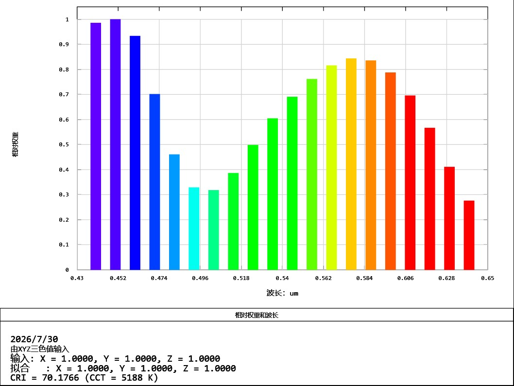

<strong>114 · RadiantSourceModelViewerSettings · Radiant Source Model™模型查看器</strong>　✅ 已捕获

| 字段 | 内容 |
|---|---|
| AnalysisIDM | `RadiantSourceModelViewerSettings` |
| ZPL 代码 | `—` |
| GUI 标题 | Radiant Source Model™模型查看器 |
| 状态 | ✅ 已捕获 |
| 截图来源 | ZOS-API 数据回退渲染 |
| 数据规模 | 曲线 0 · 网格 0 · 散点 0 · 光线 0 · NSC 点列 1 |
| 分析说明 | — |
| 文件 | [结构化数据](analyses/114-radiantsourcemodelviewersettings/data.json) · [分析设置](analyses/114-radiantsourcemodelviewersettings/settings.cfg) · [采集状态](analyses/114-radiantsourcemodelviewersettings/status.json) |

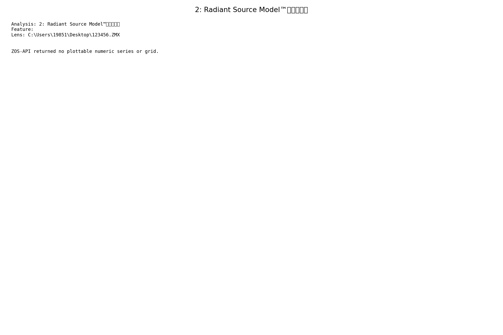

<strong>115 · SurfaceDataSettings · 表面数据</strong>　✅ 已捕获

| 字段 | 内容 |
|---|---|
| AnalysisIDM | `SurfaceDataSettings` |
| ZPL 代码 | `Sur` |
| GUI 标题 | 表面数据 |
| 状态 | ✅ 已捕获 |
| 截图来源 | ZOS-API 数据回退渲染 |
| 数据规模 | 曲线 0 · 网格 0 · 散点 0 · 光线 0 · NSC 点列 1 |
| 分析说明 | — |
| 文件 | [结构化数据](analyses/115-surfacedatasettings/data.json) · [文本结果](analyses/115-surfacedatasettings/data.txt) · [分析设置](analyses/115-surfacedatasettings/settings.cfg) · [采集状态](analyses/115-surfacedatasettings/status.json) |

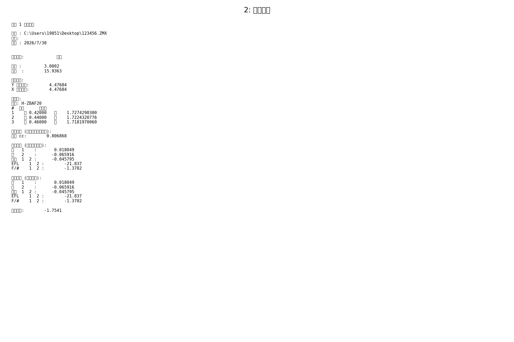

<strong>116 · PrescriptionDataSettings · 详细数据</strong>　✅ 已捕获

| 字段 | 内容 |
|---|---|
| AnalysisIDM | `PrescriptionDataSettings` |
| ZPL 代码 | `Pre` |
| GUI 标题 | 详细数据 |
| 状态 | ✅ 已捕获 |
| 截图来源 | ZOS-API 数据回退渲染 |
| 数据规模 | 曲线 0 · 网格 0 · 散点 0 · 光线 0 · NSC 点列 1 |
| 分析说明 | — |
| 文件 | [结构化数据](analyses/116-prescriptiondatasettings/data.json) · [文本结果](analyses/116-prescriptiondatasettings/data.txt) · [分析设置](analyses/116-prescriptiondatasettings/settings.cfg) · [采集状态](analyses/116-prescriptiondatasettings/status.json) |

<strong>117 · FileComparatorSettings · 文件比较</strong>　✅ 已捕获

| 字段 | 内容 |
|---|---|
| AnalysisIDM | `FileComparatorSettings` |
| ZPL 代码 | `—` |
| GUI 标题 | 文件比较 |
| 状态 | ✅ 已捕获 |
| 截图来源 | ZOS-API 数据回退渲染 |
| 数据规模 | 曲线 0 · 网格 0 · 散点 0 · 光线 0 · NSC 点列 1 |
| 分析说明 | — |
| 文件 | [结构化数据](analyses/117-filecomparatorsettings/data.json) · [文本结果](analyses/117-filecomparatorsettings/data.txt) · [分析设置](analyses/117-filecomparatorsettings/settings.cfg) · [采集状态](analyses/117-filecomparatorsettings/status.json) |

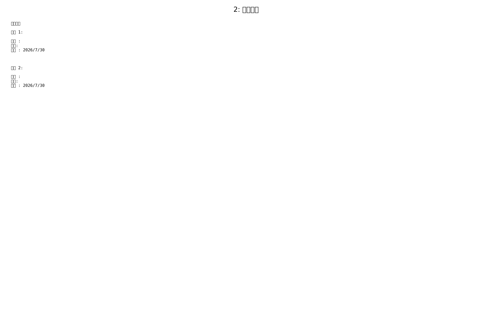

<strong>118 · PartViewer · 零件查看器: sample.igs</strong>　✅ 已捕获

| 字段 | 内容 |
|---|---|
| AnalysisIDM | `PartViewer` |
| ZPL 代码 | `Pvr` |
| GUI 标题 | 零件查看器: sample.igs |
| 状态 | ✅ 已捕获 |
| 截图来源 | OpticStudio 原生 GUI |
| 数据规模 | 曲线 0 · 网格 0 · 散点 0 · 光线 0 · NSC 点列 1 |
| 分析说明 | — |
| 文件 | [结构化数据](analyses/118-partviewer/data.json) · [分析设置](analyses/118-partviewer/settings.cfg) · [采集状态](analyses/118-partviewer/status.json) |

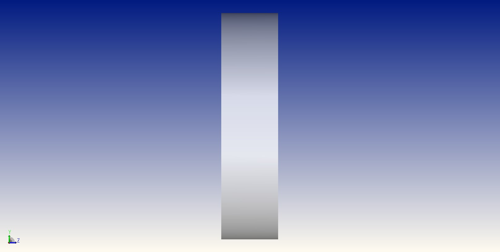

<strong>119 · ReverseRadianceAnalysis · ReverseRadianceAnalysis</strong>　➖ 不适用/未创建

| 字段 | 内容 |
|---|---|
| AnalysisIDM | `ReverseRadianceAnalysis` |
| ZPL 代码 | `Rda` |
| GUI 标题 | ReverseRadianceAnalysis |
| 状态 | ➖ 不适用/未创建 |
| 截图来源 | 无截图 |
| 数据规模 | 无结构化数据 |
| 分析说明 | — |
| 文件 | [采集状态](analyses/119-reverseradianceanalysis/status.json) |

> 未生成截图。原因：New_Analysis returned null

<strong>120 · PathAnalysis · PathAnalysis</strong>　➖ 不适用/未创建

| 字段 | 内容 |
|---|---|
| AnalysisIDM | `PathAnalysis` |
| ZPL 代码 | `Pat` |
| GUI 标题 | PathAnalysis |
| 状态 | ➖ 不适用/未创建 |
| 截图来源 | 无截图 |
| 数据规模 | 无结构化数据 |
| 分析说明 | — |
| 文件 | [采集状态](analyses/120-pathanalysis/status.json) |

> 未生成截图。原因：New_Analysis returned null

<strong>121 · FluxvsWavelength · FluxvsWavelength</strong>　➖ 不适用/未创建

| 字段 | 内容 |
|---|---|
| AnalysisIDM | `FluxvsWavelength` |
| ZPL 代码 | `Fvw` |
| GUI 标题 | FluxvsWavelength |
| 状态 | ➖ 不适用/未创建 |
| 截图来源 | 无截图 |
| 数据规模 | 无结构化数据 |
| 分析说明 | — |
| 文件 | [采集状态](analyses/121-fluxvswavelength/status.json) |

> 未生成截图。原因：New_Analysis returned null

<strong>122 · RoadwayLighting · RoadwayLighting</strong>　➖ 不适用/未创建

| 字段 | 内容 |
|---|---|
| AnalysisIDM | `RoadwayLighting` |
| ZPL 代码 | `—` |
| GUI 标题 | RoadwayLighting |
| 状态 | ➖ 不适用/未创建 |
| 截图来源 | 无截图 |
| 数据规模 | 无结构化数据 |
| 分析说明 | — |
| 文件 | [采集状态](analyses/122-roadwaylighting/status.json) |

> 未生成截图。原因：New_Analysis returned null

<strong>123 · SourceIlluminationMap · SourceIlluminationMap</strong>　➖ 不适用/未创建

| 字段 | 内容 |
|---|---|
| AnalysisIDM | `SourceIlluminationMap` |
| ZPL 代码 | `—` |
| GUI 标题 | SourceIlluminationMap |
| 状态 | ➖ 不适用/未创建 |
| 截图来源 | 无截图 |
| 数据规模 | 无结构化数据 |
| 分析说明 | — |
| 文件 | [采集状态](analyses/123-sourceilluminationmap/status.json) |

> 未生成截图。原因：New_Analysis returned null

<strong>124 · ScatterFunctionViewer · 散射函数查看器</strong>　✅ 已捕获

| 字段 | 内容 |
|---|---|
| AnalysisIDM | `ScatterFunctionViewer` |
| ZPL 代码 | `Sfv` |
| GUI 标题 | 散射函数查看器 |
| 状态 | ✅ 已捕获 |
| 截图来源 | OpticStudio 原生 GUI |
| 数据规模 | 曲线 0 · 网格 0 · 散点 0 · 光线 0 · NSC 点列 1 |
| 分析说明 | — |
| 文件 | [结构化数据](analyses/124-scatterfunctionviewer/data.json) · [分析设置](analyses/124-scatterfunctionviewer/settings.cfg) · [采集状态](analyses/124-scatterfunctionviewer/status.json) |

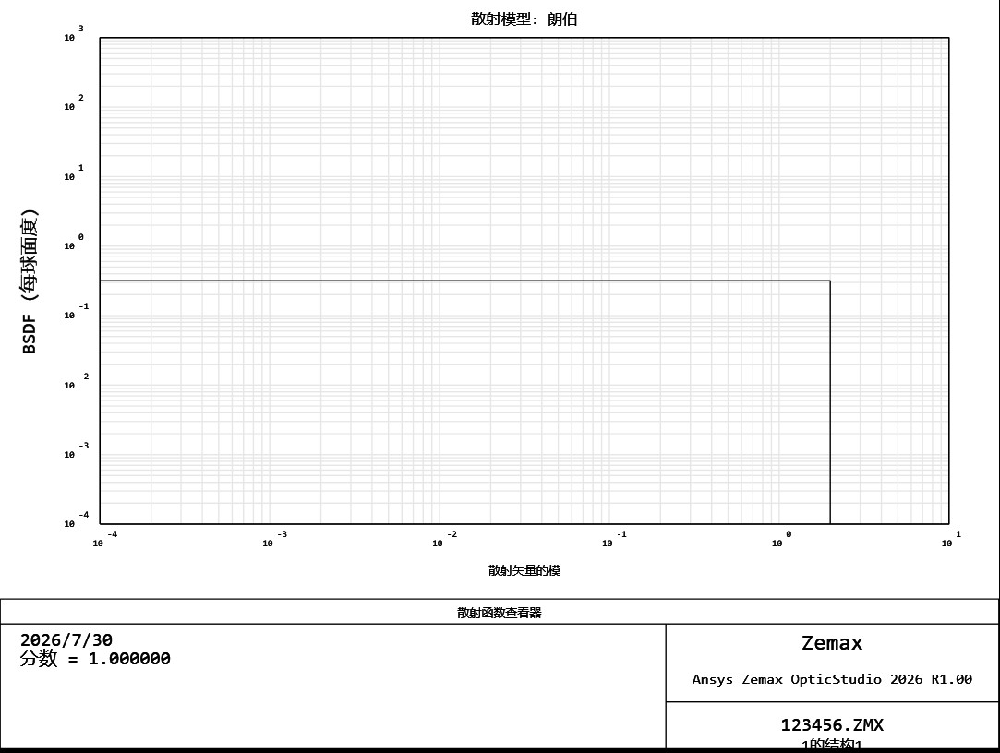

<strong>125 · ScatterPolarPlotSettings · 散射极坐标图</strong>　✅ 已捕获

| 字段 | 内容 |
|---|---|
| AnalysisIDM | `ScatterPolarPlotSettings` |
| ZPL 代码 | `Spv` |
| GUI 标题 | 散射极坐标图 |
| 状态 | ✅ 已捕获 |
| 截图来源 | OpticStudio 原生 GUI |
| 数据规模 | 曲线 0 · 网格 1 · 散点 0 · 光线 0 · NSC 点列 1 |
| 分析说明 | — |
| 文件 | [结构化数据](analyses/125-scatterpolarplotsettings/data.json) · [分析设置](analyses/125-scatterpolarplotsettings/settings.cfg) · [采集状态](analyses/125-scatterpolarplotsettings/status.json) |

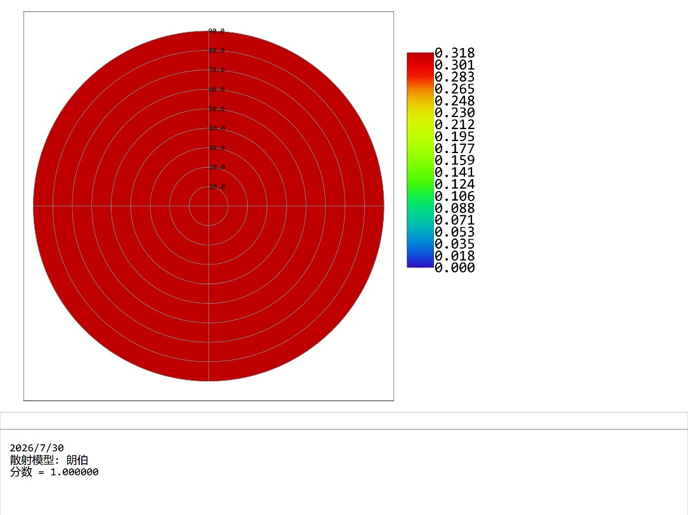

### 分析 126–150

<strong>126 · ZemaxElementDrawing · Zemax元件制图</strong>　✅ 已捕获

| 字段 | 内容 |
|---|---|
| AnalysisIDM | `ZemaxElementDrawing` |
| ZPL 代码 | `Ele` |
| GUI 标题 | Zemax元件制图 |
| 状态 | ✅ 已捕获 |
| 截图来源 | OpticStudio 原生 GUI |
| 数据规模 | 曲线 0 · 网格 0 · 散点 0 · 光线 0 · NSC 点列 1 |
| 分析说明 | — |
| 文件 | [结构化数据](analyses/126-zemaxelementdrawing/data.json) · [分析设置](analyses/126-zemaxelementdrawing/settings.cfg) · [采集状态](analyses/126-zemaxelementdrawing/status.json) |

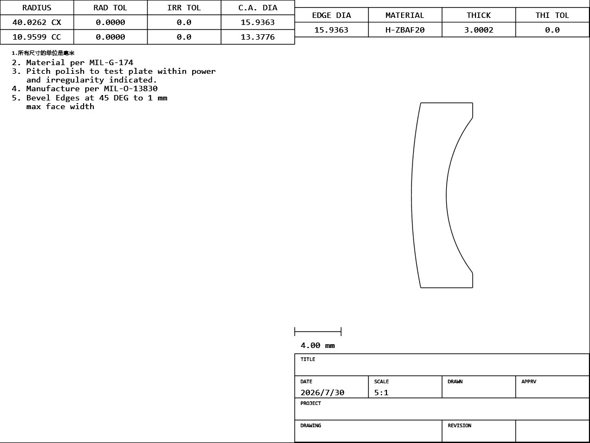

<strong>127 · ShadedModel · 实体模型</strong>　✅ 已捕获

| 字段 | 内容 |
|---|---|
| AnalysisIDM | `ShadedModel` |
| ZPL 代码 | `Lsh` |
| GUI 标题 | 实体模型 |
| 状态 | ✅ 已捕获 |
| 截图来源 | OpticStudio 原生 GUI |
| 数据规模 | 曲线 0 · 网格 0 · 散点 0 · 光线 0 · NSC 点列 1 |
| 分析说明 | — |
| 文件 | [结构化数据](analyses/127-shadedmodel/data.json) · [分析设置](analyses/127-shadedmodel/settings.cfg) · [采集状态](analyses/127-shadedmodel/status.json) |

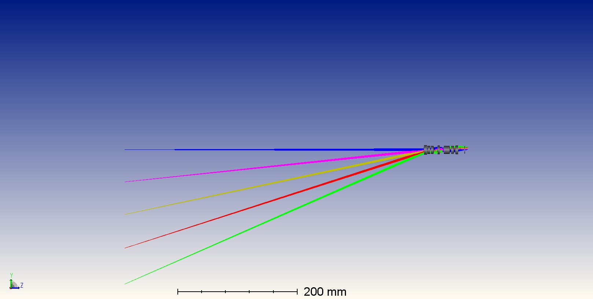

<strong>128 · NSCShadedModel · NSCShadedModel</strong>　➖ 不适用/未创建

| 字段 | 内容 |
|---|---|
| AnalysisIDM | `NSCShadedModel` |
| ZPL 代码 | `LSn` |
| GUI 标题 | NSCShadedModel |
| 状态 | ➖ 不适用/未创建 |
| 截图来源 | 无截图 |
| 数据规模 | 无结构化数据 |
| 分析说明 | — |
| 文件 | [采集状态](analyses/128-nscshadedmodel/status.json) |

> 未生成截图。原因：New_Analysis returned null

<strong>129 · NSC3DLayout · NSC3DLayout</strong>　➖ 不适用/未创建

| 字段 | 内容 |
|---|---|
| AnalysisIDM | `NSC3DLayout` |
| ZPL 代码 | `L3n` |
| GUI 标题 | NSC3DLayout |
| 状态 | ➖ 不适用/未创建 |
| 截图来源 | 无截图 |
| 数据规模 | 无结构化数据 |
| 分析说明 | — |
| 文件 | [采集状态](analyses/129-nsc3dlayout/status.json) |

> 未生成截图。原因：New_Analysis returned null

<strong>130 · NSCObjectViewer · NSCObjectViewer</strong>　➖ 不适用/未创建

| 字段 | 内容 |
|---|---|
| AnalysisIDM | `NSCObjectViewer` |
| ZPL 代码 | `Obv` |
| GUI 标题 | NSCObjectViewer |
| 状态 | ➖ 不适用/未创建 |
| 截图来源 | 无截图 |
| 数据规模 | 无结构化数据 |
| 分析说明 | — |
| 文件 | [采集状态](analyses/130-nscobjectviewer/status.json) |

> 未生成截图。原因：New_Analysis returned null

<strong>131 · RayDatabaseViewer · RayDatabaseViewer</strong>　➖ 不适用/未创建

| 字段 | 内容 |
|---|---|
| AnalysisIDM | `RayDatabaseViewer` |
| ZPL 代码 | `Rdb` |
| GUI 标题 | RayDatabaseViewer |
| 状态 | ➖ 不适用/未创建 |
| 截图来源 | 无截图 |
| 数据规模 | 无结构化数据 |
| 分析说明 | — |
| 文件 | [采集状态](analyses/131-raydatabaseviewer/status.json) |

> 未生成截图。原因：New_Analysis returned null

<strong>132 · ISOElementDrawing · ISO元件制图</strong>　✅ 已捕获

| 字段 | 内容 |
|---|---|
| AnalysisIDM | `ISOElementDrawing` |
| ZPL 代码 | `ISO` |
| GUI 标题 | ISO元件制图 |
| 状态 | ✅ 已捕获 |
| 截图来源 | OpticStudio 原生 GUI |
| 数据规模 | 曲线 1 · 网格 0 · 散点 0 · 光线 0 · NSC 点列 1 |
| 分析说明 | — |
| 文件 | [结构化数据](analyses/132-isoelementdrawing/data.json) · [分析设置](analyses/132-isoelementdrawing/settings.cfg) · [采集状态](analyses/132-isoelementdrawing/status.json) |

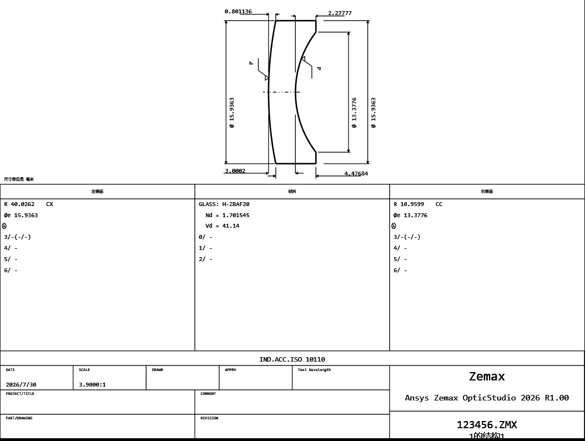

<strong>133 · SystemData · 系统数据</strong>　✅ 已捕获

| 字段 | 内容 |
|---|---|
| AnalysisIDM | `SystemData` |
| ZPL 代码 | `Sys` |
| GUI 标题 | 系统数据 |
| 状态 | ✅ 已捕获 |
| 截图来源 | ZOS-API 数据回退渲染 |
| 数据规模 | 曲线 0 · 网格 0 · 散点 0 · 光线 0 · NSC 点列 1 |
| 分析说明 | — |
| 文件 | [结构化数据](analyses/133-systemdata/data.json) · [文本结果](analyses/133-systemdata/data.txt) · [分析设置](analyses/133-systemdata/settings.cfg) · [采集状态](analyses/133-systemdata/status.json) |

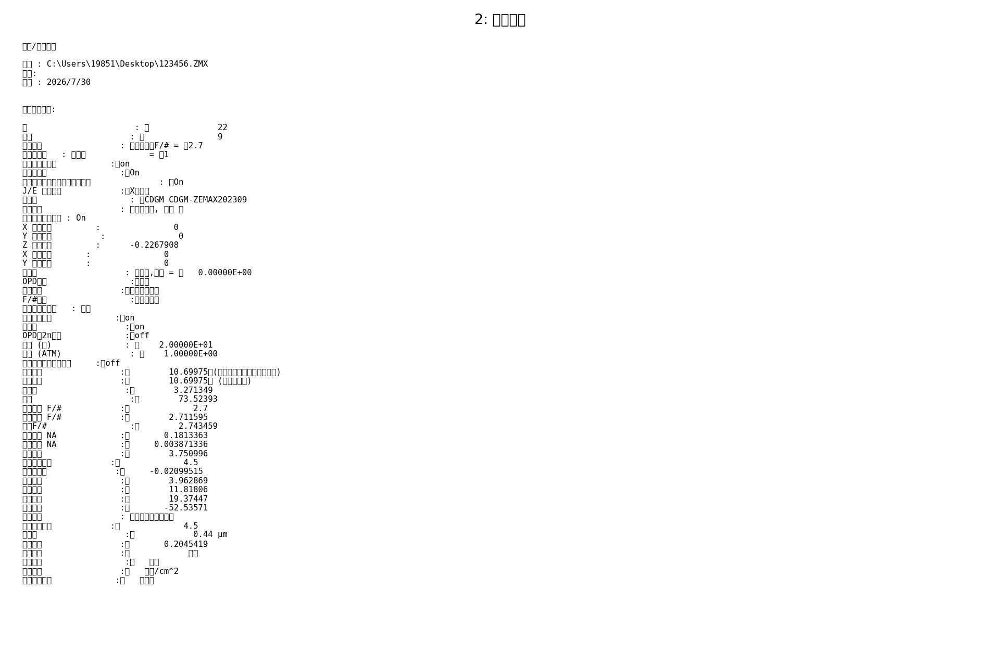

<strong>134 · TestPlateList · 套样板列表</strong>　✅ 已捕获

| 字段 | 内容 |
|---|---|
| AnalysisIDM | `TestPlateList` |
| ZPL 代码 | `Tpl` |
| GUI 标题 | 套样板列表 |
| 状态 | ✅ 已捕获 |
| 截图来源 | ZOS-API 数据回退渲染 |
| 数据规模 | 曲线 0 · 网格 0 · 散点 0 · 光线 0 · NSC 点列 1 |
| 分析说明 | — |
| 文件 | [结构化数据](analyses/134-testplatelist/data.json) · [文本结果](analyses/134-testplatelist/data.txt) · [分析设置](analyses/134-testplatelist/settings.cfg) · [采集状态](analyses/134-testplatelist/status.json) |

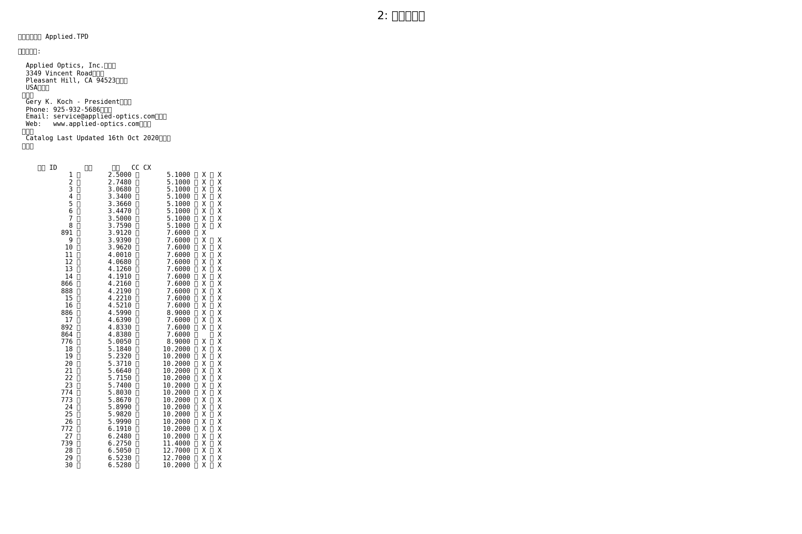

<strong>135 · SourceColorChart1931 · CIE 1931 色品图</strong>　✅ 已捕获

| 字段 | 内容 |
|---|---|
| AnalysisIDM | `SourceColorChart1931` |
| ZPL 代码 | `C31` |
| GUI 标题 | CIE 1931 色品图 |
| 状态 | ✅ 已捕获 |
| 截图来源 | OpticStudio 原生 GUI |
| 数据规模 | 曲线 0 · 网格 0 · 散点 0 · 光线 0 · NSC 点列 1 |
| 分析说明 | — |
| 文件 | [结构化数据](analyses/135-sourcecolorchart1931/data.json) · [分析设置](analyses/135-sourcecolorchart1931/settings.cfg) · [采集状态](analyses/135-sourcecolorchart1931/status.json) |

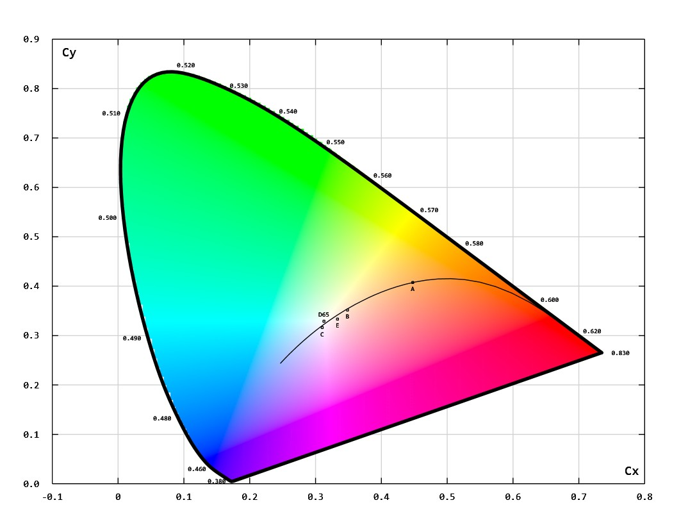

<strong>136 · SourceColorChart1976 · CIE 1976 色品图</strong>　✅ 已捕获

| 字段 | 内容 |
|---|---|
| AnalysisIDM | `SourceColorChart1976` |
| ZPL 代码 | `C76` |
| GUI 标题 | CIE 1976 色品图 |
| 状态 | ✅ 已捕获 |
| 截图来源 | OpticStudio 原生 GUI |
| 数据规模 | 曲线 0 · 网格 0 · 散点 0 · 光线 0 · NSC 点列 1 |
| 分析说明 | — |
| 文件 | [结构化数据](analyses/136-sourcecolorchart1976/data.json) · [分析设置](analyses/136-sourcecolorchart1976/settings.cfg) · [采集状态](analyses/136-sourcecolorchart1976/status.json) |

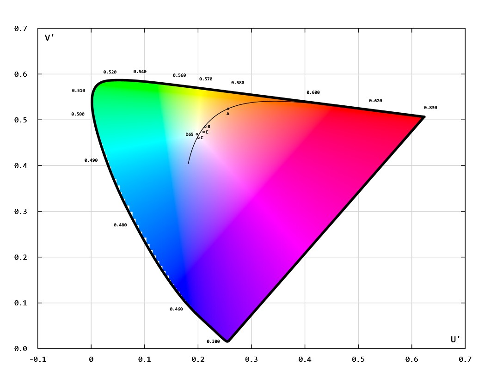

<strong>137 · PrescriptionGraphic · 系统概要图</strong>　✅ 已捕获

| 字段 | 内容 |
|---|---|
| AnalysisIDM | `PrescriptionGraphic` |
| ZPL 代码 | `—` |
| GUI 标题 | 系统概要图 |
| 状态 | ✅ 已捕获 |
| 截图来源 | ZOS-API 数据回退渲染 |
| 数据规模 | 曲线 0 · 网格 0 · 散点 0 · 光线 0 · NSC 点列 1 |
| 分析说明 | — |
| 文件 | [结构化数据](analyses/137-prescriptiongraphic/data.json) · [分析设置](analyses/137-prescriptiongraphic/settings.cfg) · [采集状态](analyses/137-prescriptiongraphic/status.json) |

<strong>138 · CriticalRayTracer · 特定光线比对</strong>　✅ 已捕获

| 字段 | 内容 |
|---|---|
| AnalysisIDM | `CriticalRayTracer` |
| ZPL 代码 | `—` |
| GUI 标题 | 特定光线比对 |
| 状态 | ✅ 已捕获 |
| 截图来源 | ZOS-API 数据回退渲染 |
| 数据规模 | 曲线 1 · 网格 0 · 散点 0 · 光线 0 · NSC 点列 1 |
| 分析说明 | — |
| 文件 | [结构化数据](analyses/138-criticalraytracer/data.json) · [文本结果](analyses/138-criticalraytracer/data.txt) · [分析设置](analyses/138-criticalraytracer/settings.cfg) · [采集状态](analyses/138-criticalraytracer/status.json) |

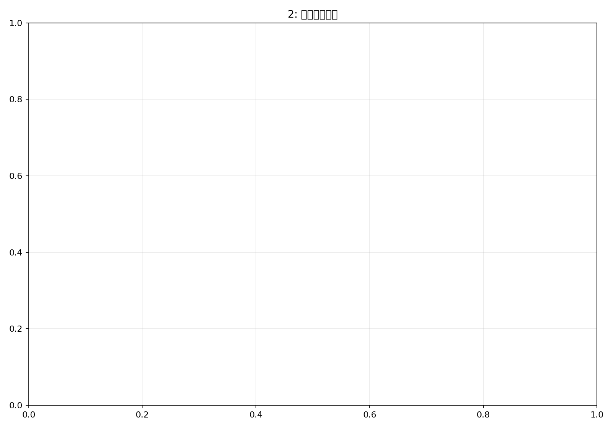

<strong>139 · ContrastLoss · 对比度损失图</strong>　✅ 已捕获

| 字段 | 内容 |
|---|---|
| AnalysisIDM | `ContrastLoss` |
| ZPL 代码 | `—` |
| GUI 标题 | 对比度损失图 |
| 状态 | ✅ 已捕获 |
| 截图来源 | ZOS-API 数据回退渲染 |
| 数据规模 | 曲线 0 · 网格 4 · 散点 0 · 光线 0 · NSC 点列 1 |
| 分析说明 | 对比度损失数据列表 |
| 文件 | [结构化数据](analyses/139-contrastloss/data.json) · [文本结果](analyses/139-contrastloss/data.txt) · [分析设置](analyses/139-contrastloss/settings.cfg) · [采集状态](analyses/139-contrastloss/status.json) |

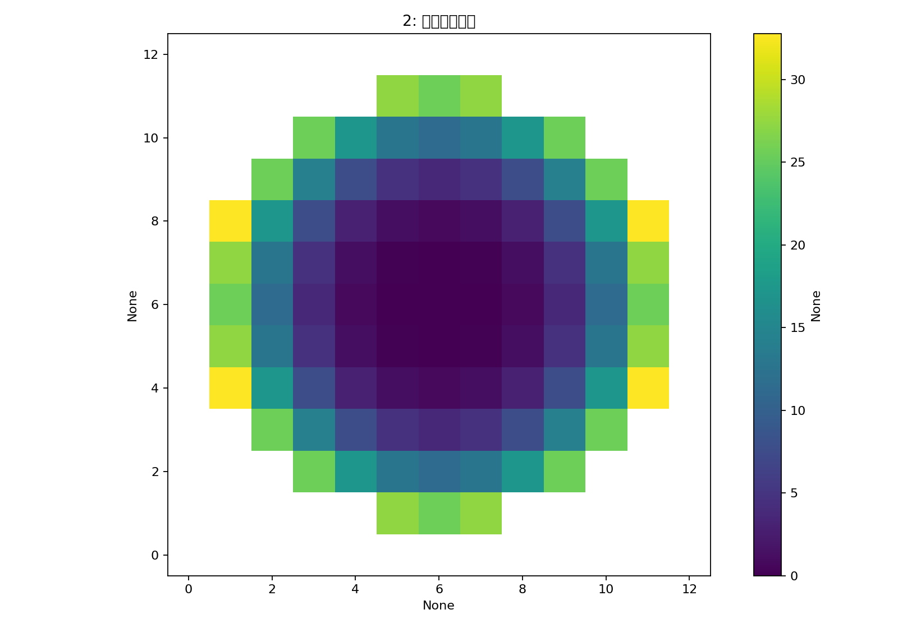

<strong>140 · CoatingListing · 膜层/材料 表</strong>　✅ 已捕获

| 字段 | 内容 |
|---|---|
| AnalysisIDM | `CoatingListing` |
| ZPL 代码 | `Cls` |
| GUI 标题 | 膜层/材料 表 |
| 状态 | ✅ 已捕获 |
| 截图来源 | ZOS-API 数据回退渲染 |
| 数据规模 | 曲线 0 · 网格 0 · 散点 0 · 光线 0 · NSC 点列 1 |
| 分析说明 | — |
| 文件 | [结构化数据](analyses/140-coatinglisting/data.json) · [文本结果](analyses/140-coatinglisting/data.txt) · [分析设置](analyses/140-coatinglisting/settings.cfg) · [采集状态](analyses/140-coatinglisting/status.json) |

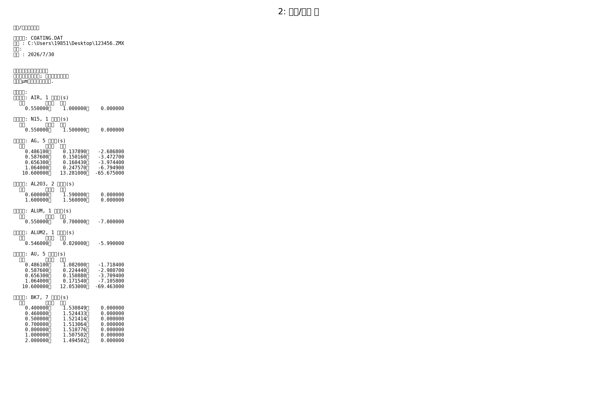

<strong>141 · FullFieldAberration · 全视场像差</strong>　✅ 已捕获

| 字段 | 内容 |
|---|---|
| AnalysisIDM | `FullFieldAberration` |
| ZPL 代码 | `Ffa` |
| GUI 标题 | 全视场像差 |
| 状态 | ✅ 已捕获 |
| 截图来源 | OpticStudio 原生 GUI |
| 数据规模 | 曲线 0 · 网格 1 · 散点 0 · 光线 0 · NSC 点列 1 |
| 分析说明 | 全视场像差图的列表 |
| 文件 | [结构化数据](analyses/141-fullfieldaberration/data.json) · [文本结果](analyses/141-fullfieldaberration/data.txt) · [分析设置](analyses/141-fullfieldaberration/settings.cfg) · [采集状态](analyses/141-fullfieldaberration/status.json) |

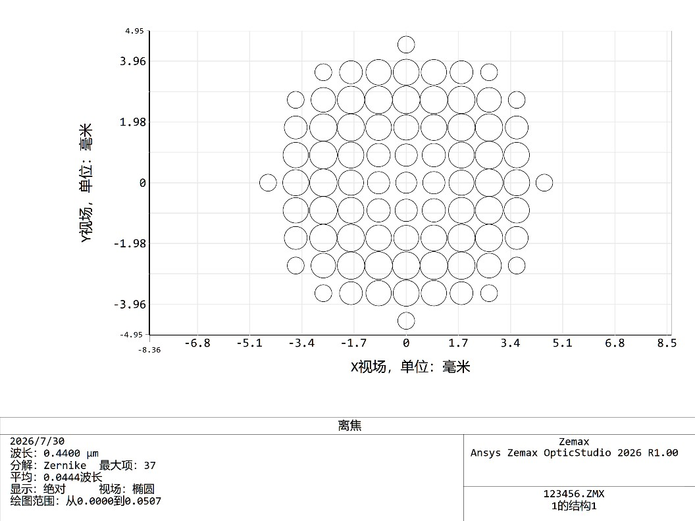

<strong>142 · SurfaceSlope · 表面斜率</strong>　✅ 已捕获

| 字段 | 内容 |
|---|---|
| AnalysisIDM | `SurfaceSlope` |
| ZPL 代码 | `—` |
| GUI 标题 | 表面斜率 |
| 状态 | ✅ 已捕获 |
| 截图来源 | ZOS-API 数据回退渲染 |
| 数据规模 | 曲线 0 · 网格 1 · 散点 0 · 光线 0 · NSC 点列 1 |
| 分析说明 | 表面斜率图数据列表 |
| 文件 | [结构化数据](analyses/142-surfaceslope/data.json) · [文本结果](analyses/142-surfaceslope/data.txt) · [分析设置](analyses/142-surfaceslope/settings.cfg) · [采集状态](analyses/142-surfaceslope/status.json) |

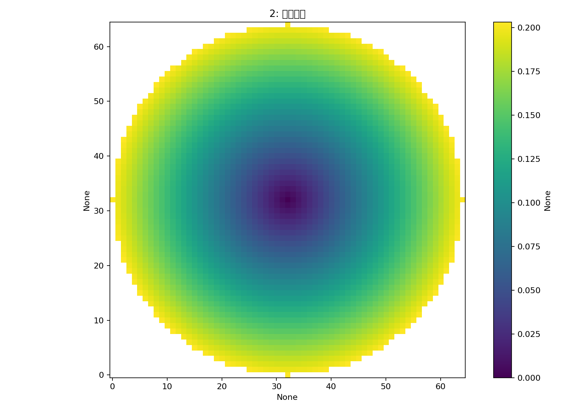

<strong>143 · SurfaceSlopeCross · 表面斜率截面</strong>　✅ 已捕获

| 字段 | 内容 |
|---|---|
| AnalysisIDM | `SurfaceSlopeCross` |
| ZPL 代码 | `—` |
| GUI 标题 | 表面斜率截面 |
| 状态 | ✅ 已捕获 |
| 截图来源 | ZOS-API 数据回退渲染 |
| 数据规模 | 曲线 1 · 网格 0 · 散点 0 · 光线 0 · NSC 点列 1 |
| 分析说明 | 表面斜率图数据列表 |
| 文件 | [结构化数据](analyses/143-surfaceslopecross/data.json) · [文本结果](analyses/143-surfaceslopecross/data.txt) · [分析设置](analyses/143-surfaceslopecross/settings.cfg) · [采集状态](analyses/143-surfaceslopecross/status.json) |

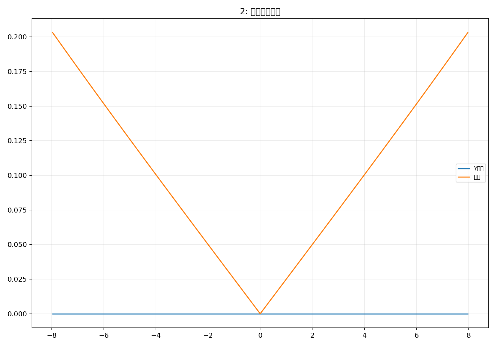

<strong>144 · QuickYield · 快速良率</strong>　✅ 已捕获

| 字段 | 内容 |
|---|---|
| AnalysisIDM | `QuickYield` |
| ZPL 代码 | `—` |
| GUI 标题 | 快速良率 |
| 状态 | ✅ 已捕获 |
| 截图来源 | ZOS-API 数据回退渲染 |
| 数据规模 | 曲线 1 · 网格 0 · 散点 0 · 光线 0 · NSC 点列 1 |
| 分析说明 | — |
| 文件 | [结构化数据](analyses/144-quickyield/data.json) · [文本结果](analyses/144-quickyield/data.txt) · [分析设置](analyses/144-quickyield/settings.cfg) · [采集状态](analyses/144-quickyield/status.json) |

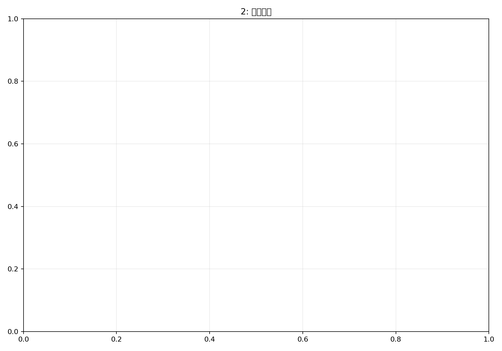

<strong>145 · SystemCheck · 系统检查</strong>　✅ 已捕获

| 字段 | 内容 |
|---|---|
| AnalysisIDM | `SystemCheck` |
| ZPL 代码 | `—` |
| GUI 标题 | 系统检查 |
| 状态 | ✅ 已捕获 |
| 截图来源 | ZOS-API 数据回退渲染 |
| 数据规模 | 曲线 0 · 网格 0 · 散点 0 · 光线 0 · NSC 点列 1 |
| 分析说明 | — |
| 文件 | [结构化数据](analyses/145-systemcheck/data.json) · [文本结果](analyses/145-systemcheck/data.txt) · [分析设置](analyses/145-systemcheck/settings.cfg) · [采集状态](analyses/145-systemcheck/status.json) |

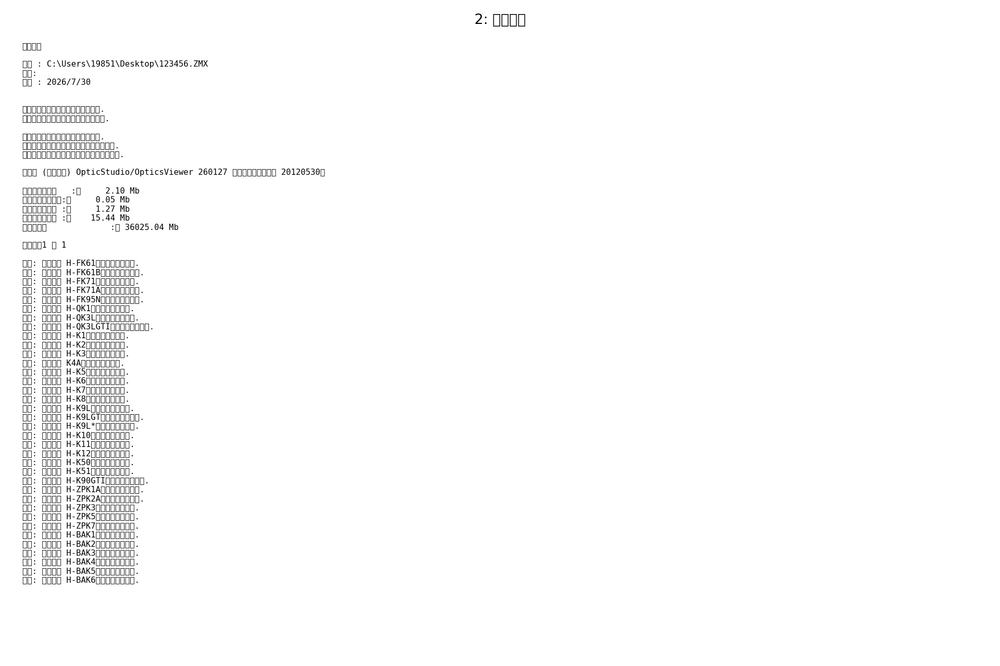

<strong>146 · ToleranceYield · 良率</strong>　✅ 已捕获

| 字段 | 内容 |
|---|---|
| AnalysisIDM | `ToleranceYield` |
| ZPL 代码 | `—` |
| GUI 标题 | 良率 |
| 状态 | ✅ 已捕获 |
| 截图来源 | ZOS-API 数据回退渲染 |
| 数据规模 | 曲线 1 · 网格 0 · 散点 0 · 光线 0 · NSC 点列 1 |
| 分析说明 | — |
| 文件 | [结构化数据](analyses/146-toleranceyield/data.json) · [文本结果](analyses/146-toleranceyield/data.txt) · [分析设置](analyses/146-toleranceyield/settings.cfg) · [采集状态](analyses/146-toleranceyield/status.json) |

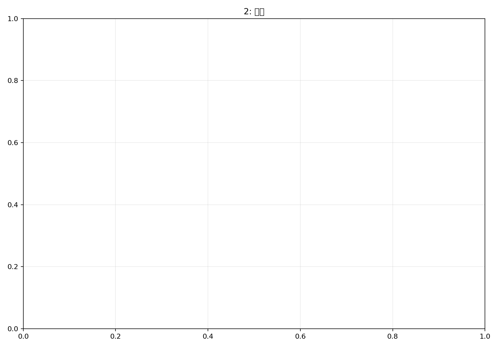

<strong>147 · ToleranceHistogram · 直方图</strong>　✅ 已捕获

| 字段 | 内容 |
|---|---|
| AnalysisIDM | `ToleranceHistogram` |
| ZPL 代码 | `—` |
| GUI 标题 | 直方图 |
| 状态 | ✅ 已捕获 |
| 截图来源 | ZOS-API 数据回退渲染 |
| 数据规模 | 曲线 1 · 网格 0 · 散点 0 · 光线 0 · NSC 点列 1 |
| 分析说明 | — |
| 文件 | [结构化数据](analyses/147-tolerancehistogram/data.json) · [文本结果](analyses/147-tolerancehistogram/data.txt) · [分析设置](analyses/147-tolerancehistogram/settings.cfg) · [采集状态](analyses/147-tolerancehistogram/status.json) |

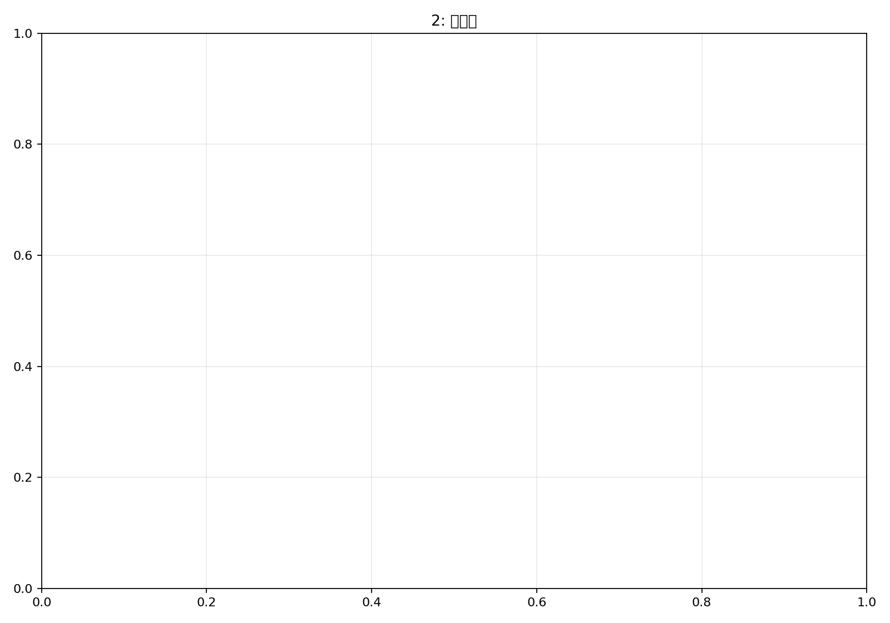

<strong>148 · DiffEfficiency2D · 衍射效率</strong>　✅ 已捕获

| 字段 | 内容 |
|---|---|
| AnalysisIDM | `DiffEfficiency2D` |
| ZPL 代码 | `—` |
| GUI 标题 | 衍射效率 |
| 状态 | ✅ 已捕获 |
| 截图来源 | ZOS-API 数据回退渲染 |
| 数据规模 | 曲线 0 · 网格 0 · 散点 0 · 光线 0 · NSC 点列 1 |
| 分析说明 | — |
| 文件 | [结构化数据](analyses/148-diffefficiency2d/data.json) · [文本结果](analyses/148-diffefficiency2d/data.txt) · [分析设置](analyses/148-diffefficiency2d/settings.cfg) · [采集状态](analyses/148-diffefficiency2d/status.json) |

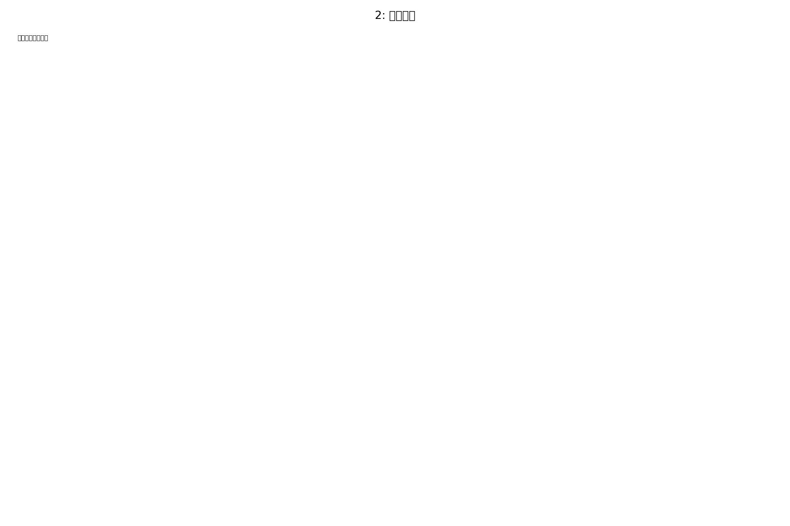

<strong>149 · DiffEfficiencyAngular · 衍射效率 vs 角度</strong>　✅ 已捕获

| 字段 | 内容 |
|---|---|
| AnalysisIDM | `DiffEfficiencyAngular` |
| ZPL 代码 | `—` |
| GUI 标题 | 衍射效率 vs 角度 |
| 状态 | ✅ 已捕获 |
| 截图来源 | ZOS-API 数据回退渲染 |
| 数据规模 | 曲线 1 · 网格 0 · 散点 0 · 光线 0 · NSC 点列 1 |
| 分析说明 | — |
| 文件 | [结构化数据](analyses/149-diffefficiencyangular/data.json) · [文本结果](analyses/149-diffefficiencyangular/data.txt) · [分析设置](analyses/149-diffefficiencyangular/settings.cfg) · [采集状态](analyses/149-diffefficiencyangular/status.json) |

<strong>150 · DiffEfficiencyChromatic · 衍射效率 vs 波长</strong>　✅ 已捕获

| 字段 | 内容 |
|---|---|
| AnalysisIDM | `DiffEfficiencyChromatic` |
| ZPL 代码 | `—` |
| GUI 标题 | 衍射效率 vs 波长 |
| 状态 | ✅ 已捕获 |
| 截图来源 | ZOS-API 数据回退渲染 |
| 数据规模 | 曲线 1 · 网格 0 · 散点 0 · 光线 0 · NSC 点列 1 |
| 分析说明 | — |
| 文件 | [结构化数据](analyses/150-diffefficiencychromatic/data.json) · [文本结果](analyses/150-diffefficiencychromatic/data.txt) · [分析设置](analyses/150-diffefficiencychromatic/settings.cfg) · [采集状态](analyses/150-diffefficiencychromatic/status.json) |

### 分析 151–165

<strong>151 · NSCSurfaceSag · NSCSurfaceSag</strong>　➖ 不适用/未创建

| 字段 | 内容 |
|---|---|
| AnalysisIDM | `NSCSurfaceSag` |
| ZPL 代码 | `—` |
| GUI 标题 | NSCSurfaceSag |
| 状态 | ➖ 不适用/未创建 |
| 截图来源 | 无截图 |
| 数据规模 | 无结构化数据 |
| 分析说明 | — |
| 文件 | [采集状态](analyses/151-nscsurfacesag/status.json) |

> 未生成截图。原因：New_Analysis returned null

<strong>152 · NSCSingleRayTrace · NSCSingleRayTrace</strong>　➖ 不适用/未创建

| 字段 | 内容 |
|---|---|
| AnalysisIDM | `NSCSingleRayTrace` |
| ZPL 代码 | `—` |
| GUI 标题 | NSCSingleRayTrace |
| 状态 | ➖ 不适用/未创建 |
| 截图来源 | 无截图 |
| 数据规模 | 无结构化数据 |
| 分析说明 | — |
| 文件 | [采集状态](analyses/152-nscsingleraytrace/status.json) |

> 未生成截图。原因：New_Analysis returned null

<strong>153 · NSCGeometricMtf · NSCGeometricMtf</strong>　➖ 不适用/未创建

| 字段 | 内容 |
|---|---|
| AnalysisIDM | `NSCGeometricMtf` |
| ZPL 代码 | `—` |
| GUI 标题 | NSCGeometricMtf |
| 状态 | ➖ 不适用/未创建 |
| 截图来源 | 无截图 |
| 数据规模 | 无结构化数据 |
| 分析说明 | — |
| 文件 | [采集状态](analyses/153-nscgeometricmtf/status.json) |

> 未生成截图。原因：New_Analysis returned null

<strong>154 · SurfacePhaseSlope · 相位斜率</strong>　✅ 已捕获

| 字段 | 内容 |
|---|---|
| AnalysisIDM | `SurfacePhaseSlope` |
| ZPL 代码 | `—` |
| GUI 标题 | 相位斜率 |
| 状态 | ✅ 已捕获 |
| 截图来源 | ZOS-API 数据回退渲染 |
| 数据规模 | 曲线 0 · 网格 1 · 散点 0 · 光线 0 · NSC 点列 1 |
| 分析说明 | Listing of Phase Slope Map Data |
| 文件 | [结构化数据](analyses/154-surfacephaseslope/data.json) · [文本结果](analyses/154-surfacephaseslope/data.txt) · [分析设置](analyses/154-surfacephaseslope/settings.cfg) · [采集状态](analyses/154-surfacephaseslope/status.json) |

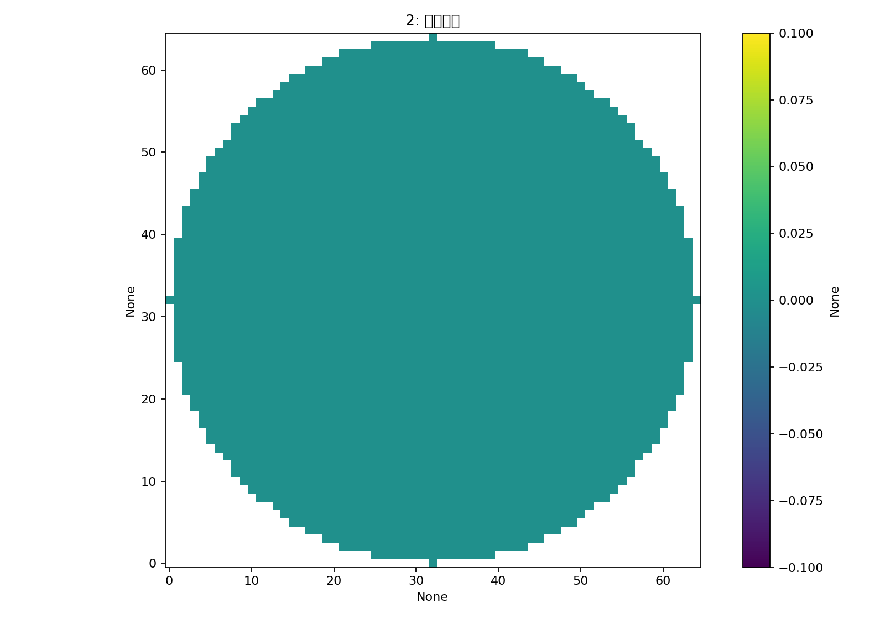

<strong>155 · SurfacePhaseSlopeCross · 相位斜率截面图</strong>　✅ 已捕获

| 字段 | 内容 |
|---|---|
| AnalysisIDM | `SurfacePhaseSlopeCross` |
| ZPL 代码 | `—` |
| GUI 标题 | 相位斜率截面图 |
| 状态 | ✅ 已捕获 |
| 截图来源 | ZOS-API 数据回退渲染 |
| 数据规模 | 曲线 1 · 网格 0 · 散点 0 · 光线 0 · NSC 点列 1 |
| 分析说明 | 相位斜率截面图列表 |
| 文件 | [结构化数据](analyses/155-surfacephaseslopecross/data.json) · [文本结果](analyses/155-surfacephaseslopecross/data.txt) · [分析设置](analyses/155-surfacephaseslopecross/settings.cfg) · [采集状态](analyses/155-surfacephaseslopecross/status.json) |

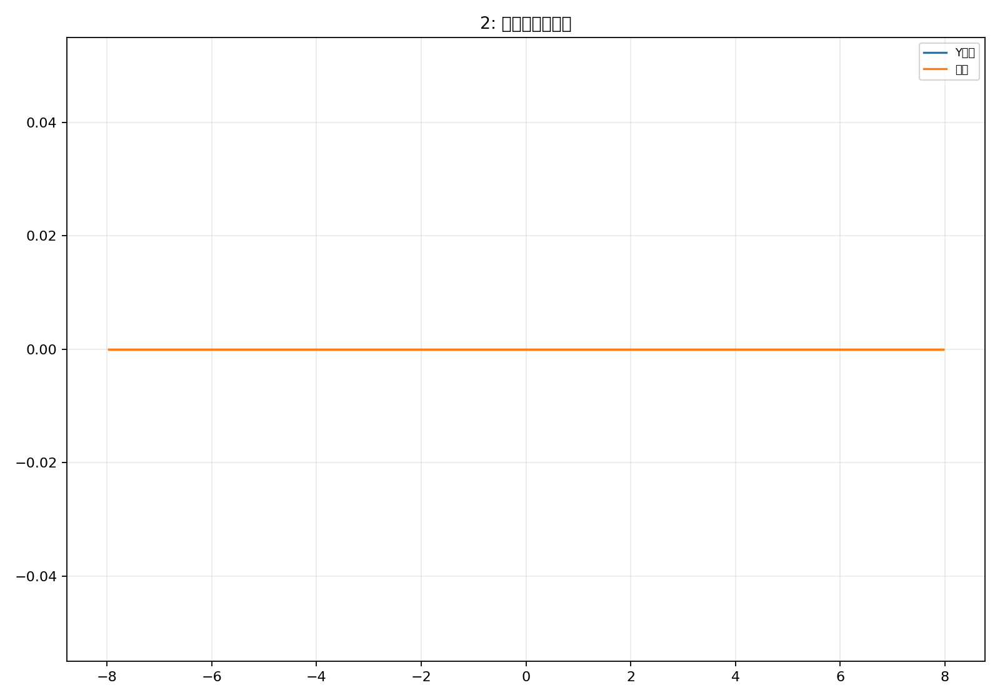

<strong>156 · STARAlignCheck · 对准检查</strong>　✅ 已捕获

| 字段 | 内容 |
|---|---|
| AnalysisIDM | `STARAlignCheck` |
| ZPL 代码 | `—` |
| GUI 标题 | 对准检查 |
| 状态 | ✅ 已捕获 |
| 截图来源 | ZOS-API 数据回退渲染 |
| 数据规模 | 曲线 0 · 网格 0 · 散点 0 · 光线 0 · NSC 点列 1 |
| 分析说明 | — |
| 文件 | [结构化数据](analyses/156-staraligncheck/data.json) · [分析设置](analyses/156-staraligncheck/settings.cfg) · [采集状态](analyses/156-staraligncheck/status.json) |

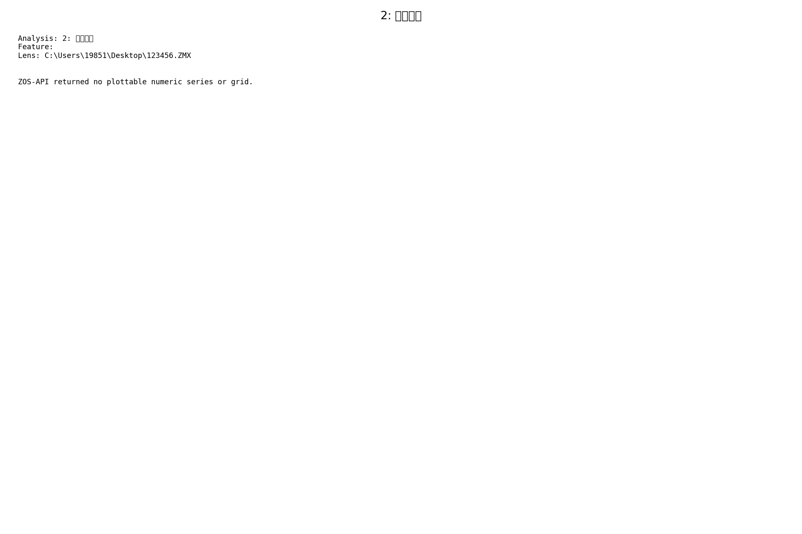

<strong>157 · STARSysViewer · 系统查看器</strong>　✅ 已捕获

| 字段 | 内容 |
|---|---|
| AnalysisIDM | `STARSysViewer` |
| ZPL 代码 | `—` |
| GUI 标题 | 系统查看器 |
| 状态 | ✅ 已捕获 |
| 截图来源 | ZOS-API 数据回退渲染 |
| 数据规模 | 曲线 0 · 网格 0 · 散点 0 · 光线 0 · NSC 点列 1 |
| 分析说明 | — |
| 文件 | [结构化数据](analyses/157-starsysviewer/data.json) · [分析设置](analyses/157-starsysviewer/settings.cfg) · [采集状态](analyses/157-starsysviewer/status.json) |

<strong>158 · STAR2DDefPlot · 2D 形变图</strong>　✅ 已捕获

| 字段 | 内容 |
|---|---|
| AnalysisIDM | `STAR2DDefPlot` |
| ZPL 代码 | `—` |
| GUI 标题 | 2D 形变图 |
| 状态 | ✅ 已捕获 |
| 截图来源 | ZOS-API 数据回退渲染 |
| 数据规模 | 曲线 0 · 网格 0 · 散点 0 · 光线 0 · NSC 点列 1 |
| 分析说明 | — |
| 文件 | [结构化数据](analyses/158-star2ddefplot/data.json) · [分析设置](analyses/158-star2ddefplot/settings.cfg) · [采集状态](analyses/158-star2ddefplot/status.json) |

<strong>159 · STARPerfChange · 性能分析</strong>　✅ 已捕获

| 字段 | 内容 |
|---|---|
| AnalysisIDM | `STARPerfChange` |
| ZPL 代码 | `—` |
| GUI 标题 | 性能分析 |
| 状态 | ✅ 已捕获 |
| 截图来源 | ZOS-API 数据回退渲染 |
| 数据规模 | 曲线 0 · 网格 0 · 散点 0 · 光线 0 · NSC 点列 1 |
| 分析说明 | — |
| 文件 | [结构化数据](analyses/159-starperfchange/data.json) · [分析设置](analyses/159-starperfchange/settings.cfg) · [采集状态](analyses/159-starperfchange/status.json) |

<strong>160 · STARIndexVsTemp · 热分析折射率绘图</strong>　✅ 已捕获

| 字段 | 内容 |
|---|---|
| AnalysisIDM | `STARIndexVsTemp` |
| ZPL 代码 | `—` |
| GUI 标题 | 热分析折射率绘图 |
| 状态 | ✅ 已捕获 |
| 截图来源 | ZOS-API 数据回退渲染 |
| 数据规模 | 曲线 0 · 网格 0 · 散点 0 · 光线 0 · NSC 点列 1 |
| 分析说明 | — |
| 文件 | [结构化数据](analyses/160-starindexvstemp/data.json) · [分析设置](analyses/160-starindexvstemp/settings.cfg) · [采集状态](analyses/160-starindexvstemp/status.json) |

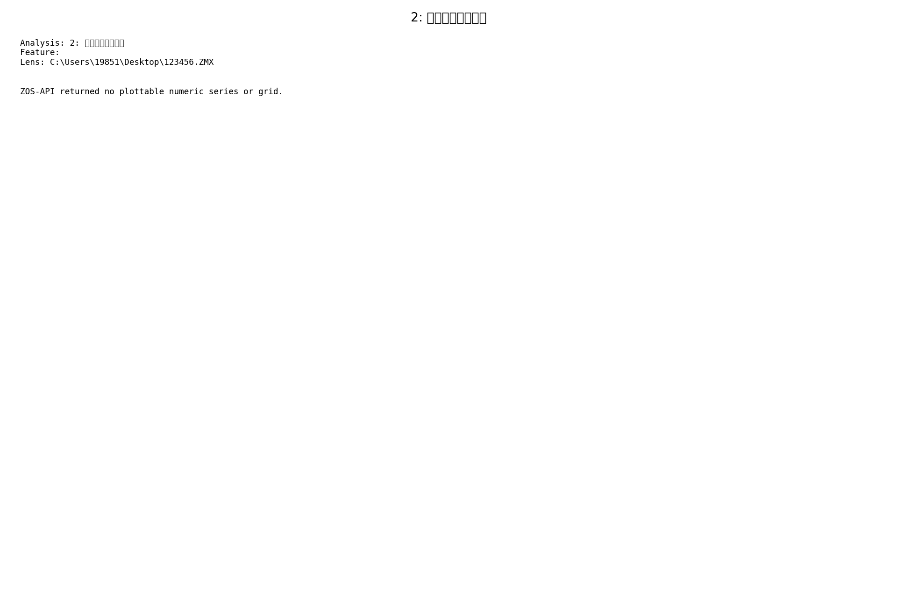

<strong>161 · STARInspectFEA · 多物理场数据查看器</strong>　✅ 已捕获

| 字段 | 内容 |
|---|---|
| AnalysisIDM | `STARInspectFEA` |
| ZPL 代码 | `—` |
| GUI 标题 | 多物理场数据查看器 |
| 状态 | ✅ 已捕获 |
| 截图来源 | ZOS-API 数据回退渲染 |
| 数据规模 | 曲线 0 · 网格 0 · 散点 0 · 光线 0 · NSC 点列 1 |
| 分析说明 | — |
| 文件 | [结构化数据](analyses/161-starinspectfea/data.json) · [分析设置](analyses/161-starinspectfea/settings.cfg) · [采集状态](analyses/161-starinspectfea/status.json) |

<strong>162 · UserDefinedCOM · UserDefinedCOM</strong>　➖ 不适用/未创建

| 字段 | 内容 |
|---|---|
| AnalysisIDM | `UserDefinedCOM` |
| ZPL 代码 | `—` |
| GUI 标题 | UserDefinedCOM |
| 状态 | ➖ 不适用/未创建 |
| 截图来源 | 无截图 |
| 数据规模 | 无结构化数据 |
| 分析说明 | — |
| 文件 | [采集状态](analyses/162-userdefinedcom/status.json) |

> 未生成截图。原因：New_Analysis returned null

<strong>163 · NEST · NEST</strong>　➖ 不适用/未创建

| 字段 | 内容 |
|---|---|
| AnalysisIDM | `NEST` |
| ZPL 代码 | `—` |
| GUI 标题 | NEST |
| 状态 | ➖ 不适用/未创建 |
| 截图来源 | 无截图 |
| 数据规模 | 无结构化数据 |
| 分析说明 | — |
| 文件 | [采集状态](analyses/163-nest/status.json) |

> 未生成截图。原因：值不在预期的范围内。 Server stack trace: 在 ZemaxUI.ZOSAPI.Analysis.A_Command.FromAnalysisIDM(AnalysisIDM id) 在 ZemaxUI.ZOSAPI.Analysis.A_Command..ctor(ZemaxAnalyses za, AnalysisIDM theIDM) 在 ZemaxUI.ZOSAPI.Analysis.ZemaxAnalyses.New_Analysis(AnalysisIDM analysisType) 在 System.Runtime.Remoting.Messaging.StackBuilderSink._PrivateProcessMessage(IntPtr md, Object[] args, Object server, Object[]& outArgs) 在 System.Runtime.Remoting.Messaging.StackBuilderSink.SyncProcessMessage(IMessage msg) Exception rethrow…

<strong>164 · NSCSpotStandardNative · NSCSpotStandardNative</strong>　➖ 不适用/未创建

| 字段 | 内容 |
|---|---|
| AnalysisIDM | `NSCSpotStandardNative` |
| ZPL 代码 | `—` |
| GUI 标题 | NSCSpotStandardNative |
| 状态 | ➖ 不适用/未创建 |
| 截图来源 | 无截图 |
| 数据规模 | 无结构化数据 |
| 分析说明 | — |
| 文件 | [采集状态](analyses/164-nscspotstandardnative/status.json) |

> 未生成截图。原因：New_Analysis returned null

<strong>165 · XXXTemplateXXX · XXXTemplateXXX</strong>　➖ 不适用/未创建

| 字段 | 内容 |
|---|---|
| AnalysisIDM | `XXXTemplateXXX` |
| ZPL 代码 | `—` |
| GUI 标题 | XXXTemplateXXX |
| 状态 | ➖ 不适用/未创建 |
| 截图来源 | 无截图 |
| 数据规模 | 无结构化数据 |
| 分析说明 | — |
| 文件 | [采集状态](analyses/165-xxxtemplatexxx/status.json) |

> 未生成截图。原因：New_Analysis returned null

## 基准完整性声明

- 清单条目：165/165。
- 已捕获截图：148/148。
- 原生 GUI 截图：106；ZOS-API 回退渲染：42。
- 不适用/未创建条目：17。
- 所有相对链接均以本报告所在目录为根目录。
