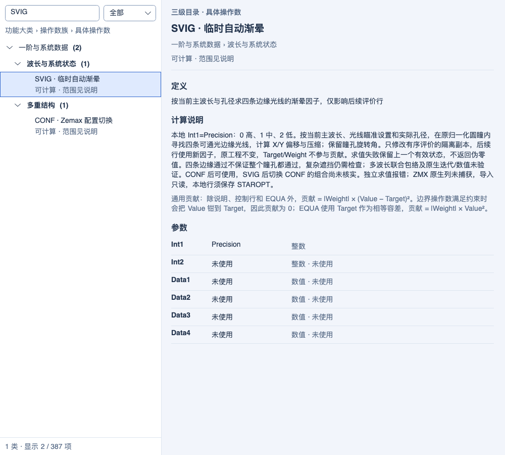
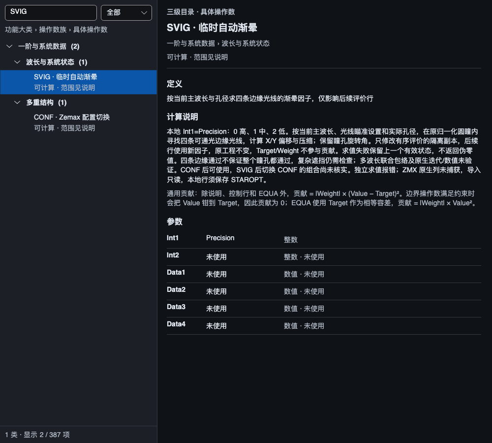
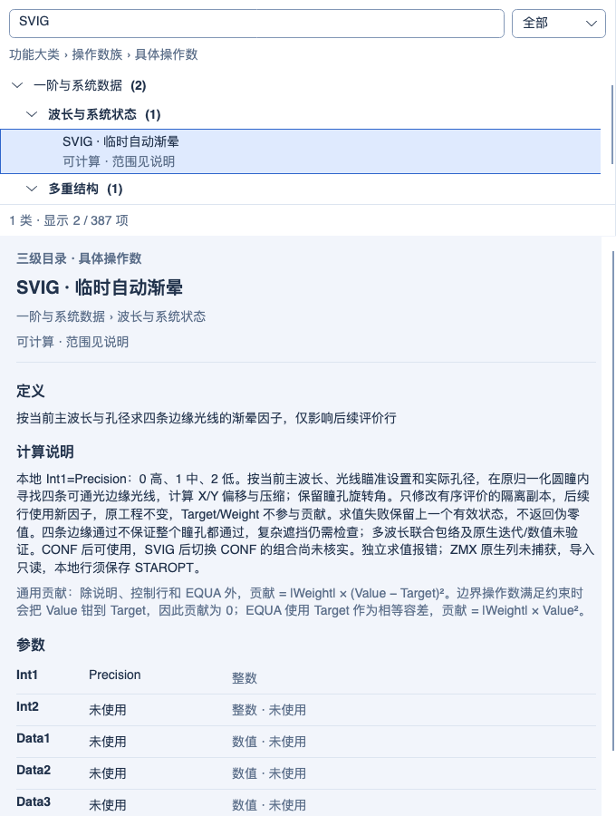

# SVIG 自动渐晕

2026-10-05 同步复验：正式及镀膜默认 Debug/Release 构建零警告、零错误；最终累计 Release **3500/3500**，装调/玻璃库相邻双配置各 **25/25**，镀膜完整双配置各 **44/44**。累计 Debug 的 3500 项保留 2026-10-04 记录；不相加各测试集合，也不表示全仓或跨平台发布验收。见 [同步范围与证据](PROJECT_SYNC_2026-10-05.md)。以下保留各功能阶段的实现日期和验证范围。

2026-10-04 MTF 制造公差：指定频率 FFT/几何 MTF、逐视场反求与联合良率、有界间隔/单表面偏心/倾斜补偿及 startol v3 已实现；参数变更清除旧结果。默认 Debug/Release 累计回归各 **3500/3500** 通过（保留此前 3426 项，新增 38 项功能/界面用例并纳入 36 项相邻回归），构建零警告、零错误；独立渲染 **3/3**、9 张实际控件截图已检查。操作数统计仍为 **341/383 项受限执行、42 项兼容保留**，另 4 项扩展；没有新增原生 Zemax 公差数值认证。见[实现、边界与验证](MTF_TOLERANCING_2026-10-04.md)。下方保留各历史阶段的范围和计数。

历史 GRIN 材料编辑阶段（2026-10-04）：Gradient 1～5 桌面系数、显式色散、积分设置及受支持系数变量已接入；修复整行编辑和多配置同名材料状态保留。当前 **341/383 项受限执行、42 项兼容保留**（35 项已知功能、2 项定义待核实、5 项 Unused），另 4 项扩展；LPTD 残差与原生捕获仍未完成。默认 Debug/Release 累计回归各 **3426/3426** 通过（保留此前 3389 项，新增 34 项功能和 3 项界面用例），零失败、零跳过；默认双配置构建零警告、零错误。界面/架构 **45/45**、独立渲染 **3/3** 通过，12 张真实控件截图已检查。见[本批实现与验证](GRIN_MATERIAL_EDITOR_2026-10-04.md)。下方保留历史阶段记录。

历史 Gradient 5 基础阶段：2026-10-03 Gradient 5：共享 Core 新增四次轴向分布、广义 Sellmeier 色散、连续/近轴追迹和严格保存；已有六点材料约束读取所选波长。LPTD 约束残差、边界倾斜项、桌面系数编辑和原生捕获仍未完成。当前 **341/383 项受限执行、42 项兼容保留**（35 项已知功能、2 项定义待核实、5 项 Unused），另 4 项扩展。默认 Debug/Release 累计回归各 **3389/3389** 通过（保留全部 3342 项，新增 44 项功能和 3 项帮助测试），零失败、零跳过、零编译警告/错误。帮助/架构 **26/26**，独立渲染 **3/3**，三张真实控件截图已检查。见[本批实现与验证](GRADIENT5_DISPERSION_2026-10-03.md)。下方保留历史阶段记录。

2026-10-03，第三十九批。SVIG 从兼容保留升级为受限执行：当前 **341/383 项受限执行、42 项兼容保留**（35 项已知功能、2 项定义待核实、5 项 Unused），另 4 项本程序扩展。原生数值等价仍待捕获验证。

## 已实现

在评价函数中添加 SVIG，Precision 使用 0/1/2，分别为高/中/低精度。当前配置中每个定义视场都通过共享 Core 光线生成器和表面追迹器搜索四条边缘光线；使用当前主波长、瞄准设置和实际物理孔径，包括像面孔径。计算 X/Y 压缩与偏移，保留已有瞳孔旋转角。再次执行先清除旧压缩与偏移进行搜索，避免累积压缩。

- SVIG 只发布到当前有序评价的隔离副本；后续操作数使用新渐晕因子，原始视场不变。Target/Weight 不计入贡献或归一化。禁用、GOTO 跳过和 ENDX 之后的行不执行，独立求值明确报错。
- PRIM 先改变主波长时，随后的 SVIG 使用新主波长；IMSF 先选择像面时，搜索只考虑到该像面的孔径。CVIG 清除临时因子；CONF 可先选择配置，再执行 SVIG。
- 所有视场完成后才发布结果。未找到通光区域、未收敛、非法精度、缺少或重复主波长、带散射模型的系统都明确失败。求值失败保留上一有效状态，优化器收到失败，取消请求继续传播。
- 参数编辑和 STAROPT v7 保存/回读已接通，不改变工程负载版本或顺序快照 schema 6。原生 ZMX 的 SVIG 列映射未捕获：导入及旧快照保持只读，不自动升级；本地 SVIG 通过四种文本格式导出会明确拒绝，避免伪造原生映射。
- 帮助沿用“大类 → 操作数族 → 具体代码”三级组织，8 大类、51 族、387 条目不变。SVIG 详情直接列出主波长、孔径、状态作用范围与限制。

## 算法边界

本地算法只在原归一化单位圆瞳中搜索，先寻找通光种子，再交替更新水平/垂直可通光区间的中心，最后检查所发布因子对应的四条边缘光线。高/中/低精度的归一化边缘容差分别为 1e-7/1e-5/1e-3，种子环密度为 64/32/16，每视场最多 200000 个不同探测点；这些是本程序的实现选择，不是 Zemax 公开规格或普遍默认值。

四条边缘光线通过不代表整个瞳孔内部通过，也不保证找到非凸或分离区域的全局最大通光椭圆；有限种子采样可能漏掉很窄的区域。当前不扩大原单位圆瞳，不执行多波长联合包络，不求解旋转角。复杂遮挡仍需完整采样检查。SVIG 后再次 CONF 的临时状态组合未核实，明确拒绝。上述范围不能表述成完整 Zemax SVIG 等价。

## 官方依据与未实现项目

[2026 R1.02 Changing System Data](https://ansyshelp.ansys.com/public/Views/Secured/Zemax/v26102/en/OpticStudio_User_Guide/OpticStudio_Help/topics/Changing_System_Data.html)确认 SVIG 的三档 Precision 和后续行作用域、评价结束恢复。官方 [How to use vignetting factors](https://optics.ansys.com/hc/en-us/articles/42661826659347-How-to-use-vignetting-factors)说明自动渐晕按每个视场的上、下、左、右边缘光线检查各孔径，并指出复杂遮挡不能由渐晕因子完整表达。[2026 R1 Vignetting Factors](https://ansyshelp.ansys.com/public/Views/Secured/Zemax/v261/en/OpticStudio_User_Guide/OpticStudio_Help/topics/Vignetting_Factors.html)说明偏移、压缩、旋转和瞄准坐标约定。上述网页只作为定义依据，未提供本地迭代常数或原生数值捕获。

同时核对了 [2026 R1 一阶属性](https://ansyshelp.ansys.com/public/Views/Secured/Zemax/v261/en/OpticStudio_User_Guide/OpticStudio_Help/topics/First_Order_Optical_Properties.html)、[2026 R1.03 Power Field Map](https://ansyshelp.ansys.com/public/Views/Secured/Zemax/v26103/en/OpticStudio_User_Guide/OpticStudio_Help/topics/Power_Field_Map.html)与 [Power Pupil Map](https://ansyshelp.ansys.com/public/Views/Secured/Zemax/v26103/en/OpticStudio_User_Guide/OpticStudio_Help/topics/Power_Pupil_Map.html)：POWF/POWP 依赖围绕主光线或指定参考光线的一圈实际光线。环半径、有限共轭焦距定义及原生符号/数值仍需核实，本批保持兼容保留，不能用现有近轴光焦度替代。

## 验证

默认 Debug/Release 输出累计回归各 **3342/3342** 通过（保留前批全部 3291 项，新增 51 项），零失败、零跳过、零编译警告/错误。状态/帮助/架构子集 **167/167**，独立渲染 **3/3**，三张真实控件截图已检查。

覆盖圆形/矩形/椭圆孔径、三档精度、瞄准开关、偏心和无主光线通光种子、离轴视场、旋转和大角度归约、遮挡瞳孔内部、失败原子性、主波长色散、像面选择、有序状态与控制流、缓存隔离、优化候选与最终评价值、保存回读及原生兼容保护。

验证分四部分记录：当前 Workbench 重算；解析几何参考与优化后评价值一致性；29 份已提交 Zemax 基线文件完整性；真实 Avalonia/Skia 界面截图。没有新增 Zemax 原生数值捕获，截图与基线完整性不能证明 SVIG 的原生数值等价。详见[机器记录](../artifacts/validation/automatic-vignetting-20261003/verification.json)和[累计过滤器](../artifacts/validation/automatic-vignetting-20261003/test-filter.txt)。

## 源码

- [共享计算入口](../src/OptilandWorkbench.Core/Services/VignettingSolver.cs)与[孔径搜索](../src/OptilandWorkbench.Core/Services/VignettingSolver.Search.cs)
- [有序状态发布](../src/OptilandWorkbench.Core/Optimization/MeritFunction.SystemState.cs)
- [数值和应用回归](../tests/OptilandWorkbench.Tests/AutomaticVignettingTests.cs)
- [实际帮助界面回归](../tests/OptilandWorkbench.Tests/AutomaticVignettingPanelTests.cs)

## 实际界面渲染

Light/Dark 1000 DIP 和 Light 680 DIP 的真实 Avalonia/Skia 控件已逐张检查。SVIG 所属大类与操作数族、完整计算说明和 Precision 名称可见；窄窗口沿用上下分栏与独立垂直滚动。原合并测试的无绘图会话曾产出空白帧，最终图片由独立 Skia 会话重新生成，并检查了非空像素数据。

