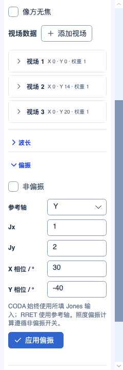
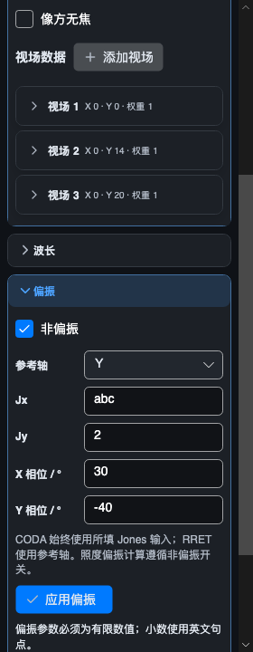

# CODA 与系统偏振设置

本页保留 CODA 阶段 326 项/3034 项验证记录。后续九项膜层约束及参数编辑优化见[最新记录](COATING_LAYER_CONSTRAINTS_2026-10-03.md)。

2026-10-03。新增 CODA 受限计算、可保存的系统 Jones 输入及紧凑侧栏编辑入口。该阶段 **326/383 项受限执行、57 项兼容保留**（50 项已知功能、2 项定义待核实、5 项 Unused）；另 4 项本程序扩展。已执行条目的未支持模式和原生数值验证仍属于后续目标。

## 定义与数据

[官方 CODA 定义](https://ansyshelp.ansys.com/public/Views/Secured/Zemax/v26103/en/OpticStudio_User_Guide/OpticStudio_Help/topics/Optimization_Operands_Alphabetically.html)说明它追迹指定系统偏振输入，即使系统启用了非偏振开关；Surf=0 指像面。Data=0 与 8 分别给出偏振和非偏振强度。以下为本地实现范围，不代表原生列顺序及数值已经验证。

本地六槽使用 `Surf / Wave / Field / Px / Py / Data`。Wave、Field 必须是有效正编号，Wave=0 的原生规则未核实，暂不接通；归一化瞳孔点须在单位圆内。Surf=0 映射到像面，其余正编号必须存在；输出为目标面的相互作用后状态。光线产生、瞄准、渐晕因子、界面几何和孔径检查复用正式引擎。

| Data 的绝对值 | 当前输出 | 单位与符号 |
| --- | --- | --- |
| 0 | 从输入光线到目标面的偏振功率 | 相对强度，包含源切趾、体吸收和界面衰减 |
| 8 | 同一路径的两正交输入功率平均 | 相对非偏振强度，与指定 Jones 幅相无关 |
| 1 / 2 / 3 | 目标界面的 R / T / A | 负 Data 取 S，正 Data 取 P；并非整条路径强度 |
| 4 / 5 | 功率归一化透射复系数实部 / 虚部 | 同上 S/P 选择；平方模为 T |
| 6 / 7 | 反射复系数实部 / 虚部 | 同上 S/P 选择；平方模为 R |
| 101…106 | 局部 Ex、Ey、Ez 的实部 / 虚部 | 包含共同路径相位 |
| 110 | Ex 与 Ey 的主值相位差 | 弧度，[-π,π] |
| 111 / 112 / 113 | Ex / Ey / Ez 分量主值相位 | 弧度，[-π,π] |
| 121 / 122 | 局部 XY 偏振椭圆长轴 / 短轴振幅 | 不包含 Ez，不是强度 |
| 123 | 椭圆主轴角 | 度，当前取 [-90°,90°] |

1…7 之外的负 Data 与对应绝对值相同。零分量相位明确报错；圆形或零场椭圆的主轴方向未定义，123 报错，长短轴仍可返回。椭圆短轴通过行列式计算，避免近线偏振时两特征值相减消失。官方[偏振术语](https://ansyshelp.ansys.com/public/Views/Secured/Zemax/v261/en/OpticStudio_User_Guide/OpticStudio_Help/topics/Definition_of_Polarization_Terms.html)解释局部 XY 投影；官方[波片示例](https://optics.ansys.com/hc/en-us/articles/42661805117971-Birdbath-architecture-for-augmented-reality-AR-system-part-2-Accurate-polarizing-element-simulation)中的 Data=110 使用约 π/2 的相位量。示例不是本项目系统的原生数值捕获。

## 共享计算与系统状态

- `SystemPolarization` 是不可变值，保存 Unpolarized、Jx/Jy、X/Y 相位及参考轴。非负有限幅度不能全零；相位必须有限；参考轴仅 X/Y/Z。Optic 属性在验证后提交并分离当前追迹缓存。界面修改由现有事务发布一次修订，支持撤销/重做，失败不污染工程。
- `CoherentMultilayerCoating.EvaluateAmplitudes` 返回原共享薄膜求解器的完整 S/P 振幅及功率。正式顺序追迹将目标界面响应随 `PolarizedRayTraceResult.Interface` 发布，CODA 读取该结果，不独立重算光学公式，也不建另一个缓存。
- 正时间约定下共轭 n+ik / 负时间薄膜响应，并使用负共同光程相位。绝对电场的相位原点是本程序生成的输入光线起点；Data=0/8/110/121…123 省略会抵消的共同相位。原生绝对相位原点、膜层 ray-equivalent 选项、绕相和退化约定尚未捕获。
- 裸介质、理想反射、全反射、标量涂层及已支持的相干膜层使用原追迹分支。标量涂层声明的 R/T 只衰减一次，在既有零附加相位模型下输出复系数；非法 R/T、R+T>1 明确失败。物理相干膜层的 A 指有限膜层吸收，吸收基底中的 T 指进入基底的功率，不能冒充已支持该介质中的均匀实光线复电场。
- RRET 继续使用其八槽中显式 Jones 幅相，只从系统读取参考轴。照度的 `UsePolarization=true` 现在按全局 Unpolarized 选择两正交输入功率平均或指定 Jones 相干组合；共同传播相位抵消，界面相对相位保留。诊断 DTO 分别保存非偏振强度、指定偏振强度及选定的照度权重，避免字段名称混淆。

官方[系统偏振说明](https://ansyshelp.ansys.com/public/Views/Secured/Zemax/v261/en/OpticStudio_User_Guide/OpticStudio_Help/topics/Polarization_System_Explorer.html)描述非偏振平均及 Jones 输入，[参考方法](https://ansyshelp.ansys.com/public/Views/Secured/Zemax/v261/en/OpticStudio_User_Guide/OpticStudio_Help/topics/Method_polarization.html)说明三个参考轴。当前实现仍拒绝 GRIN 偏振、各向异性、应力双折射、散射、光栅及没有对应复电场模型的交互；参考轴与传播方向平行时不臆造基矢。实际失交或被孔径挡住的 CODA 光线报错，不采用孔径外延续。旧 `JonesPupilEngine` 的矢量 PSF/MTF 等入口尚未迁移，不声称整个产品的偏振分析已经统一。

## 编辑、文件与目录

系统选项新增“偏振”折叠组，使用现有 240…280 DIP 紧凑布局和控件字号；水平滚动仍关闭。“应用偏振”使用 accent，一次提交全部输入。非法文字或全零 Jones 保留输入、显示原因，并滚动到提示；普通标签和 Jones 输入不会随非偏振开关被禁用。只有点击应用才修改工程。

STAROPT schema 6 新增可选 `polarization` 对象。旧快照缺少此对象时使用本地默认：非偏振开启、Jx=1、Jy=0、相位为零、X 参考。这是本程序向后兼容行为，不声称为 Zemax 通用默认。显式非法快照拒绝载入。普通系统/孔径编辑不会覆盖偏振设置。

CODA 本地六槽可保存及编辑，原生 ZMX 行和旧兼容行仍禁用只读，尾列原值保留，不自动升级。原生全局偏振文件字段尚未接入；自行新建的本地 CODA 应先核对侧栏显示的输入。非默认系统偏振导出为 ZMX、SEQ、LEN 或普通处方文本时会明确拒绝，并提示保存 STAROPT，避免静默丢失状态。

帮助仍按“光束与专项 → 镀膜与偏振 → CODA”显示一个具体操作数，Data 的不同输出放在其详情内，不拆成多个叶节点。8 大类、51 族、387 条目不变。

## 验证与渲染

定向 **179/179** 通过，包括新增 70 项 CODA/系统状态测试、2 项 UI 测试及已有 107 项偏振/紧凑布局用例。最终 Skia 明暗主题渲染 **2/2** 通过，保存与错误状态共 4 张图。默认输出 Debug/Release 合并回归各 **3034/3034**（前批 2962 + 新增 72），零失败、零跳过，构建零警告、零错误。

新增测试覆盖独立 Snell/Fresnel、吸收单层 Airy 复系数、相位和电场分量、旋转椭圆解析、全反射、Data 正负号、系统开关语义、有限距离照度、真实曲率 DLS、快照缺省与非法状态、六槽编辑保存、撤销重做、文本导出拒绝、只读原生导入、取消以及错误提示可视区域。解析公式只在测试使用；生产 DLS 目标来自同一 Core，只验证执行链，不证明原生精度。

初次编译记录保留：修正参数种类名称、Domain 导入及测试的显式瞄准参数。首次数值执行 177/179：圆偏振对参考轴旋转不敏感，准直平板的像方立体角为零，两项夹具分别改用椭圆输入和有限距离离轴物体后通过；未修改生产公式或放宽断言。首次 UI 截图发现错误提示在视口外，补充自动滚动及实际视口断言后最终渲染通过。

[最终清单](../artifacts/validation/coating-data-20261003/verification.json)记录源码、默认输出二进制、TRX、筛选集合、383 项状态和剩余分类；[官方来源读取记录](../artifacts/validation/coating-data-20261003/sources.json)单独保存定义依据。本批没有新增原生 CODA 数值捕获；固定 Zemax 基线完整性、当前 Workbench 重算、独立解析比较及 UI 渲染分别记录。

