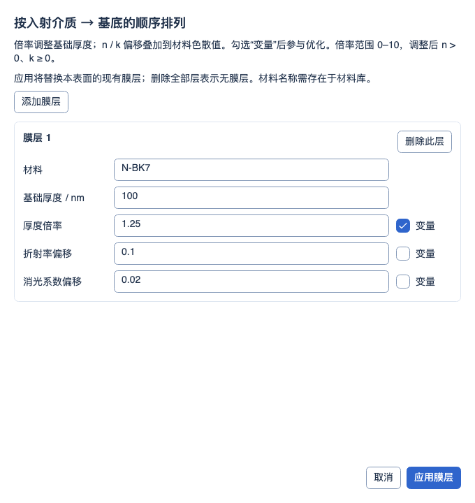
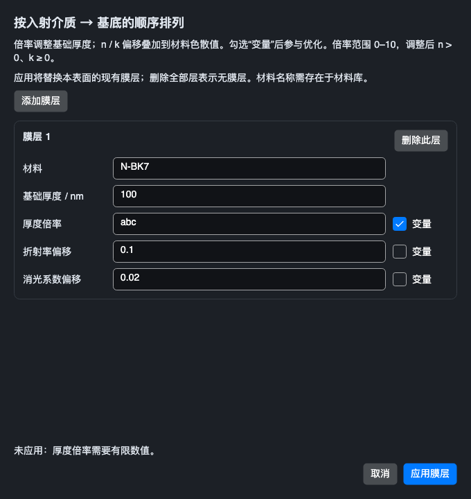

# 物理膜层参数与九项约束

2026-10-03 多配置更新：后续多配置阶段使用包含全部配置的优化候选副本；物理膜层变量仍仅更新当前配置，不自动增加膜层跨配置链接。本页 3089 项及 335 项可执行为膜层阶段历史证据，当前状态见后续记录。 详见[本批记录](MULTI_CONFIGURATION_OPERANDS_2026-10-03.md)。

2026-10-03。本批将 CMGT/CMLT/CMVA、CIGT/CILT/CIVA、CEGT/CELT/CEVA 接入本地受限计算。该阶段 **335/383 项受限执行、48 项兼容保留**（41 项已知功能、2 项定义待核实、5 项 Unused），另 4 项本程序扩展。已执行项目的未完成模式、原生文件映射及数值对照仍属于整体目标。

## 官方依据与本地约束

[2026 R1 官方操作数目录](https://ansyshelp.ansys.com/public/Views/Secured/Zemax/v26103/en/OpticStudio_User_Guide/OpticStudio_Help/topics/Optimization_Operands_Alphabetically.html)分别定义三类膜层参数的下限、上限和值约束。GT/LT 的 Surf=0、Layr=0 可选全部表面或全部层。[官方镀膜优化说明](https://ansyshelp.ansys.com/public/Views/Secured/Zemax/v261/en/OpticStudio_User_Guide/OpticStudio_Help/topics/Optimizing_Coatings.html)说明厚度倍率和 n/k 偏移、倍率最大 10，以及零基础厚度不能用于倍率优化。

| 物理参数 | 下限 | 上限 | 数值 |
| --- | --- | --- | --- |
| 基础厚度的无量纲倍率 | CMGT | CMLT | CMVA |
| 材料实折射率的无量纲加性偏移 | CIGT | CILT | CIVA |
| 材料消光系数的无量纲加性偏移 | CEGT | CELT | CEVA |

本地沿用六槽契约，Int1=Surf、Int2=Layr，四个 Data 槽标为 Unused 且不可编辑；层编号从 1 开始，按入射介质到基底排序。VA 需要两个正编号，直接返回已保存的参数。GT/LT 满足边界时返回 Target；集合选择使用最违反约束的一层，即 GT 取最小值、LT 取最大值。原生多层聚合返回值尚无捕获，本地规则不代表其数值已与 Zemax 一致。空集、指定层不存在和全表面选择遇到未支持的膜层模型均明确报错，不返回成功零值或只计算部分表面。

[表面膜层说明](https://ansyshelp.ansys.com/public/Views/Secured/Zemax/v251/en/OpticStudio_User_Guide/OpticStudio_Help/topics/Coating.html)描述逐面、逐层的独立调整及跨波长的固定折射率偏移；本批读取的是可访问的 2025 R1 页面，2026 页面未成功取得。名称及基本参数另由上述 2026 文档确认。

## 共享物理计算与优化

`CoherentFilm` 保留基础材料、基础厚度和可选不可变 `CoatingLayerParameters`。倍率、n 偏移、k 偏移及三个变量标记随 Clone/Layers 防御性复制保留，不共享可修改材料实例。基础定义不被调整值覆盖。

`CoherentThinFilmSolver` 继续使用正式相干薄膜递推算法：每层厚度乘倍率，材料 n(λ)+ik(λ) 加入无色散偏移。材料的基础波段检查仍生效，任何实际波长都要求调整后的 n>0、k≥0；倍率范围 0..10，厚度溢出及非有限参数失败。与正式标量追迹、复电场追迹和 CODA 共用同一模型；没有新增替代光学引擎或运行时解析近似。

`CoatingLayerMetrics` 用不可变替换修改指定表面的一层，并分离该 Optic 的追迹缓存。变量 getter 每次读取当前层，避免另一参数更新后读取旧实例。默认应用优化可以同时绑定几何变量和膜层变量；并行独立快照采用同一写入接口，与最终处方提交一致。输入有效性检查复用正式薄膜求解器，操作失败不发布新状态。

本地默认优化搜索范围：倍率 [0,10]；n 偏移下界取系统波长中最小基础 n 的负值加 1e-6，并保留更靠近零但仍合法的初值；k 偏移下界取最小基础 k 的负值。偏移上界为 max(初值+1, 下界+10)。这是本程序的搜索窗口，不是 Zemax 默认值或完整可编辑边界功能；实际计算仍验证每个波长。零基础厚度不能设倍率变量。原生层倍率启用开关、层间拾取、加密膜及材料/层数自动优化尚未接入。

## 编辑、帮助和文件

镜头数据 → 表面属性 → 膜层 → **编辑物理膜层…**。窗口提供材料、基础厚度、倍率、n/k 偏移及每项“变量”开关，支持添加/删除层。只有“应用膜层”提交，取消关闭不修改工程；非法文字或非法物理参数保留输入并显示原因。按钮使用主题 accent；禁用的入口通过工具提示和可访问性说明原因。

应用以工程修订号防止过期窗口覆盖新数据，一次提交、一次撤销。“移除所有变量”同时清除包括像面在内的膜层变量标记。现有层的完整材料子快照按来源层编号保留，删除/重排时不通过同名材料重新解析；新材料须在本地材料库存在。全部删除表示无膜层。现有膜层名称输入仍沿用旧行为，新物理窗口明确说明会替换现有膜层。

STAROPT schema 6 的 coherent_multilayer 数字表增加逐层 multiplier、indexOffset、extinctionOffset 和三个 *Variable 字段。旧快照缺少字段时为 1/0/0、固定；变量标记仅接受 0/1。ZMX 原生行及旧兼容行禁用只读、保留原始尾列，不自动升级。原生膜层定义和调整字段尚未解析；含物理膜层的 ZMX/SEQ/LEN/普通处方文本导出明确拒绝并建议保存 STAROPT，避免降为名称后丢数据。

帮助中九个真实代码仍在 **光束与专项 → 镀膜与偏振** 下；不新增自定义操作数或重复叶节点。8 大类、51 族、387 条目不变，详情说明参数、当前计算范围和原生缺口。

## 验证范围

本批新增 54 项测试，另纳入已有共享卡片样式检查 1 项，覆盖九项单层约束、全部层选择、空集/缺层/未支持模型、非法物理参数、快照缺省和非法变量、缓存/快照/跨表面隔离、材料重排、九项编辑槽位与 STAROPT 往返、修订冲突、撤销重做、文本导出拒绝、原生行只读及取消。

独立解析在测试中计算三个波长的单层复数 Airy 响应，验证基础色散、倍率及 n/k 偏移与实际 CODA 的 R/T 一致。三个正式 DLS 用例分别优化倍率、n 偏移及 k 偏移到参数目标；另一个正式 DLS 用例通过 k 偏移优化实际 CODA 透射率。这些本地链路测试不证明原生数值等价。

默认 Debug/Release 合并回归各 **3089/3089**（前批 3034 + 新增 54 + 既有共享卡片样式检查 1），零失败、零跳过、零编译警告/错误。首轮定向 151/151 通过（新增 52 项与已有 99 项）；补充通配符拒绝和取消检查后新增集合为 53 项。初次编译修正了 Dock 枚举与同名命名空间冲突。首轮 Release 累积回归 3086/3087，唯一失败为窗口标题使用字号常量，已改用统一 DisplayTypography.WindowTitle，未放宽断言。补充编辑往返测试发现双槽声明被旧编辑器当作本程序参数，已按现有六槽契约补齐四个不可编辑槽；同时补齐“移除所有变量”对物理膜层的清除和撤销。额外架构检查发现本窗口及两处既有主题的圆角常量，已接入共享 Chrome 角色/命名令牌，原主题 6 DIP 数值保持不变。最终定向 **71/71** 通过（本批 54 + 既有架构 17），其中 2 项界面用例生成明暗主题草稿/错误四张实际 Avalonia/Skia 图片，均已逐张检查；它们与合并回归重叠，不累加。

[验证清单](../artifacts/validation/coating-layer-constraints-20261003/verification.json)记录源码、默认桌面二进制、测试、383 项审计和剩余分类；[官方来源记录](../artifacts/validation/coating-layer-constraints-20261003/sources.json)仅是定义阅读证据。固定的 29 份 Zemax 文件完整性、当前 Workbench 重算、独立数值比较和界面渲染分别记录；本批没有新增原生数值捕获，也没有执行实验室全量发布验收。

