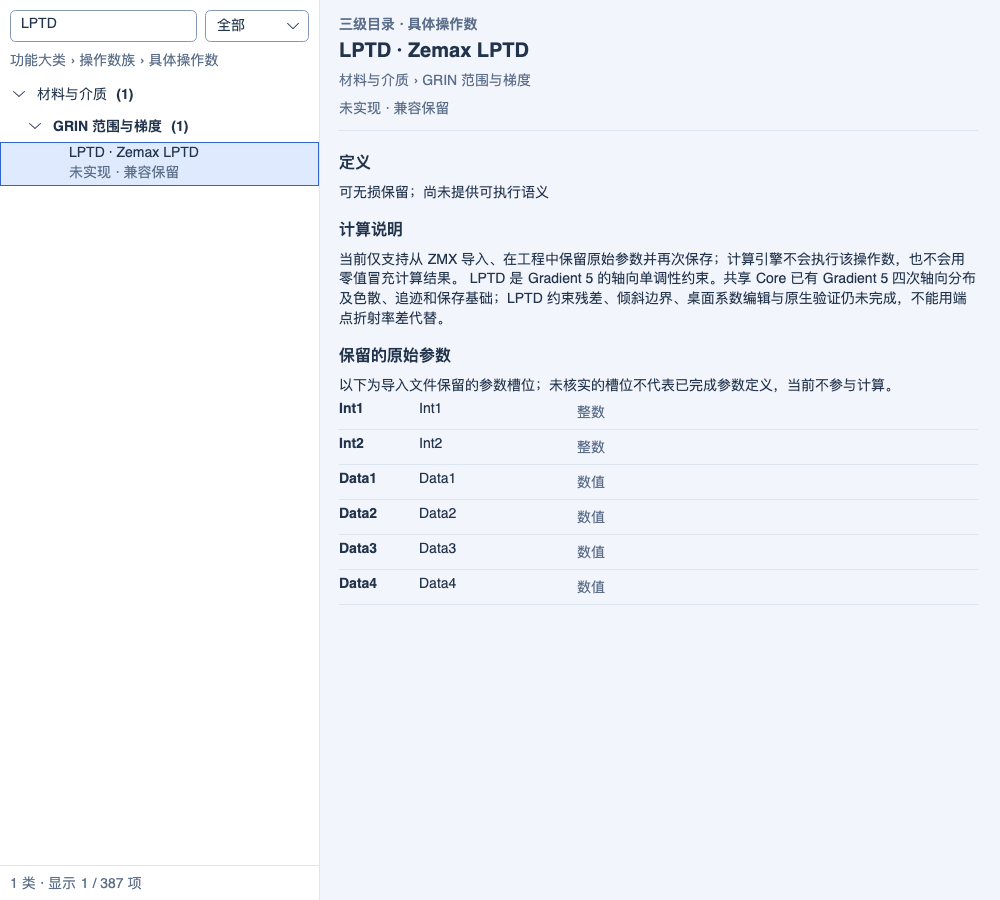
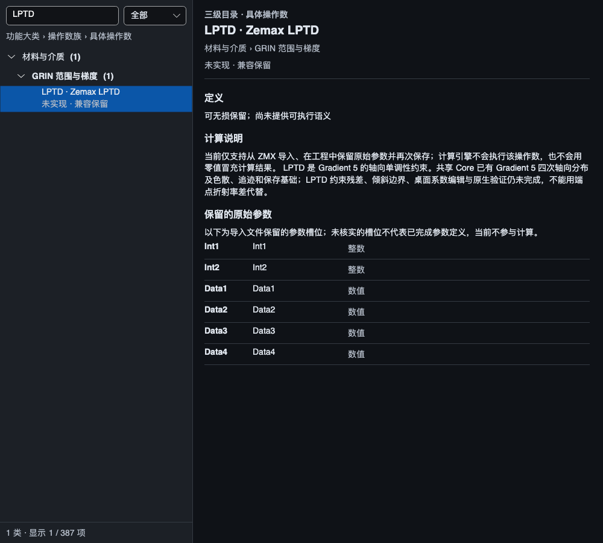
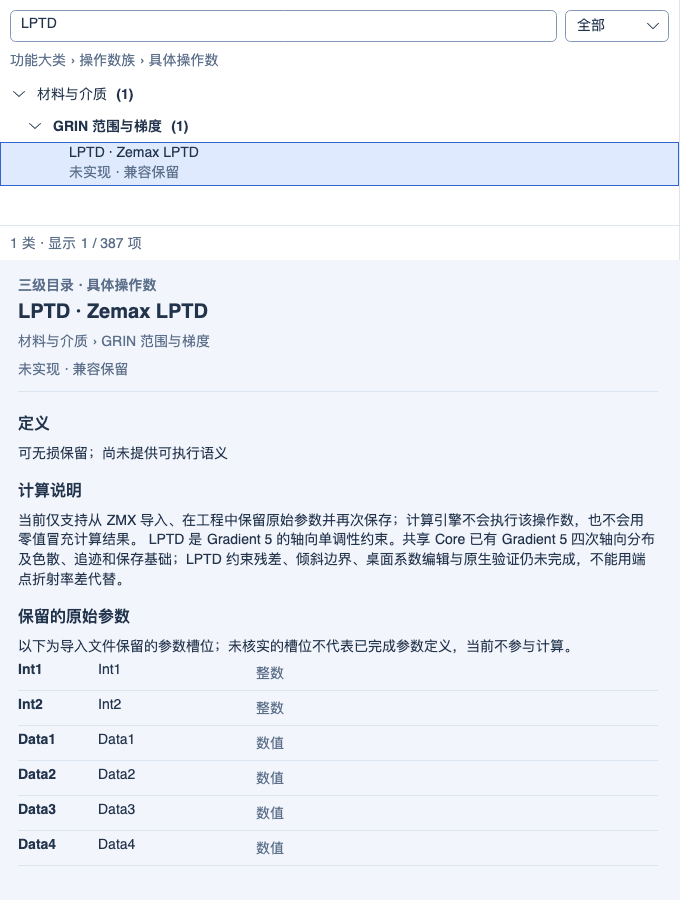

# Gradient 5 空间折射率与色散基础

2026-10-05 同步复验：正式及镀膜默认 Debug/Release 构建零警告、零错误；最终累计 Release **3500/3500**，装调/玻璃库相邻双配置各 **25/25**，镀膜完整双配置各 **44/44**。累计 Debug 的 3500 项保留 2026-10-04 记录；不相加各测试集合，也不表示全仓或跨平台发布验收。见 [同步范围与证据](PROJECT_SYNC_2026-10-05.md)。以下保留各功能阶段的实现日期和验证范围。

2026-10-04 MTF 制造公差：指定频率 FFT/几何 MTF、逐视场反求与联合良率、有界间隔/单表面偏心/倾斜补偿及 startol v3 已实现；参数变更清除旧结果。默认 Debug/Release 累计回归各 **3500/3500** 通过（保留此前 3426 项，新增 38 项功能/界面用例并纳入 36 项相邻回归），构建零警告、零错误；独立渲染 **3/3**、9 张实际控件截图已检查。操作数统计仍为 **341/383 项受限执行、42 项兼容保留**，另 4 项扩展；没有新增原生 Zemax 公差数值认证。见[实现、边界与验证](MTF_TOLERANCING_2026-10-04.md)。下方保留各历史阶段的范围和计数。

历史 GRIN 材料编辑阶段（2026-10-04）：Gradient 1～5 桌面系数、显式色散、积分设置及受支持系数变量已接入；修复整行编辑和多配置同名材料状态保留。当前 **341/383 项受限执行、42 项兼容保留**（35 项已知功能、2 项定义待核实、5 项 Unused），另 4 项扩展；LPTD 残差与原生捕获仍未完成。默认 Debug/Release 累计回归各 **3426/3426** 通过（保留此前 3389 项，新增 34 项功能和 3 项界面用例），零失败、零跳过；默认双配置构建零警告、零错误。界面/架构 **45/45**、独立渲染 **3/3** 通过，12 张真实控件截图已检查。见[本批实现与验证](GRIN_MATERIAL_EDITOR_2026-10-04.md)。下方保留历史阶段记录。

2026-10-03，第四十批。为 LPTD 补齐共享 Core 的 Gradient 5 材料基础，尚未开放 LPTD 约束执行。操作数数量仍为 **341/383 项受限执行、42 项兼容保留**（35 项已知功能、2 项定义待核实、5 项 Unused），另 4 项本程序扩展。

## 已实现范围

`Gradient5IndexProfile` 实现径向二/四次项和轴向一至四次项的参考折射率分布，提供折射率及解析空间梯度。可选的 `Gradient5Dispersion` 使用三个广义 Sellmeier 项；K、L 各为参考折射率的多项式，每组允许 1～8 项，复制输入数组并保持不可变。参考波长处回到参考分布，没有色散表时保持无色散。

- 位置及分布系数使用镜头长度单位；API 波长为 nm，色散方程使用 μm，因此 L 系数对应 μm²。快照明确保存波长单位，不读取外部材料文件，不根据材料名称隐式查找色散。
- 色散空间梯度使用完整解析链式导数，包含 K 和 L 对局部参考折射率的依赖。没有固定基准 n、有限差分梯度或均匀玻璃替代。
- 共享顺序追迹在入射位置、连续弯曲路径和出射位置读取同一材料；共享近轴传递逐积分点计算随 Z/波长变化的横向二阶导数，继续沿用 `(y,p=n·dy/dz)` 的正式一阶方程。
- 近轴传播前，用向外舍入的区间计算检查整个轴向区间的正折射率与色散极点。区间不能确认有效时继续细分，达到本地预算后明确失败；不以有效的两个端点代替内部检查。最多 8192 次不确定区间细分、深度 40，属于本程序实现限制，不是原生规格。
- 已有 I1…6 GT/LT/VA、GRMN/GRMX 和 DLTN 通过相同材料服务取值。六点约束读取请求波长；DLTN 仍为两端差，不因新增轴向四次项就声称找到体积内部极值。生产优化可改变已有厚度变量，以这些正式材料结果组成残差。
- STAROPT 保存完整分布、色散范围和三组 K/L 系数，克隆、快照、应用打开与重算贯通。未知、缺失、多余、非有限和不合法阶数的载荷明确拒绝。材料替换分离既有共享追迹缓存。仍使用 STAROPT v7 / 顺序快照 schema 6 的显式组件编码；旧解码器不认识 `gradient5` 时必须拒绝，不能静默降级。
- 帮助保留“大类 → 操作数族 → 代码”的 8 大类、51 族、387 条目。材料六点说明和一阶量说明更新 Gradient 5 色散范围；LPTD 详情明确材料基础已具备、约束残差仍待完成。

## 失败与限制

波长在声明范围外、Sellmeier 极点（包括参考波长处的 0/0）、非正参考/色散折射率、非有限梯度及非法系数均失败，不外推、不返回伪零。

本批是空间材料模型集成，**不是完整原生 Gradient 5 表面类型**：独立的边界矢高倾斜项尚未实现，不能用刚体倾斜标准面冒充；该阶段未完成的桌面材料创建、系数编辑及受支持系数优化现由第四十一批补齐；SGRIN.DAT 导入、原生 ZMX 表面/列映射和数值捕获仍未完成。系统近轴/瞄准仍限共轴、旋转对称、标准面/平面的既有范围。连续实际光线积分仍是有限步长误差控制，不证明任意高阶空间场的所有内部奇点或交点均被全局枚举。GRIN 偏振、非顺序传播和曲线场景传输保持既有禁用边界。

**LPTD 保持兼容保留。**官方将其用于 Gradient 5 轴向单调性约束；已读取公开说明，但当时公式图未能访问（第四十一批已读到端点导数同号条件，残差返回值仍未核实），不能将自行设计的导数惩罚或 DLTN 端点差标成 Zemax LPTD。

## 官方依据

Ansys [Gradient 5，2026 R1.03](https://ansyshelp.ansys.com/public/Views/Secured/Zemax/v26103/en/OpticStudio_User_Guide/OpticStudio_Help/topics/Gradient_5.html)提供参考分布、广义 Sellmeier 公式及其系数结构，并区分边界矢高倾斜项与刚体倾斜。[Using Gradient Index Operands，2026 R1.03](https://ansyshelp.ansys.com/public/Views/Secured/Zemax/v26103/en/OpticStudio_User_Guide/OpticStudio_Help/topics/Using_Gradient_Index_Operands.html)说明 LPTD 的 Gradient 5 适用范围。网页定义用于建模依据，不能替代原生工程的数值捕获。

## 验证

默认 Debug/Release 累计回归各 **3389/3389** 通过（保留全部 3342 项，新增 44 项功能和 3 项帮助测试），零失败、零跳过、零编译警告/错误。帮助/架构 **26/26**，独立渲染 **3/3**，三张真实控件截图已检查。结果与范围见[机器记录](../artifacts/validation/gradient5-dispersion-20261003/verification.json)。

新增用例覆盖三个波长的独立公式与高阶差分梯度检查、三项色散和八阶系数、输入不可变、非法参数/载荷、内部负折射率和极点、正的内部极小值、取消、近轴列与连续实际光线极限、反向传递与行列式、轴上五次光程积分、保存和应用打开、六个材料取点、缓存分离、生产 DLS 与新快照复算，以及帮助层级与 LPTD 状态。

外部证据分开报告：29 份已提交 Zemax 基线仅做完整性核对；新增数值检查为当前 Workbench 重算及独立解析参考；没有新增原生 Gradient 5/LPTD 数值比较；界面图片只验证显示与层级。

## 代码与证据

- [空间模型与色散](../src/OptilandWorkbench.Core/Materials/Gradient5IndexProfile.cs)
- [轴向区间检查](../src/OptilandWorkbench.Core/Propagation/Gradient5AxialDomain.cs)与[共享近轴传递](../src/OptilandWorkbench.Core/Propagation/GradientIndexParaxialTransport.cs)
- [色散组件保存](../src/OptilandWorkbench.Core/Serialization/ComponentSnapshot.Gradient5.cs)
- [功能回归](../tests/OptilandWorkbench.Tests/Gradient5MaterialTests.cs)与[帮助界面回归](../tests/OptilandWorkbench.Tests/Gradient5HelpPanelTests.cs)
- [累计测试过滤器](../artifacts/validation/gradient5-dispersion-20261003/test-filter.txt)

## 实际帮助界面

Light/Dark 1000 DIP 与 Light 680 DIP 的实际 Avalonia/Skia 控件逐张检查：三级目录、所属材料族、LPTD 未实现状态和完整计算边界可见，无裁切或空白帧。族总说明另有断言确认 Gradient 1～5；没有更改页面布局。

