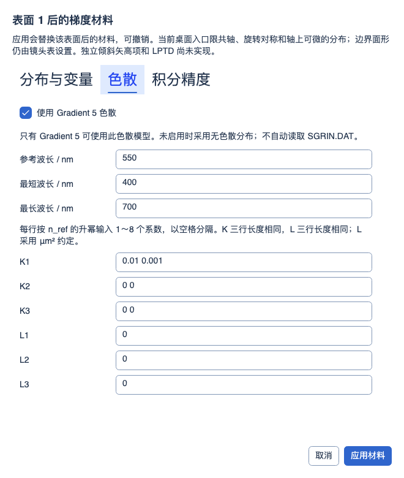

# GRIN 材料编辑、变量与完整状态保存

2026-10-07 RA256 与单光线深入复验：正式默认 Debug/Release 构建零警告、零错误；正式完整 Release **4383 通过 / 1 失败 / 共 4384 项**，比较工具完整 Release **178 通过 / 2 个既有失败 / 共 180 项**，均零跳过；新增正式 **20/20**、工具 **16/16** 通过。正式导入/单光线/RMS/GRIN 定向两配置各 **153/153**，工具定向 Debug **54/54**。六份官方镜头原设置 132 项的旧快照与重新导入两条路径均为 **95 Pass / 12 Close / 16 Difference / 8 Incomparable / 1 Error**，已有 85 Pass 无回退；独立五文件 RMS 控制为旧 17 项加新 RA256 6 项，**23/23 Pass**，分开计数。六个完整边缘光瞳共 308808 条输入、2521932 个逐面结果，修复自动 STOP 后接纳/首次截断差异均归零；更高密度收敛、Relay 瞄准、衍射、其余 21 份镜头及发布门禁未完成，见[修复与证据](ZEMAX_RA256_SINGLE_RAY_REPAIR_2026-10-07.md)。完整 Debug 和实验室本轮未重跑，2026-10-06 Debug **4336/1/4337**、初始结构 Release **258/2/260**、镀膜两配置各 **47/47** 保留历史范围。此前阶段计数不相加。

2026-10-04 MTF 制造公差：指定频率 FFT/几何 MTF、逐视场反求与联合良率、有界间隔/单表面偏心/倾斜补偿及 startol v3 已实现；参数变更清除旧结果。默认 Debug/Release 累计回归各 **3500/3500** 通过（保留此前 3426 项，新增 38 项功能/界面用例并纳入 36 项相邻回归），构建零警告、零错误；独立渲染 **3/3**、9 张实际控件截图已检查。操作数统计仍为 **341/383 项受限执行、42 项兼容保留**，另 4 项扩展；没有新增原生 Zemax 公差数值认证。见[实现、边界与验证](MTF_TOLERANCING_2026-10-04.md)。下方保留各历史阶段的范围和计数。

2026-10-04，第四十一批。补齐已有 Gradient 1～5 材料模型的桌面编辑与系数优化入口。未新增或虚构 Zemax 操作数：仍为 **341/383 项受限执行、42 项兼容保留**（35 项已知功能、2 项定义待核实、5 项 Unused），另 4 项本程序扩展。帮助继续使用 **8 大类 → 51 个操作数族 → 387 个具体条目**。

## 使用与实现范围

在镜头数据中选择具有有限正厚度的可计算透射面，打开“表面属性 → 类型 → 编辑 GRIN 材料…”。编辑器分为“分布与变量”“色散”“积分精度”三个页签，应用一次产生一次可撤销修改；取消保留原工程。物面、像面、反射面、未实现面型及无有效下一边界的面不能使用该入口，禁用原因通过工具提示和无障碍帮助说明。

- 分布系数直接映射正式 Core 的 Gradient 1～5 不可变模型，没有桌面或实验室独立光学公式。`n0Squared` 是 Gradient 2 的折射率平方；位置及空间系数使用镜头长度单位。
- Gradient 5 可编辑参考/最小/最大波长以及三组 K、L 多项式；API 波长以 nm 表示，Sellmeier 方程采用 μm 和 μm²。色散与全部九项积分预算/误差设置保存到同一材料，暂不作为优化变量。未启用色散时保持无色散，不按名称自动读取 SGRIN.DAT。
- 支持的空间系数可分别标为优化变量，使用明确的上下限和范围缩放。生产 DLS、独立候选快照与最终结果均读写正式材料，结果以“配置、面号、系数键”区分，不会把同一面的两个系数混为一个结果。当前入口只选择当前配置的系数变量，基础配置仍按既有材料链接传播。
- 桌面视场、自动口径和近轴瞄准目前要求共轴、旋转对称且轴上可微。应用前验证所有系统波长及完整系统的一阶可用性，失败不发布编辑。Gradient 1 的 `nr1` 不支持独立优化；Gradient 4 的横向一次项及彼此独立的 X/Y 二次项不能标变量，固定的对称组合仍可使用。Core 的显式非对称实际光线 API 不因此被替换或近似。
- 非法数值、重复/缺失/未知系数、无效变量范围、失效色散区间和积分配置均明确报错，保留窗口草稿。过期窗口不能覆盖后续修改。Air/MIRROR 为保留名称，不能给 GRIN 材料使用，以保持镜头表材料显示语义。

## 状态一致性修复

镜头表整行提交其他字段时，保留当前同名 GRIN 材料对象及其系数，避免再次按玻璃名称解析而丢失分布。用户明确切换材料名称仍采用原有材料解析。

多配置材料比较包含完整材料组件，不再仅比较名称。链接的材料更新同步下一面的入射介质；非基础配置修改系数后即使材料名称相同，也保持独立状态。系数修改替换不可变材料并使追迹缓存失效，克隆和独立候选之间不共享可变系数。

“清除全部变量”同时清除所有配置中的 GRIN 变量标记，保留实际系数及色散，且可撤销/重做。STAROPT v7 / 快照 schema 6 使用显式 `gradient_index_variables` 子组件保存每个变量的上下限，可与 Gradient 5 的 `dispersion` 子组件共存。读取时严格检查未知键、缺失范围、非有限值、越界当前值和非法嵌套；旧文件没有变量子组件时视为无变量。旧解码器应拒绝不认识的子组件，不能静默丢弃。

## LPTD 核实与剩余边界

本轮进一步读到 Ansys [Using Gradient Index Operands](https://ansyshelp.ansys.com/public/Views/Secured/Zemax/v26103/en/OpticStudio_User_Guide/OpticStudio_Help/topics/Using_Gradient_Index_Operands.html)的[公式图片](https://ansyshelp.ansys.com/public/Views/Secured/Zemax/v26103/en/OpticStudio_User_Guide/OpticStudio_Help/topics/images/Using%20Gradient%20Index%20Operands.png)：毛坯轴向两端的导数应同为正或同为负。上一批“公式图不可用”是当时的访问状态，现已补充读取；它给出条件，尚不足以确认操作数实际返回的残差数值、尺度和失败分支。

因此 **LPTD 仍保持兼容保留**，不以自定义导数惩罚或端点折射率差冒充。独立边界矢高倾斜项、SGRIN.DAT 解析、原生 ZMX 表面/列映射及 Gradient 5/LPTD 原生数值捕获仍待完成。GRIN 偏振、非顺序体传播、曲线场景节点以及超出上述范围的近轴/瞄准仍沿用已有明确限制。当前系数变量功能不代表完整原生 Gradient 5 面型或全部 Zemax 精度等价。

## 验证

默认 Debug/Release 累计回归各 **3426/3426** 通过（保留此前 3389 项，新增 34 项功能和 3 项界面用例），零失败、零跳过；默认双配置构建零警告、零错误。界面/架构 **45/45**、独立渲染 **3/3** 通过，12 张真实控件截图已检查。定向 84/84 通过；结果与边界见[本批机器记录](../artifacts/validation/grin-material-editor-20261004/verification.json)。

本批新增验证包括五种分布的编辑/保存/打开/撤销、色散与变量联合保存、整行其他字段修改、严格非法输入和载荷、不可微/非对称独立变量限制、过期编辑窗口、物面/像面限制、多配置同名分离及链接传播、全部变量清除、相邻介质同步、正式生产 DLS 双系数求解与结果区分。界面用例覆盖三页内容、取消、无效输入保留、明确禁用原因和滚动条右侧留白。数值输入采用保持精度的最短往返格式，避免显示冗长浮点尾数。

首次 Debug 累计运行在已有场曲页测试关闭 Avalonia Headless 会话时发生一次 `BlockingCollection.Take` 退出异常（3425 通过、1 失败）；控件断言之后的会话清理栈已保留。该类单独复验 **10/10** 通过，随后以同一程序集重新进行完整 Debug 回归；没有通过修改断言或吞掉该异常来取得通过结果。原始记录：[首次运行](../artifacts/validation/grin-material-editor-20261004/debug-teardown-failure.trx)、[定向复验](../artifacts/validation/grin-material-editor-20261004/teardown-recheck.trx)。

证据分开报告：29 份已提交 Zemax 2026 R1 基线只核对完整性；本批为 Workbench 实际编辑、保存和优化回归；未新增原生 GRIN 数值比较；截图只核对真实控件显示，不能作为光学精度证据。

## 代码及实际渲染

- [共享系数映射](../src/OptilandWorkbench.Core/Materials/GradientIndexProfileData.cs)、[变量读写](../src/OptilandWorkbench.Core/Services/GradientIndexParameters.cs)和[严格组件保存](../src/OptilandWorkbench.Core/Serialization/ComponentSnapshot.GradientIndex.cs)
- [事务编辑服务](../src/OptilandWorkbench.Application/Services/PrescriptionService.GradientIndex.cs)和[桌面编辑器](../src/OptilandWorkbench.App/Panels/GradientIndexMaterialEditorWindow.cs)
- [功能测试](../tests/OptilandWorkbench.Tests/GradientIndexEditingTests.cs)与[实际界面测试](../tests/OptilandWorkbench.Tests/GradientIndexEditorPanelTests.cs)
- [累计过滤器](../artifacts/validation/grin-material-editor-20261004/test-filter.txt)和[真实渲染目录](../artifacts/validation/grin-material-editor-20261004/screenshots)

