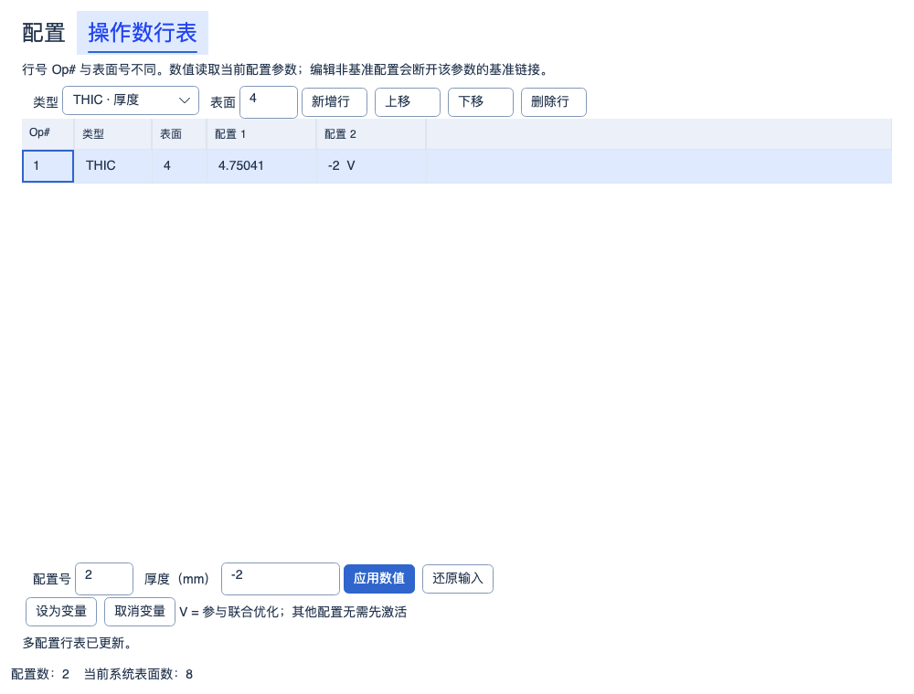
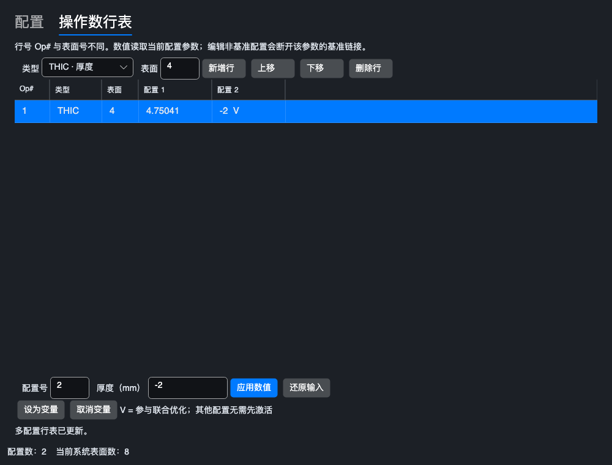
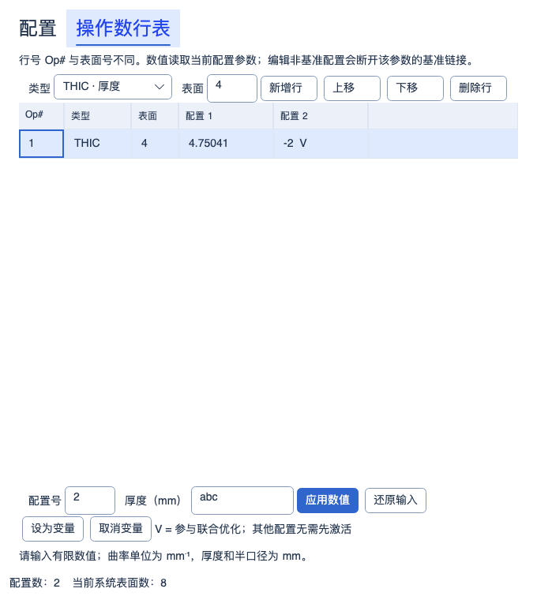

# 多配置单元格变量与联合优化

2026-10-07 RA256 与单光线深入复验：正式默认 Debug/Release 构建零警告、零错误；正式完整 Release **4383 通过 / 1 失败 / 共 4384 项**，比较工具完整 Release **178 通过 / 2 个既有失败 / 共 180 项**，均零跳过；新增正式 **20/20**、工具 **16/16** 通过。正式导入/单光线/RMS/GRIN 定向两配置各 **153/153**，工具定向 Debug **54/54**。六份官方镜头原设置 132 项的旧快照与重新导入两条路径均为 **95 Pass / 12 Close / 16 Difference / 8 Incomparable / 1 Error**，已有 85 Pass 无回退；独立五文件 RMS 控制为旧 17 项加新 RA256 6 项，**23/23 Pass**，分开计数。六个完整边缘光瞳共 308808 条输入、2521932 个逐面结果，修复自动 STOP 后接纳/首次截断差异均归零；更高密度收敛、Relay 瞄准、衍射、其余 21 份镜头及发布门禁未完成，见[修复与证据](ZEMAX_RA256_SINGLE_RAY_REPAIR_2026-10-07.md)。完整 Debug 和实验室本轮未重跑，2026-10-06 Debug **4336/1/4337**、初始结构 Release **258/2/260**、镀膜两配置各 **47/47** 保留历史范围。此前阶段计数不相加。

2026-10-04 MTF 制造公差：指定频率 FFT/几何 MTF、逐视场反求与联合良率、有界间隔/单表面偏心/倾斜补偿及 startol v3 已实现；参数变更清除旧结果。默认 Debug/Release 累计回归各 **3500/3500** 通过（保留此前 3426 项，新增 38 项功能/界面用例并纳入 36 项相邻回归），构建零警告、零错误；独立渲染 **3/3**、9 张实际控件截图已检查。操作数统计仍为 **341/383 项受限执行、42 项兼容保留**，另 4 项扩展；没有新增原生 Zemax 公差数值认证。见[实现、边界与验证](MTF_TOLERANCING_2026-10-04.md)。下方保留各历史阶段的范围和计数。

历史 GRIN 材料编辑阶段（2026-10-04）：Gradient 1～5 桌面系数、显式色散、积分设置及受支持系数变量已接入；修复整行编辑和多配置同名材料状态保留。当前 **341/383 项受限执行、42 项兼容保留**（35 项已知功能、2 项定义待核实、5 项 Unused），另 4 项扩展；LPTD 残差与原生捕获仍未完成。默认 Debug/Release 累计回归各 **3426/3426** 通过（保留此前 3389 项，新增 34 项功能和 3 项界面用例），零失败、零跳过；默认双配置构建零警告、零错误。界面/架构 **45/45**、独立渲染 **3/3** 通过，12 张真实控件截图已检查。见[本批实现与验证](GRIN_MATERIAL_EDITOR_2026-10-04.md)。下方保留历史阶段记录。

历史 Gradient 5 基础阶段：2026-10-03 Gradient 5：共享 Core 新增四次轴向分布、广义 Sellmeier 色散、连续/近轴追迹和严格保存；已有六点材料约束读取所选波长。LPTD 约束残差、边界倾斜项、桌面系数编辑和原生捕获仍未完成。当前 **341/383 项受限执行、42 项兼容保留**（35 项已知功能、2 项定义待核实、5 项 Unused），另 4 项扩展。默认 Debug/Release 累计回归各 **3389/3389** 通过（保留全部 3342 项，新增 44 项功能和 3 项帮助测试），零失败、零跳过、零编译警告/错误。帮助/架构 **26/26**，独立渲染 **3/3**，三张真实控件截图已检查。见[本批实现与验证](GRADIENT5_DISPERSION_2026-10-03.md)。下方保留历史阶段记录。

后续当前状态：SVIG 自动渐晕及最新累计验证见[第三十九批](AUTOMATIC_VIGNETTING_2026-10-03.md)。下文保留本批历史实现与验证边界。

后续进展：四类数值的单元格拾取已在[第三十八批](MCE_PICKUP_SOLVES_2026-10-03.md)实现。下文按原批次保留功能边界与验证结果，当前限制及测试数以新记录为准。

2026-10-03，第三十七批。THIC、CRVT、CONN、SDIA 行的各配置数值单元格支持显式变量，可参与同一次顺序优化。本批完善已有 MCOV/MCOG/MCOL/CONF 的应用路径，没有增加操作数名称：仍为 **340/383 项受限执行、43 项兼容保留**（36 项已知功能、2 项定义待核实、5 项 Unused），另 4 项本程序扩展。

## 已实现

- 多配置行表选择行和配置后，可以“设为变量”或“取消变量”；对应列显示 `V`。未应用或非法输入必须先处理，过期修订不能提交。整体面板布局、三级帮助目录不变。
- 变量身份是配置索引加参数绑定（类型、表面号），与行序和活动配置无关。移动行、插入表面、保存和撤销保留身份；删除无评价引用的行同时移除其变量。复制配置复制该配置的显式单元格变量。
- 非基准单元格设为变量时断开该参数的基准链接，即使初始数值完全相等也保持独立。取消变量保留当前值及断开链接，并清除同一参数的镜头表变量标记；不会因恰好等于基准值而重新链接。
- 活动配置的镜头表半径/厚度变量、物理膜层变量与所有配置中显式标记的单元格变量共同组成变量向量。同一配置同一参数只出现一次，单元格变量优先；其他配置上仅由旧处方复制的镜头表标记不会被自动纳入。
- 优化使用活动配置的评价函数行表，通过 CONF、MCOV 等显式读取各配置；不会自动拼接其他配置各自的评价函数。每个候选线程持有独立配置集合，应用完整向量后按基准链接及现有表面拾取更新，再交给共享 Core 评价。最终写回采用相同传播规则，活动配置保持不变。
- 表面拾取目标不能同时设为独立单元格变量。通过表面求解编辑器改为固定/拾取（半口径也包括自动）会移除同一参数的单元格变量，操作可撤销。半径/厚度求解显示同时识别单元格变量。
- “清除所有变量”清除活动配置镜头表/物理膜层变量以及全部显式单元格变量；作为一个事务撤销。优化服务返回每个结果的配置、表面、参数类型和膜层号，优化面板和向导的变量数与实际优化器使用同一清单。物理膜层单独作为变量也能从主优化面板执行。
- SDIA 变量固定自动口径标记；当前共享表面模型最小半口径为 0.1 mm，搜索下限使用同一值。曲率以 mm⁻¹ 优化，0 表示平面；厚度允许有符号间隔，圆锥系数无单位。

## 搜索范围与限制

范围是本程序局部搜索设置，不是 Zemax 默认值或制造约束。曲率范围为 ±max(0.025, 2|初值|) mm⁻¹；单元格厚度在初值 ±max(10, 2|初值|) mm；圆锥系数在初值 ±max(1, 2|初值|)；半口径在 0.1 至初值 + max(1, 2|初值|) mm。已有镜头表和物理膜层变量保留各自原有搜索范围。范围暂未提供单元格自定义编辑。

更多 MCE 类型、单元格间带比例/偏移的跨配置拾取、热拾取、材料替换、宏求解尚未实现；也没有实现跨配置物理膜层变量。PRIM/CVIG/IMSF 后再次 CONF 的高级组合仍拒绝。所有受限操作数的剩余模式及原生数值对照继续保留缺口。

## 保存与兼容

STAROPT 工程负载升级为 **v6**，增加 `OperandVariables`，每项包含 `ConfigurationIndex`（从 0 开始）和 `Operand`（`Kind`、`SurfaceNumber`）。值仍由配置表面拥有，不另存数值副本。变量记录与 `OperandRows` 分离，行重排不改变绑定相等性。

v1–5 缺少变量表按空表读取；低版本夹带非空变量表、重复变量、不存在的行/配置、拾取冲突明确拒绝。容器 v2 和顺序快照 schema 6 不变。有行表的文档只能保存 STAROPT，不能通过单配置 JSON 或文本无提示地丢失变量。

官方 [2026 R1 多配置求解帮助](https://ansyshelp.ansys.com/public/Views/Secured/Zemax/v261/en/OpticStudio_User_Guide/OpticStudio_Help/topics/Solve_Types_multiple_configuration_editor.html)将 Variable 定义为允许优化器改变数值单元格；该文档核实功能名称与用途。本程序的保存字段、基准链接与局部搜索范围属于本地实现。原生 MCE 行序、变量求解字段及 MFE 列映射尚未通过真实文件核实，ZMX 中相关兼容行仍只读，不宣称原生格式或数值等价。

## 验证

默认 Debug/Release 输出的合并回归各 **3236/3236** 通过，零失败、零跳过、零编译警告/错误。完整保留前批 3183 项测试，新增 35 项变量测试，并扩展纳入既有 18 项半径求解测试。最后界面/数值/架构子集 **118/118**，6 张真实控件截图已检查；向导和主面板使用相同变量清单。详见[机器记录](../artifacts/validation/mce-cell-variables-20261003/verification.json)及[过滤器](../artifacts/validation/mce-cell-variables-20261003/test-filter.txt)。这不是全仓测试或原生 Zemax 数值等价声明。

验证分别记录共享 Core/应用重算、联合 DLS 数值与最终状态一致性、29 份已提交 Zemax 文件的完整性，以及真实 Avalonia/Skia 界面截图。没有新增 Zemax 原生捕获；基线完整性不代表新增变量机制已获 Zemax 数值认证。

## 源码

- [变量标识、检查与正式参数访问](../src/OptilandWorkbench.Core/Multiconfig/MultiConfigurationVariable.cs)
- [变量与基准链接管理](../src/OptilandWorkbench.Core/Multiconfig/MultiConfiguration.Variables.cs)
- [候选隔离、变量收集和联合优化](../src/OptilandWorkbench.Application/Runtime/WorkbenchRuntime.Optimization.cs)
- [配置行表交互](../src/OptilandWorkbench.App/Panels/MultiConfigurationPanel.Operands.cs)
- [数值、保存和服务回归](../tests/OptilandWorkbench.Tests/MultiConfigurationVariableTests.cs)
- [实际控件回归](../tests/OptilandWorkbench.Tests/MultiConfigurationPanelTests.cs)

## 实际控件渲染

Light/Dark、1000/680 DIP 窗口共 6 张真实 Avalonia/Skia 截图已检查。单元格 V 标记、应用与变量按钮、底部错误均可见；非法输入 abc 保留。截图只验证呈现，不是原生 Zemax 数值证据。

