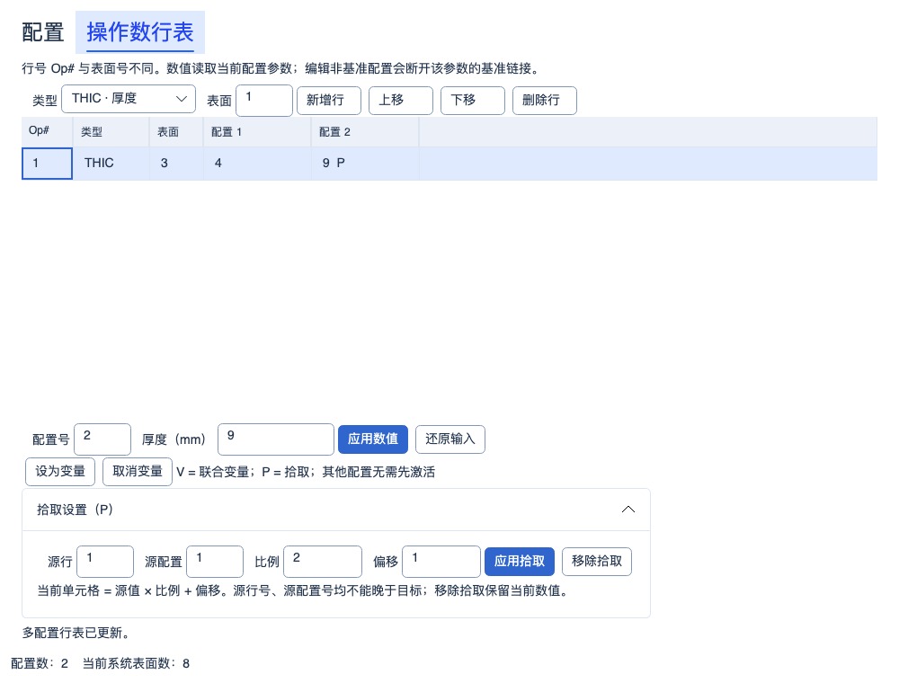
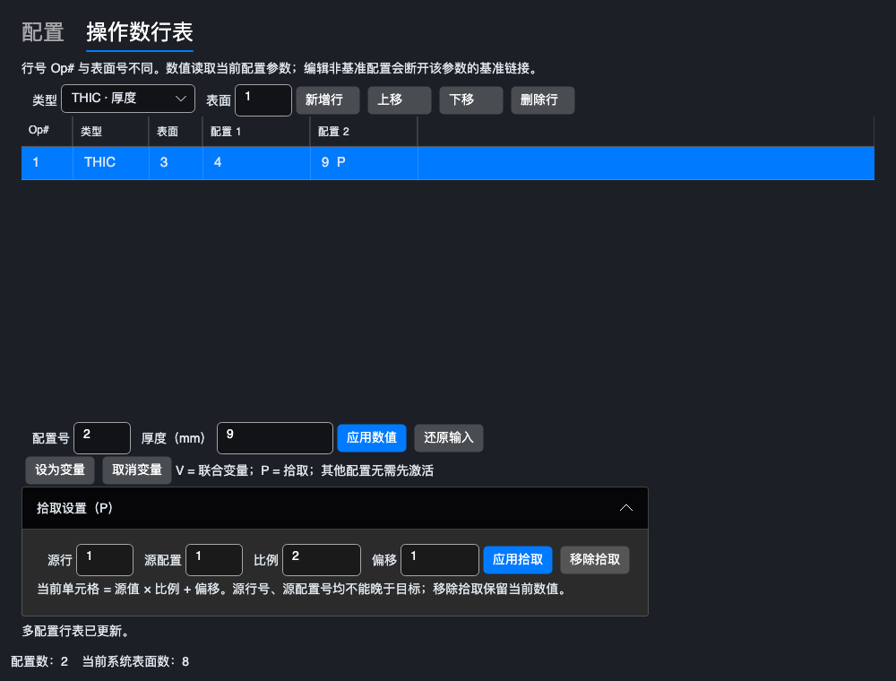
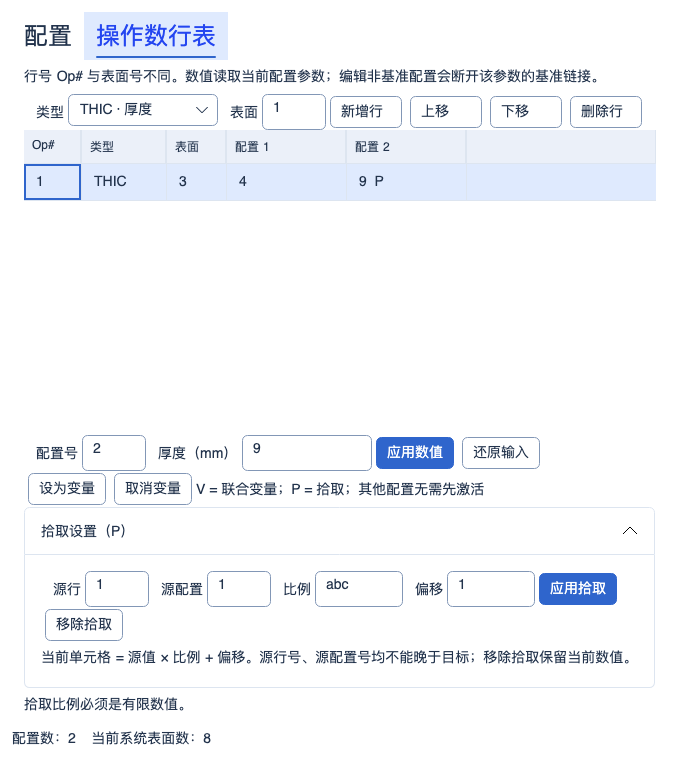

# 多配置单元格拾取

2026-10-09 按原生残差计划推进：新增 165 份原生原始文件，修复正式 FFT 瞳面棋盘相位与 Nyquist 边界舍入。默认 Debug/Release 构建零警告、零错误；正式完整 Release **4546/4546**、最终 Debug 定向 **77/77**，均零跳过。原 4539 项身份与次数全部保留，新增 7 项；完整 Release 包含同一 77 项专项。完整比较工具 **179 通过 / 1 失败 / 共 180 项**，零跳过；DEE 满足原误差预算但实际/理想仍为 Difference，Huygens 旧失败保留。新原生控制确认 N01 Auto 与 Planar 的 1024 像素逐值相同，尚未修改 Huygens 模型。冻结参考、原设置和容差不变；完整 Debug、实验室、安装包、人工桌面及六镜头矩阵本轮未重跑。本轮修复已提交并推送，完成状态见[本轮同步记录](PROJECT_SYNC_FFT_PUPIL_2026-10-09.md)；既有记录保留历史范围。当前实现、证据和缺口见[FFT 瞳面相位修复报告](FFT_PUPIL_PHASE_REPAIR_2026-10-09.md)。

历史验收记录（2026-10-08）：正式默认 Debug/Release 构建零警告、零错误，完整主测试两配置各 **4501/4501** 通过；比较工具完整 Release **178 通过 / 2 失败 / 共 180 项**，均零跳过。保留原 4494 个正式测试身份并新增 7 项；负向渐晕、Headless 会话竞态与辅助历史有限物距契约已处理，四份派生 Tessar 原生发射共 **512/512** 通过。六原文件 132 项完整重算为 **100 Pass / 9 Close / 14 Difference / 8 Incomparable / 1 Error**，此前 95 个 Pass 无回退，冻结证据、设置和容差保持不变。Huygens 截面与 DEE 残差仍开放；实验室结果和发布检查分别记录，整体发布门禁未关闭。该阶段修复的提交与远端状态见同步记录，详见[该阶段修复与完整验收](CONFIRMED_ISSUE_REPAIR_2026-10-08.md)；下方旧计数保留历史范围。

历史波前图验收记录：2026-10-08 波前图修复验收：默认 Debug/Release 构建零警告、零错误；正式完整 Release **4430 通过 / 4 失败 / 共 4434 项**，比较工具完整 Release **178 通过 / 2 失败 / 共 180 项**，均零跳过。新增 **25/25** 与原相关 **743/743** 在正式全量中均通过，本轮 Debug 定向 **49/49**；集合不相加。正式失败包括既有有限物距历史参考差异及 3 项界面会话关闭异常，其中 2 个界面失败身份本轮新增观察；两次隔离各 **13/13** 不替代全量失败。波前图瞄准修复通过专项验收，整体发布不通过。六组原生精确共节点与参考哈希复核一致，主 Zemax 基准完整性通过；新原生对照因缺少 ZOS-API 未执行。原 132 项矩阵、完整 Debug、实验室及发布包未验收，其旧计数保留历史范围；其他瞄准旁路、出瞳显示形状、带符号渐晕和 RA 波前节点仍待验证，见[完整结果与整改优先级](WAVEFRONT_ACCEPTANCE_2026-10-08.md)。

修复阶段记录：2026-10-08 波前图系统瞄准修复：均匀与六角采样均遵循系统瞄准，不再由出瞳形状显示开关决定物理光线；实际图与六组冻结原生 OPD 光扇的精确共节点复验通过，参考与容差未修改。默认 Debug/Release 构建零警告、零错误；正式相关回归两配置各 **743/743**（包含新增 **25/25**），比较工具相关各 **45/45**，零失败、零跳过，集合不相加。完整全量与原 132 项外部矩阵未重跑，下方计数均保留修复前历史范围，发布门禁未关闭。FFT 与零离焦瞄准、实际出瞳形状投影、带符号 Y 渐晕及 RA 波前节点仍未完成，见[修复与验证](WAVEFRONT_AIMING_REPAIR_2026-10-08.md)。

历史阶段记录：2026-10-08 RMS 采样与偏振链路修正：五个 RMS 入口按 GQ 环数 / RA 每边点数验证，RA64/128/256 不再静默降到 32；桌面支持方法相关标签、范围和显式 GQ 角向点数，波前 RMS 开启偏振时使用正式系统透过强度。默认 Debug/Release 构建零警告、零错误，新增两配置各 **25/25**、相关回归各 **222/222** 通过；集合重叠，不相加。正式完整 Release **4407 通过 / 2 失败 / 共 4409 项**（1 项既有历史参考、1 项界面会话关闭异常），比较工具完整 Release **178 通过 / 2 个既有失败 / 共 180 项**，均零跳过。图纸 6 项与新增设置 5 项隔离复跑 **11/11** 通过；最后的测试隔离调整后未重跑完整全量，发布门禁仍未通过，详见[本轮验证记录](RMS_SAMPLING_POLARIZATION_REPAIR_2026-10-08.md)。吸收接口/GRIN 等未支持的偏振明确报错；RA 波前节点、带符号 Y 渐晕插值及更高密度原生收敛仍待认证。未重跑六文件 132 项外部矩阵或实验室全量，旧外部分类和此前计数保留历史范围。

历史记录：2026-10-07 RA256 与单光线深入复验：正式默认 Debug/Release 构建零警告、零错误；正式完整 Release **4383 通过 / 1 失败 / 共 4384 项**，比较工具完整 Release **178 通过 / 2 个既有失败 / 共 180 项**，均零跳过；新增正式 **20/20**、工具 **16/16** 通过。正式导入/单光线/RMS/GRIN 定向两配置各 **153/153**，工具定向 Debug **54/54**。六份官方镜头原设置 132 项的旧快照与重新导入两条路径均为 **95 Pass / 12 Close / 16 Difference / 8 Incomparable / 1 Error**，已有 85 Pass 无回退；独立五文件 RMS 控制为旧 17 项加新 RA256 6 项，**23/23 Pass**，分开计数。六个完整边缘光瞳共 308808 条输入、2521932 个逐面结果，修复自动 STOP 后接纳/首次截断差异均归零；更高密度收敛、Relay 瞄准、衍射、其余 21 份镜头及发布门禁未完成，见[修复与证据](ZEMAX_RA256_SINGLE_RAY_REPAIR_2026-10-07.md)。完整 Debug 和实验室本轮未重跑，2026-10-06 Debug **4336/1/4337**、初始结构 Release **258/2/260**、镀膜两配置各 **47/47** 保留历史范围。此前阶段计数不相加。

2026-10-04 MTF 制造公差：指定频率 FFT/几何 MTF、逐视场反求与联合良率、有界间隔/单表面偏心/倾斜补偿及 startol v3 已实现；参数变更清除旧结果。默认 Debug/Release 累计回归各 **3500/3500** 通过（保留此前 3426 项，新增 38 项功能/界面用例并纳入 36 项相邻回归），构建零警告、零错误；独立渲染 **3/3**、9 张实际控件截图已检查。操作数统计仍为 **341/383 项受限执行、42 项兼容保留**，另 4 项扩展；没有新增原生 Zemax 公差数值认证。见[实现、边界与验证](MTF_TOLERANCING_2026-10-04.md)。下方保留各历史阶段的范围和计数。

历史 GRIN 材料编辑阶段（2026-10-04）：Gradient 1～5 桌面系数、显式色散、积分设置及受支持系数变量已接入；修复整行编辑和多配置同名材料状态保留。当前 **341/383 项受限执行、42 项兼容保留**（35 项已知功能、2 项定义待核实、5 项 Unused），另 4 项扩展；LPTD 残差与原生捕获仍未完成。默认 Debug/Release 累计回归各 **3426/3426** 通过（保留此前 3389 项，新增 34 项功能和 3 项界面用例），零失败、零跳过；默认双配置构建零警告、零错误。界面/架构 **45/45**、独立渲染 **3/3** 通过，12 张真实控件截图已检查。见[本批实现与验证](GRIN_MATERIAL_EDITOR_2026-10-04.md)。下方保留历史阶段记录。

历史 Gradient 5 基础阶段：2026-10-03 Gradient 5：共享 Core 新增四次轴向分布、广义 Sellmeier 色散、连续/近轴追迹和严格保存；已有六点材料约束读取所选波长。LPTD 约束残差、边界倾斜项、桌面系数编辑和原生捕获仍未完成。当前 **341/383 项受限执行、42 项兼容保留**（35 项已知功能、2 项定义待核实、5 项 Unused），另 4 项扩展。默认 Debug/Release 累计回归各 **3389/3389** 通过（保留全部 3342 项，新增 44 项功能和 3 项帮助测试），零失败、零跳过、零编译警告/错误。帮助/架构 **26/26**，独立渲染 **3/3**，三张真实控件截图已检查。见[本批实现与验证](GRADIENT5_DISPERSION_2026-10-03.md)。下方保留历史阶段记录。

后续当前状态：SVIG 自动渐晕及最新累计验证见[第三十九批](AUTOMATIC_VIGNETTING_2026-10-03.md)。下文保留本批历史实现与验证边界。

2026-10-03，第三十八批。本批完善已有 MCOV/MCOG/MCOL/CONF 的配置联动，不增加操作数代码：仍为 **340/383 项受限执行、43 项兼容保留**（36 项已知功能、2 项定义待核实、5 项 Unused），另 4 项本程序扩展。

## 已实现

- THIC、CRVT、CONN、SDIA 数值单元格支持 `目标 = 源值 × 比例 + 偏移`。CRVT 使用曲率 mm⁻¹，0 表示平面；厚度和半口径单位 mm，圆锥系数无单位。
- 多配置表选择目标行和配置，展开“拾取设置（P）”，填写源行、源配置、比例和偏移后应用。行/配置在界面均从 1 开始；目标显示 `P`。移除拾取保留当前数值及独立链接状态，可撤销。
- 源行与源配置分别不能晚于目标，不能引用自身。可在同配置中引用较早行，也可跨配置链式跟随。更改源数据时，MCE 拾取、镜头表半径/厚度/半口径拾取、基准链接和像面后焦距求解按同一依赖顺序求值；组合循环、非法计算结果在写入前拒绝。
- 拾取目标不能同时是独立变量；应用拾取替换同一单元格的变量。联合优化和单面优化的候选值、最终写回走相同依赖图，活动配置保持不变。更换为镜头表求解会移除同一参数的 MCE 拾取；后焦距已控制的像面厚度不允许叠加 MCE 拾取。
- 镜头表整行编辑一次登记全部已修改属性后解析依赖，防止非基准配置的新值被旧链接覆盖。受控数值不能直接覆盖，同面的材料、标注仍可编辑。求解期间保持实时表面引用，结束时分离配置存储，修复优化后增删表面重复执行的问题。
- 移动行按绑定身份保留引用，前向移动和删除仍被引用的源行明确拒绝；插入表面同步重映射。复制配置保留跨配置来源，并将同配置内部拾取指向新副本。
- 非法输入保留原文并显示错误；旧修订、切换目标后残留草稿禁止提交。主执行使用 accent，移除/还原中性。Light/Dark 和窄窗口保留垂直阅读顺序。

## 当前边界

自动半口径是光线追迹产生的输出，其依赖尚未纳入此数值图。直接或经镜头表拾取间接依赖自动半口径的来源明确拒绝，并提示先将源设为固定值或变量；不会静默采用过期值。半口径仍遵循共享 Core 的 0.1 mm 下限。

更多 MCE 行类型、热拾取、材料替换、宏求解、自动半口径源与跨配置膜层变量尚未实现。PRIM/CVIG/IMSF 后再次 CONF 的高级组合继续拒绝。更多受限操作数模式与原生数值捕获仍有缺口，不能把 340 项受限执行称为完整 Zemax 实现。

帮助沿用“大类 → 操作数族 → 具体代码”三级组织，MCO 族中解释单元格拾取与限制；8 大类、51 族、387 条目不变。

## 保存与官方依据

STAROPT 工程负载 **v7** 新增 `OperandPickups`，保存配置索引和行绑定身份、来源绑定、比例与偏移。配置索引从 0 开始，行绑定为 Kind/SurfaceNumber；不另存数值副本。v1–6 缺少表按空表读取，低版本夹带非空表、非法绑定或循环引用拒绝。容器 v2 和顺序快照 schema 6 不变；已有行表的工程继续只能保存 STAROPT，避免有损导出。

官方 [2026 R1 多配置求解帮助](https://ansyshelp.ansys.com/public/Views/Secured/Zemax/v261/en/OpticStudio_User_Guide/OpticStudio_Help/topics/Solve_Types_multiple_configuration_editor.html)描述数值 Pickup 的比例/偏移和源行/配置顺序。本程序依此实现有限数值拾取；本地保存字段、基准继承以及循环检测不表示原生文件映射已验证。没有真实 MCE 原生编码/数值捕获，相关 ZMX 行继续只读。

## 验证

默认 Debug/Release 输出的累计回归各 **3291/3291** 通过（完整保留前批 3236，新增 55），零失败、零跳过、零编译警告/错误。界面/数值/架构子集 **173/173**，12 张实际控件截图已检查。

验证分别记录：共享 Core 与应用重算；四类参数 DLS、单面优化最终评价值和配置值一致性；29 份已提交 Zemax 文件的完整性；实际 Avalonia/Skia 控件截图。无新增 Zemax 原生数值捕获，基线完整性与截图不能证明新增求解的 Zemax 数值等价。详见[机器记录](../artifacts/validation/mce-pickup-solves-20261003/verification.json)和[累计过滤器](../artifacts/validation/mce-pickup-solves-20261003/test-filter.txt)。

## 源码

- [绑定与参数验证](../src/OptilandWorkbench.Core/Multiconfig/MultiConfigurationPickup.cs)
- [统一依赖求值](../src/OptilandWorkbench.Core/Multiconfig/MultiConfiguration.PickupGraph.cs)
- [拾取元数据与原子编辑](../src/OptilandWorkbench.Core/Multiconfig/MultiConfiguration.Pickups.cs)
- [优化候选与最终写回](../src/OptilandWorkbench.Application/Runtime/WorkbenchRuntime.Optimization.cs)
- [实际拾取编辑器](../src/OptilandWorkbench.App/Panels/MultiConfigurationPanel.Pickups.cs)
- [数值与服务回归](../tests/OptilandWorkbench.Tests/MultiConfigurationPickupTests.cs)
- [实际控件回归](../tests/OptilandWorkbench.Tests/MultiConfigurationPickupPanelTests.cs)

## 实际控件渲染

Light/Dark 1000 DIP 与 Light 680 DIP，共 12 张真实 Avalonia/Skia 控件截图已逐张检查。其中 6 张覆盖新拾取展开界面和非法比例输入，6 张复核既有变量界面。P/V 标记、按钮、换行和底部错误提示可见，非法输入原文保留。

