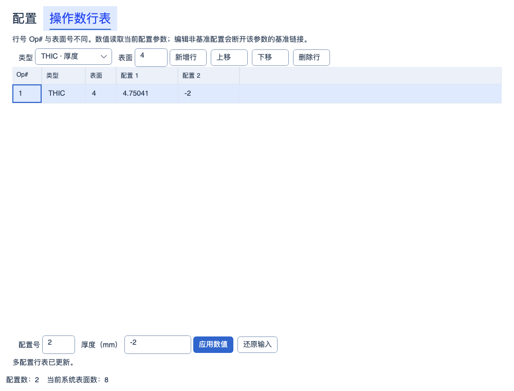
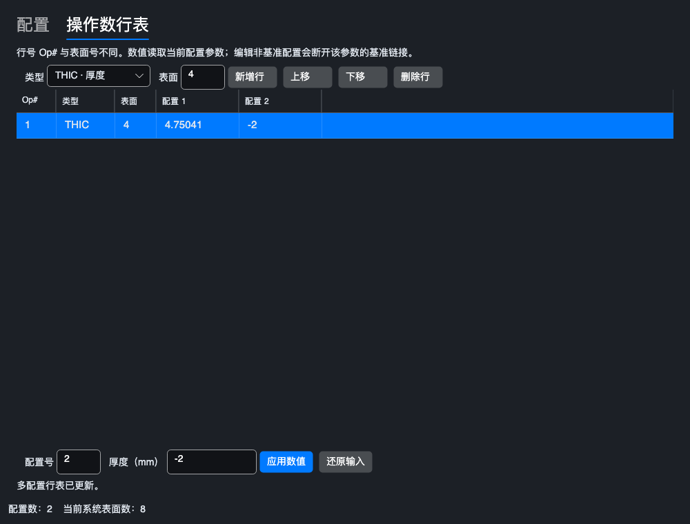
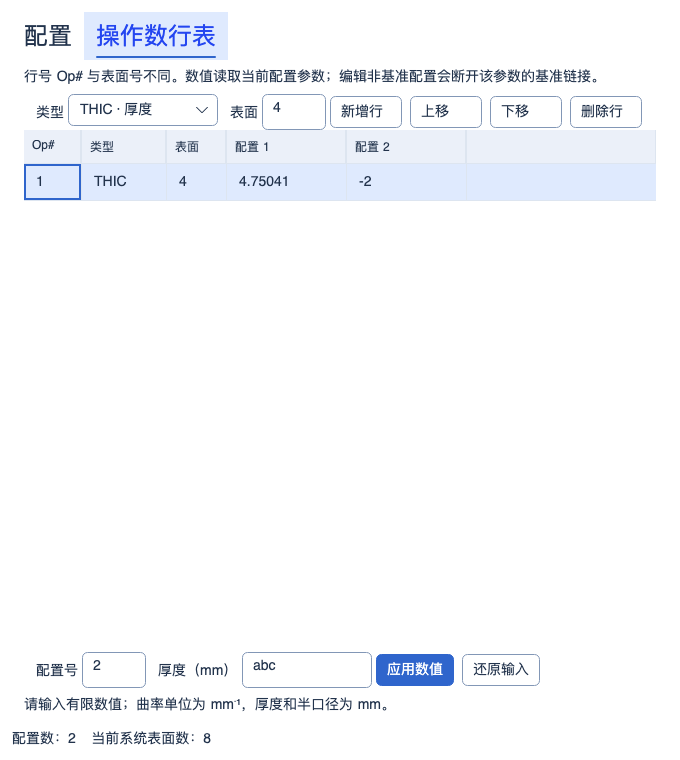

# 多配置行表与 MCOV / MCOG / MCOL

2026-10-08 计算路径修复最新验收：默认 Debug/Release 构建零警告、零错误；正式完整 Release **4492 通过 / 2 失败 / 共 4494 项**，比较工具完整 Release **178 通过 / 2 失败 / 共 180 项**，均零跳过。新增 **60/60** 在正式全量中通过，Debug 专项 **103/103**；重叠集合不相加，原 4434 个正式测试和 180 个工具测试身份全部保留。六组零离焦波前与冻结原生光扇共 **492/492** 条记录有效对应、零缺失；12 组瞄准控制、FFT Sampling/Display 和九组 Huygens 整体 Z 平移验证完成。内部设置与网格缺陷已修复，但 Huygens 仍为已标记的标量兼容近似；两个原生残差、有限物距历史辅助差异及界面会话关闭异常未关闭，整体发布验收不通过。主 Zemax 基准完整性通过，无新原生捕获；六镜头 132 项仍为历史分类，完整 Debug、实验室和发布包未验收，见[修复、前后数值与剩余问题](CALCULATION_PATH_REPAIR_2026-10-08.md)。

历史波前图验收记录：2026-10-08 波前图修复验收：默认 Debug/Release 构建零警告、零错误；正式完整 Release **4430 通过 / 4 失败 / 共 4434 项**，比较工具完整 Release **178 通过 / 2 失败 / 共 180 项**，均零跳过。新增 **25/25** 与原相关 **743/743** 在正式全量中均通过，本轮 Debug 定向 **49/49**；集合不相加。正式失败包括既有有限物距历史参考差异及 3 项界面会话关闭异常，其中 2 个界面失败身份本轮新增观察；两次隔离各 **13/13** 不替代全量失败。波前图瞄准修复通过专项验收，整体发布不通过。六组原生精确共节点与参考哈希复核一致，主 Zemax 基准完整性通过；新原生对照因缺少 ZOS-API 未执行。原 132 项矩阵、完整 Debug、实验室及发布包未验收，其旧计数保留历史范围；其他瞄准旁路、出瞳显示形状、带符号渐晕和 RA 波前节点仍待验证，见[完整结果与整改优先级](WAVEFRONT_ACCEPTANCE_2026-10-08.md)。

修复阶段记录：2026-10-08 波前图系统瞄准修复：均匀与六角采样均遵循系统瞄准，不再由出瞳形状显示开关决定物理光线；实际图与六组冻结原生 OPD 光扇的精确共节点复验通过，参考与容差未修改。默认 Debug/Release 构建零警告、零错误；正式相关回归两配置各 **743/743**（包含新增 **25/25**），比较工具相关各 **45/45**，零失败、零跳过，集合不相加。完整全量与原 132 项外部矩阵未重跑，下方计数均保留修复前历史范围，发布门禁未关闭。FFT 与零离焦瞄准、实际出瞳形状投影、带符号 Y 渐晕及 RA 波前节点仍未完成，见[修复与验证](WAVEFRONT_AIMING_REPAIR_2026-10-08.md)。

历史阶段记录：2026-10-08 RMS 采样与偏振链路修正：五个 RMS 入口按 GQ 环数 / RA 每边点数验证，RA64/128/256 不再静默降到 32；桌面支持方法相关标签、范围和显式 GQ 角向点数，波前 RMS 开启偏振时使用正式系统透过强度。默认 Debug/Release 构建零警告、零错误，新增两配置各 **25/25**、相关回归各 **222/222** 通过；集合重叠，不相加。正式完整 Release **4407 通过 / 2 失败 / 共 4409 项**（1 项既有历史参考、1 项界面会话关闭异常），比较工具完整 Release **178 通过 / 2 个既有失败 / 共 180 项**，均零跳过。图纸 6 项与新增设置 5 项隔离复跑 **11/11** 通过；最后的测试隔离调整后未重跑完整全量，发布门禁仍未通过，详见[本轮验证记录](RMS_SAMPLING_POLARIZATION_REPAIR_2026-10-08.md)。吸收接口/GRIN 等未支持的偏振明确报错；RA 波前节点、带符号 Y 渐晕插值及更高密度原生收敛仍待认证。未重跑六文件 132 项外部矩阵或实验室全量，旧外部分类和此前计数保留历史范围。

历史记录：2026-10-07 RA256 与单光线深入复验：正式默认 Debug/Release 构建零警告、零错误；正式完整 Release **4383 通过 / 1 失败 / 共 4384 项**，比较工具完整 Release **178 通过 / 2 个既有失败 / 共 180 项**，均零跳过；新增正式 **20/20**、工具 **16/16** 通过。正式导入/单光线/RMS/GRIN 定向两配置各 **153/153**，工具定向 Debug **54/54**。六份官方镜头原设置 132 项的旧快照与重新导入两条路径均为 **95 Pass / 12 Close / 16 Difference / 8 Incomparable / 1 Error**，已有 85 Pass 无回退；独立五文件 RMS 控制为旧 17 项加新 RA256 6 项，**23/23 Pass**，分开计数。六个完整边缘光瞳共 308808 条输入、2521932 个逐面结果，修复自动 STOP 后接纳/首次截断差异均归零；更高密度收敛、Relay 瞄准、衍射、其余 21 份镜头及发布门禁未完成，见[修复与证据](ZEMAX_RA256_SINGLE_RAY_REPAIR_2026-10-07.md)。完整 Debug 和实验室本轮未重跑，2026-10-06 Debug **4336/1/4337**、初始结构 Release **258/2/260**、镀膜两配置各 **47/47** 保留历史范围。此前阶段计数不相加。

2026-10-04 MTF 制造公差：指定频率 FFT/几何 MTF、逐视场反求与联合良率、有界间隔/单表面偏心/倾斜补偿及 startol v3 已实现；参数变更清除旧结果。默认 Debug/Release 累计回归各 **3500/3500** 通过（保留此前 3426 项，新增 38 项功能/界面用例并纳入 36 项相邻回归），构建零警告、零错误；独立渲染 **3/3**、9 张实际控件截图已检查。操作数统计仍为 **341/383 项受限执行、42 项兼容保留**，另 4 项扩展；没有新增原生 Zemax 公差数值认证。见[实现、边界与验证](MTF_TOLERANCING_2026-10-04.md)。下方保留各历史阶段的范围和计数。

历史 GRIN 材料编辑阶段（2026-10-04）：Gradient 1～5 桌面系数、显式色散、积分设置及受支持系数变量已接入；修复整行编辑和多配置同名材料状态保留。当前 **341/383 项受限执行、42 项兼容保留**（35 项已知功能、2 项定义待核实、5 项 Unused），另 4 项扩展；LPTD 残差与原生捕获仍未完成。默认 Debug/Release 累计回归各 **3426/3426** 通过（保留此前 3389 项，新增 34 项功能和 3 项界面用例），零失败、零跳过；默认双配置构建零警告、零错误。界面/架构 **45/45**、独立渲染 **3/3** 通过，12 张真实控件截图已检查。见[本批实现与验证](GRIN_MATERIAL_EDITOR_2026-10-04.md)。下方保留历史阶段记录。

历史 Gradient 5 基础阶段：2026-10-03 Gradient 5：共享 Core 新增四次轴向分布、广义 Sellmeier 色散、连续/近轴追迹和严格保存；已有六点材料约束读取所选波长。LPTD 约束残差、边界倾斜项、桌面系数编辑和原生捕获仍未完成。当前 **341/383 项受限执行、42 项兼容保留**（35 项已知功能、2 项定义待核实、5 项 Unused），另 4 项扩展。默认 Debug/Release 累计回归各 **3389/3389** 通过（保留全部 3342 项，新增 44 项功能和 3 项帮助测试），零失败、零跳过、零编译警告/错误。帮助/架构 **26/26**，独立渲染 **3/3**，三张真实控件截图已检查。见[本批实现与验证](GRADIENT5_DISPERSION_2026-10-03.md)。下方保留历史阶段记录。

历史自动渐晕阶段：2026-10-03 自动渐晕：新增 SVIG 受限执行，按当前主波长和实际孔径计算四条边缘光线的渐晕因子，隔离到后续评价行；参数编辑、优化重算和 STAROPT 保存已接通。当前 **341/383 项受限执行、42 项兼容保留**（35 项已知功能、2 项定义待核实、5 项 Unused），另 4 项本程序扩展。默认 Debug/Release 输出累计回归各 **3342/3342** 通过（保留前批全部 3291 项，新增 51 项），零失败、零跳过、零编译警告/错误。状态/帮助/架构子集 **167/167**，独立渲染 **3/3**，三张真实控件截图已检查。多波长包络、复杂瞳孔全局最优、SVIG 后 CONF 和原生数值/列映射仍未完成。见[本批实现与验证](AUTOMATIC_VIGNETTING_2026-10-03.md)。下方保留历史阶段范围。

2026-10-03。本批新增三项受限执行，340/383 个已核实官方代码连接计算，43 项兼容保留（36 已知功能、2 定义待核实、5 Unused），另 4 项本程序扩展。未完成模式仍属于总任务。

## 定义和实现

按 [Ansys 2026 R1 多配置编辑器说明](https://ansyshelp.ansys.com/public/Views/Secured/Zemax/v261/en/OpticStudio_User_Guide/OpticStudio_Help/topics/Multi_Configuration_Operands.html)核对四类绑定，按[官方多配置优化操作数定义](https://ansyshelp.ansys.com/public/Views/Secured/Zemax/v26102/en/OpticStudio_User_Guide/OpticStudio_Help/topics/Multi_Configuration_Zoom_Data.html)核对行号和配置号。手册核对不等于原生数值或文件列验证。

| MFE 操作数 | 本地六槽 | 返回值 |
| --- | --- | --- |
| MCOV | Int1=Op#，Int2=Cfg#，其余未用 | 指定行在指定配置的实际数值 |
| MCOG | 同上 | min(实际值, Target)，下限满足时贡献为零 |
| MCOL | 同上 | max(实际值, Target)，上限满足时贡献为零 |

Op#/Cfg# 都从 1 开始。Op# 是下表的行序，不是表面号；Cfg# 不依赖最近 CONF。必须使用带行表的有序评价上下文；无行表、无效行号/配置号、非有限参数均明确失败，不使用零值替代。

| 行类型 | 参数 | 单位 |
| --- | --- | --- |
| THIC | 正表面号的有符号厚度 | mm |
| CRVT | 正表面号的曲率，平面为 0 | mm⁻¹ |
| CONN | 正表面号的圆锥系数 | 无量纲 |
| SDIA | 正表面号的半口径，编辑时设为固定值 | mm |

行表只保存有序的类型和表面绑定，数值由对应配置的 Core 表面持有。相同绑定不允许重复，最多 4096 行。不支持物面；读取值需有限。基准配置修改传播到未断开的链接，非基准配置显式编辑断开该参数链接；已有表面拾取目标拒绝直接编辑，源参数编辑后重算拾取。

## 编辑和引用维护

多配置面板保留配置页，增加“操作数行表”页，显示 Op#、类型、表面及各配置列。可新增、上移、下移、删除；选中行后按配置号编辑数值。配置页显示编号也使用一基，应用服务内部仍为零基。

非法文字保留在输入栏，底部显示原因；工作区修订变化后拒绝旧草稿提交；切换单元格后不能把旧草稿误写到新单元格。还原输入重新读取当前数值。应用数值使用 accent，其他操作保持中性，输入单位随绑定类型显示。

行序变化会按绑定身份重映射全部配置内本地 MCO 评价行（包含禁用行）。正在被引用的行不能删除；无效本地引用需先修正。原生兼容 MCO 行保持原始参数，不能当作本地引用重排。表面插入/删除会同步剩余绑定编号；正在被绑定的表面必须先移除绑定，防止删面后引用漂移。所有应用写入先在候选文档验证，再一次性提交/撤销。

## 优化和保存

候选配置集合带相同行表，MCO 从候选的实际值求约束；当前配置的厚度和曲率变量可经过已有生产 DLS 优化。既有基准链接、断开链接及表面拾取规则保留。本批未增加其他配置独立变量的联合搜索，也未增加 MCE 单元格变量或跨配置拾取解。

STAROPT 工程负载升级为 v5，新增 OperandRows（Kind、SurfaceNumber）；容器 v2 和顺序快照 schema 6 不变。v1–4 缺失行表时读取为空，旧版本标记却携带非空新行表会拒绝。半口径断开链接校验补全。非法类型、重复绑定、不存在或非有限引用均拒绝；保存/重开/撤销保留行序、配置值和重映射后的评价参数。

任何非空行表都要求 STAROPT 保存，即使当前没有评价行；单镜头 JSON/文本不能保存项目行表。原生 MCO 导入禁用只读，快照不能自动升级；本地 MCO 文本列未核实，文本导出明确拒绝。既有 ZMX 配置属性解析不被猜测拼成 MCE 行表。

## 验证与未完成范围

默认 Debug/Release 合并回归各 **3183/3183**，包含前批 3135 与新增 48 项，零失败、零跳过、零编译警告/错误。本批新增 48 项（Core/应用 45、界面 3）；另 17 项既有架构检查构成 65/65 定向复验。包含三种返回/约束方向、曲率零点、配置与行号独立、重排/删面保护、负厚度与链接、拾取拒绝、三项生产 DLS、六槽编辑/保存撤销、旧版本读取、恶意新旧格式混用、原生保留和有损导出保护。

实际 Avalonia/Skia 生成 Light/Dark 1000 DIP 和 Light 680 DIP，各含有效值及非法输入，共六图，已逐张检查。UI 渲染是视觉证据，不是 Zemax 数值比较。已提交 29 个基线文件保持原始范围，本批没有新增 MCO 原生值捕获。

尚缺：更多数值/字符串 MCE 行类型、MCE 单元格变量与配置拾取解、独立配置变量联合搜索、原生行顺序/列映射及数值优化对照。前批 CONF 的高级状态组合限制继续有效。注册为受限执行不代表完整兼容。

[机器验证记录](../artifacts/validation/mce-row-operands-20261003/verification.json) · [过滤器](../artifacts/validation/mce-row-operands-20261003/test-filter.txt) · [操作数审计](../artifacts/validation/mce-row-operands-20261003/operand-audit.csv) · [剩余分类](../artifacts/validation/mce-row-operands-20261003/remaining-by-category.csv)

## 代码入口

[Core 行绑定](../src/OptilandWorkbench.Core/Multiconfig/MultiConfigurationOperand.cs)、[表结构与引用](../src/OptilandWorkbench.Core/Multiconfig/MultiConfiguration.Operands.cs)、[MCO 求值](../src/OptilandWorkbench.Core/Optimization/MeritFunction.MultiConfiguration.cs)、[行表界面](../src/OptilandWorkbench.App/Panels/MultiConfigurationPanel.Operands.cs)、[Core/应用回归](../tests/OptilandWorkbench.Tests/MultiConfigurationTableTests.cs)、[界面回归](../tests/OptilandWorkbench.Tests/MultiConfigurationPanelTests.cs)。
