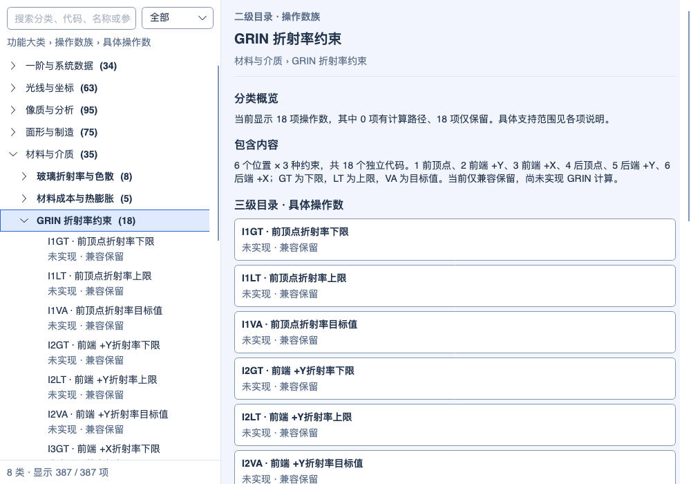
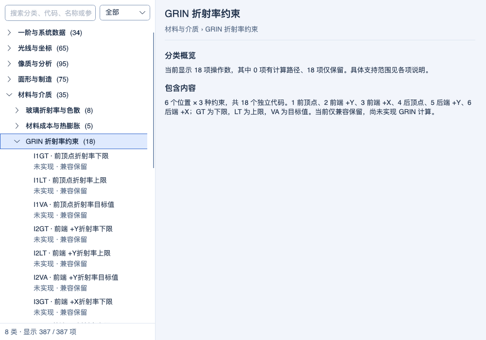
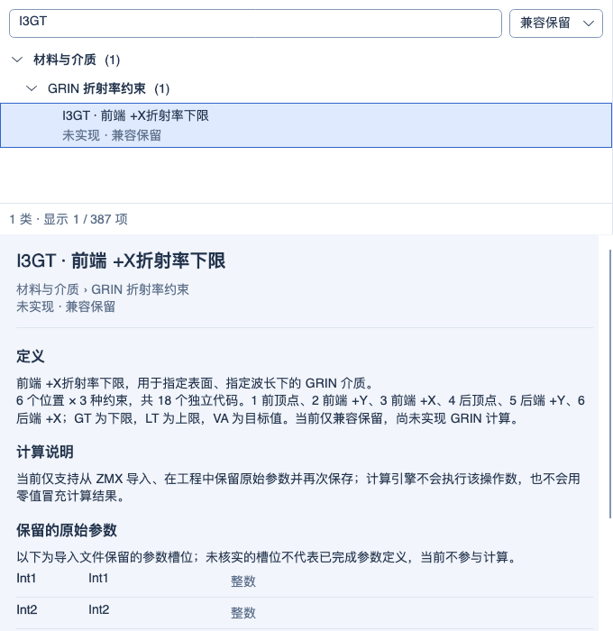

# 操作数帮助层级导航

2026-10-05 同步复验：正式及镀膜默认 Debug/Release 构建零警告、零错误；最终累计 Release **3500/3500**，装调/玻璃库相邻双配置各 **25/25**，镀膜完整双配置各 **44/44**。累计 Debug 的 3500 项保留 2026-10-04 记录；不相加各测试集合，也不表示全仓或跨平台发布验收。见 [同步范围与证据](PROJECT_SYNC_2026-10-05.md)。以下保留各功能阶段的实现日期和验证范围。

2026-10-04 MTF 制造公差：指定频率 FFT/几何 MTF、逐视场反求与联合良率、有界间隔/单表面偏心/倾斜补偿及 startol v3 已实现；参数变更清除旧结果。默认 Debug/Release 累计回归各 **3500/3500** 通过（保留此前 3426 项，新增 38 项功能/界面用例并纳入 36 项相邻回归），构建零警告、零错误；独立渲染 **3/3**、9 张实际控件截图已检查。操作数统计仍为 **341/383 项受限执行、42 项兼容保留**，另 4 项扩展；没有新增原生 Zemax 公差数值认证。见[实现、边界与验证](MTF_TOLERANCING_2026-10-04.md)。下方保留各历史阶段的范围和计数。

历史 GRIN 材料编辑阶段（2026-10-04）：Gradient 1～5 桌面系数、显式色散、积分设置及受支持系数变量已接入；修复整行编辑和多配置同名材料状态保留。当前 **341/383 项受限执行、42 项兼容保留**（35 项已知功能、2 项定义待核实、5 项 Unused），另 4 项扩展；LPTD 残差与原生捕获仍未完成。默认 Debug/Release 累计回归各 **3426/3426** 通过（保留此前 3389 项，新增 34 项功能和 3 项界面用例），零失败、零跳过；默认双配置构建零警告、零错误。界面/架构 **45/45**、独立渲染 **3/3** 通过，12 张真实控件截图已检查。见[本批实现与验证](GRIN_MATERIAL_EDITOR_2026-10-04.md)。下方保留历史阶段记录。

历史 Gradient 5 基础阶段：2026-10-03 Gradient 5：共享 Core 新增四次轴向分布、广义 Sellmeier 色散、连续/近轴追迹和严格保存；已有六点材料约束读取所选波长。LPTD 约束残差、边界倾斜项、桌面系数编辑和原生捕获仍未完成。当前 **341/383 项受限执行、42 项兼容保留**（35 项已知功能、2 项定义待核实、5 项 Unused），另 4 项扩展。默认 Debug/Release 累计回归各 **3389/3389** 通过（保留全部 3342 项，新增 44 项功能和 3 项帮助测试），零失败、零跳过、零编译警告/错误。帮助/架构 **26/26**，独立渲染 **3/3**，三张真实控件截图已检查。见[本批实现与验证](GRADIENT5_DISPERSION_2026-10-03.md)。下方保留历史阶段记录。

2026-10-03：SVIG 在“一阶与系统数据 → 波长与系统状态”族内升级为受限可计算，详情说明主波长、四条边缘光线和临时状态。8 大类、51 族、387 条目保持不变；Precision 的三档含义放在计算说明中，避免参数名称截断。

2026-10-03：MCO 族帮助更新四类单元格 P 拾取、比例/偏移、源引用顺序与限制，沿用“大类 → 操作数族 → 具体代码”三级目录。仍为 8 大类、51 族、387 条目；未为每个单元格或求解设置增加帮助条目。见[实现记录](MCE_PICKUP_SOLVES_2026-10-03.md)。

历史自动渐晕阶段：2026-10-03 自动渐晕：新增 SVIG 受限执行，按当前主波长和实际孔径计算四条边缘光线的渐晕因子，隔离到后续评价行；参数编辑、优化重算和 STAROPT 保存已接通。当前 **341/383 项受限执行、42 项兼容保留**（35 项已知功能、2 项定义待核实、5 项 Unused），另 4 项本程序扩展。默认 Debug/Release 输出累计回归各 **3342/3342** 通过（保留前批全部 3291 项，新增 51 项），零失败、零跳过、零编译警告/错误。状态/帮助/架构子集 **167/167**，独立渲染 **3/3**，三张真实控件截图已检查。多波长包络、复杂瞳孔全局最优、SVIG 后 CONF 和原生数值/列映射仍未完成。见[本批实现与验证](AUTOMATIC_VIGNETTING_2026-10-03.md)。下方保留历史阶段范围。

2026-10-03 行表更新：MCOV/MCOG/MCOL 在“一阶与系统数据 → 多重结构”中改为受限可计算；详情区说明行号/配置号、四类绑定与原生缺口。8 大类、51 族、387 条目保持不变。 详见[本批记录](MCE_ROW_OPERANDS_2026-10-03.md)。

2026-10-03 多配置更新：CONF/ZTHI 仍位于“一阶与系统数据 → 多重结构”，两项状态改为受限可计算；MCOV/MCOG/MCOL 保持兼容保留。8 大类、51 族、387 条目不变，参数、支持范围及原生缺口分别说明。 详见[本批记录](MULTI_CONFIGURATION_OPERANDS_2026-10-03.md)。

2026-10-03 膜层约束：CM/CI/CE 的九个官方代码继续归在“光束与专项 → 镀膜与偏振”，共同参数和限制写在详情。8 大类、51 族、387 条目保持不变；新增可计算状态不会产生额外的自定义操作数。 详见[实现与验证](COATING_LAYER_CONSTRAINTS_2026-10-03.md)。

2026-10-03 CODA：CODA 与 RRET 同位于“光束与专项 → 镀膜与偏振”，两者均为受限可计算，参数/计算/原生缺口各自说明。CODA 不按 22 种 Data 再拆成目录叶子。8 大类、51 族、387 条目保持不变。 详见[实现与验证](COATING_DATA_OPERAND_2026-10-03.md)。

前一阶段（2026-10-03 RRET）：RRET 仍位于“光束与专项 → 镀膜与偏振”，更新为受限可计算，详情明确八槽、相位单位、局部主值约定与原生缺口；CODA 仍显示兼容保留。8 大类、51 族、387 条目不变。 详见[实现与验证](POLARIZATION_RETARDANCE_2026-10-03.md)。

2026-10-03 HYLD：HYLD 仍位于“光线与坐标 → 光线条件与良率”，已更新为受限可计算，HHCN 仍显示兼容保留。族说明、具体公式、参数和原生验证缺口分别显示，目录层级和面板布局不变。 详见[计算与验证](HIGH_YIELD_OPERAND_2026-10-03.md)。

2026-10-03：GRIN 六点约束已从兼容保留转为受限可计算；仍集中在原三级目录中，点位搜索、状态筛选和参数说明随之更新。下文历史截图/19 项计数保留对应阶段；最新验证见 [GRIN 材料约束](GRIN_CONTROL_OPERANDS_2026-10-03.md)。

2026-10-01：帮助页已由按字母平铺的表格改为“功能大类 → 操作数族 → 具体操作数”的可折叠树，保留原左右分栏与窄窗口上下布局。

## 当前行为

- 387 个现有条目分入 8 个大类、51 个操作数族；包含 383 个已核实的官方代码及 4 个本程序扩展，每个条目只出现一次。分类是本程序的浏览组织，不是 Zemax 官方界面的分类复刻，也不参与计算引擎选择。
- 大类为：一阶与系统数据、光线与坐标、像质与分析、面形与制造、材料与介质、光束与专项、数学与控制、扩展与保留。首次打开折叠各类，右侧显示第一类概览；选择族时显示数量、支持状态概况及族说明。
- 明确标注一级“功能大类”、二级“操作数族”、三级“具体操作数”。左侧保留目录路径提示，并用不同字重区分大类、族与条目；右侧把当前层级、标题、路径及计算状态分开显示。
- 大类概览列出可点击的操作数族，族概览列出可点击的具体代码；每项显示数量或计算支持状态。点击下级目录同步展开左侧树、选中对应节点，并将右侧滚动位置复位到开头。搜索后的目录只包含匹配项；无结果时清除下级目录。
- GRIN 的 18 个编号约束集中在“材料与介质 → GRIN 折射率约束”。具体项补充位置及约束名称，例如 `I3GT · 前端 +X 折射率下限`；族说明解释六个位置和 GT/LT/VA 三种约束。HYLD 显示“真实光线高良率贡献”。
- 可计算、未实现兼容保留、本程序扩展、官方未用、定义待核实等状态与功能分类分别显示；保留名称不代表已实现。兼容条目的参数区标为“保留的原始参数”，说明未核实的槽位不代表已经完成参数定义；不显示可计算行的通用贡献说明。
- 搜索仍覆盖代码、名称、定义、计算说明、参数，并增加大类、族名及位置名称。匹配结果保留父级路径并自动展开；支持状态筛选继续生效。清空搜索后尽量保留当前选择与原展开状态。无结果时清空旧详情，恢复结果后恢复详情区。
- 树支持键盘上下移动、左右展开/折叠，分类与条目有可访问名称及完整提示。采用现有主题及字号令牌；本次未新增计算能力、修改参数存储或改变文件兼容规则。

第二十三批校正：REQS 归入流程控制，RRET 归入偏振与镀膜相关族；8 大类、51 族、387 条目总数不变。下方渲染与 19 项验证是帮助层级初版阶段记录，最新合并回归见[第二十六批](BUILD_AND_RELEASE.md#顺序操作数第二十六批复验2026-10-02)。

## 2026-10-02 可视层级与下级目录

此前已有三级树，但各层视觉差异较弱，右侧只提供文字概览。本次补充显式层级、可点击下级目录与跳转后的滚动复位；采用类型化层级字段控制呈现，不依赖中文标题判断层级。8 大类、51 族、387 条目和计算支持范围不变。

默认 Debug/Release 输出重新构建，帮助交互、官方名称/支持标识及字号回归各 **19/19** 通过；沿用现有测试用例，增加逐级点击、叶节点隐藏下级目录、无结果清除层级以及切换后的滚动复位断言。检查 Light/Dark 默认目录、GRIN 分组、代码搜索及 680 DIP 窄窗口共 8 张实际 Avalonia/Skia 渲染。见[本次验证记录](../artifacts/validation/operand-help-levels-20261002/verification.json)。本次为帮助界面的定向验证，没有重新执行 2308 项光学与操作数合并回归，没有新增 Zemax 数值捕获。

此前仅复核、未修改代码的阶段证据保留在 [20261001 复核](../artifacts/validation/operand-help-hierarchy-recheck-20261001/verification.json)和 [20261002 复核](../artifacts/validation/operand-help-hierarchy-20261002/verification.json)，其截图属于本次改进前的界面。

## 当前版本复核（2026-10-02）

在第二十八批 Core 改动之后重新构建默认 Debug/Release 输出，帮助交互、名称标识与字号定向回归各 **19/19** 通过。重新检查 Light/Dark 概览、GRIN 功能组、搜索及 680 DIP 窄窗口共 8 张实际 Avalonia/Skia 渲染，确认三级目录、下级跳转与独立支持状态均保留。本次只复核已有层级实现，未修改帮助源码或新增测试，不替代第二十八批 2497 项合并回归，也不涉及 Zemax 数值等价。见[本次记录](../artifacts/validation/operand-help-current-20261002/verification.json)。

## 前次工作区复核（历史记录）

2026-10-02 后续 Core 改动构建后，帮助、名称标识及字号子集仍为 Debug/Release 各 **19/19**。Debug 单独运行并保存 8 张当前控件图；Release 含于镀膜快照与帮助的 61 项过滤器，帮助子集逐项核实为 19 项。本次没有再修改帮助源码或增加条目。来源和当前默认二进制见[收尾记录](../artifacts/validation/operand-help-final-20261002/verification.json)。

## 实现与验证

- [分类映射](../src/OptilandWorkbench.App/Panels/OperandHelpTaxonomy.cs)：稳定代码到浏览层级的映射；未知新代码进入明确的“待分类”，测试阻止发布目录出现漏分项。
- [筛选与树投影](../src/OptilandWorkbench.App/Panels/OperandHelpProjection.cs)：只从优化服务提供的条目生成树，不补造可执行操作数。
- [帮助面板](../src/OptilandWorkbench.App/Panels/OperandHelpPanel.cs)：选择、展开、详情和状态展示。
- [交互回归](../tests/OptilandWorkbench.Tests/OperandHelpTests.cs)：覆盖完整目录唯一性、GRIN 分组、搜索路径、支持状态筛选、空结果清除、选择保留、键盘展开、明暗主题和窄窗口。

验证命令、结果与范围见[构建记录](BUILD_AND_RELEASE.md#操作数帮助层级复验2026-10-01)。此前 [2057 项名称核对及光学回归](ZEMAX_OPERAND_AUTHENTICITY_AUDIT_2026-10-01.md)保留其当时的独立范围，本次没有重跑全部光学回归或新增 Zemax 数值捕获。

## 初版实际控件渲染（历史记录）

下图来自初版 Avalonia/Skia 控件渲染，不是设计稿；覆盖 Light/Dark、默认概览、族说明、搜索结果和 680 DIP 窄窗口共 8 张。当前界面见上方“可视层级与下级目录”。

2026-10-03 单元格变量更新：MCO 仍位于“一阶与系统数据 → 多重结构”；四类行绑定的跨配置独立变量范围及原生缺口写入详情，不按配置号扩充帮助叶子。三级目录和 387 条目数不变。

## Gradient 5 帮助同步 · 2026-10-03

第四十批更新“材料与介质 → GRIN 折射率约束”族的总说明及叶子详情，明确 Gradient 1～5 的材料计算与 Gradient 5 可选色散。LPTD 仍在“材料与介质 → GRIN 范围与梯度”下显示“未实现 · 兼容保留”，说明尚缺单调性残差，不因底层模型具备就自动改成可计算。8 大类、51 族、387 个叶子不变；没有为七个空间系数或色散参数新增操作数名称。实际 Light/Dark/窄窗口渲染见[本批记录](GRADIENT5_DISPERSION_2026-10-03.md#实际帮助界面)。
