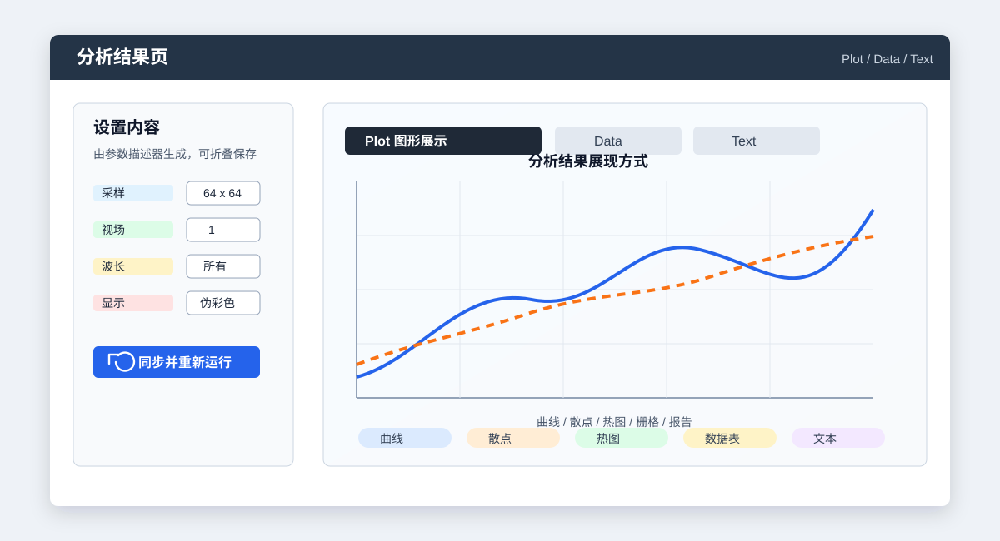
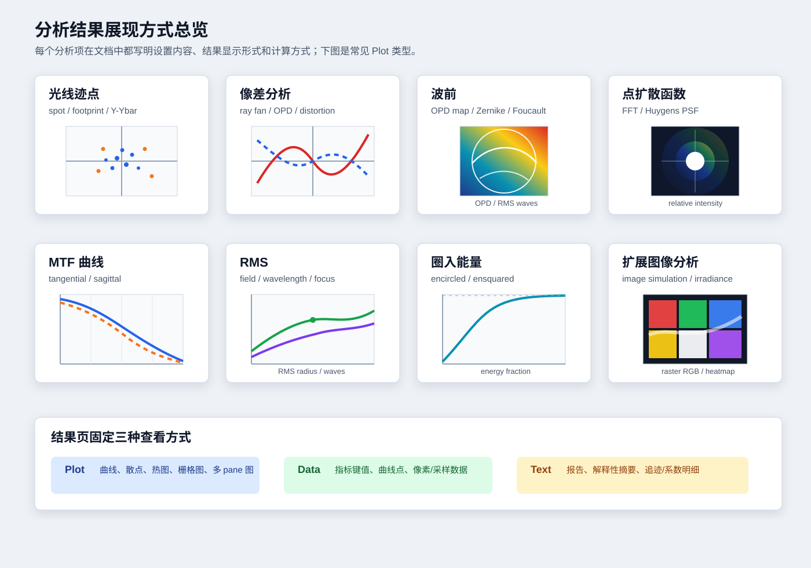

# Zemax 风格分析参考

本文档记录当前 Workbench 中按 Zemax 图像质量层级组织的分析项。范围只包括以下分组：

- 光线迹点
- 像差分析
- 波前
- 点扩散函数
- MTF 曲线
- RMS
- 圈入能量
- 扩展图像分析

不包括系统报告、优化、公差、文件格式转换、镜头库和单纯文件查看器。IMA/BIM Image Viewer 与 Bitmap File Viewer 属于查看器，不作为分析项记录。

## 代码来源

本文按当前工程实现编写，主要对应：

- `src/OptilandWorkbench.App/MainWindow.cs`：Ribbon 分组、菜单、命令名。
- `src/OptilandWorkbench.Application/Legacy/OpticalWorkspaceModel.Analysis.Parameters.cs`：GUI 参数、默认值、可选项。
- `src/OptilandWorkbench.Application/Legacy/OpticalWorkspaceModel.Analysis.cs`：参数到 Core 分析对象的映射。
- `src/OptilandWorkbench.Core/Analysis/*`：实际追迹、波前、PSF、MTF、RMS、圈入能量、图像模拟等算法。

本文描述的是 Workbench 当前实现，不声明与 OpticStudio 每个选项完全等价。

## 通用约定

- 每个分析项都按固定结构记录：`设置内容`、`分析结果展现`、`计算方式`、`备注`。
- `设置内容` 记录当前 GUI 或工厂暴露的参数、默认值、主要可选项和隐藏默认值。
- `分析结果展现` 记录结果页中用户看到的形态，例如曲线、散点、热图、栅格图、矩阵 pane、数据表或文本报告。
- 视场编号与波长编号通常为 1 起始；很多曲线类分析中 `0` 或“所有”表示全部视场/全部波长。
- 表面编号在多数光线和波前分析中 `-1` 或“像面”表示当前像面；MTF 的 `SurfaceNumber=0` 表示像面。
- 光瞳坐标使用归一化 `Px/Py` 或 `Hx/Hy` 范围，常用区间为 `[-1, 1]`。
- 几何坐标默认单位为 mm；界面上写明 `µm` 的缩放、采样间距和半径会在工厂中转换为 mm。
- OPD 与波前误差通常以 waves 作为图上单位；PSF 使用相对强度或 dB；MTF 使用 cycles/mm。
- 常用光瞳采样分布为 `hexapolar`、`uniform`、`sobol`、`random`、`line_x`、`line_y`、`ring`。
- `Sampling`、`PupilSampling`、`ImageSampling` 等选择项写成 `64 x 64` 时，工厂读取前导整数作为采样数。
- 结果页统一有 Plot、Data、Text 视图；Plot 可能是曲线、散点、热图、栅格光栅或多 pane 图。

## 结果页结构图

## 分析结果展现总览

## 光线迹点

### 单光线追迹 / Single Ray Trace

- 设置内容：`FieldNumber=1`，可选“任意”；任意视场时用 `Hx=0`、`Hy=0`。`WavelengthNumber=1`，`Px=0`，`Py=0`，`GlobalCoordinates=false`，`Type=方向余弦`，`UseRayAiming=true`，`ShowRaySegments=false`。
- 分析结果展现：以文本/表格为主，列出单条光线在各表面的坐标、方向余弦或所选角度表达；开启光线段后保留逐段信息。
- 计算方式：按指定视场、波长和归一化瞳孔点生成一条顺序真实光线，经每个表面折射/反射/孔径检查，记录交点、方向、光程和终止状态。任意视场模式直接采用输入的 `Hx/Hy`。
- 备注：该分析适合诊断单条边缘光线、主光线或异常终止位置。

### 标准点列图 / Spot Diagram

- 设置内容：`RayDensity=6`，`Pattern=六边`，`ColorRaysBy=波长`，`Reference=主光线`，`UsePolarization=false`，`DirectionCosines=false`，`ShowAiryDisk=false`，`WavelengthNumber=所有`，`FieldNumber=所有`，`SurfaceNumber=像面`，`DisplayScale=比例尺`，`PlotScaleMicrometers=0`，`ScatterRays=false`，`UseSymbols=true`。
- 分析结果展现：每个视场/波长组合生成像面散点图，可按波长或视场着色，可叠加 Airy disk；Data/Text 包含质心、RMS 半径、几何半径等指标。
- 计算方式：按选定采样分布生成光瞳光线束，追迹到指定表面，剔除失败光线；用主光线或质心作为参考点，把交点转换为相对坐标后画散点并计算矩。
- 备注：`DirectionCosines=true` 时散点数据改为方向余弦空间，用于看出射方向分布。

### 光迹图 / Footprint Diagram

- 设置内容：`RayDensity=10`，`SurfaceNumber=-1`，`WavelengthNumber=0`，`FieldNumber=0`，`DeleteVignetted=false`，`UseSymbols=true`，`ColorRaysBy=field`。
- 分析结果展现：指定表面上的足迹散点，按视场或波长区分符号/颜色。
- 计算方式：从选定视场和波长发射光瞳光线束，保留指定表面的交点。若启用 `DeleteVignetted`，渐晕或孔径失败的样本不进入图形。
- 备注：常用于查看某一机械孔径、镜片表面或像面上的光束占用范围。

### 离焦点列图 / Through Focus

- 设置内容：`RayDensity=6`，`Pattern=六边`，`Reference=主光线`，`DefocusStepMicrometers=50`，`FocusPlaneCount=5`（当前工厂固定），其余点列图参数与标准点列图一致。
- 分析结果展现：围绕名义像面的多个离焦位置分别显示点列图，并输出每个离焦位置的 RMS/半径数据。
- 计算方式：复制当前系统，在像面前后按离焦步长移动像面或等效采样平面，对每个焦位重复点列图追迹和统计，最后恢复名义系统。
- 备注：界面暴露的是离焦范围步长，当前焦面数量固定为 5 个。

### 全视场点列图 / Full Field Spot Diagram

- 设置内容：继承标准点列图；额外 `Magnification=1`。
- 分析结果展现：按多个视场组合展示点列图，强调全视场范围内 spot 的变化。
- 计算方式：对当前系统定义的视场集合逐一运行标准 spot 追迹，统一缩放后组织成全视场视图。
- 备注：适合快速比较轴上、半视场、边缘视场。

### 矩阵点列图 / Matrix Spot Diagram

- 设置内容：继承标准点列图；额外 `IgnoreLateralColor=false`。
- 分析结果展现：按视场与波长矩阵排布点列图，每个 pane 对应一个组合。
- 计算方式：对视场和波长做笛卡尔组合，逐组追迹，按主光线或质心重心化后绘制。
- 备注：`IgnoreLateralColor=true` 时会弱化不同波长主光线漂移对版式的影响。

### 结构矩阵点列图 / Configuration Matrix Spot Diagram

- 设置内容：与标准点列图一致。
- 分析结果展现：按多结构或配置维度组织 spot 结果。
- 计算方式：复用 `SpotDiagramVariantAnalysis` 的 ConfigurationMatrix 变体，对结构/视场/波长组合生成矩阵式 pane。
- 备注：当前行为取决于系统是否已有多重结构数据。

### 基面数据 / Cardinal Points Data

- 设置内容：`ReferenceSurfaceNumber` 默认为最后一个表面编号。
- 分析结果展现：文本/表格形式输出焦距、主平面、节点、焦点等一阶基面数据。
- 计算方式：围绕参考面运行近轴/一阶计算，求系统矩阵和基点位置，再转成相对当前光学系统的报告值。
- 备注：该项在光线迹点组中，但本质是辅助一阶数据。

### 渐晕图 / Vignetting Diagram

- 设置内容：无 GUI 参数。
- 分析结果展现：显示视场或光瞳上的渐晕边界/因子。
- 计算方式：扫描定义视场下的边缘/孔径光线，依据孔径裁切和有效光瞳传输判断渐晕。
- 备注：用于检查某一视场是否被机械孔径或表面孔径截断。

### 入射角 vs. 像高 / Angle vs Image Height

- 设置内容：`FieldDensity=20`，`WavelengthNumber` 默认为主波长。
- 分析结果展现：曲线图，横轴通常为像高或归一化视场，纵轴为入射角。
- 计算方式：沿视场扫描主光线或代表光线，追迹到像面或测量表面，计算局部入射方向与法线/轴的夹角。
- 备注：工厂中还保留了 Through Pupil / Through Field 两个更底层的角度扫描入口，但当前 Ribbon 菜单只暴露本项。

### Y-Ybar

- 设置内容：无 GUI 参数。
- 分析结果展现：Y-Ybar 图，展示边缘光线和主光线在系统中的高度关系。
- 计算方式：追迹近轴/真实的边缘光线与主光线，在各表面采样高度并按传统 Y-Ybar 形式绘制。
- 备注：用于诊断光阑位置、孔径负担和一阶成像关系。

## 像差分析

### 光线像差图 / Ray Fan

- 设置内容：`PlotScaleMicrometers=0`，`NumberOfRays=20`，`UseDashes=false`，`VignettedPupil=true`，`CheckApertures=true`，`WavelengthNumber=所有`，`FieldNumber=所有`，`TangentialAberration=Y Aberration`，`SagittalAberration=X Aberration`，`SurfaceNumber=像面`。
- 分析结果展现：每个视场/波长生成子午和弧矢两个 fan pane；横轴为归一化 pupil 坐标，纵轴为横向像差，单位通常为 µm。
- 计算方式：沿 `Py` 和 `Px` 两条 pupil 截线扫描 `2*NumberOfRays+1` 条光线，追迹到目标表面，减去参考主光线或理想像点，得到 X/Y transverse aberration。
- 备注：工厂启用 `zemaxCompatible=true`，因此曲线密度和 pane 排列按 Zemax 风格。

### 光程差图 / Optical Path Difference

- 设置内容：`GraphScale=0`，`NumberOfRays=20`，`UseDashes=false`，`VignettedPupil=true`，`CheckApertures=true`，`WavelengthNumber=所有`，`FieldNumber=所有`，`SurfaceNumber=像面`。
- 分析结果展现：子午/弧矢 OPD 曲线，纵轴为 waves。
- 计算方式：以主光线参考波前为基准，沿 pupil X/Y 截线采样，追迹后计算每条光线相对参考球/参考光程的 OPD，并除以当前波长转换为 waves。
- 备注：该命令同时出现在“像差分析”和“波前”分组。

### 光瞳像差 / Pupil Aberration

- 设置内容：`NumPoints=256`。
- 分析结果展现：光瞳空间中的像差曲线或散点数据。
- 计算方式：在归一化光瞳上采样真实光线，比较实际出射/成像行为与参考主光线或理想几何关系，生成 pupil aberration 数据。
- 备注：适合看像差随 pupil 坐标的分布，和 Ray Fan 的截线视角互补。

### 全视场像差 / Full Field Aberration

- 设置内容：`FieldShape=椭圆`，`XFieldWidth/YFieldWidth=当前最大视场半径`，`Decomposition=Zernike项`，`MaximumTerm=37`，`Aberration=离焦`，`FieldNumber=第 1 视场`，`WavelengthNumber=主波长`，`XFieldSamples=11`，`YFieldSamples=11`，`PupilSampling=32 x 32`，`DisplayAs=图标`，`DisplayMode=绝对值`。
- 分析结果展现：全视场热图或图标阵列，展示所选像差项在视场中的变化。
- 计算方式：在指定椭圆/矩形视场区域上布点；每个视场点生成 chief-ray 参考波前，做 Zernike 拟合，然后提取离焦、像散、彗差、球差、X/Y 倾斜或 RMS 波前值。
- 备注：该项也出现在“波前”菜单中。

### 场曲/畸变 / Field Curvature

- 设置内容：`ParabasalDelta=0.00001`。
- 分析结果展现：场曲曲线，按波长显示 tangential 与 sagittal 焦面偏移随视场变化。
- 计算方式：用近轴小间隔 `ParabasalDelta` 追迹子午/弧矢邻近光线，求交点斜率和最佳焦面位置，相对名义像面得到场曲。
- 备注：当前 Ribbon 标签写“场曲/畸变”，实际运行的 canonical analysis 是 `Field Curvature`；独立 `Distortion` 工厂存在但当前菜单未以“畸变”单项暴露。

### 畸变 / Distortion

- 设置内容：`MaximumDistortion=0`，`WavelengthNumber=0`，`DisplayMode=百分比`，`ReferenceFieldNumber=1`，`IgnoreVignettingFactors=true`；角度视场或可按角度处理的 real-image-height 系统额外使用 `DistortionType=F-Tan(Theta)`，可选 `F-Theta`。工厂内部默认 `NumPoints=128`、`ScanDirection=+y`。
- 分析结果展现：畸变随定义视场变化的曲线，横轴为百分比畸变或绝对畸变 mm，纵轴为视场坐标。
- 计算方式：为参考视场建立理想线性映射；对每个定义视场追迹主光线得到实际像点，比较实际半径与理想半径。百分比模式输出 `(actual - predicted) / predicted * 100`，绝对值模式输出 `actual - predicted`。
- 备注：当前实现对 real-image-height 视场会先转换为适合畸变分析的等效字段；`ScanDirection` 在结果中标记为 defined-fields，实际使用当前系统定义的视场样本。

### 网格畸变 / Grid Distortion

- 设置内容：`DisplayMode=截面`，`NumPoints=12`，`Scale=1`，`SymmetricMagnification=false`，`WavelengthNumber=1`，`ReferenceFieldNumber=1`，`HeightWidthAspect=1`，`FieldWidth=0`。
- 分析结果展现：理想网格、实际成像网格或畸变向量/截面图。
- 计算方式：在物方/视场平面采样规则网格，追迹主光线到像面，和理想线性放大位置比较，计算 X/Y 畸变量并按显示模式绘制。
- 备注：`SymmetricMagnification` 用于控制理想参考放大率是否强制对称。

### 轴向像差 / Axial Aberration

- 设置内容：`GraphScale=0`，`WavelengthNumber=所有`，`UseDashes=false`。
- 分析结果展现：纵向焦移曲线，横轴为 pupil zone，纵轴为焦点偏移。
- 计算方式：沿归一化 pupil 半径发射轴上或指定参考光线，求不同 zone 光线与光轴/像面附近的交点位置，得到 longitudinal aberration。
- 备注：常用于观察球差与不同波长的纵向色差趋势。

### 垂轴色差 / Lateral Color

- 设置内容：`GraphScale=0`，`AllWavelengths=false`，`UseRealRays=true`，`ShowAiryDisk=true`。
- 分析结果展现：垂轴色差曲线，纵轴为像面位移，通常以 µm 显示；可叠加 Airy disk 参考。
- 计算方式：在多个视场点追迹不同波长主光线或实际光线，比较非主波长与主波长像点位置差。`AllWavelengths=false` 时通常比较短波/长波端点。
- 备注：当前 `analysis-distortion` 命令的标签是“垂轴色差”，canonical mapping 运行的是 `Lateral Color`。

### 色焦移 / Color Focus Shift

- 设置内容：`MaximumShift=0`，`PupilZone=0`。
- 分析结果展现：焦移随波长变化的曲线，横轴为波长，纵轴为焦点漂移。
- 计算方式：若 `PupilZone=0`，使用近轴边缘光线求各波长焦点；若大于 0，则用指定 pupil zone 的真实光线求焦点。结果相对主波长焦点归一。
- 备注：`MaximumShift=0` 表示自动缩放纵轴。

### 赛德尔系数 / Seidel Coefficients

- 设置内容：`WavelengthNumber=主波长`。
- 分析结果展现：文本/表格输出各面或合计的 Seidel 项，例如 SPHA、COMA、ASTI、FCUR、DIST、CLA、CTR。
- 计算方式：基于近轴边缘光线、主光线和每面折射率/曲率计算三阶像差贡献，并累加到系统项。
- 备注：它是像差诊断报告，不是热图。

### 赛德尔图 / Seidel Diagram

- 设置内容：`WavelengthNumber=主波长`，`MaximumAberration=0.1`，`GridInterval=0.01`。
- 分析结果展现：Seidel 系数柱状图，纵轴按最大像差范围限制。
- 计算方式：复用 Seidel 系数计算结果，将各三阶项转换为 bar series。
- 备注：用于快速比较三阶项主导关系。

## 波前

### 波前图 / Wavefront Map

- 设置内容：`Sampling=64 x 64`，`Rotation=0`，`DisplayScale=1`，`Apodization=无`，`ReferenceChiefRay=false`，`UseExitPupilShape=true`，`WavelengthNumber=主波长`，`FieldNumber=1`，`SurfaceNumber=像面`，`DisplayAs=表面`，`RemoveTilt=false`，`PupilSx=0`，`PupilSy=0`，`PupilSr=1`。
- 分析结果展现：方形 pupil 热图/表面图，颜色为 OPD waves；标题包含 RMS/PV 等摘要。
- 计算方式：在 pupil 区域生成 chief-ray 参考的均匀波前采样，追迹到目标表面，计算相对参考光程；可按 `RemoveTilt` 拟合并移除倾斜平面，再插值到 map。
- 备注：`PupilSx/PupilSy/PupilSr` 用于偏移或缩放采样 pupil。

### 干涉图 / Interferogram

- 设置内容：`NumRings=15`，`MapSize=65`。
- 分析结果展现：当前实现复用 `WavefrontAnalysis` 的 OPD 热图/波前数据。
- 计算方式：使用 hexapolar pupil rings 采样 OPD，再映射到 `MapSize` 的二维 map。
- 备注：当前没有单独的真实干涉条纹渲染器；菜单名称是 Interferogram，但数据路径与 Wavefront 共用。

### 普通波前 / Wavefront

- 设置内容：`NumRings=15`，`MapSize=65`。
- 分析结果展现：OPD heatmap 与 RMS/PV 指标。
- 计算方式：hexapolar pupil 采样，主光线参考 OPD，插值生成方形 map。
- 备注：这是命令注册项，当前二级菜单主要暴露“光程差图”和“波前图”。

### 质心参考球波前 / Centroid Sphere Wavefront

- 设置内容：`NumRings=8`，`MapSize=65`，`RobustTrimStandardDeviations=3`。
- 分析结果展现：OPD map，指标包含参考球中心、半径、平均 OPD、RMS OPD、PV OPD、RMS waves。
- 计算方式：追迹 pupil 光线得到像点云，以质心定义参考球中心，计算每条光线相对该参考球的 OPD；可用 sigma 裁剪降低离群光线影响。
- 备注：当前属于波前命令组，但不在二级菜单列表中。

### 最佳拟合球波前 / Best Fit Sphere Wavefront

- 设置内容：`NumRings=8`，`MapSize=65`，`RobustTrimStandardDeviations=3`。
- 分析结果展现：同质心参考球波前，但参考球由最佳拟合得到。
- 计算方式：对光线截距和光程做四参数球面拟合，寻找使 OPD 残差 RMS 最小的参考球，再生成 OPD map。
- 备注：适合在像点偏斜或质心不代表最佳参考球时使用。

### 傅科分析 / Foucault Analysis

- 设置内容：`Sampling=32 x 32`，`Type=线性`，`DisplayAs=灰度`，`KnifeEdge=水平线上`，`DataSource=计算的`，`WavelengthNumber=主波长`，`FieldNumber=1`，`YPositionMicrometers=0`，`UsePolarization=false`。
- 分析结果展现：灰度或伪彩色 pupil 响应图。
- 计算方式：由 wavefront samples 计算局部斜率/梯度，根据刀口方向和位置模拟遮挡响应；线性或二次模式控制强度映射。
- 备注：当前数据源只有“计算的”。

### 对比度损失图 / Contrast Loss Map

- 设置内容：`PupilSampling=32`，`ZernikeTerms=37`，`PlotPointCount=128`，`MaximumFrequency=0`。
- 分析结果展现：当前实现调用 `SampledMtfAnalysis`，输出 sampled MTF 曲线，而不是独立二维 contrast heatmap。
- 计算方式：先对 wavefront 做 Zernike 拟合，再计算频率位移后 pupil 复振幅重叠积分，归一化得到 MTF/contrast。
- 备注：它在“波前”菜单中，算法实际上属于 sampled MTF。

### Zernike Fringe 系数 / Zernike Fringe

- 设置内容：`PupilSampling=32 x 32`，`ZernikeTerms=37`，`WavelengthNumber=主波长`，`FieldNumber=1`。
- 分析结果展现：Zernike 系数表、拟合波前 map 与残差/摘要指标。
- 计算方式：在均匀 pupil 网格上生成 OPD samples，使用 Fringe Zernike 基函数做最小二乘拟合。
- 备注：当前 Fringe 项数上限为 37。

### Zernike Standard 系数 / Zernike Standard

- 设置内容：`NumRings=15`，`ZernikeTerms=37`，`WavelengthNumber=主波长`，`FieldNumber=1`。
- 分析结果展现：Standard Zernike 系数和波前重建。
- 计算方式：用 hexapolar rings 采样 OPD，按 Standard Zernike 规范拟合系数。
- 备注：适合与 Standard 多项式定义对照。

### Zernike Annular 系数 / Zernike Annular

- 设置内容：`NumRings=15`，`ZernikeTerms=37`，`ObscurationRatio=0.5`，`WavelengthNumber=主波长`，`FieldNumber=1`。
- 分析结果展现：环形孔径 Zernike 系数和波前重建。
- 计算方式：剔除中心遮光区后，在 annular pupil 上按环形 Zernike 基函数拟合。
- 备注：用于有中心遮挡的反射或折反系统。

### Zernike 系数 / Zernike

- 设置内容：`NumRings=15`，`ZernikeTerms=37`，`MapSize=65`。
- 分析结果展现：Zernike 系数表和拟合/残差 map。
- 计算方式：通用 Zernike 拟合入口，按采样 ring 生成 OPD 后做最小二乘拟合。
- 备注：当前属于波前命令组，但不在二级菜单列表中。

### Zernike 系数 vs. 视场 / Zernike vs Field

- 设置内容：`FieldDensity=20`，`NumRings=12`，`ZernikeTerms=8`，`WavelengthNumber=主波长`。
- 分析结果展现：多条曲线，横轴为视场，纵轴为指定 Zernike 系数。
- 计算方式：沿视场扫描，在每个视场点生成 OPD samples 并拟合前若干 Zernike 项，逐项组成曲线。
- 备注：适合观察像差项随视场的变化趋势。

### Jones 瞳 / Jones Pupil

- 设置内容：`GridSize=65`。
- 分析结果展现：Jones pupil 的多个分量图或偏振指标图。
- 计算方式：在 pupil 网格发射偏振光线，沿顺序表面积累 Fresnel/涂层/坐标旋转对 Jones 矩阵的影响，最后在 pupil 上绘制矩阵分量。
- 备注：属于波前命令组，但当前二级菜单未列出。

## 点扩散函数

### FFT PSF

- 设置内容：`Sampling=64 x 64`，`Display=128 x 128`，`Rotation=0`，`ImageDeltaMicrometers=0`，`UsePolarization=false`，`WavelengthNumber=所有`，`FieldNumber=1`，`Type=线性`，`DisplayAs=伪彩色`，`SurfaceNumber=像面`，`Normalized=false`。
- 分析结果展现：二维 PSF heatmap，物理坐标为 µm，强度为相对强度或对数 dB。
- 计算方式：建立复 pupil 振幅和相位，按波长计算 FFT PSF；多波长时按波长权重合成；根据显示尺寸裁切/重采样到输出网格。
- 备注：`ImageDeltaMicrometers=0` 时由衍射引擎自动估计像面采样间距。

### FFT PSF Cross Section

- 设置内容：`Sampling=64 x 64`，`Row=中心`，`GraphScaleMicrometers=0`，`UsePolarization=false`，`WavelengthNumber=所有`，`FieldNumber=1`，`Type=X-线性`，`Normalized=false`。
- 分析结果展现：PSF 中心 X 或 Y 截线曲线。
- 计算方式：先计算 FFT PSF，再提取中心行或列；线性模式输出强度，对数模式输出 dB。
- 备注：若设置了 `Sampling`，显示网格通常为 `2*Sampling`。

### FFT 线/边缘扩散 / FFT Line Edge Spread

- 设置内容：`Sampling=64 x 64`，`Spread=线`，`GraphScaleMicrometers=0`，`UsePolarization=false`，`WavelengthNumber=所有`，`FieldNumber=1`，`Type=X-线性`，`UseCoherentPsf=false`。
- 分析结果展现：线扩散函数 LSF 或边缘扩散函数 ESF 曲线。
- 计算方式：由 FFT PSF 沿指定方向积分得到 line spread；edge spread 为 line spread 的累积分布并归一。
- 备注：`UseCoherentPsf=true` 时使用相干 PSF 路径。

### Huygens PSF

- 设置内容：`PupilSampling=32 x 32`，`ImageSampling=32 x 32`，`ImageDeltaMicrometers=0`，`Rotation=0`，`UsePolarization=false`，`UseCentroid=false`，`WavelengthNumber=所有`，`FieldNumber=1`，`Type=线性`，`DisplayAs=伪彩色`，`Normalized=false`。
- 分析结果展现：Huygens-Fresnel PSF heatmap，坐标为 µm 或由 pixel pitch 换算。
- 计算方式：在 exit pupil 上采样复振幅，直接对像面网格做 Huygens-Fresnel 求和，包含相位传播和倾斜/斜率因子，再归一化。
- 备注：比 FFT PSF 更直接，但采样成本更高。

### Huygens PSF Cross Section

- 设置内容：`NumRays=9`，`ImageSize=32`，`PixelPitchMillimeters=0.005`。
- 分析结果展现：Huygens PSF 的中心截线曲线。
- 计算方式：按给定 pupil 光线数生成 Huygens PSF，再提取中心线并以 pixel pitch 标定横轴。
- 备注：参数更偏向低阶校验和快速截线。

## MTF 曲线

### 傅里叶 MTF / MTF

- 设置内容：`Sampling=64`，`MaximumFrequency=0`，`WavelengthNumber=0`，`FieldNumber=0`，`SurfaceNumber=0`，`Type=调制`，`ShowDiffractionLimit=false`，`UsePolarization=false`，`UseDashes=false`。
- 分析结果展现：tangential 与 sagittal MTF 曲线，横轴 cycles/mm，纵轴为调制度、实部、虚部、相位或方波 MTF。
- 计算方式：先计算 FFT PSF，再对 PSF 强度做二维 FFT 得到 OTF；取中心轴切片形成 tangential/sagittal MTF。多波长时按波长权重合成。
- 备注：`MaximumFrequency=0` 时使用截止频率；工厂启用 Zemax-compatible 输出，并重采样为稳定曲线点。

### 傅里叶离焦 MTF / Fourier Through Focus MTF

- 设置内容：`Sampling=64`，`DeltaFocus=0.1 mm`，`Frequency=0 cycles/mm`，`NumberOfSteps=5`，`WavelengthNumber=0`，`FieldNumber=0`，`Type=调制`，`UsePolarization=false`，`UseDashes=false`。
- 分析结果展现：指定空间频率下，MTF 随离焦变化的 tangential/sagittal 曲线。
- 计算方式：在 `[-DeltaFocus, +DeltaFocus]` 内移动像面或等效焦位，每个焦位计算 Fourier MTF，然后在指定频率插值得到曲线点。
- 备注：`Frequency=0` 时使用默认/低频采样策略。

### 傅里叶 MTF vs Field

- 设置内容：`SpatialFrequency=20 cycles/mm`，`PupilSampling=32`，`ImageSize=64`，`PixelPitchMillimeters=0.005`，`WavelengthNumber=0`；内部 `FieldPointCount=21`。
- 分析结果展现：固定空间频率下，MTF 随视场变化曲线。
- 计算方式：沿视场扫描，在每个视场点计算 Fourier MTF 并取指定频率的 tangential/sagittal 值。
- 备注：该参数组与 Huygens/Geometric MTF vs Field 共用部分设置。

### 惠更斯 MTF / Huygens MTF

- 设置内容：`PupilSampling=64`，`ImageSampling=64`，`ImageDeltaMicrometers=0`，`MaximumFrequency=0`，`WavelengthNumber=0`，`FieldNumber=0`。
- 分析结果展现：tangential/sagittal MTF 曲线。
- 计算方式：先用 Huygens-Fresnel 直接求和得到 PSF，再对 PSF 做二维 FFT 生成 OTF/MTF。
- 备注：频率步长由像面采样间距和图像尺寸决定。

### 惠更斯离焦 MTF / Huygens Through Focus MTF

- 设置内容：`PupilSampling=64`，`ImageSampling=64`，`ImageDeltaMicrometers=0`，`DeltaFocus=0.1 mm`，`SpatialFrequency=50 cycles/mm`，`Steps=5`，`WavelengthNumber=0`，`FieldNumber=0`。
- 分析结果展现：指定频率下 Huygens MTF 随离焦变化曲线。
- 计算方式：逐焦位计算 Huygens PSF 和 MTF，在空间频率处插值得到 tangential/sagittal 值。
- 备注：比 Fourier through focus 成本高。

### 惠更斯 MTF vs Field

- 设置内容：`SpatialFrequency=20 cycles/mm`，`PupilSampling=32`，`ImageSize=64`，`PixelPitchMillimeters=0.005`，`WavelengthNumber=0`；内部 `FieldPointCount=21`。
- 分析结果展现：固定频率下 Huygens MTF 随视场变化曲线。
- 计算方式：沿视场扫描，每个视场点运行 Huygens PSF -> OTF -> MTF，再取指定频率。
- 备注：用于比较全视场衍射成像质量。

### 几何 MTF / Geometric MTF

- 设置内容：`NumRays=32`，`PlotPointCount=128`，`Distribution=uniform`，`MaximumFrequency=0`，`WavelengthNumber=0`，`FieldNumber=0`，`ScaleByDiffractionLimit=true`。
- 分析结果展现：几何 tangential/sagittal MTF 曲线。
- 计算方式：追迹几何 spot 光线，把像点分布投影为一维 histogram，再用 cos/sin 积分计算 OTF；可乘以圆孔衍射极限包络。
- 备注：不需要波前相位，适合几何像差主导或快速估算。

### 几何离焦 MTF / Geometric Through Focus MTF

- 设置内容：`Sampling=64`，`DeltaFocus=0.1 mm`，`SpatialFrequency=50 cycles/mm`，`Steps=5`，`WavelengthNumber=0`，`FieldNumber=0`，`Distribution=uniform`，`ScaleByDiffractionLimit=true`。
- 分析结果展现：固定频率下几何 MTF 随焦位变化。
- 计算方式：逐焦位追迹几何 spot，按 histogram Fourier 积分得到 MTF 并取指定频率。
- 备注：适合与 Through Focus spot 联合判断最佳焦位。

### 几何 MTF vs Field

- 设置内容：`SpatialFrequency=20 cycles/mm`，`PupilSampling=32`，`ImageSize=64`，`PixelPitchMillimeters=0.005`，`WavelengthNumber=0`，`Distribution=uniform`，`ScaleByDiffractionLimit=true`；内部 `FieldPointCount=21`。
- 分析结果展现：固定频率下几何 MTF 随视场变化。
- 计算方式：沿视场扫描，逐点用几何 spot histogram 方法求 tangential/sagittal MTF。
- 备注：`ImageSize/PixelPitchMillimeters` 对几何方法主要用于共用设置结构，不是核心几何积分参数。

### Sampled MTF / Contrast Loss Map 使用的采样 MTF

- 设置内容：`PupilSampling=32`，`ZernikeTerms=37`，`PlotPointCount=128`，`MaximumFrequency=0`。
- 分析结果展现：sampled MTF 频率曲线。
- 计算方式：生成 pupil OPD，拟合 Zernike 波前；对不同空间频率计算 frequency-shifted pupil overlap，归一化得到 MTF。
- 备注：Ribbon 菜单里叫“对比度损失图”时仍走同一实现。

## RMS

### RMS vs. 视场 / RMS vs Field

- 设置内容：`NumRings=6`，`Distribution=hexapolar`。
- 分析结果展现：每个波长一条 RMS spot radius 曲线，横轴为视场。
- 计算方式：对每个定义视场和波长追迹 pupil 光线束，按像点参考统计 RMS spot 半径。
- 备注：工厂传入 `NumFields=64`，但当前生成数据主要使用系统已定义视场样本。

### RMS vs. 波长 / RMS vs Wavelength

- 设置内容：`WaveDensity=21`，`NumRings=6`，`Distribution=hexapolar`，`FieldNumber=0`，`Reference=centroid`。
- 分析结果展现：RMS spot radius 随波长变化曲线。
- 计算方式：在当前波长范围内生成 `WaveDensity` 个采样波长；每个波长追迹光线束并按质心或主光线参考计算 RMS 半径。
- 备注：`FieldNumber=0` 表示全部视场。

### RMS vs. 离焦 / RMS vs Focus

- 设置内容：`FocusDensity=21`，`MinimumFocus=-1`，`MaximumFocus=1`，`NumRings=6`，`Distribution=hexapolar`，`WavelengthNumber=0`，`Reference=centroid`。
- 分析结果展现：RMS spot radius 随焦移变化曲线，并可找出最小 RMS 焦位。
- 计算方式：在给定焦移范围内移动像面或等效采样平面，每个焦位追迹光线束并计算 RMS spot 半径。
- 备注：单位为 mm，范围默认覆盖 `[-1, +1]` mm。

### 二维视场 RMS 图 / RMS Field Map

- 设置内容：`XFieldSamples=11`，`YFieldSamples=11`，`XFieldWidth=0`，`YFieldWidth=0`，`NumRings=6`，`Distribution=hexapolar`，`WavelengthNumber=0`，`Reference=centroid`。
- 分析结果展现：二维视场 heatmap，颜色为 RMS spot radius。
- 计算方式：在 X/Y 视场矩形内采样网格；每个网格点追迹 pupil 光线束，计算 RMS spot radius。
- 备注：`XFieldWidth/YFieldWidth=0` 时使用系统视场范围自动确定。

### RMS Wavefront vs Field

- 设置内容：`NumRings=12`；工厂内部 `NumFields=32`。
- 分析结果展现：每个波长一条 RMS wavefront error 曲线，纵轴为 waves。
- 计算方式：沿视场扫描 chief-ray 参考波前，对每个视场点采样 OPD 并计算 RMS。
- 备注：参数和工厂存在于 catalog 中，但当前主 Ribbon 的 RMS 二级菜单未列出。

## 圈入能量

### 衍射圈入能量 / Diffraction Encircled Energy

- 设置内容：`PupilSampling=64 x 64`，`ImageSampling=128 x 128`，`NumPoints=256`，`WavelengthNumber=0`，`FieldNumber=0`，`Type=encircled`，`Reference=centroid`，`MaximumDistanceMicrometers=0`。
- 分析结果展现：圈入能量、X-only、Y-only 或 ensquared energy 曲线。
- 计算方式：计算 FFT diffraction PSF，在像面网格上按相对参考点的半径、X/Y 距离或方框距离排序积分，归一化累计能量。
- 备注：`MaximumDistanceMicrometers=0` 时自动覆盖有效 PSF 范围。

### 几何圈入能量 / Encircled Energy

- 设置内容：`NumRays=10000`，`NumPoints=256`，`Distribution=sobol`。
- 分析结果展现：几何 encircled energy 曲线。
- 计算方式：追迹大量几何光线，计算像点到参考点的半径，排序后累计权重并按半径采样输出。
- 备注：默认使用 Sobol 采样降低随机噪声。

### 几何线/边缘扩散 / Geometric Line Edge Spread

- 设置内容：`PupilSampling=32 x 32`，`NumPoints=257`，`WavelengthNumber=0`，`FieldNumber=1`，`Orientation=X`，`Display=line and edge`，`MaximumRadiusMicrometers=0`。
- 分析结果展现：几何 LSF、ESF 或二者同时显示。
- 计算方式：追迹几何 spot，将像点投影到 X 或 Y 方向；对投影分布做 histogram 得到 line spread，对 line spread 积分得到 edge spread。
- 备注：虽然放在圈入能量组中，计算对象是几何线/边缘扩散。

### 扩展光源圈入能量 / Extended Source Encircled Energy

- 设置内容：`FieldSize=0`，`SourceSampling=5`，`NumRays=5000`，`NumPoints=256`，`WavelengthNumber=0`，`FieldNumber=1`，`Type=encircled`，`Reference=centroid`，`MaximumDistanceMicrometers=0`。
- 分析结果展现：扩展源的 encircled/X-only/Y-only/ensquared energy 曲线。
- 计算方式：在扩展光源或视场区域上采样多个源点，每个源点追迹光线束，把所有像点按能量权重合并后累计积分。
- 备注：`FieldSize=0` 时使用与当前视场相关的默认源尺寸。

## 扩展图像分析

### 图像模拟 / Image Simulation

- 设置内容：`SourceImage=彩色测试卡`，`PsfSize=32`，`NumRays=16`，`EigenPsfComponents=3`，`DistortionGridSize=9`，`DistortionPolynomialDegree=5`；工厂固定 `PsfGridRows=3`，`PsfGridColumns=3`，`Padding=16`。
- 分析结果展现：RGB 栅格图像，展示经过系统 PSF、畸变和场依赖模糊后的模拟成像。
- 计算方式：先生成测试源图；在视场网格上计算场依赖 PSF stack；用 EigenPSF 分解降低空间变化卷积成本；拟合畸变多项式并对图像做反向 warp；最后按 RGB 通道合成。
- 备注：源图可选彩色测试卡、分辨率靶标、畸变网格、西门子星。

### 几何图像分析 / Geometric Image Analysis

- 设置内容：`SourceImage=分辨率靶标`，`ImageSize=64`，`NumRays=8`。
- 分析结果展现：几何光线形成的灰度/强度栅格图像。
- 计算方式：把源图像采样为物方/视场点，对每个点发射多条 pupil 光线并追迹到像面，根据落点累积像素强度。
- 备注：不包含衍射 PSF；主要显示几何像差和畸变。

### 几何位图图像分析 / Geometric Bitmap Image Analysis

- 设置内容：`ImageSize=64`，`RaysPerPixel=8`。
- 分析结果展现：位图式几何成像结果。
- 计算方式：以内部色卡/位图源为输入，对每个源像素发射 `RaysPerPixel` 条几何光线，按像面落点重采样。
- 备注：当前不读取外部位图文件；外部位图查看器不属于本分析。

### 光源分析 / Light Source Analysis

- 设置内容：`Resolution=65`，`NumRays=2048`。
- 分析结果展现：光源/远场强度或辐射分布 heatmap。
- 计算方式：当前实现调用辐射强度分析路径，采样光线方向并在角度 bin 上累积能量。
- 备注：用于扩展图像分析中的光源分布诊断。

### 部分相干图像分析 / Partially Coherent Image Analysis

- 设置内容：`ImageSize=64`，`PupilSampling=16 x 16`，`Coherence=0.5`。
- 分析结果展现：部分相干条件下的模拟图像。
- 计算方式：以分辨率靶标为源图，使用 pupil 采样构造相干和非相干成像贡献，并按 `Coherence` 在两者之间混合。
- 备注：`Coherence=0` 接近非相干，`Coherence=1` 接近相干。

### 扩展衍射图像分析 / Extended Diffraction Image Analysis

- 设置内容：`SourceImage=分辨率靶标`，`ImageSize=64`，`PupilSampling=16 x 16`，`FieldGrid=5`。
- 分析结果展现：带场依赖衍射模糊的图像模拟结果。
- 计算方式：对源图生成 field grid；每个视场格点计算衍射 PSF，再用空间变化 PSF 对源图进行卷积/插值，得到扩展衍射图像。
- 备注：比几何图像分析更接近衍射成像，但成本更高。

### 相对照度 / Relative Illumination

- 设置内容：`RayDensity=10`，`FieldDensity=21`，`WavelengthNumber=0`（主波长），`ScanDirection=+y`，`RemoveVignettingFactors=true`。
- 分析结果展现：相对照度随视场扫描方向变化的曲线。
- 计算方式：沿指定视场方向扫描，追迹矩形 pupil 网格，积分 transmitted effective pupil area，并按最大场照度归一化。
- 备注：`RemoveVignettingFactors=true` 时会移除字段中的渐晕因子影响，观察系统本身照度变化。

### 非相干照度 / Incoherent Irradiance

- 设置内容：`NumRays=5`，`ResolutionX=128`，`ResolutionY=128`，`DetectorSurfaceIndex=-1`，`Distribution=random`，`Normalized=true`。
- 分析结果展现：探测器面非相干照度 heatmap。
- 计算方式：从光瞳或源分布发射随机/指定分布光线，追迹到探测器表面，在二维 detector bin 上累积非相干能量；可归一化显示。
- 备注：属于扩展图像分析命令组，但当前二级菜单未列出。

### 辐射强度 / Radiant Intensity

- 设置内容：`AngularBinsX=101`，`AngularBinsY=101`，`NumRays=2048`，`ReferenceSurfaceIndex=-1`，`Distribution=random`，`UseAbsoluteUnits=true`。
- 分析结果展现：角空间辐射强度 heatmap。
- 计算方式：追迹光线到参考表面，读取出射方向，把方向角投影到 X/Y 角度 bin 中累积能量；可使用绝对单位或归一化单位。
- 备注：属于扩展图像分析命令组，但当前二级菜单未列出。

## 当前实现注意点

- “光程差图”和“全视场像差”在多个分组出现，实际共用同一 Core 分析。
- “对比度损失图”当前复用 `SampledMtfAnalysis`，输出曲线而非单独二维损失 map。
- “干涉图”当前复用普通波前 OPD map，没有独立干涉条纹渲染。
- Ribbon 中 `analysis-distortion` 的显示名是“垂轴色差”，实际 canonical name 为 `Lateral Color`；独立 `DistortionAnalysis` 已在本文作为 catalog 能力记录，但当前这一路菜单不会触发它。
- 质心球波前、最佳拟合球波前、通用 Zernike、Jones Pupil、非相干照度、辐射强度属于已注册命令或工厂能力，但不是所有项都在当前二级菜单中显示。
