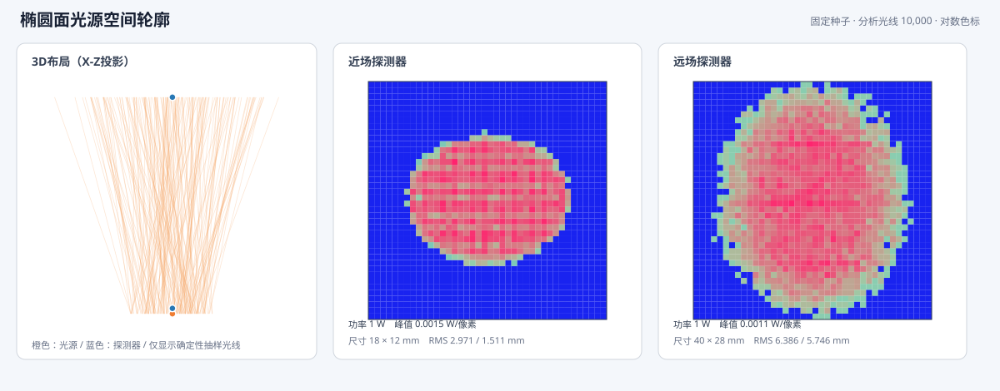
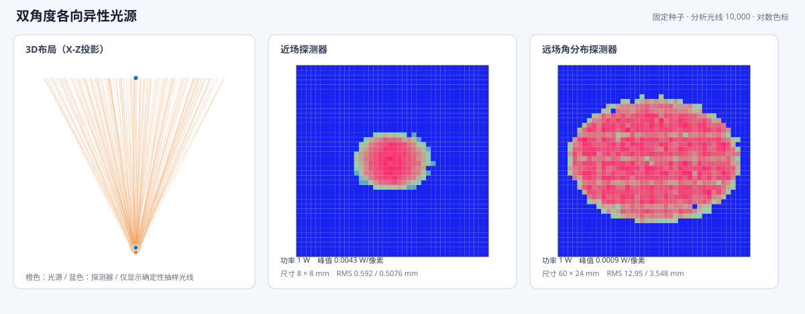
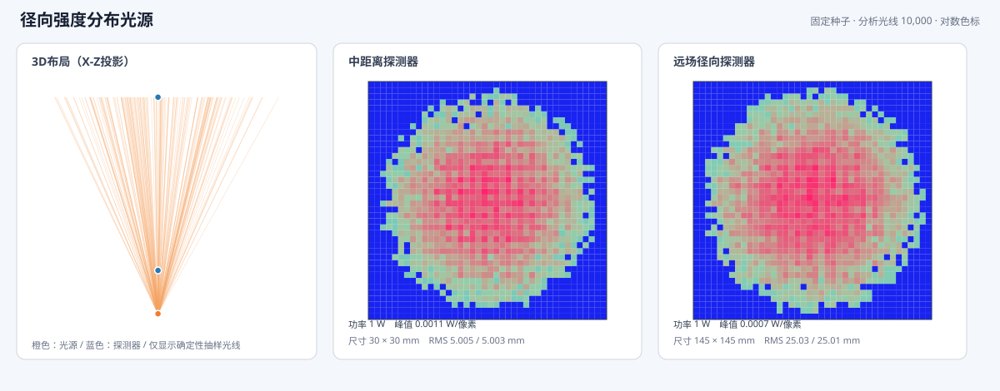
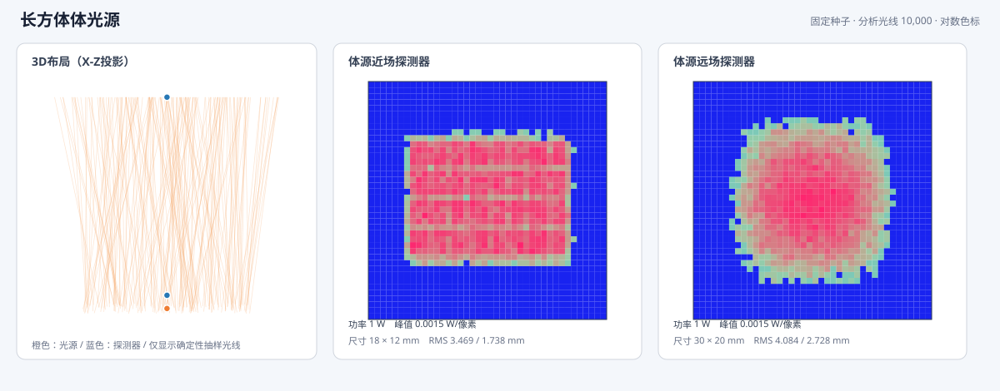
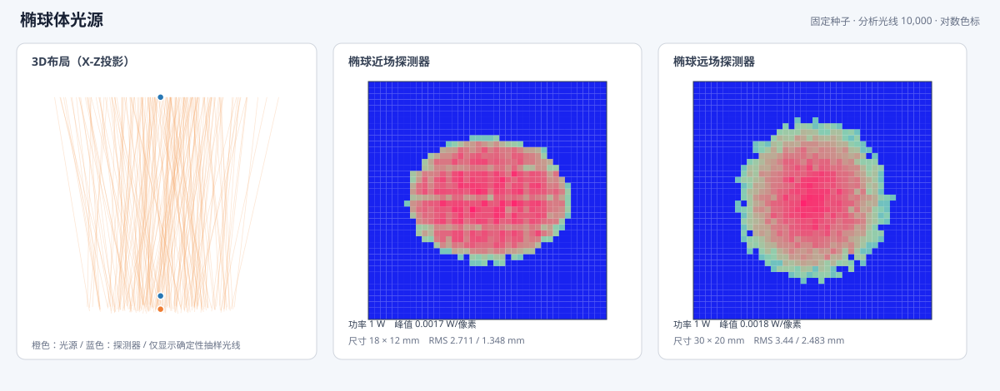
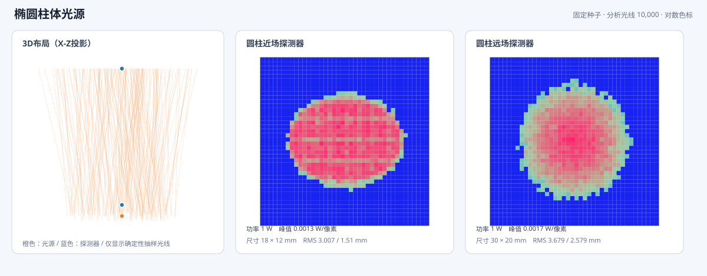

# 非序列功能测试与教学样例

这里的 12 个 `.staropt` 文件是 Workbench 原生非序列工程，可以直接通过“文件 > 打开”载入。打开后切换到“设置 > 工作模式 > 非序列模式”，使用对象编辑器、非序列3D布局、追迹控制、光线数据库、路径分析和探测器查看器完成练习。

这些样例借鉴 Zemax OpticStudio 官方教程中“对象—追迹—探测器—光线数据库—路径筛选”的教学顺序，但几何、参数、文件和预期结果均由本项目独立设计，不是 Zemax 示例文件的复制或转换，也不声明 NSC/ZRD 兼容。参考资料：

- [简单非序列系统：光源、镜片、探测器和光管](https://optics.ansys.com/hc/en-us/articles/42661713082899-How-to-create-a-simple-non-sequential-system)
- [非序列模式概览：分支、探测器和光线数据库](https://optics.ansys.com/hc/en-us/articles/42661670424851-Exploring-Non-Sequential-Mode-in-OpticStudio)
- [复杂非序列对象与全反射光管](https://optics.ansys.com/hc/en-us/articles/42661740806675-How-to-create-complex-non-sequential-objects)
- [杂散光分析概览](https://optics.ansys.com/hc/en-us/articles/45146457845395-Stray-Light-Analysis-Overview)

07号椭圆面源以及10—12号体源样例为了演示前向投影，显式保留旧的兼容圆锥方向分布；在对象编辑器中新建矩形/椭圆面源时默认使用 Zemax 风格 `VirtualPoint`，新建体源默认使用全空间均匀球面方向。

## 建议学习顺序

### 01 基础镜片与探测器

文件：`01-basic-lens-detector.staropt`

对象为矩形扩展光源、N-BK7双凸标准镜片和像面探测器。首次打开3D布局会自动使用对象的布局射线数建立共享布局会话；随后运行分析追迹并查看探测器。固定随机种子下，2,000条源光线应产生2,000个完成分支，约`0.957835 W`到达探测器。

建议筛选：`D3`、`SEQ(Q1,H2,T2,D3)`。

### 02 Fresnel主光与鬼像路径

文件：`02-fresnel-main-and-ghost.staropt`

打开Fresnel分支后，镜片界面同时产生反射与透射子分支；前向探测器记录主光，后向探测器记录前表面反射。400条源光线应形成1,600个完成分支，两个探测器都有非零结果。

建议筛选：`D3`、`D4`、`SEQ(Q1,H2,R2,D4)`、`R2`。把追迹模式设为“光线数据库”后，可在路径分析中比较主路径和反射路径功率。

### 03 矩形光管全反射

文件：`03-total-internal-reflection-light-pipe.staropt`

点光源和出口探测器包含在N-BK7长方体内。光线可重复命中同一对象侧壁，并以全反射继续传播。追迹结果必须包含`TotalInternalReflection`事件，约`0.961063 W`到达出口。

建议筛选：`D3`、`R1 & D3`、`SEQ(Q2,R1,D3)`。

### 04 双反射镜折叠光路

文件：`04-two-mirror-folded-path.staropt`

单射线先沿+Z传播，经第一面镜转向+X，再由第二面镜转回+Z并到达探测器。对象编号不是追迹的预定义表面顺序；实际命中完全由空间位置和方向决定。

建议筛选：`D4`、`SEQ(Q1,H2,R2,H3,R3,D4)`。正确路径包含两次反射和一次探测，共3个分段，功率为`1 W`。

### 05 三波长多光源探测

文件：`05-three-wavelength-sources.staropt`

蓝、绿、红三个高斯光源分别使用486.1、587.6和656.3 nm，功率为0.25、0.5和0.25 W。探测器按波长分别累计像素功率，总功率应为`1 W`。

建议筛选：`W1 & D4`、`W2 & D4`、`W3 & D4`、`Q2 & D4`。

### 06 内嵌STL机械挡光环

文件：`06-embedded-stl-baffle.staropt`

工程内嵌一个8三角形开放STL方孔挡光环，不需要原始STL文件。开放网格使用双面吸收；约`0.48975 W`穿过中心方孔到达探测器，约`0.51025 W`被机械结构吸收。

建议筛选：`D3`、`H2 & A`、`SEQ(Q1,H2,A)`、`M2 & D3`。这个样例适合验证STAROPT资产内嵌、机械遮挡、吸收能量平衡及数据库筛选后的探测器重建。

### 07 椭圆面光源空间轮廓

文件：`07-ellipse-source-footprint.staropt`

12 × 6 mm椭圆面光源依次穿过非吸收近场探测器和吸收远场探测器。近场用于观察椭圆发光口径，远场用于观察8°发散后的扩展光斑。两面探测器都记录约`1 W`，但能量平衡只把最终吸收探测器计为终止功率。

建议筛选：`H2`、`D3`、`SEQ(Q1,H2,D3)`。



### 08 双角度各向异性光源

文件：`08-two-angle-anisotropic-source.staropt`

椭圆孔径光源的X/Y发散半角分别为18°和5°。远场光斑的X向RMS宽度应显著大于Y向，可用于验证Zemax Source Two Angle风格的独立方向分布。

建议筛选：`H2`、`D3`、`SEQ(Q1,H2,D3)`。



### 09 径向强度分布光源

文件：`09-radial-intensity-distribution.staropt`

径向表为`0°:1、10°:1、20°:0.55、35°:0`。采样会进行线性插值并计入立体角权重；中距离和远场探测器应得到同轴、近似圆对称分布。

建议筛选：`H2`、`D3`、`SEQ(Q1,H2,D3)`。



### 10 长方体体光源

文件：`10-volume-rectangle-source.staropt`

光线起点在12 × 6 × 4 mm长方体内部均匀分布，方向位于3°圆锥内。3D布局用于观察起点深度，近场与远场用于比较体积投影和传播展宽。

建议筛选：`H2`、`D3`、`SEQ(Q1,H2,D3)`。



### 11 椭球体光源

文件：`11-volume-ellipse-source.staropt`

光线起点在半轴6、3、2 mm的椭球体内部均匀分布。近场轮廓应呈平滑椭圆边缘，区别于长方体体源。

建议筛选：`H2`、`D3`、`SEQ(Q1,H2,D3)`。



### 12 椭圆柱体光源

文件：`12-volume-cylinder-source.staropt`

光线起点在X/Y半径6、3 mm、长度6 mm的椭圆柱体内部均匀分布。该样例用于比较柱体恒定横截面与椭球体随深度收缩的区别。

建议筛选：`H2`、`D3`、`SEQ(Q1,H2,D3)`。



## 自动验证和重新生成

`index.json`记录文件、课程目标、对象/资产数量、确定性分支数、能量结果、探测器峰值/质心/RMS基准、效果图路径和建议筛选。自动测试会逐个重新载入、追迹并验证这些值。

从仓库根目录重新生成全部文件：

```bash
dotnet run --project tools/OptilandWorkbench.NonSequentialSamples/OptilandWorkbench.NonSequentialSamples.csproj -- samples/non-sequential
```

生成器使用固定GUID和随机种子，先完成真实追迹和能量/筛选验收，再通过STAROPT原子保存发布文件。生成中断不会留下半个工程文件。

## 能力边界

样例覆盖当前正式实现的10类原生光源、非相干功率、几何光线、Fresnel分支、镜面反射、全反射、吸收/非吸收像素矩形探测器和STL机械网格。它们不演示散射、偏振、相干、镀膜、非序列优化/公差、精确STEP/IGES/SAT CAD或Zemax文件兼容。
