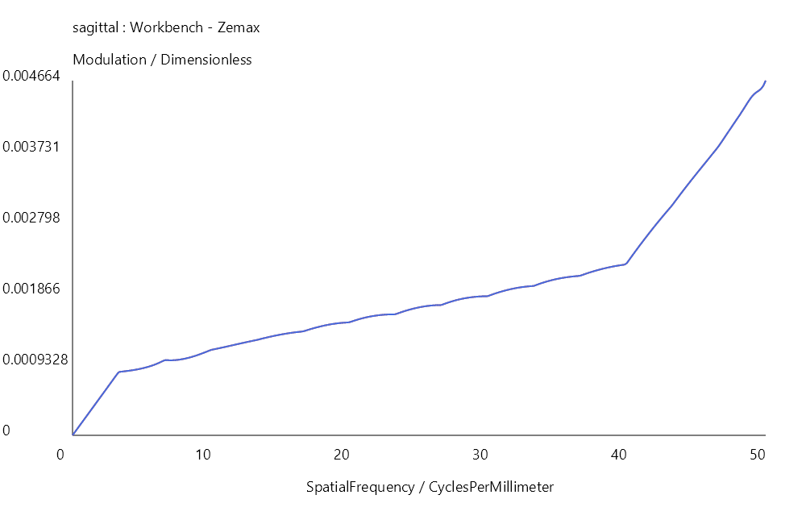
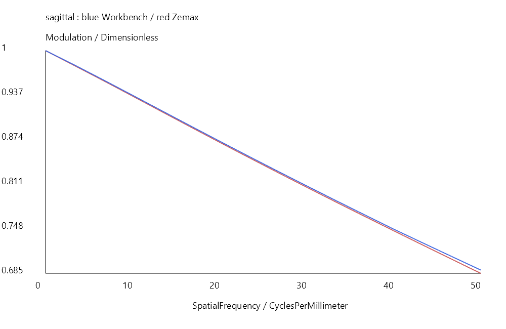
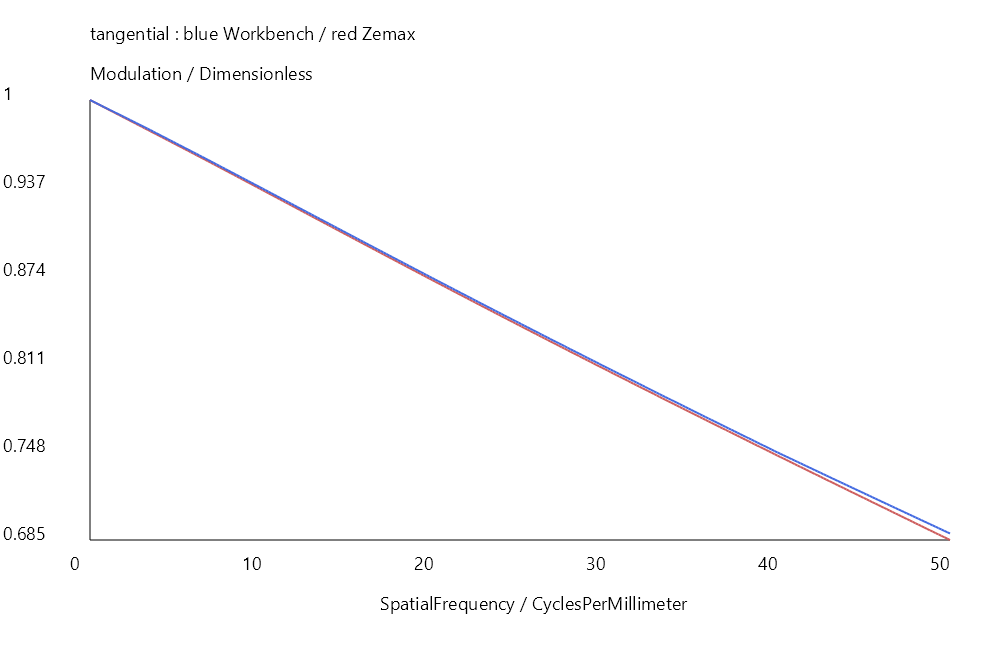
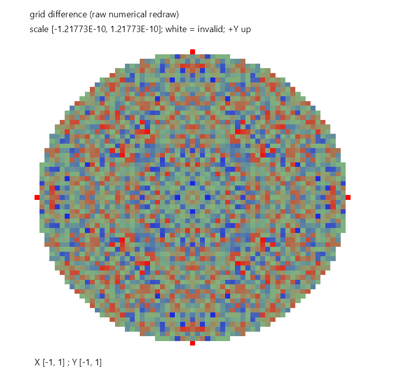
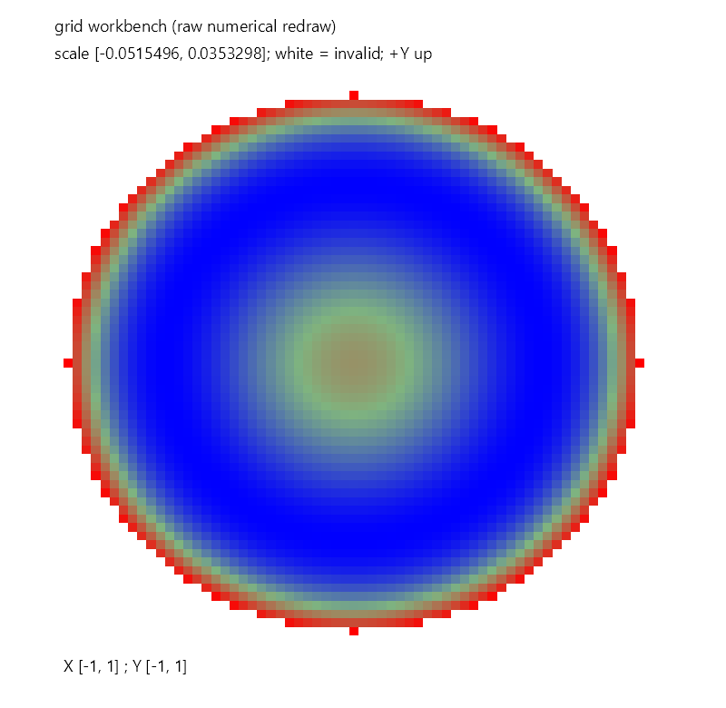
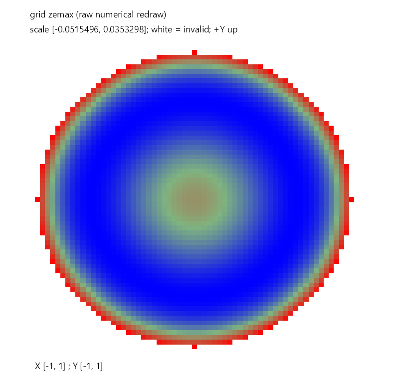

# Zemax / Workbench 数值比较

结论仅适用于 manifest 记录的镜头哈希、CapturedSettings、软件版本和容差配置。图像是数值重绘，原生截图状态单列；截图不计数值通过。

Enumerated: 177; Workbench captured: 4; Zemax captured: 4; Pass: 4; Close: 0; Difference: 0; Incomparable: 0; Skipped: 173; Error: 0

| Analysis | Zemax | Workbench | Comparison | Worst NRMSE | Reason |
|---|---|---|---|---:|---|
| [Single Ray Trace](comparisons/single-ray-trace-c1/comparison.json) | Skipped | Skipped | Skipped | — | Not selected by --analysis |
| [Non-Sequential Ray Trace](comparisons/non-sequential-ray-trace-c1/comparison.json) | Skipped | Skipped | Skipped | — | Not selected by --analysis |
| [Non-Sequential Detector Viewer](comparisons/non-sequential-detector-viewer-c1/comparison.json) | Skipped | Skipped | Skipped | — | Not selected by --analysis |
| [First Order](comparisons/first-order-c1/comparison.json) | Captured | Captured | Pass | 4.44083E-16 | Compare EFL and F-number via native MFE operands; TotalTrack is not equated to optical total length. |
| [Seidel Coefficients](comparisons/seidel-coefficients-c1/comparison.json) | Skipped | Skipped | Skipped | — | Not selected by --analysis |
| [Seidel Diagram](comparisons/seidel-diagram-c1/comparison.json) | Skipped | Skipped | Skipped | — | Not selected by --analysis |
| [Spot Diagram](comparisons/spot-diagram-c1/comparison.json) | Captured | Captured | Pass | 7.71884E-13 | Compare native RMS/GEO spot metrics only; point ordering and ray correspondence are not equated. |
| [Full Field Spot Diagram](comparisons/full-field-spot-diagram-c1/comparison.json) | Skipped | Skipped | Skipped | — | Not selected by --analysis |
| [Matrix Spot Diagram](comparisons/matrix-spot-diagram-c1/comparison.json) | Skipped | Skipped | Skipped | — | Not selected by --analysis |
| [Configuration Matrix Spot Diagram](comparisons/configuration-matrix-spot-diagram-c1/comparison.json) | Skipped | Skipped | Skipped | — | Not selected by --analysis |
| [Ray Fan](comparisons/ray-fan-c1/comparison.json) | Skipped | Skipped | Skipped | — | Not selected by --analysis |
| [Footprint Diagram](comparisons/footprint-diagram-c1/comparison.json) | Skipped | Skipped | Skipped | — | Not selected by --analysis |
| [Field Curvature and Distortion](comparisons/field-curvature-and-distortion-c1/comparison.json) | Skipped | Skipped | Skipped | — | Not selected by --analysis |
| [Grid Distortion](comparisons/grid-distortion-c1/comparison.json) | Skipped | Skipped | Skipped | — | Not selected by --analysis |
| [Field Curvature](comparisons/field-curvature-c1/comparison.json) | Skipped | Skipped | Skipped | — | Not selected by --analysis |
| [Color Focus Shift](comparisons/color-focus-shift-c1/comparison.json) | Skipped | Skipped | Skipped | — | Not selected by --analysis |
| [Lateral Color](comparisons/lateral-color-c1/comparison.json) | Skipped | Skipped | Skipped | — | Not selected by --analysis |
| [Axial Aberration](comparisons/axial-aberration-c1/comparison.json) | Skipped | Skipped | Skipped | — | Not selected by --analysis |
| [Full Field Aberration](comparisons/full-field-aberration-c1/comparison.json) | Skipped | Skipped | Skipped | — | Not selected by --analysis |
| [Encircled Energy](comparisons/encircled-energy-c1/comparison.json) | Skipped | Skipped | Skipped | — | Not selected by --analysis |
| [Diffraction Encircled Energy](comparisons/diffraction-encircled-energy-c1/comparison.json) | Skipped | Skipped | Skipped | — | Not selected by --analysis |
| [Geometric Line Edge Spread](comparisons/geometric-line-edge-spread-c1/comparison.json) | Skipped | Skipped | Skipped | — | Not selected by --analysis |
| [Extended Source Encircled Energy](comparisons/extended-source-encircled-energy-c1/comparison.json) | Skipped | Skipped | Skipped | — | Not selected by --analysis |
| [Pupil Aberration](comparisons/pupil-aberration-c1/comparison.json) | Skipped | Skipped | Skipped | — | Not selected by --analysis |
| [RMS vs Field](comparisons/rms-vs-field-c1/comparison.json) | Skipped | Skipped | Skipped | — | Not selected by --analysis |
| [RMS vs Wavelength](comparisons/rms-vs-wavelength-c1/comparison.json) | Skipped | Skipped | Skipped | — | Not selected by --analysis |
| [RMS vs Focus](comparisons/rms-vs-focus-c1/comparison.json) | Skipped | Skipped | Skipped | — | Not selected by --analysis |
| [RMS Field Map](comparisons/rms-field-map-c1/comparison.json) | Skipped | Skipped | Skipped | — | Not selected by --analysis |
| [RMS Wavefront vs Field](comparisons/rms-wavefront-vs-field-c1/comparison.json) | Skipped | Skipped | Skipped | — | Not selected by --analysis |
| [Through Focus](comparisons/through-focus-c1/comparison.json) | Skipped | Skipped | Skipped | — | Not selected by --analysis |
| [Through Focus MTF](comparisons/through-focus-mtf-c1/comparison.json) | Skipped | Skipped | Skipped | — | Not selected by --analysis |
| [Fourier Through Focus MTF](comparisons/fourier-through-focus-mtf-c1/comparison.json) | Skipped | Skipped | Skipped | — | Not selected by --analysis |
| [Huygens Through Focus MTF](comparisons/huygens-through-focus-mtf-c1/comparison.json) | Skipped | Skipped | Skipped | — | Not selected by --analysis |
| [Geometric Through Focus MTF](comparisons/geometric-through-focus-mtf-c1/comparison.json) | Skipped | Skipped | Skipped | — | Not selected by --analysis |
| [Fourier MTF vs Field](comparisons/fourier-mtf-vs-field-c1/comparison.json) | Skipped | Skipped | Skipped | — | Not selected by --analysis |
| [Huygens MTF vs Field](comparisons/huygens-mtf-vs-field-c1/comparison.json) | Skipped | Skipped | Skipped | — | Not selected by --analysis |
| [Geometric MTF vs Field](comparisons/geometric-mtf-vs-field-c1/comparison.json) | Skipped | Skipped | Skipped | — | Not selected by --analysis |
| [Angle vs Image Height](comparisons/angle-vs-image-height-c1/comparison.json) | Skipped | Skipped | Skipped | — | Not selected by --analysis |
| [Angle vs Image Height - Through Pupil](comparisons/angle-vs-image-height---through-pupil-c1/comparison.json) | Skipped | Skipped | Skipped | — | Not selected by --analysis |
| [Angle vs Image Height - Through Field](comparisons/angle-vs-image-height---through-field-c1/comparison.json) | Skipped | Skipped | Skipped | — | Not selected by --analysis |
| [Cardinal Points Data](comparisons/cardinal-points-data-c1/comparison.json) | Skipped | Skipped | Skipped | — | Not selected by --analysis |
| [Vignetting Diagram](comparisons/vignetting-diagram-c1/comparison.json) | Skipped | Skipped | Skipped | — | Not selected by --analysis |
| [Relative Illumination](comparisons/relative-illumination-c1/comparison.json) | Skipped | Skipped | Skipped | — | Not selected by --analysis |
| [Incoherent Irradiance](comparisons/incoherent-irradiance-c1/comparison.json) | Skipped | Skipped | Skipped | — | Not selected by --analysis |
| [Radiant Intensity](comparisons/radiant-intensity-c1/comparison.json) | Skipped | Skipped | Skipped | — | Not selected by --analysis |
| [Y-Ybar](comparisons/y-ybar-c1/comparison.json) | Skipped | Skipped | Skipped | — | Not selected by --analysis |
| [PSF](comparisons/psf-c1/comparison.json) | Skipped | Skipped | Skipped | — | Not selected by --analysis |
| [FFT PSF Cross Section](comparisons/fft-psf-cross-section-c1/comparison.json) | Skipped | Skipped | Skipped | — | Not selected by --analysis |
| [FFT Line Edge Spread](comparisons/fft-line-edge-spread-c1/comparison.json) | Skipped | Skipped | Skipped | — | Not selected by --analysis |
| [Huygens PSF](comparisons/huygens-psf-c1/comparison.json) | Skipped | Skipped | Skipped | — | Not selected by --analysis |
| [Huygens PSF Cross Section](comparisons/huygens-psf-cross-section-c1/comparison.json) | Skipped | Skipped | Skipped | — | Not selected by --analysis |
| [MTF](comparisons/mtf-c1/comparison.json) | Captured | Captured | Pass | 0.00208675 |  |
| [Huygens MTF](comparisons/huygens-mtf-c1/comparison.json) | Skipped | Skipped | Skipped | — | Not selected by --analysis |
| [Geometric MTF](comparisons/geometric-mtf-c1/comparison.json) | Skipped | Skipped | Skipped | — | Not selected by --analysis |
| [Sampled MTF](comparisons/sampled-mtf-c1/comparison.json) | Skipped | Skipped | Skipped | — | Not selected by --analysis |
| [Contrast Loss Map](comparisons/contrast-loss-map-c1/comparison.json) | Skipped | Skipped | Skipped | — | Not selected by --analysis |
| [Optical Path Difference](comparisons/optical-path-difference-c1/comparison.json) | Skipped | Skipped | Skipped | — | Not selected by --analysis |
| [Foucault Analysis](comparisons/foucault-analysis-c1/comparison.json) | Skipped | Skipped | Skipped | — | Not selected by --analysis |
| [Wavefront](comparisons/wavefront-c1/comparison.json) | Captured | Captured | Pass | 7.40741E-10 |  |
| [Centroid Sphere Wavefront](comparisons/centroid-sphere-wavefront-c1/comparison.json) | Skipped | Skipped | Skipped | — | Not selected by --analysis |
| [Best Fit Sphere Wavefront](comparisons/best-fit-sphere-wavefront-c1/comparison.json) | Skipped | Skipped | Skipped | — | Not selected by --analysis |
| [Zernike](comparisons/zernike-c1/comparison.json) | Skipped | Skipped | Skipped | — | Not selected by --analysis |
| [Image Simulation](comparisons/image-simulation-c1/comparison.json) | Skipped | Skipped | Skipped | — | Not selected by --analysis |
| [Geometric Image Analysis](comparisons/geometric-image-analysis-c1/comparison.json) | Skipped | Skipped | Skipped | — | Not selected by --analysis |
| [Geometric Bitmap Image Analysis](comparisons/geometric-bitmap-image-analysis-c1/comparison.json) | Skipped | Skipped | Skipped | — | Not selected by --analysis |
| [Light Source Analysis](comparisons/light-source-analysis-c1/comparison.json) | Skipped | Skipped | Skipped | — | Not selected by --analysis |
| [Partially Coherent Image Analysis](comparisons/partially-coherent-image-analysis-c1/comparison.json) | Skipped | Skipped | Skipped | — | Not selected by --analysis |
| [Extended Diffraction Image Analysis](comparisons/extended-diffraction-image-analysis-c1/comparison.json) | Skipped | Skipped | Skipped | — | Not selected by --analysis |
| [Jones Pupil](comparisons/jones-pupil-c1/comparison.json) | Skipped | Skipped | Skipped | — | Not selected by --analysis |
| [Prescription Report](comparisons/prescription-report-c1/comparison.json) | Skipped | Skipped | Skipped | — | Not selected by --analysis |
| [System Data Report](comparisons/system-data-report-c1/comparison.json) | Skipped | Skipped | Skipped | — | Not selected by --analysis |
| [Classified Data Report](comparisons/classified-data-report-c1/comparison.json) | Skipped | Skipped | Skipped | — | Not selected by --analysis |
| [Zemax:ZernikeAnnularCoefficients](comparisons/zemax-zernikeannularcoefficients/comparison.json) | Skipped | Skipped | Skipped | — | Enumerated native AnalysisIDM; no corresponding public Workbench canonical analysis or explicit adapter. Not executed. |
| [Zemax:ZernikeCoefficientsVsField](comparisons/zemax-zernikecoefficientsvsfield/comparison.json) | Skipped | Skipped | Skipped | — | Enumerated native AnalysisIDM; no corresponding public Workbench canonical analysis or explicit adapter. Not executed. |
| [Zemax:ZernikeStandardCoefficients](comparisons/zemax-zernikestandardcoefficients/comparison.json) | Skipped | Skipped | Skipped | — | Enumerated native AnalysisIDM; no corresponding public Workbench canonical analysis or explicit adapter. Not executed. |
| [Zemax:FftMtfMap](comparisons/zemax-fftmtfmap/comparison.json) | Skipped | Skipped | Skipped | — | Enumerated native AnalysisIDM; no corresponding public Workbench canonical analysis or explicit adapter. Not executed. |
| [Zemax:GeometricMtfMap](comparisons/zemax-geometricmtfmap/comparison.json) | Skipped | Skipped | Skipped | — | Enumerated native AnalysisIDM; no corresponding public Workbench canonical analysis or explicit adapter. Not executed. |
| [Zemax:FftSurfaceMtf](comparisons/zemax-fftsurfacemtf/comparison.json) | Skipped | Skipped | Skipped | — | Enumerated native AnalysisIDM; no corresponding public Workbench canonical analysis or explicit adapter. Not executed. |
| [Zemax:HuygensSurfaceMtf](comparisons/zemax-huygenssurfacemtf/comparison.json) | Skipped | Skipped | Skipped | — | Enumerated native AnalysisIDM; no corresponding public Workbench canonical analysis or explicit adapter. Not executed. |
| [Zemax:SurfaceCurvatureCross](comparisons/zemax-surfacecurvaturecross/comparison.json) | Skipped | Skipped | Skipped | — | Enumerated native AnalysisIDM; no corresponding public Workbench canonical analysis or explicit adapter. Not executed. |
| [Zemax:SurfacePhaseCross](comparisons/zemax-surfacephasecross/comparison.json) | Skipped | Skipped | Skipped | — | Enumerated native AnalysisIDM; no corresponding public Workbench canonical analysis or explicit adapter. Not executed. |
| [Zemax:SurfaceSagCross](comparisons/zemax-surfacesagcross/comparison.json) | Skipped | Skipped | Skipped | — | Enumerated native AnalysisIDM; no corresponding public Workbench canonical analysis or explicit adapter. Not executed. |
| [Zemax:SurfaceCurvature](comparisons/zemax-surfacecurvature/comparison.json) | Skipped | Skipped | Skipped | — | Enumerated native AnalysisIDM; no corresponding public Workbench canonical analysis or explicit adapter. Not executed. |
| [Zemax:SurfacePhase](comparisons/zemax-surfacephase/comparison.json) | Skipped | Skipped | Skipped | — | Enumerated native AnalysisIDM; no corresponding public Workbench canonical analysis or explicit adapter. Not executed. |
| [Zemax:SurfaceSag](comparisons/zemax-surfacesag/comparison.json) | Skipped | Skipped | Skipped | — | Enumerated native AnalysisIDM; no corresponding public Workbench canonical analysis or explicit adapter. Not executed. |
| [Zemax:Interferogram](comparisons/zemax-interferogram/comparison.json) | Skipped | Skipped | Skipped | — | Enumerated native AnalysisIDM; no corresponding public Workbench canonical analysis or explicit adapter. Not executed. |
| [Zemax:Draw2D](comparisons/zemax-draw2d/comparison.json) | Skipped | Skipped | Skipped | — | Enumerated native AnalysisIDM; no corresponding public Workbench canonical analysis or explicit adapter. Not executed. |
| [Zemax:Draw3D](comparisons/zemax-draw3d/comparison.json) | Skipped | Skipped | Skipped | — | Enumerated native AnalysisIDM; no corresponding public Workbench canonical analysis or explicit adapter. Not executed. |
| [Zemax:IMABIMFileViewer](comparisons/zemax-imabimfileviewer/comparison.json) | Skipped | Skipped | Skipped | — | Enumerated native AnalysisIDM; no corresponding public Workbench canonical analysis or explicit adapter. Not executed. |
| [Zemax:BitmapFileViewer](comparisons/zemax-bitmapfileviewer/comparison.json) | Skipped | Skipped | Skipped | — | Enumerated native AnalysisIDM; no corresponding public Workbench canonical analysis or explicit adapter. Not executed. |
| [Zemax:BiocularFieldOfViewAnalysis](comparisons/zemax-biocularfieldofviewanalysis/comparison.json) | Skipped | Skipped | Skipped | — | Enumerated native AnalysisIDM; no corresponding public Workbench canonical analysis or explicit adapter. Not executed. |
| [Zemax:BiocularDipvergenceConvergence](comparisons/zemax-bioculardipvergenceconvergence/comparison.json) | Skipped | Skipped | Skipped | — | Enumerated native AnalysisIDM; no corresponding public Workbench canonical analysis or explicit adapter. Not executed. |
| [Zemax:PowerFieldMapSettings](comparisons/zemax-powerfieldmapsettings/comparison.json) | Skipped | Skipped | Skipped | — | Enumerated native AnalysisIDM; no corresponding public Workbench canonical analysis or explicit adapter. Not executed. |
| [Zemax:PowerPupilMapSettings](comparisons/zemax-powerpupilmapsettings/comparison.json) | Skipped | Skipped | Skipped | — | Enumerated native AnalysisIDM; no corresponding public Workbench canonical analysis or explicit adapter. Not executed. |
| [Zemax:FiberCouplingSettings](comparisons/zemax-fibercouplingsettings/comparison.json) | Skipped | Skipped | Skipped | — | Enumerated native AnalysisIDM; no corresponding public Workbench canonical analysis or explicit adapter. Not executed. |
| [Zemax:YNIContributions](comparisons/zemax-ynicontributions/comparison.json) | Skipped | Skipped | Skipped | — | Enumerated native AnalysisIDM; no corresponding public Workbench canonical analysis or explicit adapter. Not executed. |
| [Zemax:SagTable](comparisons/zemax-sagtable/comparison.json) | Skipped | Skipped | Skipped | — | Enumerated native AnalysisIDM; no corresponding public Workbench canonical analysis or explicit adapter. Not executed. |
| [Zemax:DispersionDiagram](comparisons/zemax-dispersiondiagram/comparison.json) | Skipped | Skipped | Skipped | — | Enumerated native AnalysisIDM; no corresponding public Workbench canonical analysis or explicit adapter. Not executed. |
| [Zemax:GlassMap](comparisons/zemax-glassmap/comparison.json) | Skipped | Skipped | Skipped | — | Enumerated native AnalysisIDM; no corresponding public Workbench canonical analysis or explicit adapter. Not executed. |
| [Zemax:AthermalGlassMap](comparisons/zemax-athermalglassmap/comparison.json) | Skipped | Skipped | Skipped | — | Enumerated native AnalysisIDM; no corresponding public Workbench canonical analysis or explicit adapter. Not executed. |
| [Zemax:InternalTransmissionvsWavelength](comparisons/zemax-internaltransmissionvswavelength/comparison.json) | Skipped | Skipped | Skipped | — | Enumerated native AnalysisIDM; no corresponding public Workbench canonical analysis or explicit adapter. Not executed. |
| [Zemax:DispersionvsWavelength](comparisons/zemax-dispersionvswavelength/comparison.json) | Skipped | Skipped | Skipped | — | Enumerated native AnalysisIDM; no corresponding public Workbench canonical analysis or explicit adapter. Not executed. |
| [Zemax:GrinProfile](comparisons/zemax-grinprofile/comparison.json) | Skipped | Skipped | Skipped | — | Enumerated native AnalysisIDM; no corresponding public Workbench canonical analysis or explicit adapter. Not executed. |
| [Zemax:GradiumProfile](comparisons/zemax-gradiumprofile/comparison.json) | Skipped | Skipped | Skipped | — | Enumerated native AnalysisIDM; no corresponding public Workbench canonical analysis or explicit adapter. Not executed. |
| [Zemax:UniversalPlot1D](comparisons/zemax-universalplot1d/comparison.json) | Skipped | Skipped | Skipped | — | Enumerated native AnalysisIDM; no corresponding public Workbench canonical analysis or explicit adapter. Not executed. |
| [Zemax:UniversalPlot2D](comparisons/zemax-universalplot2d/comparison.json) | Skipped | Skipped | Skipped | — | Enumerated native AnalysisIDM; no corresponding public Workbench canonical analysis or explicit adapter. Not executed. |
| [Zemax:PolarizationRayTrace](comparisons/zemax-polarizationraytrace/comparison.json) | Skipped | Skipped | Skipped | — | Enumerated native AnalysisIDM; no corresponding public Workbench canonical analysis or explicit adapter. Not executed. |
| [Zemax:Transmission](comparisons/zemax-transmission/comparison.json) | Skipped | Skipped | Skipped | — | Enumerated native AnalysisIDM; no corresponding public Workbench canonical analysis or explicit adapter. Not executed. |
| [Zemax:PhaseAberration](comparisons/zemax-phaseaberration/comparison.json) | Skipped | Skipped | Skipped | — | Enumerated native AnalysisIDM; no corresponding public Workbench canonical analysis or explicit adapter. Not executed. |
| [Zemax:TransmissionFan](comparisons/zemax-transmissionfan/comparison.json) | Skipped | Skipped | Skipped | — | Enumerated native AnalysisIDM; no corresponding public Workbench canonical analysis or explicit adapter. Not executed. |
| [Zemax:ParaxialGaussianBeam](comparisons/zemax-paraxialgaussianbeam/comparison.json) | Skipped | Skipped | Skipped | — | Enumerated native AnalysisIDM; no corresponding public Workbench canonical analysis or explicit adapter. Not executed. |
| [Zemax:SkewGaussianBeam](comparisons/zemax-skewgaussianbeam/comparison.json) | Skipped | Skipped | Skipped | — | Enumerated native AnalysisIDM; no corresponding public Workbench canonical analysis or explicit adapter. Not executed. |
| [Zemax:PhysicalOpticsPropagation](comparisons/zemax-physicalopticspropagation/comparison.json) | Skipped | Skipped | Skipped | — | Enumerated native AnalysisIDM; no corresponding public Workbench canonical analysis or explicit adapter. Not executed. |
| [Zemax:BeamFileViewer](comparisons/zemax-beamfileviewer/comparison.json) | Skipped | Skipped | Skipped | — | Enumerated native AnalysisIDM; no corresponding public Workbench canonical analysis or explicit adapter. Not executed. |
| [Zemax:ReflectionvsAngle](comparisons/zemax-reflectionvsangle/comparison.json) | Skipped | Skipped | Skipped | — | Enumerated native AnalysisIDM; no corresponding public Workbench canonical analysis or explicit adapter. Not executed. |
| [Zemax:TransmissionvsAngle](comparisons/zemax-transmissionvsangle/comparison.json) | Skipped | Skipped | Skipped | — | Enumerated native AnalysisIDM; no corresponding public Workbench canonical analysis or explicit adapter. Not executed. |
| [Zemax:AbsorptionvsAngle](comparisons/zemax-absorptionvsangle/comparison.json) | Skipped | Skipped | Skipped | — | Enumerated native AnalysisIDM; no corresponding public Workbench canonical analysis or explicit adapter. Not executed. |
| [Zemax:DiattenuationvsAngle](comparisons/zemax-diattenuationvsangle/comparison.json) | Skipped | Skipped | Skipped | — | Enumerated native AnalysisIDM; no corresponding public Workbench canonical analysis or explicit adapter. Not executed. |
| [Zemax:PhasevsAngle](comparisons/zemax-phasevsangle/comparison.json) | Skipped | Skipped | Skipped | — | Enumerated native AnalysisIDM; no corresponding public Workbench canonical analysis or explicit adapter. Not executed. |
| [Zemax:RetardancevsAngle](comparisons/zemax-retardancevsangle/comparison.json) | Skipped | Skipped | Skipped | — | Enumerated native AnalysisIDM; no corresponding public Workbench canonical analysis or explicit adapter. Not executed. |
| [Zemax:ReflectionvsWavelength](comparisons/zemax-reflectionvswavelength/comparison.json) | Skipped | Skipped | Skipped | — | Enumerated native AnalysisIDM; no corresponding public Workbench canonical analysis or explicit adapter. Not executed. |
| [Zemax:TransmissionvsWavelength](comparisons/zemax-transmissionvswavelength/comparison.json) | Skipped | Skipped | Skipped | — | Enumerated native AnalysisIDM; no corresponding public Workbench canonical analysis or explicit adapter. Not executed. |
| [Zemax:AbsorptionvsWavelength](comparisons/zemax-absorptionvswavelength/comparison.json) | Skipped | Skipped | Skipped | — | Enumerated native AnalysisIDM; no corresponding public Workbench canonical analysis or explicit adapter. Not executed. |
| [Zemax:DiattenuationvsWavelength](comparisons/zemax-diattenuationvswavelength/comparison.json) | Skipped | Skipped | Skipped | — | Enumerated native AnalysisIDM; no corresponding public Workbench canonical analysis or explicit adapter. Not executed. |
| [Zemax:PhasevsWavelength](comparisons/zemax-phasevswavelength/comparison.json) | Skipped | Skipped | Skipped | — | Enumerated native AnalysisIDM; no corresponding public Workbench canonical analysis or explicit adapter. Not executed. |
| [Zemax:RetardancevsWavelength](comparisons/zemax-retardancevswavelength/comparison.json) | Skipped | Skipped | Skipped | — | Enumerated native AnalysisIDM; no corresponding public Workbench canonical analysis or explicit adapter. Not executed. |
| [Zemax:DirectivityPlot](comparisons/zemax-directivityplot/comparison.json) | Skipped | Skipped | Skipped | — | Enumerated native AnalysisIDM; no corresponding public Workbench canonical analysis or explicit adapter. Not executed. |
| [Zemax:SourcePolarViewer](comparisons/zemax-sourcepolarviewer/comparison.json) | Skipped | Skipped | Skipped | — | Enumerated native AnalysisIDM; no corresponding public Workbench canonical analysis or explicit adapter. Not executed. |
| [Zemax:PhotoluminscenceViewer](comparisons/zemax-photoluminscenceviewer/comparison.json) | Skipped | Skipped | Skipped | — | Enumerated native AnalysisIDM; no corresponding public Workbench canonical analysis or explicit adapter. Not executed. |
| [Zemax:SourceSpectrumViewer](comparisons/zemax-sourcespectrumviewer/comparison.json) | Skipped | Skipped | Skipped | — | Enumerated native AnalysisIDM; no corresponding public Workbench canonical analysis or explicit adapter. Not executed. |
| [Zemax:RadiantSourceModelViewerSettings](comparisons/zemax-radiantsourcemodelviewersettings/comparison.json) | Skipped | Skipped | Skipped | — | Enumerated native AnalysisIDM; no corresponding public Workbench canonical analysis or explicit adapter. Not executed. |
| [Zemax:SurfaceDataSettings](comparisons/zemax-surfacedatasettings/comparison.json) | Skipped | Skipped | Skipped | — | Enumerated native AnalysisIDM; no corresponding public Workbench canonical analysis or explicit adapter. Not executed. |
| [Zemax:FileComparatorSettings](comparisons/zemax-filecomparatorsettings/comparison.json) | Skipped | Skipped | Skipped | — | Enumerated native AnalysisIDM; no corresponding public Workbench canonical analysis or explicit adapter. Not executed. |
| [Zemax:PartViewer](comparisons/zemax-partviewer/comparison.json) | Skipped | Skipped | Skipped | — | Enumerated native AnalysisIDM; no corresponding public Workbench canonical analysis or explicit adapter. Not executed. |
| [Zemax:ReverseRadianceAnalysis](comparisons/zemax-reverseradianceanalysis/comparison.json) | Skipped | Skipped | Skipped | — | Enumerated native AnalysisIDM; no corresponding public Workbench canonical analysis or explicit adapter. Not executed. |
| [Zemax:PathAnalysis](comparisons/zemax-pathanalysis/comparison.json) | Skipped | Skipped | Skipped | — | Enumerated native AnalysisIDM; no corresponding public Workbench canonical analysis or explicit adapter. Not executed. |
| [Zemax:FluxvsWavelength](comparisons/zemax-fluxvswavelength/comparison.json) | Skipped | Skipped | Skipped | — | Enumerated native AnalysisIDM; no corresponding public Workbench canonical analysis or explicit adapter. Not executed. |
| [Zemax:RoadwayLighting](comparisons/zemax-roadwaylighting/comparison.json) | Skipped | Skipped | Skipped | — | Enumerated native AnalysisIDM; no corresponding public Workbench canonical analysis or explicit adapter. Not executed. |
| [Zemax:SourceIlluminationMap](comparisons/zemax-sourceilluminationmap/comparison.json) | Skipped | Skipped | Skipped | — | Enumerated native AnalysisIDM; no corresponding public Workbench canonical analysis or explicit adapter. Not executed. |
| [Zemax:ScatterFunctionViewer](comparisons/zemax-scatterfunctionviewer/comparison.json) | Skipped | Skipped | Skipped | — | Enumerated native AnalysisIDM; no corresponding public Workbench canonical analysis or explicit adapter. Not executed. |
| [Zemax:ScatterPolarPlotSettings](comparisons/zemax-scatterpolarplotsettings/comparison.json) | Skipped | Skipped | Skipped | — | Enumerated native AnalysisIDM; no corresponding public Workbench canonical analysis or explicit adapter. Not executed. |
| [Zemax:ZemaxElementDrawing](comparisons/zemax-zemaxelementdrawing/comparison.json) | Skipped | Skipped | Skipped | — | Enumerated native AnalysisIDM; no corresponding public Workbench canonical analysis or explicit adapter. Not executed. |
| [Zemax:ShadedModel](comparisons/zemax-shadedmodel/comparison.json) | Skipped | Skipped | Skipped | — | Enumerated native AnalysisIDM; no corresponding public Workbench canonical analysis or explicit adapter. Not executed. |
| [Zemax:NSCShadedModel](comparisons/zemax-nscshadedmodel/comparison.json) | Skipped | Skipped | Skipped | — | Enumerated native AnalysisIDM; no corresponding public Workbench canonical analysis or explicit adapter. Not executed. |
| [Zemax:NSC3DLayout](comparisons/zemax-nsc3dlayout/comparison.json) | Skipped | Skipped | Skipped | — | Enumerated native AnalysisIDM; no corresponding public Workbench canonical analysis or explicit adapter. Not executed. |
| [Zemax:NSCObjectViewer](comparisons/zemax-nscobjectviewer/comparison.json) | Skipped | Skipped | Skipped | — | Enumerated native AnalysisIDM; no corresponding public Workbench canonical analysis or explicit adapter. Not executed. |
| [Zemax:RayDatabaseViewer](comparisons/zemax-raydatabaseviewer/comparison.json) | Skipped | Skipped | Skipped | — | Enumerated native AnalysisIDM; no corresponding public Workbench canonical analysis or explicit adapter. Not executed. |
| [Zemax:ISOElementDrawing](comparisons/zemax-isoelementdrawing/comparison.json) | Skipped | Skipped | Skipped | — | Enumerated native AnalysisIDM; no corresponding public Workbench canonical analysis or explicit adapter. Not executed. |
| [Zemax:TestPlateList](comparisons/zemax-testplatelist/comparison.json) | Skipped | Skipped | Skipped | — | Enumerated native AnalysisIDM; no corresponding public Workbench canonical analysis or explicit adapter. Not executed. |
| [Zemax:SourceColorChart1931](comparisons/zemax-sourcecolorchart1931/comparison.json) | Skipped | Skipped | Skipped | — | Enumerated native AnalysisIDM; no corresponding public Workbench canonical analysis or explicit adapter. Not executed. |
| [Zemax:SourceColorChart1976](comparisons/zemax-sourcecolorchart1976/comparison.json) | Skipped | Skipped | Skipped | — | Enumerated native AnalysisIDM; no corresponding public Workbench canonical analysis or explicit adapter. Not executed. |
| [Zemax:PrescriptionGraphic](comparisons/zemax-prescriptiongraphic/comparison.json) | Skipped | Skipped | Skipped | — | Enumerated native AnalysisIDM; no corresponding public Workbench canonical analysis or explicit adapter. Not executed. |
| [Zemax:CriticalRayTracer](comparisons/zemax-criticalraytracer/comparison.json) | Skipped | Skipped | Skipped | — | Enumerated native AnalysisIDM; no corresponding public Workbench canonical analysis or explicit adapter. Not executed. |
| [Zemax:CoatingListing](comparisons/zemax-coatinglisting/comparison.json) | Skipped | Skipped | Skipped | — | Enumerated native AnalysisIDM; no corresponding public Workbench canonical analysis or explicit adapter. Not executed. |
| [Zemax:SurfaceSlope](comparisons/zemax-surfaceslope/comparison.json) | Skipped | Skipped | Skipped | — | Enumerated native AnalysisIDM; no corresponding public Workbench canonical analysis or explicit adapter. Not executed. |
| [Zemax:SurfaceSlopeCross](comparisons/zemax-surfaceslopecross/comparison.json) | Skipped | Skipped | Skipped | — | Enumerated native AnalysisIDM; no corresponding public Workbench canonical analysis or explicit adapter. Not executed. |
| [Zemax:QuickYield](comparisons/zemax-quickyield/comparison.json) | Skipped | Skipped | Skipped | — | Enumerated native AnalysisIDM; no corresponding public Workbench canonical analysis or explicit adapter. Not executed. |
| [Zemax:SystemCheck](comparisons/zemax-systemcheck/comparison.json) | Skipped | Skipped | Skipped | — | Enumerated native AnalysisIDM; no corresponding public Workbench canonical analysis or explicit adapter. Not executed. |
| [Zemax:ToleranceYield](comparisons/zemax-toleranceyield/comparison.json) | Skipped | Skipped | Skipped | — | Enumerated native AnalysisIDM; no corresponding public Workbench canonical analysis or explicit adapter. Not executed. |
| [Zemax:ToleranceHistogram](comparisons/zemax-tolerancehistogram/comparison.json) | Skipped | Skipped | Skipped | — | Enumerated native AnalysisIDM; no corresponding public Workbench canonical analysis or explicit adapter. Not executed. |
| [Zemax:DiffEfficiency2D](comparisons/zemax-diffefficiency2d/comparison.json) | Skipped | Skipped | Skipped | — | Enumerated native AnalysisIDM; no corresponding public Workbench canonical analysis or explicit adapter. Not executed. |
| [Zemax:DiffEfficiencyAngular](comparisons/zemax-diffefficiencyangular/comparison.json) | Skipped | Skipped | Skipped | — | Enumerated native AnalysisIDM; no corresponding public Workbench canonical analysis or explicit adapter. Not executed. |
| [Zemax:DiffEfficiencyChromatic](comparisons/zemax-diffefficiencychromatic/comparison.json) | Skipped | Skipped | Skipped | — | Enumerated native AnalysisIDM; no corresponding public Workbench canonical analysis or explicit adapter. Not executed. |
| [Zemax:NSCSurfaceSag](comparisons/zemax-nscsurfacesag/comparison.json) | Skipped | Skipped | Skipped | — | Enumerated native AnalysisIDM; no corresponding public Workbench canonical analysis or explicit adapter. Not executed. |
| [Zemax:NSCGeometricMtf](comparisons/zemax-nscgeometricmtf/comparison.json) | Skipped | Skipped | Skipped | — | Enumerated native AnalysisIDM; no corresponding public Workbench canonical analysis or explicit adapter. Not executed. |
| [Zemax:SurfacePhaseSlope](comparisons/zemax-surfacephaseslope/comparison.json) | Skipped | Skipped | Skipped | — | Enumerated native AnalysisIDM; no corresponding public Workbench canonical analysis or explicit adapter. Not executed. |
| [Zemax:SurfacePhaseSlopeCross](comparisons/zemax-surfacephaseslopecross/comparison.json) | Skipped | Skipped | Skipped | — | Enumerated native AnalysisIDM; no corresponding public Workbench canonical analysis or explicit adapter. Not executed. |
| [Zemax:STARAlignCheck](comparisons/zemax-staraligncheck/comparison.json) | Skipped | Skipped | Skipped | — | Enumerated native AnalysisIDM; no corresponding public Workbench canonical analysis or explicit adapter. Not executed. |
| [Zemax:STARSysViewer](comparisons/zemax-starsysviewer/comparison.json) | Skipped | Skipped | Skipped | — | Enumerated native AnalysisIDM; no corresponding public Workbench canonical analysis or explicit adapter. Not executed. |
| [Zemax:STAR2DDefPlot](comparisons/zemax-star2ddefplot/comparison.json) | Skipped | Skipped | Skipped | — | Enumerated native AnalysisIDM; no corresponding public Workbench canonical analysis or explicit adapter. Not executed. |
| [Zemax:STARPerfChange](comparisons/zemax-starperfchange/comparison.json) | Skipped | Skipped | Skipped | — | Enumerated native AnalysisIDM; no corresponding public Workbench canonical analysis or explicit adapter. Not executed. |
| [Zemax:STARIndexVsTemp](comparisons/zemax-starindexvstemp/comparison.json) | Skipped | Skipped | Skipped | — | Enumerated native AnalysisIDM; no corresponding public Workbench canonical analysis or explicit adapter. Not executed. |
| [Zemax:STARInspectFEA](comparisons/zemax-starinspectfea/comparison.json) | Skipped | Skipped | Skipped | — | Enumerated native AnalysisIDM; no corresponding public Workbench canonical analysis or explicit adapter. Not executed. |
| [Zemax:UserDefinedCOM](comparisons/zemax-userdefinedcom/comparison.json) | Skipped | Skipped | Skipped | — | Enumerated native AnalysisIDM; no corresponding public Workbench canonical analysis or explicit adapter. Not executed. |
| [Zemax:NEST](comparisons/zemax-nest/comparison.json) | Skipped | Skipped | Skipped | — | Enumerated native AnalysisIDM; no corresponding public Workbench canonical analysis or explicit adapter. Not executed. |
| [Zemax:NSCSpotStandardNative](comparisons/zemax-nscspotstandardnative/comparison.json) | Skipped | Skipped | Skipped | — | Enumerated native AnalysisIDM; no corresponding public Workbench canonical analysis or explicit adapter. Not executed. |
| [Zemax:XXXTemplateXXX](comparisons/zemax-xxxtemplatexxx/comparison.json) | Skipped | Skipped | Skipped | — | Enumerated native AnalysisIDM; no corresponding public Workbench canonical analysis or explicit adapter. Not executed. |

## 环境与输入

```json
{
  "inputPath": "D:\\Projects\\opticalsystem\\artifacts\\validation\\initial-structure-p5-20260907\\external\\3-element\\candidate.ZMX",
  "fileName": "candidate.ZMX",
  "fileLength": 7852,
  "sourceSha256": "71614021ba0444bd1202a0588cc580461f110c7e4f807e7b345c2877be764a30",
  "inputLastWriteUtc": "2026-09-07T13:05:24.3646376Z",
  "startedUtc": "2026-09-07T13:10:03.0258792+00:00",
  "configurationSha256": "f1491c60159235876a2c0e82b15ddc2a9ef9ad3181ca001ed1c81c304639f460",
  "configurationVersion": "1.0.0-captured-settings",
  "dotnetVersion": ".NET 10.0.8",
  "operatingSystem": "Microsoft Windows 10.0.26200",
  "toolVersion": "1.0.0",
  "expectedZemaxVersion": "2026 R1",
  "toolAssemblySha256": "e9eb518ffb69074279bd2decbcdc42394e7f9101554b03a8dbbeabf7523c0d10",
  "settingsOrigin": "CapturedSettings",
  "originalFileUnchanged": true,
  "gitSha": "912434630c44c3c08d357e7c9e8ef02e4c744db4",
  "gitWorkingTreeDirty": true,
  "zmxHeaderRecords": [
    "VERS 260127 75 20120530 20120530",
    "MODE SEQ",
    "UNIT MM X W X CM MR CPMM LU",
    "GCAT SCHOTT",
    "RAIM 0 0 1 1 0 0 0 0 0 1",
    "FTYP 0 0 3 1 0 0 0 3"
  ],
  "zmxFileVersion": "VERS 260127 75 20120530 20120530",
  "configurationCount": 1,
  "workbenchParsing": [
    {
      "configuration": 1,
      "surfaceCount": 8,
      "fields": [
        {
          "label": "On axis",
          "x": 0,
          "y": 0,
          "xAngleDegrees": 0,
          "yAngleDegrees": 0,
          "weight": 1,
          "vignetteFactorX": 0,
          "vignetteFactorY": 0
        },
        {
          "label": "Field 2",
          "x": 0,
          "y": 2.5,
          "xAngleDegrees": 0,
          "yAngleDegrees": 2.5,
          "weight": 1,
          "vignetteFactorX": 0,
          "vignetteFactorY": 0
        },
        {
          "label": "Field 3",
          "x": 0,
          "y": 5,
          "xAngleDegrees": 0,
          "yAngleDegrees": 5,
          "weight": 1,
          "vignetteFactorX": 0,
          "vignetteFactorY": 0
        }
      ],
      "wavelengths": [
        {
          "label": "W1",
          "nanometers": 587.6,
          "micrometers": 0.5876,
          "weight": 1,
          "isPrimary": true
        }
      ],
      "fieldDefinition": "Angle",
      "aperture": {
        "kind": "EntrancePupilDiameter",
        "value": 6.25,
        "objectSpaceTelecentric": false
      },
      "imageSpaceAfocal": false,
      "rayAimingEnabled": false,
      "glassCatalogs": [
        "SCHOTT"
      ],
      "apodization": {
        "kind": "zemax_pupil",
        "numbers": {
          "type": 0,
          "factor": 0
        },
        "text": {},
        "children": null
      },
      "preflightIssues": [],
      "coordinateBreaks": [],
      "parserWarnings": "Importer exposes capability issues; unsupported preserved records are available in input snapshot. No additional warning stream is exposed."
    }
  ],
  "zosApiPath": "D:\\Program Files\\ANSYS Inc\\v261\\Zemax OpticStudio",
  "zemaxEnvironment": {
    "major": 26,
    "minor": 1,
    "servicePack": 0,
    "opticStudioVersion": 260127,
    "licenseStatus": "EnterpriseEdition",
    "validLicense": true,
    "initializationErrors": "",
    "analysisIds": [
      "RayFan",
      "OpticalPathFan",
      "PupilAberrationFan",
      "FieldCurvatureAndDistortion",
      "FocalShiftDiagram",
      "GridDistortion",
      "LateralColor",
      "LongitudinalAberration",
      "RayTrace",
      "SeidelCoefficients",
      "SeidelDiagram",
      "ZernikeAnnularCoefficients",
      "ZernikeCoefficientsVsField",
      "ZernikeFringeCoefficients",
      "ZernikeStandardCoefficients",
      "FftMtf",
      "FftThroughFocusMtf",
      "GeometricThroughFocusMtf",
      "GeometricMtf",
      "FftMtfMap",
      "GeometricMtfMap",
      "FftSurfaceMtf",
      "FftMtfvsField",
      "GeometricMtfvsField",
      "HuygensMtfvsField",
      "HuygensMtf",
      "HuygensSurfaceMtf",
      "HuygensThroughFocusMtf",
      "FftPsf",
      "FftPsfCrossSection",
      "FftPsfLineEdgeSpread",
      "HuygensPsfCrossSection",
      "HuygensPsf",
      "DiffractionEncircledEnergy",
      "GeometricEncircledEnergy",
      "GeometricLineEdgeSpread",
      "ExtendedSourceEncircledEnergy",
      "SurfaceCurvatureCross",
      "SurfacePhaseCross",
      "SurfaceSagCross",
      "SurfaceCurvature",
      "SurfacePhase",
      "SurfaceSag",
      "StandardSpot",
      "ThroughFocusSpot",
      "FullFieldSpot",
      "MatrixSpot",
      "ConfigurationMatrixSpot",
      "RMSField",
      "RMSFieldMap",
      "RMSLambdaDiagram",
      "RMSFocus",
      "Foucault",
      "Interferogram",
      "WavefrontMap",
      "DetectorViewer",
      "Draw2D",
      "Draw3D",
      "ImageSimulation",
      "GeometricImageAnalysis",
      "IMABIMFileViewer",
      "GeometricBitmapImageAnalysis",
      "BitmapFileViewer",
      "LightSourceAnalysis",
      "PartiallyCoherentImageAnalysis",
      "ExtendedDiffractionImageAnalysis",
      "BiocularFieldOfViewAnalysis",
      "BiocularDipvergenceConvergence",
      "RelativeIllumination",
      "VignettingDiagramSettings",
      "FootprintSettings",
      "YYbarDiagram",
      "PowerFieldMapSettings",
      "PowerPupilMapSettings",
      "IncidentAnglevsImageHeight",
      "FiberCouplingSettings",
      "YNIContributions",
      "SagTable",
      "CardinalPoints",
      "DispersionDiagram",
      "GlassMap",
      "AthermalGlassMap",
      "InternalTransmissionvsWavelength",
      "DispersionvsWavelength",
      "GrinProfile",
      "GradiumProfile",
      "UniversalPlot1D",
      "UniversalPlot2D",
      "PolarizationRayTrace",
      "PolarizationPupilMap",
      "Transmission",
      "PhaseAberration",
      "TransmissionFan",
      "ParaxialGaussianBeam",
      "SkewGaussianBeam",
      "PhysicalOpticsPropagation",
      "BeamFileViewer",
      "ReflectionvsAngle",
      "TransmissionvsAngle",
      "AbsorptionvsAngle",
      "DiattenuationvsAngle",
      "PhasevsAngle",
      "RetardancevsAngle",
      "ReflectionvsWavelength",
      "TransmissionvsWavelength",
      "AbsorptionvsWavelength",
      "DiattenuationvsWavelength",
      "PhasevsWavelength",
      "RetardancevsWavelength",
      "DirectivityPlot",
      "SourcePolarViewer",
      "PhotoluminscenceViewer",
      "SourceSpectrumViewer",
      "RadiantSourceModelViewerSettings",
      "SurfaceDataSettings",
      "PrescriptionDataSettings",
      "FileComparatorSettings",
      "PartViewer",
      "ReverseRadianceAnalysis",
      "PathAnalysis",
      "FluxvsWavelength",
      "RoadwayLighting",
      "SourceIlluminationMap",
      "ScatterFunctionViewer",
      "ScatterPolarPlotSettings",
      "ZemaxElementDrawing",
      "ShadedModel",
      "NSCShadedModel",
      "NSC3DLayout",
      "NSCObjectViewer",
      "RayDatabaseViewer",
      "ISOElementDrawing",
      "SystemData",
      "TestPlateList",
      "SourceColorChart1931",
      "SourceColorChart1976",
      "PrescriptionGraphic",
      "CriticalRayTracer",
      "ContrastLoss",
      "CoatingListing",
      "FullFieldAberration",
      "SurfaceSlope",
      "SurfaceSlopeCross",
      "QuickYield",
      "SystemCheck",
      "ToleranceYield",
      "ToleranceHistogram",
      "DiffEfficiency2D",
      "DiffEfficiencyAngular",
      "DiffEfficiencyChromatic",
      "NSCSurfaceSag",
      "NSCSingleRayTrace",
      "NSCGeometricMtf",
      "SurfacePhaseSlope",
      "SurfacePhaseSlopeCross",
      "STARAlignCheck",
      "STARSysViewer",
      "STAR2DDefPlot",
      "STARPerfChange",
      "STARIndexVsTemp",
      "STARInspectFEA",
      "UserDefinedCOM",
      "NEST",
      "NSCSpotStandardNative",
      "XXXTemplateXXX"
    ]
  },
  "zemaxParsing": {
    "mode": "Sequential",
    "surfaceCount": 8,
    "configurationCount": 1,
    "fields": [
      {
        "number": 1,
        "data": {
          "IsActive": true,
          "FieldNumber": 1,
          "X": 0,
          "Y": 0,
          "Weight": 1,
          "VDX": 0,
          "VDY": 0,
          "VCX": 0,
          "VCY": 0,
          "VAN": 0,
          "TAN": 0,
          "Comment": "",
          "XSolve": "Fixed",
          "YSolve": "Fixed",
          "Ignore": false
        }
      },
      {
        "number": 2,
        "data": {
          "IsActive": true,
          "FieldNumber": 2,
          "X": 0,
          "Y": 2.5,
          "Weight": 1,
          "VDX": 0,
          "VDY": 0,
          "VCX": 0,
          "VCY": 0,
          "VAN": 0,
          "TAN": 0,
          "Comment": "",
          "XSolve": "Fixed",
          "YSolve": "Fixed",
          "Ignore": false
        }
      },
      {
        "number": 3,
        "data": {
          "IsActive": true,
          "FieldNumber": 3,
          "X": 0,
          "Y": 5,
          "Weight": 1,
          "VDX": 0,
          "VDY": 0,
          "VCX": 0,
          "VCY": 0,
          "VAN": 0,
          "TAN": 0,
          "Comment": "",
          "XSolve": "Fixed",
          "YSolve": "Fixed",
          "Ignore": false
        }
      }
    ],
    "wavelengths": [
      {
        "number": 1,
        "data": {
          "WavelengthNumber": 1,
          "IsActive": true,
          "IsPrimary": true,
          "Wavelength": 0.5876,
          "Weight": 1
        }
      }
    ],
    "aperture": {
      "ApertureType": "EntrancePupilDiameter",
      "ApertureValue": 6.25,
      "ApodizationType": "Uniform",
      "ApodizationFactor": 0,
      "ApodizationFactorIsUsed": false,
      "SemiDiameterMargin": 0,
      "SemiDiameterMarginPct": 0,
      "TelecentricObjectSpace": false,
      "AFocalImageSpace": false,
      "IterateSolvesWhenUpdating": false,
      "FastSemiDiameters": true,
      "CheckGRINApertures": false
    },
    "units": {
      "LensUnits": "Millimeters",
      "SourceUnitPrefix": "None",
      "SourceUnits": "Watts",
      "AnalysisUnitPrefix": "None",
      "AnalysisUnits": "WattsPerCMSq",
      "AfocalModeUnits": "Milliradians",
      "MTFUnits": "CyclesPerMillimeter",
      "UseLensUnitsForCAD": true,
      "CADUnits": "Millimeters"
    },
    "rayAiming": {
      "RayAiming": "Off",
      "Method": "Heuristic",
      "UseRayAimingCache": true,
      "UseRobustRayAiming": false,
      "ScalePupilShiftFactorsByField": false,
      "AutomaticallyCalculatePupilShiftsIsChecked": true,
      "UseEnhancedRayAiming": false,
      "UseAdvancedConvergence": false,
      "UseFallBackSearchDuringCacheSetup": false,
      "PupilShiftX": 0,
      "PupilShiftY": 0,
      "PupilShiftZ": 0,
      "PupilCompressX": 0,
      "PupilCompressY": 0,
      "NumStepsCacheSetup": 10
    },
    "environment": {
      "AdjustIndexToEnvironment": false,
      "Temperature": 20,
      "Pressure": 1
    },
    "surfaces": [
      {
        "IsValidRow": true,
        "RowIndex": 0,
        "RowTypeName": "\u6807\u51C6\u9762",
        "Bookmark": "",
        "IsActive": true,
        "SurfaceNumber": 0,
        "TypeName": "\u6807\u51C6\u9762",
        "Type": "Standard",
        "IsObject": true,
        "IsImage": false,
        "IsStop": false,
        "Comment": "Object",
        "Radius": null,
        "Thickness": null,
        "Material": "",
        "Coating": "",
        "SemiDiameter": null,
        "ChipZone": 0,
        "MechanicalSemiDiameter": null,
        "Conic": 0,
        "TCE": 0,
        "MaterialCatalog": "555CHINESES.AGF"
      },
      {
        "IsValidRow": true,
        "RowIndex": 1,
        "RowTypeName": "\u6807\u51C6\u9762",
        "Bookmark": "",
        "IsActive": true,
        "SurfaceNumber": 1,
        "TypeName": "\u6807\u51C6\u9762",
        "Type": "Standard",
        "IsObject": false,
        "IsImage": false,
        "IsStop": true,
        "Comment": "Element 1 front",
        "Radius": 245.659595969013,
        "Thickness": 2,
        "Material": "N-BK7",
        "Coating": "",
        "SemiDiameter": 3.90625,
        "ChipZone": 0,
        "MechanicalSemiDiameter": 3.90625,
        "Conic": 0,
        "TCE": null,
        "MaterialCatalog": "SCHOTT.AGF"
      },
      {
        "IsValidRow": true,
        "RowIndex": 2,
        "RowTypeName": "\u6807\u51C6\u9762",
        "Bookmark": "",
        "IsActive": true,
        "SurfaceNumber": 2,
        "TypeName": "\u6807\u51C6\u9762",
        "Type": "Standard",
        "IsObject": false,
        "IsImage": false,
        "IsStop": false,
        "Comment": "Element 1 back",
        "Radius": -192.88756581440703,
        "Thickness": 1,
        "Material": "",
        "Coating": "",
        "SemiDiameter": 3.90625,
        "ChipZone": 0,
        "MechanicalSemiDiameter": 3.90625,
        "Conic": 0,
        "TCE": 0,
        "MaterialCatalog": "555CHINESES.AGF"
      },
      {
        "IsValidRow": true,
        "RowIndex": 3,
        "RowTypeName": "\u6807\u51C6\u9762",
        "Bookmark": "",
        "IsActive": true,
        "SurfaceNumber": 3,
        "TypeName": "\u6807\u51C6\u9762",
        "Type": "Standard",
        "IsObject": false,
        "IsImage": false,
        "IsStop": false,
        "Comment": "Element 2 front",
        "Radius": 165.791175061624,
        "Thickness": 2,
        "Material": "N-BK7",
        "Coating": "",
        "SemiDiameter": 3.90625,
        "ChipZone": 0,
        "MechanicalSemiDiameter": 3.90625,
        "Conic": 0,
        "TCE": null,
        "MaterialCatalog": "SCHOTT.AGF"
      },
      {
        "IsValidRow": true,
        "RowIndex": 4,
        "RowTypeName": "\u6807\u51C6\u9762",
        "Bookmark": "",
        "IsActive": true,
        "SurfaceNumber": 4,
        "TypeName": "\u6807\u51C6\u9762",
        "Type": "Standard",
        "IsObject": false,
        "IsImage": false,
        "IsStop": false,
        "Comment": "Element 2 back",
        "Radius": -139.811837006026,
        "Thickness": 1,
        "Material": "",
        "Coating": "",
        "SemiDiameter": 3.90625,
        "ChipZone": 0,
        "MechanicalSemiDiameter": 3.90625,
        "Conic": 0,
        "TCE": 0,
        "MaterialCatalog": "555CHINESES.AGF"
      },
      {
        "IsValidRow": true,
        "RowIndex": 5,
        "RowTypeName": "\u6807\u51C6\u9762",
        "Bookmark": "",
        "IsActive": true,
        "SurfaceNumber": 5,
        "TypeName": "\u6807\u51C6\u9762",
        "Type": "Standard",
        "IsObject": false,
        "IsImage": false,
        "IsStop": false,
        "Comment": "Element 3 front",
        "Radius": 124.915221932878,
        "Thickness": 2,
        "Material": "N-BK7",
        "Coating": "",
        "SemiDiameter": 3.90625,
        "ChipZone": 0,
        "MechanicalSemiDiameter": 3.90625,
        "Conic": 0,
        "TCE": null,
        "MaterialCatalog": "SCHOTT.AGF"
      },
      {
        "IsValidRow": true,
        "RowIndex": 6,
        "RowTypeName": "\u6807\u51C6\u9762",
        "Bookmark": "",
        "IsActive": true,
        "SurfaceNumber": 6,
        "TypeName": "\u6807\u51C6\u9762",
        "Type": "Standard",
        "IsObject": false,
        "IsImage": false,
        "IsStop": false,
        "Comment": "Element 3 back",
        "Radius": -109.482044407722,
        "Thickness": 47.4353422347763,
        "Material": "",
        "Coating": "",
        "SemiDiameter": 3.90625,
        "ChipZone": 0,
        "MechanicalSemiDiameter": 3.90625,
        "Conic": 0,
        "TCE": 0,
        "MaterialCatalog": "555CHINESES.AGF"
      },
      {
        "IsValidRow": true,
        "RowIndex": 7,
        "RowTypeName": "\u6807\u51C6\u9762",
        "Bookmark": "",
        "IsActive": true,
        "SurfaceNumber": 7,
        "TypeName": "\u6807\u51C6\u9762",
        "Type": "Standard",
        "IsObject": false,
        "IsImage": true,
        "IsStop": false,
        "Comment": "Image",
        "Radius": null,
        "Thickness": null,
        "Material": "",
        "Coating": "",
        "SemiDiameter": 3.90625,
        "ChipZone": 0,
        "MechanicalSemiDiameter": 3.90625,
        "Conic": 0,
        "TCE": 0,
        "MaterialCatalog": "555CHINESES.AGF"
      }
    ],
    "warnings": ""
  },
  "completedUtc": "2026-09-07T13:10:46.241875+00:00",
  "snapshotInputUnchanged": true,
  "fatalError": null
}
```

## 最差差异

- MTF: Pass, NRMSE 0.00208675
- Wavefront: Pass, NRMSE 7.40741E-10
- Spot Diagram: Pass, NRMSE 7.71884E-13
- First Order: Pass, NRMSE 4.44083E-16

## First Order

Pass: Compare EFL and F-number via native MFE operands; TotalTrack is not equated to optical total length.

Native screenshot: NotRequested

Settings origin: CapturedSettings; request SHA-256: `603ed21dff82c43862898bd1b7f9feb587e20173df7b067ae2ba4736808a1c4f`

```json
{
  "canonicalAnalysisKey": "First Order",
  "configuration": 1,
  "field": 1,
  "wavelength": 1,
  "surface": -1,
  "pupilSampling": 64,
  "imageSampling": 64,
  "rayCount": 20,
  "gridSize": 64,
  "imageDeltaMicrometers": 0.25,
  "maximumFrequency": 50,
  "focusMinimum": -0.1,
  "focusMaximum": 0.1,
  "reference": "ChiefRay",
  "polarization": false,
  "apodization": "{\r\n  \u0022kind\u0022: \u0022zemax_pupil\u0022,\r\n  \u0022numbers\u0022: {\r\n    \u0022type\u0022: 0,\r\n    \u0022factor\u0022: 0\r\n  },\r\n  \u0022text\u0022: {},\r\n  \u0022children\u0022: null\r\n}",
  "deleteVignetted": true,
  "useRayAiming": false,
  "normalization": "NativePhysical",
  "coordinateConvention": "LocalSurfaceXY; row=y ascending; column=x ascending",
  "outputUnits": "TypedAxes",
  "settingsOrigin": "CapturedSettings",
  "workbenchSettings": {
    "FieldNumber": "1",
    "WavelengthNumber": "1",
    "SurfaceNumber": "-1",
    "UsePolarization": "False",
    "UseRayAiming": "False"
  },
  "zemaxSettings": {},
  "zemaxCfgSettings": {},
  "wavelengthScope": "Selected",
  "wavelengthCount": 1,
  "fieldDefinition": "Angle",
  "maximumFieldRadius": 5,
  "surfaceCount": 8,
  "fieldCount": 3,
  "definedFields": [
    [
      0,
      0
    ],
    [
      0,
      2.5
    ],
    [
      0,
      5
    ]
  ],
  "fieldScanDirection": "\u002By",
  "primaryWavelengthMicrometers": 0.5876,
  "zemaxSettingsMode": "TypedProperties",
  "sourceImagePath": null,
  "sourceImageSha256": null
}
```

Per-quantity tolerances (configuration SHA-256 in manifest):

```json
{
  "EffectiveFocalLength": {
    "absolute": 1E-08,
    "relative": 1E-06,
    "nrmse": 1E-06,
    "closeNrmse": 1E-05,
    "minimumCoverage": 0.95
  },
  "FNumber": {
    "absolute": 1E-08,
    "relative": 1E-06,
    "nrmse": 1E-06,
    "closeNrmse": 1E-05,
    "minimumCoverage": 0.95
  }
}
```


```json
[
  {
    "id": "EffectiveFocalLength",
    "unit": "Millimeter",
    "count": 1,
    "maxAbsolute": 2.1316282072803006E-14,
    "meanAbsolute": 2.1316282072803006E-14,
    "rmse": 2.1316282072803006E-14,
    "nrmse": 4.2631935690373974E-16,
    "maxRelative": 4.2631935690373974E-16,
    "p50": 2.1316282072803006E-14,
    "p90": 2.1316282072803006E-14,
    "p95": 2.1316282072803006E-14,
    "pearson": null,
    "worstX": 0,
    "worstY": null,
    "coverage": 1,
    "conclusion": "Pass",
    "extra": {
      "workbench": 50.00073707095613,
      "zemax": 50.00073707095615
    }
  },
  {
    "id": "FNumber",
    "unit": "Dimensionless",
    "count": 1,
    "maxAbsolute": 3.552713678800501E-15,
    "meanAbsolute": 3.552713678800501E-15,
    "rmse": 3.552713678800501E-15,
    "nrmse": 4.440826634413956E-16,
    "maxRelative": 4.440826634413956E-16,
    "p50": 3.552713678800501E-15,
    "p90": 3.552713678800501E-15,
    "p95": 3.552713678800501E-15,
    "pearson": null,
    "worstX": 0,
    "worstY": null,
    "coverage": 1,
    "conclusion": "Pass",
    "extra": {
      "workbench": 8.00011793135298,
      "zemax": 8.000117931352984
    }
  }
]
```


## Spot Diagram

Pass: Compare native RMS/GEO spot metrics only; point ordering and ray correspondence are not equated.

Native screenshot: NotRequested

Settings origin: CapturedSettings; request SHA-256: `868f6d64253fceb2cfbe46b729454aec7a8321a133370c11e83912f4d61da06c`

```json
{
  "canonicalAnalysisKey": "Spot Diagram",
  "configuration": 1,
  "field": 1,
  "wavelength": 1,
  "surface": -1,
  "pupilSampling": 64,
  "imageSampling": 64,
  "rayCount": 20,
  "gridSize": 64,
  "imageDeltaMicrometers": 0.25,
  "maximumFrequency": 50,
  "focusMinimum": -0.1,
  "focusMaximum": 0.1,
  "reference": "ChiefRay",
  "polarization": false,
  "apodization": "{\r\n  \u0022kind\u0022: \u0022zemax_pupil\u0022,\r\n  \u0022numbers\u0022: {\r\n    \u0022type\u0022: 0,\r\n    \u0022factor\u0022: 0\r\n  },\r\n  \u0022text\u0022: {},\r\n  \u0022children\u0022: null\r\n}",
  "deleteVignetted": true,
  "useRayAiming": false,
  "normalization": "NativePhysical",
  "coordinateConvention": "LocalSurfaceXY; row=y ascending; column=x ascending",
  "outputUnits": "TypedAxes",
  "settingsOrigin": "CapturedSettings",
  "workbenchSettings": {
    "RayDensity": "20",
    "Pattern": "hexapolar",
    "ColorRaysBy": "\u6CE2\u957F",
    "Reference": "chief",
    "UsePolarization": "False",
    "DirectionCosines": "False",
    "ShowAiryDisk": "false",
    "WavelengthNumber": "1",
    "FieldNumber": "1",
    "SurfaceNumber": "-1",
    "DisplayScale": "\u6BD4\u4F8B\u5C3A",
    "PlotScaleMicrometers": "0",
    "ScatterRays": "false",
    "UseSymbols": "True",
    "UseRayAiming": "False",
    "DeltaFocus": "0"
  },
  "zemaxSettings": {},
  "zemaxCfgSettings": {},
  "wavelengthScope": "Selected",
  "wavelengthCount": 1,
  "fieldDefinition": "Angle",
  "maximumFieldRadius": 5,
  "surfaceCount": 8,
  "fieldCount": 3,
  "definedFields": [
    [
      0,
      0
    ],
    [
      0,
      2.5
    ],
    [
      0,
      5
    ]
  ],
  "fieldScanDirection": "\u002By",
  "primaryWavelengthMicrometers": 0.5876,
  "zemaxSettingsMode": "TypedProperties",
  "sourceImagePath": null,
  "sourceImageSha256": null
}
```

Per-quantity tolerances (configuration SHA-256 in manifest):

```json
{
  "RmsSpotRadius": {
    "absolute": 0.001,
    "relative": 0.01,
    "nrmse": 0.01,
    "closeNrmse": 0.03,
    "minimumCoverage": 0.95
  },
  "GeoSpotRadius": {
    "absolute": 0.001,
    "relative": 0.01,
    "nrmse": 0.01,
    "closeNrmse": 0.03,
    "minimumCoverage": 0.95
  }
}
```

- SpotDiagramAnalysis native metric positions 0=RMS, 1=GEO; labels are display-only; one monochromatic field.
- IAR_SpotDataResultMatrix focal RMS/GEO metrics are reported in micrometers for MM lens units (verified against native text export); no extra x1000 conversion or point-cloud registration.

```json
[
  {
    "id": "RmsSpotRadius",
    "unit": "Micrometer",
    "count": 1,
    "maxAbsolute": 1.362021606610142E-12,
    "meanAbsolute": 1.362021606610142E-12,
    "rmse": 1.362021606610142E-12,
    "nrmse": 5.064082010271818E-13,
    "maxRelative": 5.064082010271818E-13,
    "p50": 1.362021606610142E-12,
    "p90": 1.362021606610142E-12,
    "p95": 1.362021606610142E-12,
    "pearson": null,
    "worstX": 0,
    "worstY": null,
    "coverage": 1,
    "conclusion": "Pass",
    "extra": {
      "workbench": 2.6895725698098336,
      "zemax": 2.6895725698111956
    }
  },
  {
    "id": "GeoSpotRadius",
    "unit": "Micrometer",
    "count": 1,
    "maxAbsolute": 4.4861891979053325E-12,
    "meanAbsolute": 4.4861891979053325E-12,
    "rmse": 4.4861891979053325E-12,
    "nrmse": 7.71884308325611E-13,
    "maxRelative": 7.71884308325611E-13,
    "p50": 4.4861891979053325E-12,
    "p90": 4.4861891979053325E-12,
    "p95": 4.4861891979053325E-12,
    "pearson": null,
    "worstX": 0,
    "worstY": null,
    "coverage": 1,
    "conclusion": "Pass",
    "extra": {
      "workbench": 5.811996888022524,
      "zemax": 5.81199688802701
    }
  }
]
```


## MTF

Pass:

Native screenshot: NotRequested

Settings origin: CapturedSettings; request SHA-256: `7562ff7765f2ed9b479eff41806ecb358cdcd93c35b14e28b99371f83648cd73`

```json
{
  "canonicalAnalysisKey": "MTF",
  "configuration": 1,
  "field": 1,
  "wavelength": 1,
  "surface": -1,
  "pupilSampling": 64,
  "imageSampling": 64,
  "rayCount": 20,
  "gridSize": 64,
  "imageDeltaMicrometers": 0.25,
  "maximumFrequency": 50,
  "focusMinimum": -0.1,
  "focusMaximum": 0.1,
  "reference": "ChiefRay",
  "polarization": false,
  "apodization": "{\r\n  \u0022kind\u0022: \u0022zemax_pupil\u0022,\r\n  \u0022numbers\u0022: {\r\n    \u0022type\u0022: 0,\r\n    \u0022factor\u0022: 0\r\n  },\r\n  \u0022text\u0022: {},\r\n  \u0022children\u0022: null\r\n}",
  "deleteVignetted": true,
  "useRayAiming": false,
  "normalization": "NativePhysical",
  "coordinateConvention": "LocalSurfaceXY; row=y ascending; column=x ascending",
  "outputUnits": "TypedAxes",
  "settingsOrigin": "CapturedSettings",
  "workbenchSettings": {
    "Sampling": "64",
    "MaximumFrequency": "50",
    "WavelengthNumber": "1",
    "FieldNumber": "1",
    "SurfaceNumber": "-1",
    "Type": "\u8C03\u5236",
    "ShowDiffractionLimit": "false",
    "UsePolarization": "False",
    "UseDashes": "false",
    "UseRayAiming": "False"
  },
  "zemaxSettings": {},
  "zemaxCfgSettings": {},
  "wavelengthScope": "Selected",
  "wavelengthCount": 1,
  "fieldDefinition": "Angle",
  "maximumFieldRadius": 5,
  "surfaceCount": 8,
  "fieldCount": 3,
  "definedFields": [
    [
      0,
      0
    ],
    [
      0,
      2.5
    ],
    [
      0,
      5
    ]
  ],
  "fieldScanDirection": "\u002By",
  "primaryWavelengthMicrometers": 0.5876,
  "zemaxSettingsMode": "TypedProperties",
  "sourceImagePath": null,
  "sourceImageSha256": null
}
```

Per-quantity tolerances (configuration SHA-256 in manifest):

```json
{
  "Modulation": {
    "absolute": 0.001,
    "relative": 0.001,
    "nrmse": 0.01,
    "closeNrmse": 0.03,
    "minimumCoverage": 0.95
  }
}
```

- Canonical one-field/one-wavelength output contract: native series/pane 0=tangential, 1=sagittal. No label parsing.
- Native group 0 column 0; other monochromatic wavelength slots are absent/null, never treated as zero.
- Native group 0 column 1; other monochromatic wavelength slots are absent/null, never treated as zero.
- IAS MTF Modulation: native columns 0=T, 1=S; explicit selected field/wavelength, cycles/mm.
- tangential: sorted coordinates; linear interpolation on union of 336 physical knots in [0, 50]; no extrapolation
- sagittal: sorted coordinates; linear interpolation on union of 336 physical knots in [0, 50]; no extrapolation

```json
[
  {
    "id": "tangential",
    "unit": "Dimensionless",
    "count": 336,
    "maxAbsolute": 0.004663990347795521,
    "meanAbsolute": 0.0018424557889018844,
    "rmse": 0.0020867453586142486,
    "nrmse": 0.0020867453586142486,
    "maxRelative": 0.006808380898222691,
    "p50": 0.0016617635413145315,
    "p90": 0.003415205908955443,
    "p95": 0.004097636221449069,
    "pearson": 0.9999914678728081,
    "worstX": 50,
    "worstY": null,
    "coverage": 1,
    "conclusion": "Pass",
    "extra": {
      "workbench.dc": 1,
      "workbench.frequency10": 0.9368175832267633,
      "workbench.frequency20": 0.8719135389226546,
      "workbench.frequency30": 0.8087107372035506,
      "workbench.frequency50": 0.6897006264462611,
      "workbench.firstCrossing50": null,
      "workbench.firstCrossing10": null,
      "zemax.dc": 1,
      "zemax.frequency10": 0.9356949761600251,
      "zemax.frequency20": 0.8704248337867928,
      "zemax.frequency30": 0.8068771821812198,
      "zemax.frequency50": 0.6850366360984655,
      "zemax.firstCrossing50": null,
      "zemax.firstCrossing10": null
    }
  },
  {
    "id": "sagittal",
    "unit": "Dimensionless",
    "count": 336,
    "maxAbsolute": 0.004663990347795521,
    "meanAbsolute": 0.0018424557889018406,
    "rmse": 0.002086745358614209,
    "nrmse": 0.002086745358614209,
    "maxRelative": 0.006808380898222691,
    "p50": 0.0016617635413145315,
    "p90": 0.0034152059089553877,
    "p95": 0.004097636221449069,
    "pearson": 0.9999914678728081,
    "worstX": 50,
    "worstY": null,
    "coverage": 1,
    "conclusion": "Pass",
    "extra": {
      "workbench.dc": 1,
      "workbench.frequency10": 0.9368175832267633,
      "workbench.frequency20": 0.8719135389226544,
      "workbench.frequency30": 0.8087107372035506,
      "workbench.frequency50": 0.6897006264462611,
      "workbench.firstCrossing50": null,
      "workbench.firstCrossing10": null,
      "zemax.dc": 1,
      "zemax.frequency10": 0.9356949761600251,
      "zemax.frequency20": 0.8704248337867928,
      "zemax.frequency30": 0.8068771821812198,
      "zemax.frequency50": 0.6850366360984655,
      "zemax.firstCrossing50": null,
      "zemax.firstCrossing10": null
    }
  }
]
```









## Wavefront

Pass:

Native screenshot: NotRequested

Settings origin: CapturedSettings; request SHA-256: `2991899d5381c4c90743070279687e28d999f2963f05450cdd85be67cbbf5353`

```json
{
  "canonicalAnalysisKey": "Wavefront",
  "configuration": 1,
  "field": 1,
  "wavelength": 1,
  "surface": -1,
  "pupilSampling": 64,
  "imageSampling": 64,
  "rayCount": 20,
  "gridSize": 64,
  "imageDeltaMicrometers": 0.25,
  "maximumFrequency": 50,
  "focusMinimum": -0.1,
  "focusMaximum": 0.1,
  "reference": "ChiefRay",
  "polarization": false,
  "apodization": "{\r\n  \u0022kind\u0022: \u0022zemax_pupil\u0022,\r\n  \u0022numbers\u0022: {\r\n    \u0022type\u0022: 0,\r\n    \u0022factor\u0022: 0\r\n  },\r\n  \u0022text\u0022: {},\r\n  \u0022children\u0022: null\r\n}",
  "deleteVignetted": true,
  "useRayAiming": false,
  "normalization": "NativePhysical",
  "coordinateConvention": "LocalSurfaceXY; row=y ascending; column=x ascending",
  "outputUnits": "TypedAxes",
  "settingsOrigin": "CapturedSettings",
  "workbenchSettings": {
    "Sampling": "64",
    "Rotation": "0",
    "DisplayScale": "1",
    "Apodization": "\u65E0",
    "ReferenceChiefRay": "False",
    "UseExitPupilShape": "True",
    "WavelengthNumber": "1",
    "FieldNumber": "1",
    "SurfaceNumber": "-1",
    "DisplayAs": "\u8868\u9762",
    "RemoveTilt": "False",
    "PupilSx": "0",
    "PupilSy": "0",
    "PupilSr": "1",
    "UsePolarization": "False",
    "UseRayAiming": "False"
  },
  "zemaxSettings": {},
  "zemaxCfgSettings": {},
  "wavelengthScope": "Selected",
  "wavelengthCount": 1,
  "fieldDefinition": "Angle",
  "maximumFieldRadius": 5,
  "surfaceCount": 8,
  "fieldCount": 3,
  "definedFields": [
    [
      0,
      0
    ],
    [
      0,
      2.5
    ],
    [
      0,
      5
    ]
  ],
  "fieldScanDirection": "\u002By",
  "primaryWavelengthMicrometers": 0.5876,
  "zemaxSettingsMode": "TypedProperties",
  "sourceImagePath": null,
  "sourceImageSha256": null
}
```

Per-quantity tolerances (configuration SHA-256 in manifest):

```json
{
  "WavefrontError": {
    "absolute": 1E-05,
    "relative": 0.001,
    "nrmse": 0.003,
    "closeNrmse": 0.01,
    "minimumCoverage": 0.95
  }
}
```

- Wavefront even-grid physical pupil convention: (index-N/2)/(N/2-1), shared with committed golden test. Missing/vignetted samples remain null.
- Undo Workbench display-only minimum offset: add -0.05154955591654835 waves, derived solely from native MeanOpticalPathDifference / wavelength minus displayed mean; retain signed chief-reference OPD, no fit to Zemax.
- ZOS WavefrontMap even N grid uses chief-ray index N/2 and pupil denominator N/2-1; decode sample coordinates using existing Zemax golden contract, not display-grid MinX/Dx. No fitted shift.
- grid: typed units (1,1,1); identical physical axes; intersection of finite masks (3001/3001); no orientation search

```json
[
  {
    "id": "grid",
    "unit": "Wave",
    "count": 3001,
    "maxAbsolute": 1.217732165104124E-10,
    "meanAbsolute": 3.049181511721122E-11,
    "rmse": 3.81848812382738E-11,
    "nrmse": 7.407412262101358E-10,
    "maxRelative": "Infinity",
    "p50": 2.4845993318312054E-11,
    "p90": 6.542128297426508E-11,
    "p95": 7.023930048699611E-11,
    "pearson": 1.0000000000000093,
    "worstX": 0,
    "worstY": -1,
    "coverage": 1,
    "conclusion": "Pass",
    "extra": {
      "grid.workbench.peak": 0.03532984620537473,
      "grid.workbench.pv": 0.08687940212192308,
      "grid.workbench.rmsAboutZero": 0.03584178058269602,
      "grid.workbench.rmsAfterPiston": 0.022271104719352494,
      "grid.zemax.peak": 0.03532984608360151,
      "grid.zemax.pv": 0.08687940197053333,
      "grid.zemax.rmsAboutZero": 0.035841780586580226,
      "grid.zemax.rmsAfterPiston": 0.0222711047202951
    }
  }
]
```








## 适用边界

未实现适配器、非等价参考球、模型预检、API/许可证失败和数值差异均单独记录。捕获设置不是通用 Zemax 默认值。本工具不拟合缩放、不搜索对齐方式，也不通过重新归一化改善分数。--fail-on none/error 返回 0 不代表数值一致，必须查看数量、完整状态矩阵和每项原因。
